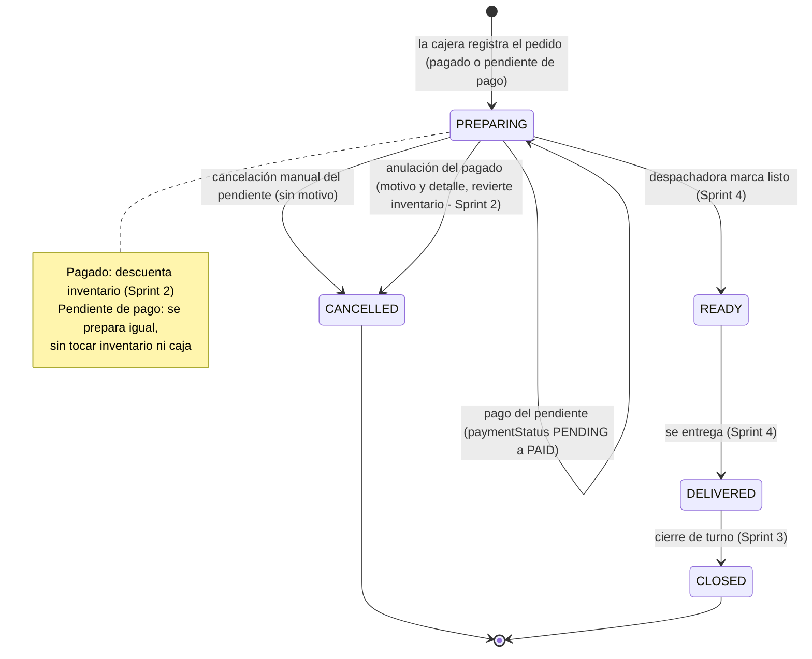

# Technical Guide — Wonder Chicken

**Sistema Informático de Ventas — Documento técnico de implementación**
**Complementa:** [../business/pdr.md](../business/pdr.md) (reglas de negocio) · **Material de origen:** [../business/business_context.md](../business/business_context.md)
**Audiencia:** equipo de desarrollo backend y frontend, y LLM generador de código
**Versión:** 2.0 · **Fecha:** 2026-10-05 · **Estado del backend:** Sprint 0 y Sprint 1 completos; Sprint 2 parcial (ítems de inventario, ajuste y dashboard); Sprints 3 a 5 pendientes

> **Qué es este documento.** La traducción técnica del PDR: modelo de datos, contrato de la API, reglas transaccionales, casos de prueba y despliegue. Junto con el PDR es la **fuente de verdad** del proyecto, y el frontend se construye sobre él. Describe **lo que el backend hace hoy** y **lo que falta construir**; no describe lo que existió antes.
>
> **Precedencia.** Si una decisión técnica entra en conflicto con una regla de negocio, **gana el [PDR](../business/pdr.md)** y esta guía se corrige. Para el modelo físico exacto (tipos, índices, restricciones), `prisma/schema.prisma` debe coincidir con [§3](#3-modelo-de-datos-esquema-lógico-para-la-bd). El contrato de lo implementado se genera del código (`swagger.json`): si una sección ✅ de esta guía lo contradice, es un error de la guía y se corrige junto con el código.
>
> **Estados.** ✅ implementado y verificado contra el código · 🔲 pendiente (con su sprint): el contrato descrito es el **objetivo** · ⏸️ aplazado por decisión.
>
> **Convenciones de los ejemplos.** Los ids se abrevian como `uuid-…` (en la API son UUID v7) · los enums van en MAYÚSCULAS · los importes `Decimal` viajan como **string** (`"45"`) · las fechas, en ISO 8601 UTC (`2026-05-01T12:00:00.000Z`) · los textos para el usuario, en español.
>
> **Documentos hermanos.** [implementation_guide.md](implementation_guide.md) (qué construir y en qué orden, sprint por sprint) · [plan-integracion-front-datos-reales.md](plan-integracion-front-datos-reales.md) (plan del front) · [plan-mejoras-backend.md](plan-mejoras-backend.md) (patrones de código y red de seguridad) · [api-testing-guide.md](api-testing-guide.md) · [seeders.md](seeders.md) · [sincronizar-swagger-postman.md](sincronizar-swagger-postman.md).

## Orden de lectura

1. **[§1](#1-stack-tecnológico-obligatorio) y [§2](#2-requerimientos-no-funcionales-nfr):** stack, configuración por entorno y requisitos no funcionales.
2. **[§3](#3-modelo-de-datos-esquema-lógico-para-la-bd):** qué datos existen.
3. **[§5](#5-contratos-de-la-api):** cómo se habla con la API — principios, formato de respuesta, errores, autenticación, alcance por rol y sucursal, y el mapa de endpoints.
4. **[§6](#6-contratos-por-módulo-requestresponse):** el detalle request/response de cada módulo, en el **orden en que se implementan**.
5. **[§4](#4-máquina-de-estados-de-pedidos-transaccional):** reglas transaccionales de pedidos y auditoría (se necesitan al llegar al Sprint 2).
6. **[§8](#8-test-cases-e2e-casos-prioritarios) a [§10](#10-mapeo-negocio--técnica):** pruebas, despliegue y mapeo negocio → técnica.

## Índice

  - [Orden de lectura](#orden-de-lectura)
- [1. Stack tecnológico (obligatorio)](#1-stack-tecnológico-obligatorio)
  - [1.1 Configuración por entorno](#11-configuración-por-entorno)
- [2. Requerimientos no funcionales (NFR)](#2-requerimientos-no-funcionales-nfr)
- [3. Modelo de datos (esquema lógico para la BD)](#3-modelo-de-datos-esquema-lógico-para-la-bd)
  - [3.1 Entidades principales](#31-entidades-principales)
  - [3.2 Relaciones clave](#32-relaciones-clave)
  - [3.3 Diagrama de relaciones (ER)](#33-diagrama-de-relaciones-er)
- [4. Máquina de estados de pedidos (transaccional)](#4-máquina-de-estados-de-pedidos-transaccional)
  - [4.1 Transiciones y efectos](#41-transiciones-y-efectos)
  - [4.2 Reglas transaccionales](#42-reglas-transaccionales)
  - [4.3 Auditoría — implementación (V1)](#43-auditoría--implementación-v1)
- [5. Contratos de la API](#5-contratos-de-la-api)
  - [5.0 Principios de diseño de la API (el backend manda, el frontend renderiza)](#50-principios-de-diseño-de-la-api-el-backend-manda-el-frontend-renderiza)
  - [5.1 Endpoints principales](#51-endpoints-principales)
  - [5.2 Autenticación y autorización](#52-autenticación-y-autorización)
  - [5.3 Estructura de respuesta estándar](#53-estructura-de-respuesta-estándar)
  - [5.4 Reglas del contrato](#54-reglas-del-contrato)
  - [5.5 Catálogo de códigos de error](#55-catálogo-de-códigos-de-error)
  - [5.6 Alcance por rol y sucursal](#56-alcance-por-rol-y-sucursal)
- [6. Contratos por módulo (request/response)](#6-contratos-por-módulo-requestresponse)
  - [6.1 Autenticación — Sprint 0](#61-autenticación--sprint-0)
  - [6.2 Sucursales — Sprint 0](#62-sucursales--sprint-0)
  - [6.3 Usuarios — Sprint 0](#63-usuarios--sprint-0)
  - [6.4 Cajas registradoras — Sprint 1](#64-cajas-registradoras--sprint-1)
  - [6.5 Turnos y períodos de turno — Sprint 1](#65-turnos-y-períodos-de-turno--sprint-1)
  - [6.6 Productos y variantes — Sprint 1](#66-productos-y-variantes--sprint-1)
  - [6.7 Clientes — Sprint 1 y Sprint 4](#67-clientes--sprint-1-y-sprint-4)
  - [6.8 Inventario — Sprint 2](#68-inventario--sprint-2)
  - [6.9 Planilla de inventario diario — Sprint 2](#69-planilla-de-inventario-diario--sprint-2)
  - [6.10 POS — Sprint 1 a 3](#610-pos--sprint-1-a-3)
  - [6.11 Pedidos — Sprint 1 a 3](#611-pedidos--sprint-1-a-3)
  - [6.12 Descuentos — Sprint 3](#612-descuentos--sprint-3)
  - [6.13 Vales — Sprint 3](#613-vales--sprint-3)
  - [6.14 Gastos — Sprint 3](#614-gastos--sprint-3)
  - [6.15 Reportes — Sprint 3](#615-reportes--sprint-3)
  - [6.16 Vistas públicas e impresión — Sprint 4](#616-vistas-públicas-e-impresión--sprint-4)
  - [6.17 Auditoría — Sprint 5](#617-auditoría--sprint-5)
- [7. OpenAPI y Postman (generados)](#7-openapi-y-postman-generados)
- [8. Test cases E2E (casos prioritarios)](#8-test-cases-e2e-casos-prioritarios)
  - [Ventas y pedidos](#ventas-y-pedidos)
  - [Descuentos (Sprint 3)](#descuentos-sprint-3)
  - [Cocina (Sprint 2)](#cocina-sprint-2)
  - [Sesión, gastos y auditoría](#sesión-gastos-y-auditoría)
  - [Maestros y administración](#maestros-y-administración)
  - [Alcance, sesión y reglas de turno](#alcance-sesión-y-reglas-de-turno)
- [9. Despliegue, backups y sincronización](#9-despliegue-backups-y-sincronización)
- [10. Mapeo Negocio → Técnica](#10-mapeo-negocio--técnica)
  - [Notas finales](#notas-finales)

---

# 1. Stack tecnológico (obligatorio)

- **Backend:** **NestJS 11**, **TypeScript** en ESM (`"type": "module"`), **Prisma 7** sobre **PostgreSQL** (driver adapter `@prisma/adapter-pg`) y **pnpm** como único gestor de paquetes.
- **Frontend:** **Next.js 16**, **React 19**, **Zustand 5** (estado global), **MUI 9** + MUI Icons y **Zod 4** (validación de formularios).
- **Autenticación:** **JWT** con `@nestjs/jwt` (firma HS256, **sin Passport**) + **bcryptjs** para el hash de la contraseña. Autorización por rol con **guards de NestJS** (`AuthGuard` + `RolesGuard`) registrados globales. Detalle en [§5.2](#52-autenticación-y-autorización).
- **Validación de entrada:** `ValidationPipe` global + **class-validator** en los DTOs, con `whitelist`, `transform` y `forbidNonWhitelisted` (una propiedad desconocida es un error 400). Los mensajes salen en español ([§5.4](#54-reglas-del-contrato)).
- **Documentación de la API:** `@nestjs/swagger` genera `swagger.json`, y de ahí se genera la colección de Postman ([§7](#7-openapi-y-postman-generados)).
- **Impresión/PDF (Sprint 4):** `react-to-print` u otro paquete equivalente con buenos resultados personalizables.
- **Multiplataforma:** el código corre en Windows y Linux. Usar `path.join` (nunca separadores hardcodeados) y manejar fechas en UTC con timezone explícito al presentar.

## 1.1 Configuración por entorno

La configuración vive en `src/config/` y **se valida al arrancar**: si falta o es inválida alguna variable, la app no inicia y el mensaje lista todos los problemas juntos. Setup paso a paso y comandos: [README](../../README.md).

| Variable | Obligatoria | Descripción |
|---|---|---|
| `APP_ENV` | sí | `development` \| `qa` \| `production`. Elige el perfil de la tabla de abajo. No tiene valor por defecto a propósito. |
| `DATABASE_URL` | sí | Cadena de conexión de PostgreSQL. |
| `JWT_SECRET` | sí | Clave de firma de los tokens: mínimo 32 caracteres, distinta por entorno. |
| `PORT` | no | Por defecto `4000`. |
| `JWT_EXPIRES_IN` | no | Duración del token (`30m`, `2h`, `1d`; mayor que 0 y de 24 h como máximo). Pisa el valor del perfil. |
| `CORS_ORIGINS` | no | Orígenes permitidos, separados por coma. Pisa el valor del perfil. |
| `SWAGGER_ENABLED_PRODUCTION` | no | `true` publica Swagger en `production` a propósito. Se ignora fuera de producción. |

| Perfil (`APP_ENV`) | Duración del token | CORS | Swagger (`/api/docs`, `/swagger.json`) | Reescribe `docs/swagger-postman/swagger.json` | `pnpm seed` |
|---|---|---|---|---|---|
| `development` | 2 h | cualquier origen | sí | sí | permitido (solo si la base es local) |
| `qa` | 2 h | solo los de `CORS_ORIGINS` | sí | no | bloqueado |
| `production` | 8 h | solo los de `CORS_ORIGINS` | **no** (salvo `SWAGGER_ENABLED_PRODUCTION=true`) | no | bloqueado |

- Si `CORS_ORIGINS` está vacío en `qa` o `production`, **no se acepta ningún origen externo** (correcto cuando el front se sirve desde el mismo origen, por ejemplo con el proxy de Next).
- **Base de la API:** `http://localhost:4000/api/v1` (todos los endpoints bajo el prefijo `/api/v1`).
- **Superadmin de bootstrap:** `pnpm bootstrap:admin` crea el `SUPER_ADMIN` leyendo `SUPER_ADMIN_EMAIL`, `SUPER_ADMIN_FIRSTNAME`, `SUPER_ADMIN_LASTNAME` y `SUPER_ADMIN_CI` (por defecto `superadmin@gmail.com` / `password123`). Con `APP_ENV=production` se niega si `SUPER_ADMIN_CI` falta, es la de por defecto o tiene menos de 12 caracteres.

---

# 2. Requerimientos no funcionales (NFR)

- **Usabilidad:** POS en 3 pasos máximo; interfaces limpias y reactivas; español por defecto. Soporte para tema claro y oscuro usando `paper` y colores de MUI (evitar fondos sólidos no reactivos).
- **Rendimiento:** respuesta objetivo en LAN **≤ 300 ms** para operaciones de venta; tolerancia a picos. El `AuthGuard` hace una consulta por clave primaria por request; es despreciable con PostgreSQL local.
- **Disponibilidad:** modo local (on-premise) con opción de sincronización a nube en V2; objetivo **99.5 % de uptime** en horario operativo.
- **Seguridad:** autenticación JWT; contraseñas hasheadas con **bcryptjs**; auditoría de acciones críticas. **El control de permisos por rol y sucursal se aplica en el backend** ([PDR §2.7](../business/pdr.md#27-roles-e-interfaces-v1-con-autenticación-jwt-y-control-de-permisos-por-rol-en-backend)): la UI oculta pantallas por comodidad, pero la frontera de seguridad es la API (**401** sin token válido o con usuario desactivado, **403** si el rol o la sucursal no corresponden). Detalle en [§5.2](#52-autenticación-y-autorización) y [§5.6](#56-alcance-por-rol-y-sucursal).
- **Escalabilidad:** backend modular (NestJS) con Prisma; un módulo por dominio. Frontend modular con Next.js, Zustand y MUI.
- **Mantenibilidad:** TypeScript en todo el stack; código reutilizable y fácil de leer. Los patrones obligatorios para todo endpoint nuevo están en [implementation_guide.md §1](implementation_guide.md#1-convenciones).
- **Localización:** español; formatos de fecha y moneda locales (Bs).
- **Impresión (Sprint 4):** impresoras térmicas de 7 cm; **PDF** como alternativa automática.
- **Accesibilidad:** contraste y tamaño de fuente adecuados para ambientes con iluminación variable.
- **Despliegue V1:** aplicación web local en Windows 10. Sin Docker requerido, pero deseable para portabilidad.
- **Backup (V2):** backup automático diario de la BD y backup manual para el administrador.

---

# 3. Modelo de datos (esquema lógico para la BD)

> Es el **contrato del dato**: todos los campos, enums y restricciones, con los nombres exactos de `prisma/schema.prisma` (que debe coincidir con esta sección). Los diagramas ER no se dibujan a mano: se generan desde el schema ([§3.3](#33-diagrama-de-relaciones-er)). Todas las entidades llevan `id` (UUID v7) y, salvo que se indique lo contrario, `createdAt`; las que se editan llevan además `updatedAt`.

## 3.1 Entidades principales

Mapa rápido, en el orden en que se implementan:

| Entidad | Para qué sirve | Estado |
|---|---|---|
| `Branch` | Sucursal del restaurante (entidad central del multi-sucursal). | ✅ |
| `User` | Personal del sistema, con su rol y su sucursal. | ✅ |
| `CashRegister` | Caja física de una sucursal. | ✅ |
| `ShiftPeriod` | Catálogo de períodos del día ("Mañana", "Noche"; ampliable sin migración). | ✅ |
| `Shift` | Turno de trabajo de una cajera en una caja. | ✅ apertura · 🔲 cierre y arqueo (Sprint 3) |
| `Product` / `Variant` | Catálogo de platos y sus variantes (composición). | ✅ |
| `Customer` | Cliente registrado (CI/NIT) para factura nominada; opcional por venta. | ✅ |
| `InventoryItem` / `InventoryTransaction` | Inventario **cocido** transaccional y su libro de movimientos. | ✅ ítems, alta y ajuste · 🔲 descuento por venta (Sprint 2) |
| `Order` / `OrderItem` / `OrderItemComponent` | Pedido, sus ítems y los componentes operativos de cada ítem. | ✅ estándar · 🔲 custom y descuentos |
| `AuditLog` | Rastro inmutable de acciones críticas ([PDR §2.9](../business/pdr.md#29-auditoría)). | ✅ parcial (ver [§4.3](#43-auditoría--implementación-v1)) |
| `DailyInventoryEntry` / `ShiftChickenLog` | Celdas de la planilla de inventario diario por día operativo (sucursal + período + fecha): ítems y ciclo del pollo. | ✅ |
| `Expense` | Gasto pagado desde caja. | 🔲 Sprint 3 |
| `Voucher` | Vale del personal (descuenta nómina, no caja). | 🔲 Sprint 3 |
| `Discount` / `DiscountAuthorization` | Catálogo de descuentos por plato y su autorización por turno. | 🔲 Sprint 3 |
| `InventoryBatch` | Lotes de inventario. Existe en el schema, **sin uso en V1** (opcional). | — |

### Enumeraciones

| Enum | Valores |
|---|---|
| `UserRole` | `SUPER_ADMIN`, `ADMIN`, `CASHIER`, `DISPATCHER`, `COOK` |
| `OrderType` | `MESA`, `LLEVAR` (**CUSTOM no es un tipo**: es `Order.isCustom`, [PDR §2.10](../business/pdr.md#210-ventas-custom-presas-surtidas)) |
| `OrderStatus` | `CREATED`, `CONFIRMED`, `PREPARING`, `READY`, `DELIVERED`, `CLOSED`, `PENDING_PAYMENT`, `CANCELLED`, `ON_HOLD` (**reservado, sin uso en V1**: el backend no lo produce ni lo acepta) |
| `PaymentStatus` | `PENDING`, `PAID`, `PARTIAL` (`PARTIAL` **reservado, sin uso en V1**) |
| `PaymentMethod` | `CASH`, `CARD`, `VALE` |
| `InventoryUnit` | `PRESA`, `BOLSA`, `PAQUETE`, `UNIDAD`, `VASO`, `DOYPACK` |
| `InventoryItemType` | `PECHO`, `ALA`, `PIERNA`, `ENTREPIERNA`, `BEBIDA`, `INSUMO` |
| `InventoryTxnReason` | `SALE`, `ADJUSTMENT`, `RECEPTION`, `VALE`, `MANUAL_CONSUMPTION`, `CANCELLATION_REVERT` |
| `VoucherStatus` | `ISSUED` (`REDEEMED` y `CANCELLED` **reservados, sin uso en V1**: el vale solo se emite) |
| `CustomerSex` | `HOMBRE`, `MUJER` |
| `DiscountAvailability` | `ALWAYS` (todo el turno), `END_OF_SHIFT` (solo a fin de turno) |
| `ChickenPieceType` | `PECHO`, `ALA`, `PIERNA`, `ENTREPIERNA` |
| `ExpensePaidBy` | `CASH`, `REGISTER` |
| `ShiftStatus` | `OPEN`, `CLOSED` |

> Los tipos que viajan **dentro de campos JSON** (`Variant.components`, `OrderItem.selectedPieces`, `customPieces`, `substitutions`, `extras`, `drinks`) **no son enums**: van en minúscula (`presa`, `pecho`, `mixto`…).

### Entidades, campo por campo

- **Branch** ✅
  - `name` (único), `address`, `phone?` (texto libre), `active`.
  - Relaciones: `User.branchId` (nullable), `Shift.branchId`, `CashRegister.branchId` e `InventoryItem.branchId` (obligatorios en las entidades locales).

- **User** ✅
  - `firstName`, `lastName`, `email` (único: credencial de login), `phone?`, `role`, `active`.
  - `ci` (único): cédula de identidad. **Su hash bcrypt se guarda en `passwordHash` y es la contraseña de login** (login = email + CI). `passwordHash` nunca se expone en la API.
  - `branchId?`: sucursal asignada. **`null` significa "acceso global" y solo corresponde a `SUPER_ADMIN`**; todo otro rol exige sucursal ([PDR §2.7](../business/pdr.md#27-roles-e-interfaces-v1-con-autenticación-jwt-y-control-de-permisos-por-rol-en-backend)).

- **CashRegister** ✅ — `name`, `active`, `branchId`. Restricción: `UNIQUE(branchId, name)` (dos sucursales pueden tener cada una su "Caja 1"). Sin `updatedAt`.

- **ShiftPeriod** ✅ — catálogo **por sucursal**, **no enum**, para que un tercer turno ("Tarde") no requiera migración. El negocio tiene dos turnos operativos (Mañana y Noche): es el único eje común de caja, inventario y cocina.
  - `name` (único **por sucursal**: `UNIQUE(branchId, name)`), `displayOrder` (orden dentro del día), `referenceStart?` / `referenceEnd?` (horarios de **referencia informativos**, ej. `"09:00"`, que **jamás clasifican nada**: el reloj puede estar mal y los horarios cambian), `active`, `branchId`.
  - El período **se declara al abrir el turno**; nunca se infiere del reloj ([PDR §13.3](../business/pdr.md#133-decisiones-residuales-pendientes-de-cierre-antes-de-v1)). La agenda semanal es V2 ([PDR §13.2](../business/pdr.md)).
  - **Los horarios de cada rol no se modelan** (cocina 9:00–16:00 y 16:00–23:00; cajera y despachadora, que comparten horario, 10:00–16:30 y 16:30–23:00): V1 no controla asistencia. Un módulo futuro agregaría tablas nuevas (`Attendance`, `WorkSchedule`) sobre la misma clave `(branchId, periodId, businessDate)`.

- **Shift** ✅ apertura · 🔲 cierre
  - `status` (`OPEN` | `CLOSED`), `openingAmount`, `startAt`, `lastOrderNumber` (contador de tickets del turno: se incrementa atómicamente al crear cada orden).
  - `cashierId`, `cashRegisterId?`, `branchId`, `periodId`, `businessDate` (fecha operativa, `DATE`; se fija al abrir la caja con el día del servidor). Un `Shift` es la sesión de **una cajera en una caja dentro de un período**; puede haber varios por período. `(branchId, periodId, businessDate)` es la clave del **día operativo**.
  - 🔲 al cerrar (Sprint 3): `endAt`, `closingAmount`, `expectedAmount`, `discrepancy`.
  - Reglas vigentes: una cajera tiene **un solo turno `OPEN`** a la vez, y una caja la usa **una sola cajera** a la vez (validado por la aplicación al abrir; ver [implementation_guide.md §10](implementation_guide.md#10-mejoras-del-backend-pendientes-y-decisiones-abiertas)).

- **Product** ✅ — global (sin `branchId`: el menú es el mismo para todas las sucursales).
  - `name`, `basePrice` (`Decimal(10,2)`), `category` (texto libre, para no romper si cambia el menú), `description?`, `active`.
  - `isSellable`: si aparece en el POS para la venta. `isInventoryItem`: si sus ventas generan movimientos de inventario.

- **Variant** ✅ — global.
  - `productId`, `name`, `components` (JSON), `isDefault`, `active`.
  - `components`: `[{ "type": "presa" | "acompanamiento" | "bebida" | "extra", "name"?: string, "count": int ≥ 1 }]`, mínimo un elemento.
  - **No existe campo de ajuste de precio**: por regla del negocio las variantes y sustituciones no modifican el precio ([PDR §2.1](../business/pdr.md#21-precios-y-sustituciones)). Si V2 lo necesita se llamará `priceAdjustment`.
  - No se fuerza un único `isDefault` por producto.

- **Customer** ✅ — global (sin `branchId`; la deduplicación por CI es cross-sucursal, [PDR §2.12](../business/pdr.md#212-clientes-y-facturación-nominada)).
  - `ci` (único; clave de búsqueda), `nit?` (también buscable: el cliente puede dictar CI o NIT), `firstName`, `lastName`, `sex`, `birthDate?` (**tipo `date`, no `datetime`**), `phone?`, `email?`, `active`.
  - `passwordHash?` queda `null` en V1 (reservado al login de clientes de V2) y no se expone.
  - Registrar al cliente es **opcional por venta**: `Order.customerId` es nullable (venta anónima, "S/N"). La regla legal completa (umbral Bs 1.000, RND del SIN, por qué no usar el NIT `99001`) vive en el PDR §2.12.

- **InventoryItem** ✅ — plano **cocido** del expositor; el ciclo **crudo** se modela aparte (`ShiftChickenLog`).
  - `productCode`, `name`, `unit`, `type`, `currentStock` (entero: **es un cache del libro de transacciones y nunca se escribe sin rastro**), `unitMeasure?` (texto libre, ej. `"500 ml"`), `salePrice?`, `active`, `branchId`, `productId?`.
  - `kitchenManaged` (por defecto `false`): `true` marca los ítems que **anota cocina** en la planilla de inventario diario (ej. las bolsas de papa usadas). El cocinero solo puede escribir el ingreso y el gasto de estos ítems; el resto lo anotan caja y despacho. Lo define el ADMIN al crear o editar el ítem.
  - `productId?` vincula una **bebida** con el `Product` con el que se vende (un producto por marca y tamaño, nombre único: "Fanta Naranja 2 lt"). Es lo que permite descontar su stock al pagar. Solo `type = BEBIDA`; `UNIQUE(branchId, productId)`.
  - `salePrice` es **solo precio de VENTA** (el sistema no registra costo ni margen) y solo vale para `type ∈ {PECHO, ALA, PIERNA, ENTREPIERNA}`: alimenta el precio sugerido de la venta custom ([PDR §2.10](../business/pdr.md#210-ventas-custom-presas-surtidas)).
  - Restricción: `UNIQUE(branchId, productCode)`.

- **InventoryTransaction** ✅ — libro de movimientos (sin `updatedAt`).
  - `inventoryItemId`, `delta` (entero; negativo = salida, positivo = ingreso o reversión), `reason`, `referenceId?` (id de `Order`, `Voucher` o `Expense`), `note?`, `timestamp`, `userId`.
  - **No hay `reason` de descuento**: un descuento es puramente monetario ([PDR §2.11](../business/pdr.md#211-descuentos-sobre-la-orden-incluye-descuento-al-personal)); la venta con descuento descuenta inventario con `SALE` como cualquier otra.
  - Hoy se escribe en el alta de un ítem con `initialStock` (`RECEPTION`) y en `POST /inventory/adjust` (`ADJUSTMENT` o `RECEPTION`). 🔲 `SALE` y `CANCELLATION_REVERT` (Sprint 2), `MANUAL_CONSUMPTION` (Sprint 2), `VALE` (Sprint 3).

- **Order** ✅
  - `orderNumber` (entero legible: **se reinicia por turno**; `UNIQUE(shiftId, orderNumber)`; lo asigna la aplicación con `Shift.lastOrderNumber` dentro de una transacción; es lo que muestra la pantalla pública), `type`, `tableNumber?`.
  - `customerId?` (referencia al `Customer`; agrupa los pedidos del cliente) y `customerName?` (**snapshot de visualización**: no cambia si luego se edita el `Customer`; `null` en una venta anónima, que la UI muestra como "S/N").
  - `publicToken` (único; aleatorio y no adivinable: 128 bits generados con `crypto.randomBytes(16)`; es la credencial de la vista pública del cliente, que **nunca** usa el `id` interno).
  - `status`, `paymentStatus`, `paymentMethod?`.
  - `originalAmount` = `Σ(unitPrice × quantity)` de los ítems, antes de descuentos. `total` = `originalAmount − Σ(descuentos de los ítems)`: es el valor derivado y lo que entra a caja. Hoy no hay descuentos, así que `total = originalAmount`.
  - `isCustom` ([PDR §2.10](../business/pdr.md#210-ventas-custom-presas-surtidas)): `true` solo si la orden nació de `POST /orders/custom`.
  - `cancelReason?`, `cancelDetails?`, `cancelledAt?` · `paidAt?`, `readyAt?`, `deliveredAt?` · `createdById`, `deliveredById?`, `shiftId`.
  - El descuento **no vive en `Order`**: vive por plato en `OrderItem`.

- **OrderItem** ✅
  - `orderId`, `productId?` (`null` si la orden es custom), `variantId?`, `quantity`, `unitPrice`, `totalPrice` (derivado: `(unitPrice − (discountAmount ?? 0)) × quantity`), `notes?`.
  - `snapshot` (JSON inmutable de la línea al crearse, para impresión, auditoría y trazabilidad: nombre del producto, precio base, nombre y componentes de la variante, cantidad, presas, sustituciones, extras y bebidas).
  - `substitutions` (`[{ "from": "mixto", "to": "arroz" | "papa" | "smiles" | "mixto" }]`, **máximo una por ítem y sin efecto en el precio**), `selectedPieces` (presas elegidas en una orden estándar: `[{ "type": "pecho", "qty": 2 }]`), `customPieces` (presas de una orden custom), `extras` (`[{ "type", "qty" }]`), `drinks` (`[{ "productId", "qty" }]`).
  - 🔲 Sprint 3: `discountId?` y `discountAmount?`. `discountAmount` es un **snapshot por unidad** del monto fijo (no una resta): se congela para que editar el catálogo no altere ventas pasadas, y aplica a **todas** las unidades del ítem (para un descuento parcial el POS parte el ítem en dos líneas). Máximo **un** descuento por ítem, sin apilamiento.

- **OrderItemComponent** ✅ parcial — filas normalizadas por presa, bebida o extra que consume un ítem; serán la **fuente de verdad del descuento de inventario** al pagar.
  - Campos: `orderItemId`, `inventoryItemId?`, `productId?`, `quantity`, `unitPrice`, `label?`.
  - Hoy (Sprint 1) solo se crean filas para los componentes de tipo `presa` de la variante, con `label` y **sin referencia** a `InventoryItem` ni a `Product`: son un registro declarativo.
  - 🔲 Sprint 2: se vinculan a `InventoryItem` o a `Product` (exactamente a **uno** de los dos) y se agrega la restricción de base de datos:

    ```sql
    ALTER TABLE order_item_components
    ADD CONSTRAINT order_item_component_one_ref CHECK (
      (inventory_item_id IS NULL AND product_id IS NOT NULL)
      OR (inventory_item_id IS NOT NULL AND product_id IS NULL)
    );
    ```

- **AuditLog** ✅ parcial (sin `updatedAt`; **append-only**, ver [§4.3](#43-auditoría--implementación-v1))
  - `entity`, `action`, `details?` (JSON), `timestamp`, `userId`.
  - `entityId`: **string, no UUID**. Es una referencia polimórfica (apunta a distintas tablas según `entity`), así que no lleva FK. Guarda el UUID cuando la entidad está persistida y una **clave legible** cuando es lógica (`Report` → `"sales:2026-07"`).
  - `shiftId?`: el turno en que ocurrió la acción (el log **nace sabiendo su turno**, sin ventanas horarias). `null` = acción crítica fuera de una sesión de caja (`ADJUST_INVENTORY`, `GENERATE_REPORT`).

- **DailyInventoryEntry** ✅ *(tabla de ítems de la planilla de inventario diario; [PDR §2.3](../business/pdr.md#23-inventario-por-presas) / FR-017)* — una fila por ítem y turno: `branchId`, `periodId`, `businessDate`, `inventoryItemId`, `received?` (INGRESO), `consumed?` (GASTO manual), `leftoverCount?` (SOBRANTE contado), `recordedById` (quien modificó por última vez), `createdAt`, `updatedAt`. Restricción: `UNIQUE(branchId, periodId, businessDate, inventoryItemId)`. Las celdas se **sobrescriben**; `received` y `consumed` dejan en el libro la **diferencia** con el valor anterior, y `leftoverCount` no mueve el stock.

- **ShiftChickenLog** ✅ *(tabla del pollo de la misma planilla; cocina anota lo crudo, despacho y caja el cocido en expositor, y la cajera puede corregir lo del cocinero)*
  - `branchId`, `periodId`, `businessDate`, `pieceType`, y las celdas **opcionales** `reprocessRaw` (crudo del período anterior; se sugiere con el `rawLeftover` del último ciclo anterior con datos), `processedRaw` (pollo fresco marinado), `rawLeftover` (sobrante crudo: alimenta el `reprocessRaw` siguiente), `cookedLeftover` (sobrante cocido en expositor: habilita el descuento al personal), más `recordedAt`, `updatedAt` y `recordedById` (quien modificó por última vez). **No hay cierre**: se sobrescribe.
  - Cantidad cocinada (**derivada, no se almacena**): `reprocessRaw + processedRaw − rawLeftover`. Restricción: `UNIQUE(branchId, periodId, businessDate, pieceType)`.

- **Expense** 🔲 — `description`, `amount`, `paidBy` (`CASH` | `REGISTER`), `shiftId`, `createdById`.

- **Voucher** 🔲 *(vale; [PDR §2.4](../business/pdr.md#24-vales-ventas-internas--descuento-por-nómina))*
  - `code` (único, generado por el backend, ej. `V-20260501-001`), `workerId?` o `workerName?` (si el trabajador no es usuario del sistema; al menos uno), `productId?`, `productName` (snapshot).
  - `originalAmount` (precio del producto, **derivado**; el front no lo envía), `discountId?`, `discountAmount?` (snapshot del "Descuento personal"), `amount` (monto que se descuenta de nómina = `originalAmount − (discountAmount ?? 0)`, **derivado** por el backend).
  - `status` (`ISSUED`), `note?`, `issuedAt`, `issuedById`, `shiftId`.
  - El vale **no es un descuento**: no suma a caja y descuenta nómina.

- **Discount** 🔲 *(catálogo mínimo, **no** un motor de reglas; [PDR §2.11](../business/pdr.md#211-descuentos-sobre-la-orden-incluye-descuento-al-personal))* — `name`, `fixedAmount` (monto fijo en Bs **por plato**, no porcentaje en V1), `availability`, `requiresAuthorization`, `active`. Las dos instancias principales ("Descuento personal" y "Compensación al cliente") están descritas en el PDR §2.11.

- **DiscountAuthorization** 🔲 *(habilitación que un admin otorga a la sesión de una cajera para un descuento con `requiresAuthorization = true`; FR-016b)* — `discountId`, `shiftId`, `cashierId`, `authorizedById`, `authorizedAt`. Restricción: `UNIQUE(discountId, shiftId, cashierId)`. Alcance por turno; se extingue al cerrarlo.

## 3.2 Relaciones clave

- **Multi-sucursal:** `Branch` 1..* `User` (`User.branchId`, nullable solo para `SUPER_ADMIN`) · `Branch` 1..* `Shift`, `CashRegister` e `InventoryItem` (`branchId` obligatorio).
- `Product` 1..* `Variant` · `Order` 1..* `OrderItem` 1..* `OrderItemComponent`.
- `Customer` 1..* `Order` (`Order.customerId`, opcional: `null` = venta anónima).
- `OrderItem` → `Product` / `Variant` (ambos opcionales si pertenece a una orden custom, `Order.isCustom = true`).
- `Shift` vincula `User` (cajera), `CashRegister`, `ShiftPeriod`, `Order`, `Voucher`, `Expense`, `DiscountAuthorization` y `AuditLog` (nullable). `DailyInventoryEntry` y `ShiftChickenLog` **no** cuelgan del `Shift`: se ligan a `Branch` y `ShiftPeriod` por el día operativo.
- `InventoryTransaction` referencia a `Order`, `Voucher` o `Expense` por `referenceId` (sin FK).
- `Discount` 1..* `OrderItem` y 1..* `Voucher` (ambos opcionales) · `Discount` 1..* `DiscountAuthorization`.

## 3.3 Diagrama de relaciones (ER)

> **El ER no se dibuja a mano acá**: el modelo cambia seguido y un diagrama estático queda desactualizado en silencio. La fuente es [`prisma/schema.prisma`](../../prisma/schema.prisma); el diagrama se **genera** desde él con una extensión de VS Code (por ejemplo *Prisma ERD Visualizer*) o una herramienta externa (`prisma-erd-generator`, dbdiagram.io). Las entidades y sus notas están en [§3.1](#31-entidades-principales) y las relaciones en [§3.2](#32-relaciones-clave).

> **Tres sutilezas de negocio que el modelo refleja** (hay que entenderlas, no solo copiarlas):
> - `Order.isCustom` es un **flag**, no un valor de `type`: una venta custom sigue siendo `MESA` o `LLEVAR`.
> - El descuento vive en el **ítem**, no en la orden: se aplica **por plato**.
> - `OrderItem.discountAmount` es un **snapshot por unidad**, no una resta. `OrderItem.totalPrice` y `Order.total` son los derivados.

---

# 4. Máquina de estados de pedidos (transaccional)

Los efectos transaccionales de cada transición. La regla de negocio está en el [PDR §4](../business/pdr.md#4-máquina-de-estados-de-pedidos).

**Estados lógicos del PDR:** `CREATED → CONFIRMED → PREPARING → READY → DELIVERED → CLOSED`, más `PENDING_PAYMENT`, `CANCELLED` y `ON_HOLD` (reservado, sin transiciones en V1).



> **Reglas clave que el diagrama codifica:**
> - El inventario se descuenta **al confirmar el pago**, nunca antes ([PDR §2.3](../business/pdr.md#23-inventario-por-presas)).
> - Un pedido con pago pendiente se prepara **igual** que uno pagado, pero sin tocar inventario ni caja ([PDR §2.5](../business/pdr.md#25-pedidos-delivery-y-pago-pendiente)).
> - Cancelar un pendiente es **manual y sin motivo**; anular un pagado exige **motivo y detalle** y revierte el inventario (FR-011b).

**Cómo está implementado hoy (✅ Sprint 1).** El backend crea el pedido **directamente en `PREPARING`**, pagado o no: el PDR dice que "pasa a preparación" de inmediato. `CREATED`, `CONFIRMED` y `PENDING_PAYMENT` existen en el enum como estados lógicos del PDR, pero **el backend no los produce**: el estado de cobro lo da `paymentStatus` (`PENDING` / `PAID`), no `status`. El front debe usar `paymentStatus` para saber si un pedido está pendiente de pago.

## 4.1 Transiciones y efectos

- **Registro con pago inmediato** — `POST /orders` con `paymentStatus = PAID` ✅
  - Efecto: se crea en `PREPARING` con `paymentStatus = PAID` y el `paymentMethod` indicado; se asigna `orderNumber`; se genera la comanda digital; se escribe `CREATE_SALE` en `AuditLog`. 🔲 Sprint 2: **descuento atómico de inventario** en la misma transacción.
  - Hoy `paidAt` queda `null` en este caso: solo `/pay` lo completa ([implementation_guide.md §10](implementation_guide.md#10-mejoras-del-backend-pendientes-y-decisiones-abiertas)).

- **Registro con pago pendiente** — `POST /orders` con `paymentStatus = PENDING` ✅
  - Efecto: se crea en `PREPARING` con `paymentStatus = PENDING` y **sin** método de pago. **No** toca inventario ni caja ni auditoría. La cancelación, si ocurre, es siempre manual ([PDR §2.5](../business/pdr.md#25-pedidos-delivery-y-pago-pendiente)).

- **Pago del pendiente** — `POST /orders/{id}/pay` ✅
  - Efecto: `paymentStatus = PAID`, `paymentMethod` y `paidAt = now`; el `status` **no cambia** (sigue `PREPARING`); se escribe `CREATE_SALE`. 🔲 Sprint 2: **descuento atómico de inventario**.
  - Un pedido ya pagado responde `ORDER_ALREADY_PAID`; uno cancelado, `ORDER_CANCELLED`.

- **Cancelación manual del pendiente** — `POST /orders/{id}/cancel` ✅
  - Efecto: `status = CANCELLED` y `cancelledAt = now`. **No se guarda motivo** (`cancelReason` queda `null`: el PDR no lo pide). Inventario e ingreso nunca se tocaron. **No existe auto-cancelación por tiempo.**
  - Hoy cancelar un pedido que **ya está cancelado** no da error: vuelve a marcarlo `CANCELLED` y refresca `cancelledAt` ([implementation_guide.md §10](implementation_guide.md#10-mejoras-del-backend-pendientes-y-decisiones-abiertas)).
  - Un pedido **pagado** responde `ORDER_ALREADY_PAID_USE_ANULL`: se anula con la anulación de abajo.

- **Anulación de un pedido pagado** — `POST /orders/{id}/cancel` 🔲 Sprint 2
  - Requiere `reason` y `details`. Efecto: `status = CANCELLED`, `cancelReason`, `cancelDetails`, `cancelledAt`; **reversión de inventario** (`CANCELLATION_REVERT`); queda en el arqueo bajo `anulaciones` con su monto; `AuditLog` (`CANCEL_SALE`) obligatorio.

- **Marcar listo** — `PATCH /orders/{id}/status` 🔲 Sprint 4
  - `PREPARING → READY`, `readyAt = now`. El pedido aparece en la pantalla pública mostrando **únicamente el número de pedido** (MESA y LLEVAR por igual) y suena una alerta breve.

- **Marcar entregado** — `PATCH /orders/{id}/status` 🔲 Sprint 4
  - `READY → DELIVERED`, `deliveredAt = now`, `deliveredById`.

- **Cierre administrativo** — `POST /shifts/close` 🔲 Sprint 3
  - Al cerrar el turno, todas las órdenes `DELIVERED` del turno pasan a `CLOSED` en la misma operación. No hay endpoint dedicado.

## 4.2 Reglas transaccionales

- El descuento de inventario y la marca de pago ocurren en **una transacción atómica**. Si no hay stock suficiente, el pedido permanece en su estado anterior y se avisa a la cajera qué falta (🔲 Sprint 2; la lógica ya está prevista como un paso de `orders.create()`).
- Los pedidos pendientes **no tienen job de auto-cancelación**: solo pasan a `CANCELLED` por acción manual o a pagados al confirmar el pago.
- **El registro de auditoría forma parte de la transacción.** En las acciones críticas, el `INSERT` en `AuditLog` ocurre **dentro de la misma `$transaction`** que la acción: si la operación se revierte, el audit tampoco queda. Detalle en [§4.3](#43-auditoría--implementación-v1).
- **Altas con rastro.** `currentStock` nunca se escribe sin una fila en `InventoryTransaction` en la misma transacción (alta con `initialStock` y ajuste).

---

## 4.3 Auditoría — implementación (V1)

> Traducción técnica de la regla de negocio [PDR §2.9](../business/pdr.md#29-auditoría). La auditoría registra el rastro inmutable de las **acciones críticas** (quién, cuándo, qué entidad, qué cambió) sobre la entidad `AuditLog` ([§3.1](#31-entidades-principales)). **No confundir con el logging técnico** (errores y debug): la auditoría es un registro **de negocio**, persistido en la base, inmutable y consultable por el admin.

### Patrón: audit explícito dentro del service y la transacción

- La escritura se hace de forma **explícita dentro del service** de cada acción crítica, en la **misma `prisma.$transaction`** que la operación, por dos motivos: **atomicidad** (acción y audit se graban juntos o no se graban: no se auditan ventas revertidas) y **estado antes/después** (el `details` necesita el valor previo, disponible solo antes de mutar).
- Se hace con `AuditService.log(tx, { entity, entityId, action, userId, shiftId?, details? })` (`src/audit/`), reutilizando la transacción activa. Rechaza cualquier `action` que no esté en la lista cerrada `AUDIT_ACTIONS`.

### Acciones auditadas y su punto de captura

| Acción (`action`) | Punto de captura | `entity` | Estado |
|---|---|---|---|
| `CREATE_SALE` | `POST /orders` con pago inmediato y `POST /orders/{id}/pay` y `POST /orders/custom`. Los **descuentos por ítem** van en `details` (`discountId`, `discountAmount`, ítems afectados): no hay una acción aparte para "aplicar descuento" | `Order` | ✅ (descuentos 🔲) |
| `OPEN_SHIFT` | `POST /shifts/open` | `Shift` | ✅ |
| `ADJUST_INVENTORY` | `POST /inventory/adjust` | `InventoryItem` | ✅ |
| `CANCEL_SALE` | `POST /orders/{id}/cancel` (anulación de un pagado) | `Order` | ✅ |
| `CREATE_VOUCHER` | `POST /vouchers` | `Voucher` | 🔲 Sprint 3 |
| `CLOSE_SHIFT` | `POST /shifts/close` | `Shift` | 🔲 Sprint 3 |
| `AUTHORIZE_DISCOUNT` | `POST /discounts/{id}/authorize` (el **acto de autorizar** queda auditado aparte, FR-016b) | `DiscountAuthorization` | 🔲 Sprint 3 |
| `GENERATE_REPORT` | `GET /reports/...` | `Report` (lógico: sin fila en la base; `entityId` es una clave legible) | 🔲 Sprint 3 |

La administración de clientes (alta, edición, activar/desactivar) todavía **no** se audita; sumarla exige agregar sus acciones (`CREATE_CUSTOMER`, `UPDATE_CUSTOMER`, `TOGGLE_CUSTOMER_ACTIVE`) a la lista cerrada `AUDIT_ACTIONS` (🔲 Sprint 4).

### Cómo se llena cada campo

- **`userId`** (quién): del JWT, `request.user.sub`.
- **`shiftId`** (en qué turno): del **turno activo de la sesión** que ejecuta la acción (en `OPEN_SHIFT` y `CLOSE_SHIFT` es el propio turno). `null` en las acciones de admin fuera de una sesión de caja (`ADJUST_INVENTORY`, `GENERATE_REPORT`). El log nace sabiendo su turno: la consulta por turno es una FK directa.
- **`timestamp`** (cuándo): reloj del servidor.
- **`entity` + `entityId`** (qué entidad): tipo e id del registro afectado. En una **creación**, el `entityId` está disponible tras el insert, dentro de la misma transacción. Las entidades persistidas guardan su UUID; la entidad lógica `Report` guarda una **clave legible** `<reporte>:<alcance>` (por ejemplo `"sales:2026-07"`), nunca un UUID inventado.
- **`action` + `details`** (qué cambió): `action` es el verbo fijo; `details` guarda el cambio concreto. En **creaciones**: qué se creó (`{ total, items, paymentMethod }`). En **mutaciones**: el estado previo y el nuevo (`{ before, after, reason }`, `{ expected, counted, difference }`). Hoy `ADJUST_INVENTORY` guarda `{ productCode, delta, reason, note }`.

### Inmutabilidad: tabla append-only

A `AuditLog` solo se le hace **`INSERT`** y **`SELECT`**. **Nunca `UPDATE` ni `DELETE`**: un registro editable no sirve como prueba, la inmutabilidad **es** la feature.

### Consulta 🔲 Sprint 5

El rastro se consulta **como lo piensa el negocio, sin paginación** (admin): **`POST /audit-logs/shift`** con `{ date, periodId, cashRegisterId? }` devuelve los logs de ese turno (~50-80 filas; sin caja = todas las cajas de ese período) y **`POST /audit-logs/month`** con `{ month }`, el mes completo. Se resuelve por **FK directa** (`Shift` por fecha + período + caja → `AuditLog WHERE shiftId IN (...)`), sin ventanas horarias. Contrato en [§6.17](#617-auditoría--sprint-5).

### Por qué no un interceptor genérico en V1

Un `AuditInterceptor` global corre **fuera de la transacción** del service y **no tiene el estado previo**, así que no puede garantizar atomicidad ni llenar `details` con el antes/después. Por eso V1 usa audit explícito. Un interceptor para las acciones simples queda **diferido a V2**, y entrará **con un caso real** cuando la repetición lo justifique.

---

# 5. Contratos de la API

## 5.0 Principios de diseño de la API (el backend manda, el frontend renderiza)

Reglas transversales que **todos** los endpoints respetan. El frontend envía el **mínimo**; el backend resuelve el resto y devuelve respuestas **listas para pintar**.

1. **Lo que viene del token nunca viaja en el body.** El token identifica al usuario (`sub`); el backend toma de `request.user` todos los campos de **actor y sesión**: `Order.createdById`, `Shift.cashierId`, `InventoryTransaction.userId`, y a futuro `Voucher.issuedById` y `DiscountAuthorization.authorizedById`. Además **no confía en el rol ni en la sucursal del token**: los lee de la base en cada request ([§5.2](#52-autenticación-y-autorización)). **Si el front manda uno de esos campos, el backend lo rechaza** con `400 VALIDATION_ERROR` ("El campo X no está permitido"): toda propiedad desconocida es un error, no se ignora.
2. **El `shiftId` se deriva del turno activo.** Las operaciones de venta (órdenes y, a futuro, vales y gastos) no reciben `shiftId`: el backend resuelve el **turno abierto de la cajera** autenticada y lo asigna. Sin turno abierto, `409 NO_ACTIVE_SHIFT`.
3. **Precios y totales los calcula el backend desde la base.** En la orden estándar el front **no** envía `unitPrice` ni `total`: el backend los toma de `Product.basePrice` y calcula `totalPrice` y `total`. **Única excepción:** la venta custom 🔲, donde la cajera confirma un `unitPrice` (input de negocio legítimo, [PDR §2.10](../business/pdr.md#210-ventas-custom-presas-surtidas)). Los snapshots (`customerName`, `discountAmount`) también los congela el backend.
4. **El front manda referencias (ids), no datos copiados.** Para vincular un cliente, primero hace el lookup exacto (`GET /customers/by-ci/{ci}` o `by-nit/{nit}`) y obtiene su `id`; al crear la orden manda `customerId`, **no** `customerName`: el backend lee el `Customer` y snapshotea el nombre. Igual para los descuentos 🔲: el ítem lleva `discountId` y el backend valida, congela el snapshot y deriva los totales; el front jamás manda montos de descuento.
5. **Respuestas listas para renderizar.** El backend devuelve todo lo que la UI muestra, ya calculado y con los nombres resueltos. Los campos de actor se devuelven como objeto `{ id, firstName, lastName }` (por ejemplo `createdBy`), no como id suelto.
6. **Una operación de negocio = una llamada.** Todo lo que la cajera decide en una pantalla viaja en **un solo request** y se resuelve en **una sola transacción**. Los endpoints separados se reservan para **momentos distintos en el tiempo** (`/pay`, `/cancel`, `/status`), nunca para pasos de una misma operación. No existe un endpoint para "aplicar un descuento": va como `discountId` en cada ítem de `POST /orders`.
7. **El alcance por rol y sucursal lo impone el backend.** El front puede ocultar acciones como ayuda visual, pero **no necesita filtrar ni restringir** nada para que sea correcto ([§5.6](#56-alcance-por-rol-y-sucursal)).
8. **El negocio no borra, desactiva.** No existe ningún `DELETE`: toda baja es `PATCH /{recurso}/{id}/toggle-active`, que invierte el estado actual sin body y conserva el historial.
9. **Semántica de `PATCH`.** Solo cambian los campos enviados. Un campo **anulable** (`phone`, `birthDate`, `email`, `salePrice`, `branchId` de un `SUPER_ADMIN`…) acepta `null` para borrarse; un campo **no anulable** con `null` da `400 VALIDATION_ERROR`. Un `PATCH` de sucursales o de clientes sin ningún campo da `400 NO_FIELDS_TO_UPDATE`.

## 5.1 Endpoints principales

> El rol de cada endpoint también está en la [matriz de §5.2](#matriz-de-autorización-endpoint--roles). Todos exigen `Authorization: Bearer <token>` salvo los marcados **público**. El detalle de request, response y errores de cada uno está en el [§6](#6-contratos-por-módulo-requestresponse). Los módulos van en el **orden en que se implementan**. `SUPER_ADMIN` pasa siempre por el control de roles (con las salvedades de [§5.6](#56-alcance-por-rol-y-sucursal)).

### Autenticación

| Endpoint | Roles | HTTP | Qué hace | Estado |
|---|---|---|---|---|
| `POST /auth/login` | público | 200 | Iniciar sesión y obtener token JWT (un ejemplo por rol) | ✅ |
| `GET /auth/me` | cualquier rol | 200 | Perfil del usuario autenticado (nombre, rol, sucursal) para el header. Cualquier rol. | ✅ |
| `POST /auth/logout` | cualquier rol | 200 | Cerrar sesión | ✅ |

### Sucursales

| Endpoint | Roles | HTTP | Qué hace | Estado |
|---|---|---|---|---|
| `POST /branches` | `SUPER_ADMIN` | 201 | Crear sucursal (SUPER_ADMIN) | ✅ |
| `GET /branches` | `SUPER_ADMIN` | 200 | Listar sucursales con su cantidad de cajas y su ADMIN (SUPER_ADMIN) | ✅ |
| `PATCH /branches/:id` | `SUPER_ADMIN` | 200 | Actualizar sucursal (SUPER_ADMIN) | ✅ |
| `PATCH /branches/:id/toggle-active` | `SUPER_ADMIN` | 200 | Activar/desactivar sucursal (toggle) (SUPER_ADMIN) | ✅ |

### Usuarios

| Endpoint | Roles | HTTP | Qué hace | Estado |
|---|---|---|---|---|
| `POST /users` | `ADMIN` | 201 | Crear usuario. SUPER_ADMIN: cualquier rol y sucursal. ADMIN: solo CASHIER, DISPATCHER y COOK de su sucursal. | ✅ |
| `GET /users` | `ADMIN` | 200 | Listar usuarios con filtro por rol. ADMIN ve solo el personal (CASHIER, DISPATCHER, COOK) de su sucursal. | ✅ |
| `GET /users/:id` | `ADMIN` | 200 | Obtener usuario por id (admin) | ✅ |
| `PATCH /users/:id` | `ADMIN` | 200 | Editar usuario (admin). NO permite cambiar active; usar PATCH /users/:id/toggle-active | ✅ |
| `PATCH /users/:id/toggle-active` | `ADMIN`, `SUPER_ADMIN` | 200 | Activar/desactivar usuario (toggle) (ADMIN / SUPER_ADMIN) | ✅ |

### Cajas registradoras

| Endpoint | Roles | HTTP | Qué hace | Estado |
|---|---|---|---|---|
| `GET /cash-registers` | `CASHIER`, `ADMIN` | 200 | Listar cajas registradoras de la sucursal del usuario (CASHIER / ADMIN). SUPER_ADMIN: ?branchId= opcional. | ✅ |
| `POST /cash-registers` | `ADMIN` | 201 | Crear caja registradora (ADMIN, en su sucursal; SUPER_ADMIN indica branchId) | ✅ |
| `PATCH /cash-registers/:id` | `ADMIN` | 200 | Editar nombre de caja (ADMIN) | ✅ |
| `PATCH /cash-registers/:id/toggle-active` | `ADMIN` | 200 | Activar/desactivar caja registradora (toggle) (ADMIN) | ✅ |

### Turnos y períodos de turno

| Endpoint | Roles | HTTP | Qué hace | Estado |
|---|---|---|---|---|
| `GET /shifts/shift-periods` | `CASHIER`, `ADMIN` | 200 | Listar períodos de turno activos. ADMIN: ?includeInactive=true también trae los desactivados. | ✅ |
| `POST /shifts/shift-periods` | `ADMIN` | 201 | Crear período de turno (ADMIN) | ✅ |
| `PATCH /shifts/shift-periods/:id` | `ADMIN` | 200 | Editar/desactivar período de turno (ADMIN) | ✅ |
| `POST /shifts/open` | `CASHIER` | 201 | Abrir turno de caja declarando el período (no se infiere del reloj) | ✅ |
| `GET /shifts/active` | `CASHIER` | 200 | Obtener el turno activo de la cajera. Devuelve shift: null si no hay. | ✅ |
| `POST /shifts/close` | `CASHIER` | — | Cerrar caja con arqueo; cierra las órdenes entregadas del turno | 🔲 Sprint 3 |

> **Nota de ruta:** el catálogo de períodos vive **anidado bajo `/shifts`** (`/shifts/shift-periods`) para mantenerlo junto al recurso que lo consume, el `periodId` que declara `POST /shifts/open`. Las cajas, en cambio, son un recurso propio de la sucursal y van **top-level** (`/cash-registers`).

### Productos y variantes

| Endpoint | Roles | HTTP | Qué hace | Estado |
|---|---|---|---|---|
| `POST /products` | `ADMIN` | 201 | Crear producto (admin) | ✅ |
| `GET /products` | `ADMIN`, `CASHIER` | 200 | Listar productos. ADMIN ve todos; CASHIER solo activos e isSellable. | ✅ |
| `GET /products/:id` | `ADMIN` | 200 | Obtener producto con sus variantes (ADMIN) | ✅ |
| `PATCH /products/:id` | `ADMIN` | 200 | Editar producto (ADMIN) | ✅ |
| `PATCH /products/:id/toggle-active` | `ADMIN` | 200 | Activar/desactivar producto (toggle) (ADMIN) | ✅ |
| `POST /variants` | `ADMIN` | 201 | Crear variante de un producto (admin) | ✅ |
| `GET /variants` | `ADMIN` | 200 | Listar variantes (admin). Filtro opcional por productId. | ✅ |
| `PATCH /variants/:id` | `ADMIN` | 200 | Editar variante (admin) | ✅ |
| `PATCH /variants/:id/toggle-active` | `ADMIN` | 200 | Activar/desactivar variante (toggle) (admin) | ✅ |

### Clientes

| Endpoint | Roles | HTTP | Qué hace | Estado |
|---|---|---|---|---|
| `GET /customers/by-ci/:ci` | `CASHIER`, `ADMIN` | 200 | Lookup exacto de cliente activo por CI (cédula). | ✅ |
| `GET /customers/by-nit/:nit` | `CASHIER`, `ADMIN` | 200 | Lookup exacto de cliente activo por NIT (factura razón social). | ✅ |
| `GET /customers` | `ADMIN` | 200 | Listar clientes (ADMIN): búsqueda libre, estado, fechas de alta y paginación. | ✅ |
| `POST /customers` | `CASHIER`, `ADMIN` | 201 | Registrar cliente (POS, atajo F9) — CASHIER / ADMIN | ✅ |
| `GET /customers/:id` | `CASHIER`, `ADMIN` | 200 | Obtener cliente por id. La cajera solo ve los activos; ADMIN ve también los desactivados. | ✅ |
| `GET /customers/:id/orders` | `ADMIN` | 200 | Historial de pedidos del cliente, de todas las sucursales (ADMIN). | ✅ |
| `PATCH /customers/:id` | `CASHIER`, `ADMIN` | 200 | Editar datos personales del cliente. ci y nit no se editan. La cajera solo edita los activos. | ✅ |
| `PATCH /customers/:id/toggle-active` | `ADMIN` | 200 | Activar/desactivar cliente (toggle) (ADMIN) | ✅ |

> Las rutas estáticas (`by-ci`, `by-nit`) se declaran **antes** de `:id` para no colisionar con él.

### Inventario

| Endpoint | Roles | HTTP | Qué hace | Estado |
|---|---|---|---|---|
| `GET /inventory/items` | `ADMIN`, `COOK` | 200 | Listar ítems de inventario de la sucursal (ADMIN / COOK). Filtros: type, active, search. SUPER_ADMIN: ?branchId= opcional. | ✅ |
| `POST /inventory/items` | `ADMIN` | 201 | Crear ítem de inventario (ADMIN, en su sucursal; SUPER_ADMIN indica branchId) | ✅ |
| `PATCH /inventory/items/:id` | `ADMIN` | 200 | Editar ítem de inventario (ADMIN) | ✅ |
| `PATCH /inventory/items/:id/toggle-active` | `ADMIN` | 200 | Activar/desactivar ítem de inventario (toggle) (ADMIN) | ✅ |
| `POST /inventory/adjust` | `ADMIN` | 201 | Ajustar stock con motivo (ADMIN): suma o resta piezas y deja rastro en el libro y la auditoría. | ✅ |
| `GET /inventory/dashboard` | `ADMIN`, `COOK` | 200 | Dashboard de stock cocido por tipo de presa y variación desde la apertura del turno (ADMIN / COOK). | ✅ |
| `GET /inventory/daily-sheet` | `ADMIN`, `COOK`, `CASHIER`, `DISPATCHER` | 200 | Planilla de inventario diario del turno, ya calculada (encabezado, tabla del pollo con TOTAL, tabla de ítems agrupada). | ✅ |
| `PUT /inventory/daily-sheet/chicken` | `COOK`, `CASHIER`, `DISPATCHER` | 200 | Celdas de la tabla del pollo (se sobrescriben). El cocido en expositor, solo `CASHIER` y `DISPATCHER`. | ✅ |
| `PUT /inventory/daily-sheet/items` | `COOK`, `CASHIER`, `DISPATCHER` | 200 | Celdas de la tabla de ítems. `CASHIER` y `DISPATCHER`: ingreso, gasto y sobrante de cualquier ítem. `COOK`: solo el ingreso y el gasto de los ítems de cocina (`kitchenManaged`). Mueve el stock con la diferencia. | ✅ |

> El precio de venta de una presa se configura con `salePrice` en `PATCH /inventory/items/{id}` (`null` lo borra; solo vale en tipos de presa).

### POS

| Endpoint | Roles | HTTP | Qué hace | Estado |
|---|---|---|---|---|
| `GET /pos/context` | `CASHIER` | 200 | Carga única del POS: productos + variantes + períodos + turno activo. | ✅ |

### Pedidos

| Endpoint | Roles | HTTP | Qué hace | Estado |
|---|---|---|---|---|
| `POST /orders` | `CASHIER` | 201 | Crear pedido estándar MESA/LLEVAR con N ítems. Total calculado en backend. | ✅ |
| `POST /orders/:id/pay` | `CASHIER` | 201 | Confirmar pago de un pedido pendiente. Descuenta inventario (Sprint 2). | ✅ |
| `POST /orders/:id/cancel` | `CASHIER` | 201 | Cancelar pedido pendiente (manual, sin motivo). Pagados llegan en Sprint 2. | ✅ |
| `GET /orders/:id` | `CASHIER`, `DISPATCHER`, `ADMIN` | 200 | Obtener pedido por id | ✅ |
| `GET /orders` | `CASHIER`, `DISPATCHER`, `ADMIN` | 200 | Listar pedidos con filtros (panel despacho + historial). Restringido por sucursal. | ✅ |
| `POST /orders/custom` | `CASHIER` | — | Crear orden custom (presas surtidas) con precio confirmado por la cajera | 🔲 Sprint 2 |
| `PATCH /orders/:id/status` | `DISPATCHER` | — | Despacho marca READY / DELIVERED | 🔲 Sprint 4 |

> **Ampliaciones pendientes de los endpoints existentes:** `POST /orders` 🔲 acepta `discountId` por ítem (Sprint 3) y descuenta inventario al cobrar (Sprint 2); `POST /orders/{id}/pay` 🔲 descuenta inventario (Sprint 2); `POST /orders/{id}/cancel` 🔲 anula pedidos **pagados** con `reason` y `details` (Sprint 2); `GET /pos/context` 🔲 suma `piecePrices` (Sprint 2) y `discounts` (Sprint 3).

### Gastos

| Endpoint | Roles | HTTP | Qué hace | Estado |
|---|---|---|---|---|
| `POST /expenses` | `CASHIER` | — | Registrar gasto pagado desde caja | 🔲 Sprint 3 |

### Vales

| Endpoint | Roles | HTTP | Qué hace | Estado |
|---|---|---|---|---|
| `POST /vouchers` | `CASHIER` | — | Crear vale (descuenta nómina, no suma a caja) | 🔲 Sprint 3 |
| `GET /vouchers` | `CASHIER`, `ADMIN` | — | Listar vales con filtros | 🔲 Sprint 3 |

### Descuentos

| Endpoint | Roles | HTTP | Qué hace | Estado |
|---|---|---|---|---|
| `POST /discounts` | `ADMIN` | — | Crear descuento del catálogo | 🔲 Sprint 3 |
| `GET /discounts` | `ADMIN` | — | Listar descuentos (filtros availability, active) | 🔲 Sprint 3 |
| `PATCH /discounts/:id` | `ADMIN` | — | Editar descuento (no altera ventas pasadas) | 🔲 Sprint 3 |
| `POST /discounts/:id/authorize` | `ADMIN` | — | Autorizar a una cajera para el turno | 🔲 Sprint 3 |
| `GET /discounts/authorizations` | `ADMIN` | — | Listar autorizaciones vigentes del turno | 🔲 Sprint 3 |

### Reportes

| Endpoint | Roles | HTTP | Qué hace | Estado |
|---|---|---|---|---|
| `GET /reports/sales` | `ADMIN` | — | Ventas por turno/día y rango (`?format=csv`) | 🔲 Sprint 3 |
| `GET /reports/inventory-presas` | `ADMIN` | — | Presas vendidas y restantes por tipo (`?format=csv`) | 🔲 Sprint 3 |
| `GET /reports/cash-audit` | `ADMIN` | — | Arqueo por turno o rango (`?format=csv`) | 🔲 Sprint 3 |
| `GET /reports/branches-summary` | `SUPER_ADMIN` | — | Resumen consolidado de todas las sucursales | ⏸️ aplazado |

> Los tres reportes aceptan `?format=csv` (por defecto `json`): FR-010 exige exportar a CSV.

### Auditoría

| Endpoint | Roles | HTTP | Qué hace | Estado |
|---|---|---|---|---|
| `POST /audit-logs/shift` | `ADMIN` | — | Rastro de auditoría de un turno | 🔲 Sprint 5 |
| `POST /audit-logs/month` | `ADMIN` | — | Rastro de auditoría de un mes calendario | 🔲 Sprint 5 |

### Vistas públicas e impresión

| Endpoint | Roles | HTTP | Qué hace | Estado |
|---|---|---|---|---|
| `GET /public/orders/:token` | público | — | Comanda del cliente por `publicToken` | 🔲 Sprint 4 |
| `GET /public/ready-orders` | público | — | Números de pedido en estado `READY` de una sucursal (pantalla de turnos) | 🔲 Sprint 4 |
| `POST /print/invoice` | `CASHIER` | — | Imprimir factura térmica | 🔲 Sprint 4 |
| `GET /print/invoice/:orderId/pdf` | `CASHIER` | — | Descargar la factura en PDF (alternativa) | 🔲 Sprint 4 |

## 5.2 Autenticación y autorización

> **Decisión V1 ([PDR §2.7](../business/pdr.md#27-roles-e-interfaces-v1-con-autenticación-jwt-y-control-de-permisos-por-rol-en-backend) / FR-018):** el control de permisos por rol y sucursal se aplica **en el backend**, no solo en la UI. La UI oculta pantallas por comodidad; **la frontera de seguridad es la API**, que valida el token, el usuario y el rol en **cada** petición.

### Enfoque: guards de NestJS, sin Passport

`@nestjs/jwt` directo, con dos guards encadenados, ambos registrados **globales** (`APP_GUARD`): todo queda protegido por defecto y se abre solo lo necesario.

1. **`AuthGuard` (autenticación)** — corre primero ✅
   - Extrae el token de `Authorization: Bearer <token>` y lo verifica (firma y vencimiento).
   - Sin cabecera → `401 TOKEN_REQUIRED`. Token inválido o vencido → `401 TOKEN_INVALID`.
   - Con el token válido **consulta al usuario en la base** (`active`, `role`, `branchId`). Si no existe o está desactivado → `401 USER_INACTIVE`.
   - Deja en `request.user` el payload del token **con el rol y la sucursal vigentes de la base**: lo que dice el token sobre ellos se descarta.
   - Respeta `@Public()`: las rutas marcadas (`POST /auth/login`) saltan la verificación.
2. **`RolesGuard` (autorización)** — corre después ✅
   - El endpoint **no declara** `@Roles(...)` → alcanza con estar autenticado (`GET /auth/me`, `POST /auth/logout`).
   - `SUPER_ADMIN` **pasa siempre**, sin importar los roles declarados.
   - Cualquier otro rol que no esté en la lista → `403 FORBIDDEN`.

> **Por qué guards y no middleware:** el middleware corre **antes** del routing y no conoce el handler destino, así que no puede leer el `@Roles` de ese endpoint. El guard corre **después**, con el contexto completo, y por eso puede leer los metadatos del decorador. La autorización por rol va en guard.

### El token

- Firmado con HS256 con `JWT_SECRET`. Payload: `{ sub, email, role, branchId, iat, exp }`. **Siempre vence**: 2 h en `development` y `qa`, 8 h en `production` (se ajusta con `JWT_EXPIRES_IN`; [§1.1](#11-configuración-por-entorno)).
- Es **legible** (cualquiera puede decodificar el payload), pero no se puede falsificar. Sirve para saber quién es el usuario y que la sesión vence; **el backend no decide nada con el rol o la sucursal que trae**.
- **No hay renovación**: al vencer, el usuario vuelve a loguearse (🔲 el token de renovación está aplazado, ver [implementation_guide.md §10](implementation_guide.md#10-mejoras-del-backend-pendientes-y-decisiones-abiertas)).
- **Consecuencia útil:** desactivar a alguien, cambiarle el rol o trasladarlo de sucursal **se aplica al instante**, sin esperar a que venza su token.
- Para mostrar el nombre y la sucursal (por ejemplo en el header) el front usa `GET /auth/me`, no el token.

### Login

- **Login por email + CI**: la contraseña es el **CI** del usuario (se compara contra `passwordHash`, el hash bcrypt del CI). Los usuarios del seed entran con `password123`.
- `LoginDto` exige una contraseña de **mínimo 6 caracteres**: un usuario creado con un CI más corto **no puede loguearse**.
- Un email inexistente y una contraseña incorrecta dan el **mismo** `401 INVALID_CREDENTIALS` (no se revela cuál falló). Un usuario **desactivado** con el email y la contraseña **correctos** recibe `401 USER_INACTIVE`: solo se distingue cuando quien intenta entrar conoce la contraseña, así que no permite averiguar qué correos existen.

### Piezas

| Pieza | Rol en el sistema |
|---|---|
| `@Public()` | Marca una ruta como abierta (sin token). |
| `@Roles(UserRole.ADMIN, …)` | Declara qué roles pueden tocar el handler. |
| `AuthGuard` | Verifica el JWT, consulta al usuario y deja el rol y la sucursal vigentes en `request.user`. → 401 |
| `RolesGuard` | Compara `request.user.role` con `@Roles`. → 403 |
| `JwtModule` | Firma y verifica el token (`JWT_SECRET`, vencimiento por entorno). |
| `bcryptjs` | Hashea y compara la contraseña en el login (`User.passwordHash`). |
| `ValidationPipe` (global) | Valida el body y la query contra los DTOs (class-validator). |

> **Regla para campos UUID en DTOs:** usar `@IsUUID()` sin argumento de versión. No usar `@IsUUID('4')`: los ids de la aplicación (`uuid(7)` de Prisma) no son UUIDv4.

### Matriz de autorización (endpoint → roles)

Es la **spec que el `RolesGuard` implementa**: aterriza la matriz de negocio del [PDR §2.7](../business/pdr.md#27-roles-e-interfaces-v1-con-autenticación-jwt-y-control-de-permisos-por-rol-en-backend) a roles por endpoint. `SUPER_ADMIN` no se lista: pasa siempre. Que un rol pase el control no significa que vea todos los datos: el [alcance por sucursal](#56-alcance-por-rol-y-sucursal) se aplica además.

| Endpoint | Roles permitidos | Estado |
|---|---|---|
| `POST /auth/login` | público | ✅ |
| `GET /auth/me`<br>`POST /auth/logout` | cualquier rol | ✅ |
| `POST /branches`<br>`GET /branches`<br>`PATCH /branches/:id`<br>`PATCH /branches/:id/toggle-active` | `SUPER_ADMIN` | ✅ |
| `POST /users`<br>`GET /users`<br>`GET /users/:id`<br>`PATCH /users/:id` | `ADMIN` | ✅ |
| `PATCH /users/:id/toggle-active` | `ADMIN`, `SUPER_ADMIN` | ✅ |
| `GET /cash-registers` | `CASHIER`, `ADMIN` | ✅ |
| `POST /cash-registers`<br>`PATCH /cash-registers/:id`<br>`PATCH /cash-registers/:id/toggle-active` | `ADMIN` | ✅ |
| `GET /shifts/shift-periods` | `CASHIER`, `ADMIN` | ✅ |
| `POST /shifts/shift-periods`<br>`PATCH /shifts/shift-periods/:id` | `ADMIN` | ✅ |
| `POST /shifts/open`<br>`GET /shifts/active` | `CASHIER` | ✅ |
| `POST /shifts/close` | `CASHIER` | 🔲 Sprint 3 |
| `POST /products`<br>`GET /products/:id`<br>`PATCH /products/:id`<br>`PATCH /products/:id/toggle-active`<br>`POST /variants`<br>`GET /variants`<br>`PATCH /variants/:id`<br>`PATCH /variants/:id/toggle-active` | `ADMIN` | ✅ |
| `GET /products` | `ADMIN`, `CASHIER` | ✅ |
| `GET /customers/by-ci/:ci`<br>`GET /customers/by-nit/:nit`<br>`POST /customers`<br>`GET /customers/:id`<br>`PATCH /customers/:id` | `CASHIER`, `ADMIN` | ✅ |
| `GET /customers`<br>`GET /customers/:id/orders`<br>`PATCH /customers/:id/toggle-active` | `ADMIN` | ✅ |
| `GET /inventory/items` | `ADMIN`, `COOK`, `CASHIER`, `DISPATCHER` | ✅ |
| `GET /inventory/dashboard` | `ADMIN`, `COOK` | ✅ |
| `POST /inventory/items`<br>`PATCH /inventory/items/:id`<br>`PATCH /inventory/items/:id/toggle-active`<br>`POST /inventory/adjust` | `ADMIN` | ✅ |
| `GET /inventory/daily-sheet` | `ADMIN`, `COOK`, `CASHIER`, `DISPATCHER` | ✅ |
| `PUT /inventory/daily-sheet/chicken`<br>`PUT /inventory/daily-sheet/items` | `COOK`, `CASHIER`, `DISPATCHER` (por celda: [§6.9](#69-planilla-de-inventario-diario--sprint-2)) | ✅ |
| `GET /pos/context` | `CASHIER` | ✅ |
| `POST /orders`<br>`POST /orders/:id/pay`<br>`POST /orders/:id/cancel` | `CASHIER` | ✅ |
| `GET /orders/:id`<br>`GET /orders` | `CASHIER`, `DISPATCHER`, `ADMIN` | ✅ |
| `POST /orders/custom` | `CASHIER` | 🔲 Sprint 2 |
| `PATCH /orders/:id/status` | `DISPATCHER` | 🔲 Sprint 4 |
| `POST /expenses` | `CASHIER` | 🔲 Sprint 3 |
| `POST /vouchers` | `CASHIER` | 🔲 Sprint 3 |
| `GET /vouchers` | `CASHIER`, `ADMIN` | 🔲 Sprint 3 |
| `POST /discounts`<br>`GET /discounts`<br>`PATCH /discounts/:id`<br>`POST /discounts/:id/authorize`<br>`GET /discounts/authorizations` | `ADMIN` | 🔲 Sprint 3 |
| `GET /reports/sales`<br>`GET /reports/inventory-presas`<br>`GET /reports/cash-audit` | `ADMIN` | 🔲 Sprint 3 |
| `GET /reports/branches-summary` | `SUPER_ADMIN` | ⏸️ aplazado |
| `POST /audit-logs/shift`<br>`POST /audit-logs/month` | `ADMIN` | 🔲 Sprint 5 |
| `GET /public/orders/:token`<br>`GET /public/ready-orders` | público | 🔲 Sprint 4 |
| `POST /print/invoice`<br>`GET /print/invoice/:orderId/pdf` | `CASHIER` | 🔲 Sprint 4 |

### Sesión única por turno (FR-008b) 🔲 Sprint 5

Dentro de un mismo turno, un usuario solo puede tener **1 sesión activa con 1 rol** ([PDR §2.7](../business/pdr.md#27-roles-e-interfaces-v1-con-autenticación-jwt-y-control-de-permisos-por-rol-en-backend)): el login rechaza abrir una segunda sesión con otro rol en el turno vigente con un mensaje claro. Es responsabilidad del servicio de auth y turnos, no del guard. `POST /auth/logout` y el cierre de turno la liberan. Hoy `POST /auth/logout` solo registra el evento y **no invalida el token**.

## 5.3 Estructura de respuesta estándar

**Éxito**

```json
{ "isSuccess": true, "message": "Caja creada correctamente", "data": { "cashRegister": {} }, "error": null }
```

**Error**

```json
{
  "isSuccess": false,
  "message": "Error de validación",
  "data": null,
  "error": {
    "code": "VALIDATION_ERROR",
    "details": [{ "field": "items[0].quantity", "message": "El campo quantity debe ser un número válido" }]
  }
}
```

- El éxito se arma siempre con el helper `ok(message, data)` (`src/common/http/api-result.ts`). `data` es un objeto cuya clave nombra la entidad (`{ branch }`, `{ order }`) o el recurso en plural (`{ users, total }`); en `logout` es `null`.
- **Códigos HTTP:** `200` para `GET`, `PATCH`, `login` y `logout`; `201` para todo `POST` que crea o actúa, **incluidos `POST /orders/{id}/pay` y `POST /orders/{id}/cancel`** (ver [implementation_guide.md §10](implementation_guide.md#10-mejoras-del-backend-pendientes-y-decisiones-abiertas)).
- **Formatos de los datos:**

| Tipo | Formato | Ejemplo |
|---|---|---|
| Id | UUID v7 | `01900000-0000-7000-8000-000000000101` |
| Importe (`Decimal`) | **string** | `"45"`, `"12.5"` |
| Fecha y hora | ISO 8601 UTC, también las columnas de solo fecha (`birthDate`) | `"2026-05-01T12:00:00.000Z"`, `"1990-03-14T00:00:00.000Z"` |
| Enum | MAYÚSCULAS | `"PREPARING"` |
| Tipos dentro de JSON (`components`, `selectedPieces`…) | minúscula | `"presa"`, `"pecho"` |

- **Listas:** el arreglo viaja dentro de `data` con el nombre del recurso en plural (`{ users: [...], total }`). Casi todas agregan `total`; `GET /cash-registers` y `GET /shifts/shift-periods` **no** lo traen. Las listas **paginadas** (`GET /customers` y `GET /customers/{id}/orders`) agregan `page` y `pageSize` y aceptan `?page=` (≥ 1, por defecto 1) y `?pageSize=` (1 a 100, por defecto 20). El resto de las listas **no pagina**.

## 5.4 Reglas del contrato

- El frontend decide el flujo con `isSuccess`, y la razón de un fallo con **`error.code`** (nunca con el texto del `message`).
- `error` es **singular**. `details` es **siempre un array** (vacío si no hay detalle por campo); cada elemento es `{ field, message }` y `field` es la ruta del campo en el body (`items[0].quantity`).
- El `code` es un **string estable** del catálogo ([§5.5](#55-catálogo-de-códigos-de-error)) y cada código tiene **un único status HTTP**. Convención de nombres: `X_NOT_FOUND` = el recurso va en la **URL** (404); `X_REFERENCE_NOT_FOUND` = el recurso va **referenciado desde el body** y no existe (400).
- El `message` está en español y puede incluir el valor involucrado. Los errores de validación (`VALIDATION_ERROR`) llevan un `{ field, message }` por regla fallida y, como `message` de nivel superior, el **primero**.
- **Propiedades desconocidas:** cualquier campo del body o de la query que el DTO no declare es un `400 VALIDATION_ERROR` ("El campo X no está permitido"). Los tipos se convierten antes de validar (`?page=2` llega como número).
- **Errores que genera el propio Nest** (no pasan por el catálogo): reciben un código genérico según su status.

| Código | HTTP | Cuándo |
|---|---|---|
| `BAD_REQUEST` | 400 | Id con formato inválido en la URL o en la query (`"Validation failed (uuid is expected)"`) |
| `UNAUTHORIZED` | 401 | Reservado para errores 401 que no salgan del catálogo |
| `FORBIDDEN` | 403 | También es un código del catálogo (control de roles) |
| `NOT_FOUND` | 404 | Ruta inexistente (`"Cannot GET /api/v1/…"`) |
| `CONFLICT` | 409 | Violación de unicidad de la base que ningún chequeo previo atrapó (por ejemplo, renombrar una sucursal con un nombre repetido) |
| `INTERNAL_SERVER_ERROR` | 500 | Falla no prevista (el detalle queda en el log del servidor, no en la respuesta) |

- **Mensajes en inglés (conocidos):** los de `BAD_REQUEST` y `NOT_FOUND` de arriba, y los de algunas reglas de validación poco comunes (`must not be less than`, `must not be greater than`). El front decide por `code` y debe mostrar su propio texto en español en esos casos ([implementation_guide.md §10](implementation_guide.md#10-mejoras-del-backend-pendientes-y-decisiones-abiertas)).
- **Códigos previstos para el Sprint 3:** `DISCOUNT_NOT_AVAILABLE` (descuento inactivo o fuera de su ventana: rechaza la orden completa) y `DISCOUNT_NOT_AUTHORIZED` (la sesión de la cajera no tiene autorización vigente para ese descuento). No existe `DISCOUNT_ALREADY_APPLIED`: con un único `discountId` por ítem el apilamiento es **irrepresentable**.

## 5.5 Catálogo de códigos de error

Fuente única: `src/common/errors/error-codes.ts`. Esta tabla se mantiene igual a ella; si difieren, manda el código.

**Cross-cutting**

| Código | HTTP | Mensaje por defecto | Dónde |
|---|---|---|---|
| `VALIDATION_ERROR` | 400 | Error de validación | 29 endpoints (ver §6) |
| `USER_WITHOUT_BRANCH` | 400 | El usuario no tiene una sucursal asignada. Contacte al administrador. | 15 endpoints (ver §6) |

**Cash registers**

| Código | HTTP | Mensaje por defecto | Dónde |
|---|---|---|---|
| `CASH_REGISTER_NOT_FOUND` | 404 | Caja registradora no encontrada | `PATCH /cash-registers/:id`<br>`PATCH /cash-registers/:id/toggle-active` |
| `CASH_REGISTER_ALREADY_EXISTS` | 400 | Ya existe una caja con ese nombre en la sucursal | `POST /cash-registers`<br>`PATCH /cash-registers/:id` |

**Branches**

| Código | HTTP | Mensaje por defecto | Dónde |
|---|---|---|---|
| `BRANCH_NOT_FOUND` | 404 | Sucursal no encontrada | `PATCH /branches/:id`<br>`PATCH /branches/:id/toggle-active` |
| `BRANCH_REFERENCE_NOT_FOUND` | 400 | La sucursal indicada no existe | 4 endpoints (ver §6) |
| `BRANCH_REQUIRED` | 400 | Indique la sucursal (branchId) | `POST /cash-registers`<br>`POST /inventory/items` |
| `BRANCH_ALREADY_EXISTS` | 400 | Ya existe una sucursal con ese nombre | `POST /branches` |
| `NO_FIELDS_TO_UPDATE` | 400 | Debe enviar al menos un campo para actualizar | `PATCH /branches/:id`<br>`PATCH /customers/:id` |

**Users**

| Código | HTTP | Mensaje por defecto | Dónde |
|---|---|---|---|
| `USER_NOT_FOUND` | 404 | Usuario no encontrado | `GET /users/:id`<br>`PATCH /users/:id`<br>`PATCH /users/:id/toggle-active` |
| `USER_EMAIL_ALREADY_EXISTS` | 400 | El email ya está registrado | `POST /users`<br>`PATCH /users/:id` |
| `USER_CI_ALREADY_EXISTS` | 400 | El CI ya está registrado | `POST /users`<br>`PATCH /users/:id` |
| `USER_PHONE_ALREADY_EXISTS` | 400 | El teléfono ya está registrado | `POST /users`<br>`PATCH /users/:id` |
| `BRANCH_REQUIRED_FOR_ROLE` | 400 | El branchId es obligatorio para los roles de sucursal | `POST /users`<br>`PATCH /users/:id` |
| `FIELD_NOT_EDITABLE` | 400 | El campo no puede modificarse en este endpoint | `PATCH /users/:id` |
| `ROLE_NOT_ALLOWED` | 403 | No tiene permisos para asignar ese rol | `POST /users`<br>`PATCH /users/:id` |
| `BRANCH_OUT_OF_SCOPE` | 403 | No tiene permisos sobre esa sucursal | 7 endpoints (ver §6) |
| `USER_HAS_OPEN_SHIFT` | 409 | El usuario tiene un turno abierto. Ciérrelo antes de cambiar su rol o sucursal. | `PATCH /users/:id` |
| `CANNOT_TOGGLE_SELF` | 400 | No puede cambiar el estado de su propio usuario | `PATCH /users/:id/toggle-active` |
| `FORBIDDEN` | 403 | Acceso denegado: privilegios insuficientes | cualquier endpoint con roles |

**Shifts and shift periods**

| Código | HTTP | Mensaje por defecto | Dónde |
|---|---|---|---|
| `SHIFT_PERIOD_NOT_FOUND` | 404 | Período de turno no encontrado | `PATCH /shifts/shift-periods/:id` |
| `SHIFT_PERIOD_REFERENCE_NOT_FOUND` | 400 | El período de turno no existe o está inactivo | `POST /shifts/open` |
| `SHIFT_PERIOD_ALREADY_EXISTS` | 400 | Ya existe un período de turno con ese nombre | `POST /shifts/shift-periods`<br>`PATCH /shifts/shift-periods/:id` |
| `CASH_REGISTER_REFERENCE_NOT_FOUND` | 400 | La caja no existe o no pertenece a su sucursal | `POST /shifts/open` |
| `CASH_REGISTER_INACTIVE` | 400 | La caja está inactiva y no puede abrirse un turno en ella | `POST /shifts/open` |
| `CASH_REGISTER_IN_USE` | 409 | La caja ya está abierta por otra cajera | `POST /shifts/open` |
| `SHIFT_NOT_FOUND` | 404 | Turno no encontrado | _reservado: ningún endpoint lo emite todavía_ |
| `SHIFT_FROM_OTHER_BRANCH` | 400 | El turno pertenece a otra sucursal | _reservado: ningún endpoint lo emite todavía_ |
| `SHIFT_ALREADY_OPEN` | 409 | Ya tiene un turno abierto. Ciérrelo antes de abrir otro. | `POST /shifts/open` |
| `NO_ACTIVE_SHIFT` | 409 | No hay un turno abierto. Abra caja antes de registrar pedidos. | `POST /orders` |

**Products and variants**

| Código | HTTP | Mensaje por defecto | Dónde |
|---|---|---|---|
| `PRODUCT_NOT_FOUND` | 404 | Producto no encontrado | `GET /products/:id`<br>`PATCH /products/:id`<br>`PATCH /products/:id/toggle-active` |
| `PRODUCT_REFERENCE_NOT_FOUND` | 400 | El producto indicado no existe | `POST /orders`<br>`POST /variants` |
| `DUPLICATE_PRODUCT_NAME` | 400 | Ya existe un producto con ese nombre | `POST /products`<br>`PATCH /products/:id` |
| `VARIANT_NOT_FOUND` | 404 | Variante no encontrada | `PATCH /variants/:id`<br>`PATCH /variants/:id/toggle-active` |

**Inventory**

| Código | HTTP | Mensaje por defecto | Dónde |
|---|---|---|---|
| `INVENTORY_ITEM_NOT_FOUND` | 404 | Ítem de inventario no encontrado | `PATCH /inventory/items/:id`<br>`PATCH /inventory/items/:id/toggle-active`<br>`POST /inventory/adjust` |
| `INVENTORY_ITEM_CODE_ALREADY_EXISTS` | 400 | Ya existe un ítem con ese código en la sucursal | `POST /inventory/items` |
| `INSUFFICIENT_STOCK` | 409 | Stock insuficiente: el ajuste dejaría el stock en negativo | `POST /inventory/adjust` |
| `SALE_PRICE_NOT_ALLOWED_FOR_TYPE` | 400 | El precio de venta solo aplica a los tipos de presa (PECHO, ALA, PIERNA, ENTREPIERNA) | `POST /inventory/items`<br>`PATCH /inventory/items/:id` |

**Customers**

| Código | HTTP | Mensaje por defecto | Dónde |
|---|---|---|---|
| `CUSTOMER_NOT_FOUND` | 404 | Cliente no encontrado | 6 endpoints (ver §6) |
| `CUSTOMER_REFERENCE_NOT_FOUND` | 400 | El cliente indicado no existe | `POST /orders` |
| `CUSTOMER_INACTIVE` | 400 | El cliente está inactivo. Reactívelo o use la venta S/N. | `POST /orders` |
| `CUSTOMER_CI_ALREADY_EXISTS` | 400 | Ya existe un cliente registrado con esa CI | `POST /customers` |
| `CUSTOMER_NIT_ALREADY_EXISTS` | 400 | Ya existe un cliente registrado con ese NIT | `POST /customers` |

**Orders**

| Código | HTTP | Mensaje por defecto | Dónde |
|---|---|---|---|
| `ORDER_NOT_FOUND` | 404 | Pedido no encontrado | `POST /orders/:id/pay`<br>`POST /orders/:id/cancel`<br>`GET /orders/:id` |
| `ORDER_FROM_OTHER_BRANCH` | 403 | No tiene acceso a pedidos de otra sucursal | `POST /orders/:id/pay`<br>`POST /orders/:id/cancel`<br>`GET /orders/:id` |
| `ORDER_ALREADY_PAID` | 409 | La orden ya está pagada | `POST /orders/:id/pay` |
| `ORDER_CANCELLED` | 409 | La orden fue cancelada | `POST /orders/:id/pay` |
| `ORDER_ALREADY_PAID_USE_ANULL` | 409 | La orden ya está pagada. La anulación con motivo llega en Sprint 2. | `POST /orders/:id/cancel` |
| `PAYMENT_METHOD_REQUIRED` | 400 | El método de pago es obligatorio cuando el pedido se crea pagado | `POST /orders` |
| `PAYMENT_METHOD_NOT_ALLOWED` | 400 | No se debe especificar método de pago cuando el pedido tiene pago pendiente (paymentStatus=PENDING) | `POST /orders` |
| `PRODUCT_INACTIVE` | 400 | El producto no está disponible para la venta | `POST /orders` |
| `VARIANT_REFERENCE_NOT_FOUND` | 400 | La variante no existe o no pertenece al producto | `POST /orders` |
| `MULTIPLE_SUBSTITUTIONS_NOT_ALLOWED` | 400 | Solo se permite una sustitución por ítem (PDR §2.1) | `POST /orders` |
| `INVALID_SUBSTITUTION_TARGET` | 400 | La sustitución solo aplica al acompañamiento por defecto (mixto) | `POST /orders` |

**Authentication**

| Código | HTTP | Mensaje por defecto | Dónde |
|---|---|---|---|
| `INVALID_CREDENTIALS` | 401 | Credenciales inválidas | `POST /auth/login` |
| `TOKEN_REQUIRED` | 401 | Token de autenticación requerido | cualquier endpoint autenticado |
| `TOKEN_INVALID` | 401 | Token inválido o expirado | cualquier endpoint autenticado |
| `USER_INACTIVE` | 401 | El usuario está inactivo o ya no existe | `POST /auth/login` (credenciales correctas) y cualquier endpoint autenticado |


## 5.6 Alcance por rol y sucursal

Lo impone el backend. Si algo cae fuera del alcance del usuario responde **404** (no se revela que existe); si intenta asignar algo que no puede, **403**; y un cambio de rol, sucursal o estado aplica **al instante**.

| Recurso | `SUPER_ADMIN` | `ADMIN` | Otros roles |
|---|---|---|---|
| **Usuarios** | cualquier rol y sucursal; **único que traslada personal** (cambiar `branchId`) | solo `CASHIER`, `DISPATCHER` y `COOK` **de su sucursal**. Lo demás: 404 al verlo o editarlo; `403 ROLE_NOT_ALLOWED` al asignar un rol superior; `403 BRANCH_OUT_OF_SCOPE` al nombrar otra sucursal | no gestionan usuarios |
| **Sucursales** | todas | — | — |
| **Cajas e inventario** | elige la sucursal: `?branchId=` en las listas (sin él ve todas) y `branchId` **obligatorio** en el body al crear; edita cualquier sucursal | su sucursal (si nombra otra: `403 BRANCH_OUT_OF_SCOPE`) | `CASHIER` ve las cajas de la suya; `COOK` lee inventario y dashboard de la suya |
| **Pedidos** | todos | **solo los de su sucursal** (`403 ORDER_FROM_OTHER_BRANCH` en el detalle; lista acotada) | `CASHIER` y `DISPATCHER`: los de su sucursal |
| **Clientes** (globales, sin sucursal) | todo | lista, detalle, edición, activar/desactivar e historial de pedidos **de todas las sucursales** | `CASHIER`: lookups, alta, detalle y edición, **solo de clientes activos** |
| **Turnos** | — (no tiene sucursal ni abre turnos) | períodos con `?includeInactive=true` | `CASHIER`: **un turno abierto a la vez**, y **una caja la usa una sola cajera a la vez** |
| **Productos, variantes y períodos** | globales | gestión completa | `CASHIER` lee los productos activos y vendibles |

- **`SUPER_ADMIN` y la sucursal.** Pasa el control de roles en cualquier endpoint con `@Roles`, pero **no tiene sucursal** (`branchId = null`): los endpoints que operan sobre la sucursal del actor (`POST /orders`, `/orders/{id}/pay`, `/orders/{id}/cancel`, `POST /shifts/open`) le responden `400 USER_WITHOUT_BRANCH`. En cajas e inventario elige la sucursal como indica la tabla.
- **Excepción deliberada** al alcance por sucursal: `GET /customers/{id}/orders` devuelve los pedidos del cliente de **todas** las sucursales, porque el cliente es global y la vista del administrador sobre él es cross-sucursal ([PDR §2.12](../business/pdr.md#212-clientes-y-facturación-nominada)). Cada pedido indica su sucursal.
- El código de estas reglas vive en `src/common/auth/` (`requireBranchId`, `readableBranchId`, `resolveWriteBranchId`).

---

# 6. Contratos por módulo (request/response)

> Los módulos van en el **orden en que se implementan** (el mismo que el [mapa de §5.1](#51-endpoints-principales)). Los **requests** salen de los DTOs (campos y validaciones reales); los **responses** muestran la forma real de `data`. Cada endpoint lista sus **errores propios**; los comunes a todo endpoint autenticado (`401` y `403`, [§5.2](#52-autenticación-y-autorización)) no se repiten, y `VALIDATION_ERROR` es siempre un `400` con un `{ field, message }` por regla fallida. En los ejemplos se omiten el `isSuccess`, el `message` y el `error: null` cuando no aportan.

## 6.1 Autenticación — Sprint 0

**`POST /auth/login`** — público ✅

```json
{ "email": "cajera1@gmail.com", "password": "password123" }
```

`email` es un correo válido; `password` es un string de **mínimo 6 caracteres** (la contraseña es el CI del usuario).

```json
{ "isSuccess": true, "message": "Login exitoso", "data": { "accessToken": "eyJhbGciOiJIUzI1NiIsInR5cCI6IkpXVCJ9..." }, "error": null }
```

**Errores propios:** `VALIDATION_ERROR` (400) · `INVALID_CREDENTIALS` (401) · `USER_INACTIVE` (401, solo con el email y la contraseña correctos).

**`GET /auth/me`** — cualquier rol ✅. El perfil del usuario autenticado, leído de la base en cada llamada; es lo que usa el header del front.

```json
{
  "data": {
    "user": {
      "id": "uuid-user-cashier", "firstName": "Mariela", "lastName": "Sanchez Sanchez",
      "email": "cajera1@gmail.com", "role": "CASHIER",
      "branchId": "uuid-branch-1", "branchName": "Casa Matriz"
    }
  }
}
```

`branchId` y `branchName` son `null` para `SUPER_ADMIN`.

**Errores propios:** `TOKEN_REQUIRED` (401) · `TOKEN_INVALID` (401) · `USER_INACTIVE` (401).

**`POST /auth/logout`** — cualquier rol ✅. Responde `200` con `data: null`. Hoy solo registra el evento y **no invalida el token** (🔲 Sprint 5, [§5.2](#sesión-única-por-turno-fr-008b--sprint-5)).

## 6.2 Sucursales — Sprint 0

Solo `SUPER_ADMIN`. Objeto `branch`:

```json
{ "id": "uuid-branch-1", "name": "Casa Matriz", "address": "Av. de las Américas #317, Edificio Las Américas (Zona: Barrio Petrolero)", "city": "Sucre", "phone": "64-64864 / 64333477", "active": true, "createdAt": "2026-05-01T12:00:00.000Z", "updatedAt": "2026-05-01T12:00:00.000Z" }
```

**`GET /branches`** ✅ — `data: { branches, total }`, de la más reciente a la más antigua. Cada sucursal trae dos campos **derivados** (el schema no cambia): `cashRegistersCount` (cajas, activas o no) y `admin` (`{ id, firstName, lastName }` del ADMIN **activo más antiguo** de la sede, o `null` si no tiene).

```json
{ "data": { "branches": [ { "id": "uuid-branch-1", "name": "Casa Matriz", "address": "Av. de las Américas #317, Edificio Las Américas (Zona: Barrio Petrolero)", "city": "Sucre", "phone": "64-64864 / 64333477", "active": true, "createdAt": "…", "updatedAt": "…", "cashRegistersCount": 2, "admin": { "id": "uuid-user-admin", "firstName": "Jhonny", "lastName": "Hurtado Zardan" } } ], "total": 1 } }
```

**`POST /branches`** ✅ — `201 { branch }`.

| Campo | Regla |
|---|---|
| `name` | obligatorio, 1–100 caracteres, **único** |
| `address` | obligatorio, 1–200 caracteres |
| `phone` | opcional, hasta 30 caracteres (texto libre) |

**Errores propios:** `VALIDATION_ERROR` (400) · `BRANCH_ALREADY_EXISTS` (400).

**`PATCH /branches/{id}`** ✅ — `{ name?, address?, phone? }` con las mismas reglas; **al menos un campo**. `200 { branch }`. Renombrar con un nombre ya usado responde `409 CONFLICT` genérico ([§5.4](#54-reglas-del-contrato)).

**Errores propios:** `VALIDATION_ERROR` (400) · `NO_FIELDS_TO_UPDATE` (400) · `BRANCH_NOT_FOUND` (404).

**`PATCH /branches/{id}/toggle-active`** ✅ — invierte `active` sin body; no borra nada ni toca las entidades que la referencian. `200 { branch }`.

**Errores propios:** `BRANCH_NOT_FOUND` (404).

## 6.3 Usuarios — Sprint 0

Alcance por rol y sucursal: [§5.6](#56-alcance-por-rol-y-sucursal). Objeto `user` (nunca incluye `passwordHash`):

```json
{ "id": "uuid-user-cashier", "firstName": "Mariela", "lastName": "Sanchez Sanchez", "email": "cajera1@gmail.com", "phone": null, "ci": "CASHIER-001", "role": "CASHIER", "active": true, "branchId": "uuid-branch-1", "createdAt": "…", "updatedAt": "…" }
```

**`POST /users`** ✅ — `201 { user }`.

| Campo | Regla |
|---|---|
| `firstName`, `lastName` | obligatorios, 1–50 caracteres |
| `email` | obligatorio, correo válido, **único** |
| `phone` | opcional; si viene, **único** |
| `ci` | obligatorio, **único**. Es también la **contraseña de login**: para poder iniciar sesión necesita al menos 6 caracteres |
| `role` | obligatorio, uno de `UserRole`. Un ADMIN solo puede asignar `CASHIER`, `DISPATCHER` o `COOK` |
| `branchId` | UUID. **Obligatorio para todo rol salvo `SUPER_ADMIN`**, y debe existir. Un ADMIN no lo manda: se usa la suya (y si manda otra recibe `BRANCH_OUT_OF_SCOPE`) |

**Errores propios:** `VALIDATION_ERROR` (400) · `USER_EMAIL_ALREADY_EXISTS` (400) · `USER_CI_ALREADY_EXISTS` (400) · `USER_PHONE_ALREADY_EXISTS` (400) · `BRANCH_REQUIRED_FOR_ROLE` (400) · `BRANCH_REFERENCE_NOT_FOUND` (400) · `FORBIDDEN` (403) · `ROLE_NOT_ALLOWED` (403) · `BRANCH_OUT_OF_SCOPE` (403).

**`GET /users`** ✅ — `?role=` opcional. `data: { users, total }`, del más reciente al más antiguo, ya acotado al alcance del usuario.

**Errores propios:** `VALIDATION_ERROR` (400).

**`GET /users/{id}`** ✅ — `200 { user }`.

**Errores propios:** `USER_NOT_FOUND` (404).

**`PATCH /users/{id}`** ✅ — cualquiera de `firstName`, `lastName`, `email`, `phone`, `ci`, `role`, `branchId`; `200 { user }`.

- `phone: null` borra el teléfono. `branchId: null` solo es válido si el rol resultante es `SUPER_ADMIN`.
- `ci` actualiza **la CI y la contraseña** a la vez.
- Cambiar `role` o `branchId` de alguien con un **turno abierto** se rechaza (`USER_HAS_OPEN_SHIFT`). Cambiar `branchId` (traslado) es solo de `SUPER_ADMIN`.
- `active` **no se edita acá**: enviarlo da `400 VALIDATION_ERROR` ("El campo active no está permitido"); se usa `toggle-active`. (`FIELD_NOT_EDITABLE` es una defensa del service que hoy no se alcanza: el pipe rechaza el campo antes.)

**Errores propios:** `VALIDATION_ERROR` (400) · `USER_NOT_FOUND` (404) · `USER_EMAIL_ALREADY_EXISTS` (400) · `USER_CI_ALREADY_EXISTS` (400) · `USER_PHONE_ALREADY_EXISTS` (400) · `BRANCH_REQUIRED_FOR_ROLE` (400) · `BRANCH_REFERENCE_NOT_FOUND` (400) · `FIELD_NOT_EDITABLE` (400) · `FORBIDDEN` (403) · `ROLE_NOT_ALLOWED` (403) · `BRANCH_OUT_OF_SCOPE` (403) · `USER_HAS_OPEN_SHIFT` (409).

**`PATCH /users/{id}/toggle-active`** ✅ — invierte `active` sin body. Un ADMIN solo puede sobre el personal de su sucursal; nadie, salvo `SUPER_ADMIN`, puede desactivarse a sí mismo.

**Errores propios:** `USER_NOT_FOUND` (404) · `CANNOT_TOGGLE_SELF` (400).

## 6.4 Cajas registradoras — Sprint 1

Objeto `cashRegister`: `{ "id": "uuid-caja-1", "name": "Caja 1", "active": true, "branchId": "uuid-branch-1" }`. El `name` es único **por sucursal**.

**`GET /cash-registers`** ✅ — `?branchId=` (solo `SUPER_ADMIN`; sin él ve todas). `data: { cashRegisters }` por nombre ascendente, **incluidas las inactivas** (la validación de actividad la hace `POST /shifts/open`). Sin `total`.

**Errores propios:** `VALIDATION_ERROR` (400) · `USER_WITHOUT_BRANCH` (400) · `BRANCH_OUT_OF_SCOPE` (403).

**`POST /cash-registers`** ✅ — `{ name, branchId? }` con `name` de 1–100 caracteres. La caja pertenece a la sucursal del ADMIN que la crea; el `SUPER_ADMIN` **debe** indicar `branchId`. `201 { cashRegister }`.

**Errores propios:** `VALIDATION_ERROR` (400) · `CASH_REGISTER_ALREADY_EXISTS` (400) · `USER_WITHOUT_BRANCH` (400) · `BRANCH_REQUIRED` (400) · `BRANCH_REFERENCE_NOT_FOUND` (400) · `FORBIDDEN` (403) · `BRANCH_OUT_OF_SCOPE` (403).

**`PATCH /cash-registers/{id}`** ✅ — `{ name }` (obligatorio). `200 { cashRegister }`.

**Errores propios:** `VALIDATION_ERROR` (400) · `CASH_REGISTER_ALREADY_EXISTS` (400) · `CASH_REGISTER_NOT_FOUND` (404) · `USER_WITHOUT_BRANCH` (400).

**`PATCH /cash-registers/{id}/toggle-active`** ✅ — invierte `active`; no borra la caja ni los turnos que la referencian.

**Errores propios:** `CASH_REGISTER_NOT_FOUND` (404) · `USER_WITHOUT_BRANCH` (400).

## 6.5 Turnos y períodos de turno — Sprint 1

Objeto `period`: `{ "id": "uuid-period-manana", "name": "Mañana", "displayOrder": 1, "referenceStart": "09:00", "referenceEnd": "16:00", "active": true, "branchId": "uuid-branch-1" }`.

Los períodos son **por sucursal** ([§5.6](#56-alcance-por-rol-y-sucursal)): cada una tiene los suyos, los crea su `ADMIN`, y el `SUPER_ADMIN` indica la sucursal (`?branchId=` al listar, `branchId` en el body al crear). Un período de otra sucursal responde `404`.

**`GET /shifts/shift-periods`** ✅ (`CASHIER`, `ADMIN`, `COOK`) — `data: { periods }` por `displayOrder`. Por defecto **solo los activos**; `?includeInactive=true` (lo respetan solo `ADMIN` y `SUPER_ADMIN`; los demás roles siempre reciben los activos) trae también los desactivados, para poder reactivarlos. `?branchId=` solo lo usa el `SUPER_ADMIN` (sin él ve las de todas); los demás ven siempre la suya y, si piden otra, `403`. Cualquier otro valor da `400`. El cocinero lo usa para elegir el período de sus registros.

**Errores propios:** `VALIDATION_ERROR` (400) · `BRANCH_OUT_OF_SCOPE` (403) · `USER_WITHOUT_BRANCH` (400).

**`POST /shifts/shift-periods`** ✅ — `{ name, displayOrder, referenceStart?, referenceEnd?, branchId? }`: `name` de 1–100 caracteres y **único por sucursal**; `displayOrder` entero ≥ 1; los horarios, `HH:mm` de 24 h e informativos. Permite un tercer turno ("Tarde") **sin migración ni código**. `branchId` solo lo manda el `SUPER_ADMIN` (obligatorio para él). `201 { period }`.

**Errores propios:** `VALIDATION_ERROR` (400) · `SHIFT_PERIOD_ALREADY_EXISTS` (400) · `BRANCH_REQUIRED` (400) · `BRANCH_REFERENCE_NOT_FOUND` (400) · `BRANCH_OUT_OF_SCOPE` (403) · `USER_WITHOUT_BRANCH` (400).

**`PATCH /shifts/shift-periods/{id}`** ✅ — cualquiera de `name`, `displayOrder`, `referenceStart`, `referenceEnd`, `active`. `referenceStart` y `referenceEnd` aceptan `null` para borrarse; el resto no. Los horarios son informativos: cambiarlos **no reclasifica** ningún turno existente; desactivar un período lo retira de la apertura sin tocar los turnos históricos. `200 { period }`.

**Errores propios:** `VALIDATION_ERROR` (400) · `SHIFT_PERIOD_ALREADY_EXISTS` (400) · `SHIFT_PERIOD_NOT_FOUND` (404) · `USER_WITHOUT_BRANCH` (400).

**Alcance del período (para no confundirlo).** El período es **el turno del negocio** (Mañana/Noche), el eje común de caja, inventario y cocina:
- Lo elige quien abre la caja (`Shift.periodId`) y lo ven la cajera y el POS (`GET /pos/context`).
- Cocina, caja y despacho lo eligen al escribir la planilla de inventario diario ([§6.9](#69-planilla-de-inventario-diario--sprint-2)); la despachadora no abre caja, pero sí anota en la planilla.
- **No** es atributo del usuario y **no** se deduce del reloj. Los horarios de cada rol (cocina 9:00–16:00 y 16:00–23:00; cajera y despachadora 10:00–16:30 y 16:30–23:00) **no se modelan**: V1 no controla asistencia.
- **Día operativo = `(branchId, periodId, businessDate)`.** `Shift.businessDate` se fija al abrir la caja con el día del servidor.

**Alcance del período (para no confundirlo).** Un período es solo una **etiqueta del turno de caja** (`Shift.periodId`): lo elige quien abre el turno y lo ven la cajera y el POS (`GET /pos/context`). **No** es atributo del usuario, **no** se deduce del reloj y cocina y despacho **no** lo usan.

> **🔲 Pendiente:** los períodos por sucursal (#33) y la validación del formato `HH:mm` (#34) están en [implementation_guide.md §10.2](implementation_guide.md#102-deuda-técnica-conocida), con su versión y sprint recomendados.

Objeto `shift` (apertura y turno activo):

```json
{
  "id": "uuid-shift-1", "status": "OPEN", "openingAmount": "200", "lastOrderNumber": 0,
  "startAt": "2026-05-01T12:00:00.000Z", "branchId": "uuid-branch-1",
  "cashier": { "id": "uuid-user-cashier", "firstName": "Mariela", "lastName": "Sanchez Sanchez" },
  "cashRegister": { "id": "uuid-caja-1", "name": "Caja 1" },
  "period": { "id": "uuid-period-manana", "name": "Mañana", "displayOrder": 1 }
}
```

**`POST /shifts/open`** ✅ — abre el turno **declarando el período** (nunca se infiere del reloj, [PDR §13.3](../business/pdr.md#133-decisiones-residuales-pendientes-de-cierre-antes-de-v1)). El `periodId` viene preseleccionado en la pantalla como sugerencia editable.

```json
{ "openingAmount": 200, "cashRegisterId": "uuid-caja-1", "periodId": "uuid-period-manana" }
```

`openingAmount`: número de 0 a 999999.99 con hasta 2 decimales. `201 { shift }`. En la misma transacción escribe `OPEN_SHIFT` en `AuditLog`.

**Reglas:** la cajera no puede tener otro turno abierto (`SHIFT_ALREADY_OPEN`); el período debe existir y estar activo; la caja debe existir **en su sucursal** y estar activa; y **ninguna otra cajera** puede tenerla abierta (`CASH_REGISTER_IN_USE`). Mientras no exista el cierre de turno (Sprint 3), un turno abierto sigue ocupando su caja.

**Errores propios:** `VALIDATION_ERROR` (400) · `USER_WITHOUT_BRANCH` (400) · `SHIFT_ALREADY_OPEN` (409) · `SHIFT_PERIOD_REFERENCE_NOT_FOUND` (400) · `CASH_REGISTER_REFERENCE_NOT_FOUND` (400) · `CASH_REGISTER_INACTIVE` (400) · `CASH_REGISTER_IN_USE` (409).

**`GET /shifts/active`** ✅ — el turno abierto de la cajera: `data: { shift }`, con `shift: null` si no tiene (no es un error).

**Errores propios:** ninguno (solo los comunes de [§5.2](#52-autenticación-y-autorización)).

**`POST /shifts/close`** 🔲 Sprint 3 — cierra el turno y genera el arqueo con el desglose del [PDR §2.6](../business/pdr.md). La respuesta de abajo es el contrato objetivo.

```json
{ "countedAmount": 1450 }
```

```json
{
  "data": {
    "shift": {
      "id": "uuid-shift-1", "status": "CLOSED",
      "openingAmount": "200", "closingAmount": "1450", "expectedAmount": "1455", "discrepancy": "-5",
      "totals": {
        "sales": "1255", "byMethod": { "cash": "1100", "card": "155", "vale": "0" },
        "expenses": "30", "vouchers": "60", "cancellations": { "count": 1, "amount": "36" }
      }
    }
  }
}
```

Al cerrar, las órdenes `DELIVERED` del turno pasan a `CLOSED`, se extinguen las `DiscountAuthorization` del turno, se libera la caja y se escribe `CLOSE_SHIFT` en `AuditLog`.

## 6.6 Productos y variantes — Sprint 1

Globales (sin sucursal). Objetos:

```json
{ "id": "uuid-product-porcion-media", "name": "Porción Media", "basePrice": "30", "category": "Plato principal", "description": "2 presas + porción mixto de papa y arroz", "active": true, "isSellable": true, "isInventoryItem": true, "createdAt": "…", "updatedAt": "…" }
```

```json
{ "id": "uuid-variant-porcion-media", "productId": "uuid-product-porcion-media", "name": "Porción Media", "components": [ { "type": "presa", "count": 2 }, { "type": "acompanamiento", "name": "mixto", "count": 1 } ], "isDefault": true, "active": true, "createdAt": "…", "updatedAt": "…" }
```

Una respuesta de **producto** incluye además `variants` (arreglo de variantes), **salvo el alta**, que devuelve el producto sin ellas.

**`POST /products`** ✅ — `201 { product }`.

| Campo | Regla |
|---|---|
| `name` | obligatorio, 3–80 caracteres, **único** (comparación exacta, distingue mayúsculas) |
| `basePrice` | obligatorio, número ≥ 0.01 con hasta 2 decimales |
| `category` | obligatorio, texto libre |
| `description` | opcional, hasta 500 caracteres |
| `isSellable`, `isInventoryItem` | opcionales, por defecto `true` |

**Errores propios:** `VALIDATION_ERROR` (400) · `DUPLICATE_PRODUCT_NAME` (400).

**`GET /products`** ✅ — `data: { products, total }` por nombre ascendente, con `variants`. **`ADMIN` ve todos** (con todas sus variantes, para poder reactivarlas); **`CASHIER` solo los productos `active` e `isSellable`, con sus variantes activas** (es lo que consume el POS).

**`GET /products/{id}`** ✅ (`ADMIN`) — `200 { product }` con sus variantes.

**Errores propios:** `PRODUCT_NOT_FOUND` (404).

**`PATCH /products/{id}`** ✅ — cualquiera de `name`, `basePrice`, `category`, `description` (acepta `null`), `isSellable`, `isInventoryItem`; **no cambia `active`**. El precio no se acepta sin revalidar y **editarlo no recalcula las órdenes ya cobradas** (cada ítem conserva su `unitPrice` y su `snapshot`). `200 { product }`.

**Errores propios:** `VALIDATION_ERROR` (400) · `PRODUCT_NOT_FOUND` (404) · `DUPLICATE_PRODUCT_NAME` (400).

**`PATCH /products/{id}/toggle-active`** ✅ — retira el producto del POS sin tocar las órdenes ya creadas. `200 { product }`.

**Errores propios:** `PRODUCT_NOT_FOUND` (404).

**`POST /variants`** ✅ — `{ productId, name, components, isDefault? }`. `components` es un arreglo de **al menos un** `{ type: "presa" | "acompanamiento" | "bebida" | "extra", name?, count }` con `count` entero ≥ 1. `201 { variant }`.

**Errores propios:** `VALIDATION_ERROR` (400) · `PRODUCT_REFERENCE_NOT_FOUND` (400).

**`GET /variants`** ✅ — `?productId=` (UUID) opcional. `data: { variants, total }` por nombre, **incluidas las inactivas** (es la vista de gestión; el POS recibe solo las activas dentro de cada producto).

**`PATCH /variants/{id}`** ✅ — `name`, `components`, `isDefault`; no cambia `active`. Editar `components` no altera las órdenes históricas (conservan su `snapshot`). `200 { variant }`.

**Errores propios:** `VALIDATION_ERROR` (400) · `VARIANT_NOT_FOUND` (404).

**`PATCH /variants/{id}/toggle-active`** ✅ — la variante desaparece del POS y el historial queda.

**Errores propios:** `VARIANT_NOT_FOUND` (404).

## 6.7 Clientes — Sprint 1 y Sprint 4

Globales (sin sucursal). Objeto `customer`; el de los lookups no trae `birthDate`, el del resto de los endpoints sí:

```json
{ "id": "uuid-customer-1", "ci": "8351427", "nit": "120558027", "firstName": "MARCO", "lastName": "ORTEGA GUTIERREZ", "sex": "HOMBRE", "birthDate": "1990-03-14T00:00:00.000Z", "phone": "71234567", "email": "marco.ortega@example.com", "active": true, "createdAt": "…", "updatedAt": "…" }
```

**`GET /customers/by-ci/{ci}`** y **`GET /customers/by-nit/{nit}`** ✅ — lookup **exacto** de un cliente **activo** (`CASHIER`, `ADMIN`). El POS lo usa al tipear el CI (o el NIT) y presionar Enter. `200 { customer }`. Un valor de menos de 3 caracteres, uno inexistente o un cliente desactivado responden `404 CUSTOMER_NOT_FOUND` (no se revela la existencia de desactivados).

**Errores propios:** `CUSTOMER_NOT_FOUND` (404).

**`POST /customers`** ✅ — alta rápida desde el POS (atajo F9), **antes de cobrar**. `201 { customer }`; `passwordHash` nunca se expone.

| Campo | Regla |
|---|---|
| `ci` | obligatorio, **solo dígitos, 4 a 20**, **único** en toda la base (la primera registración gana) |
| `nit` | opcional, solo dígitos, 3 a 20; si viene, **único** |
| `firstName`, `lastName` | obligatorios, 1–80 caracteres |
| `sex` | obligatorio: `HOMBRE` o `MUJER` |
| `birthDate` | opcional, `YYYY-MM-DD` |
| `phone` | opcional, hasta 30 caracteres |
| `email` | opcional, correo válido |

**Errores propios:** `VALIDATION_ERROR` (400) · `CUSTOMER_CI_ALREADY_EXISTS` (400) · `CUSTOMER_NIT_ALREADY_EXISTS` (400).

**`GET /customers`** ✅ (`ADMIN`) — lista administrativa **paginada** de todos los clientes.

| Query | Significado |
|---|---|
| `search` | texto libre, hasta 80 caracteres: **cada palabra** debe aparecer en el nombre, apellido, CI o NIT (sin distinguir mayúsculas) |
| `status` | `active` \| `inactive` \| `all` (por defecto `all`) |
| `from`, `to` | fecha de **alta**, `YYYY-MM-DD`, ambas inclusivas |
| `page`, `pageSize` | paginación ([§5.3](#53-estructura-de-respuesta-estándar)) |

`data: { customers, total, page, pageSize }`, del más reciente al más antiguo.

**Errores propios:** `VALIDATION_ERROR` (400).

**`GET /customers/{id}`** ✅ (`CASHIER`, `ADMIN`) — `200 { customer }`. La cajera solo ve clientes **activos** (404 si está desactivado); el ADMIN ve también los desactivados.

**Errores propios:** `CUSTOMER_NOT_FOUND` (404).

**`PATCH /customers/{id}`** ✅ (`CASHIER`, `ADMIN`) — `firstName`, `lastName`, `sex`, `birthDate`, `phone`, `email`; `birthDate`, `phone` y `email` aceptan `null` para borrarse. **`ci` y `nit` no se editan** (se rechazan con `400`): son su identidad para buscarlo y facturarlo. Un body vacío da `NO_FIELDS_TO_UPDATE`. La cajera no puede editar un cliente desactivado. Editar al cliente **no altera** el `customerName` de sus pedidos pasados (es un snapshot). `200 { customer }`.

**Errores propios:** `VALIDATION_ERROR` (400) · `CUSTOMER_NOT_FOUND` (404) · `NO_FIELDS_TO_UPDATE` (400).

**`PATCH /customers/{id}/toggle-active`** ✅ (`ADMIN`) — el cliente desactivado deja de aparecer en las búsquedas del POS; sus pedidos conservan el nombre. `200 { customer }`.

**Errores propios:** `CUSTOMER_NOT_FOUND` (404).

**`GET /customers/{id}/orders`** ✅ (`ADMIN`) — historial de pedidos del cliente en **todas** las sucursales, paginado (`?page=&pageSize=`), del más reciente al más antiguo. `data: { orders, total, page, pageSize }`; cada pedido tiene la forma de la lista de [§6.11](#611-pedidos--sprint-1-a-3) más `branchId` y `branchName`.

**Errores propios:** `VALIDATION_ERROR` (400) · `CUSTOMER_NOT_FOUND` (404).

## 6.8 Inventario — Sprint 2

Local por sucursal ([§5.6](#56-alcance-por-rol-y-sucursal)). Objeto `inventoryItem`:

```json
{ "id": "uuid-item-pecho", "productCode": "PRESA-PECHO", "name": "Presa de pecho", "unit": "PRESA", "type": "PECHO", "currentStock": 40, "unitMeasure": null, "salePrice": "12", "active": true, "branchId": "uuid-branch-1", "createdAt": "…", "updatedAt": "…" }
```

**`POST /inventory/items`** ✅ (`ADMIN`; `SUPER_ADMIN` con `branchId`) — `201 { inventoryItem }`.

| Campo | Regla |
|---|---|
| `productCode` | obligatorio, 1–50 caracteres de `A-Z a-z 0-9 _ -`, **único por sucursal** |
| `name` | obligatorio, 1–120 caracteres |
| `unit` | obligatorio, uno de `InventoryUnit` |
| `type` | obligatorio, uno de `InventoryItemType` |
| `unitMeasure` | opcional, hasta 30 caracteres |
| `salePrice` | opcional, ≥ 0 con hasta 2 decimales; **solo** para `PECHO`, `ALA`, `PIERNA` y `ENTREPIERNA` (se rechaza en los demás) |
| `initialStock` | opcional, entero ≥ 0 |
| `branchId` | solo `SUPER_ADMIN` (obligatorio para él); un ADMIN no lo manda |

Con `initialStock > 0`, el alta **crea además la `InventoryTransaction` `RECEPTION`** (`note: "Carga inicial de inventario"`) **en la misma transacción**: `currentStock` es un cache del libro y nunca se escribe sin rastro. Cargarlo con `adjust` aparte obligaría a dos llamadas y dejaría el ítem en 0 sin constancia del ingreso.

**Errores propios:** `VALIDATION_ERROR` (400) · `INVENTORY_ITEM_CODE_ALREADY_EXISTS` (400) · `SALE_PRICE_NOT_ALLOWED_FOR_TYPE` (400) · `USER_WITHOUT_BRANCH` (400) · `BRANCH_REQUIRED` (400) · `BRANCH_REFERENCE_NOT_FOUND` (400) · `FORBIDDEN` (403) · `BRANCH_OUT_OF_SCOPE` (403).

**`GET /inventory/items`** ✅ (`ADMIN`, `COOK`) — `data: { inventoryItems, total }` por tipo y nombre. Filtros: `?type=`, `?active=true|false` (otro valor da `400`), `?search=` (parcial por nombre o código, hasta 120 caracteres) y, solo `SUPER_ADMIN`, `?branchId=`. Alimenta el selector de insumos de consumos manuales (FR-017) y la vista de stock del cocinero (FR-008).

**Errores propios:** `VALIDATION_ERROR` (400) · `USER_WITHOUT_BRANCH` (400) · `FORBIDDEN` (403) · `BRANCH_OUT_OF_SCOPE` (403).

**`PATCH /inventory/items/{id}`** ✅ (`ADMIN`) — edita **solo** `name`, `unit`, `unitMeasure` y `salePrice` (`null` borra el precio). `productCode`, `type` y **`currentStock` no se editan** (se rechazan con `400`): el stock solo se mueve con el alta o con `adjust`. `200 { inventoryItem }`.

**Errores propios:** `VALIDATION_ERROR` (400) · `INVENTORY_ITEM_NOT_FOUND` (404) · `SALE_PRICE_NOT_ALLOWED_FOR_TYPE` (400) · `USER_WITHOUT_BRANCH` (400).

**`PATCH /inventory/items/{id}/toggle-active`** ✅ (`ADMIN`) — no borra el ítem ni toca su stock. `200 { inventoryItem }`.

**Errores propios:** `INVENTORY_ITEM_NOT_FOUND` (404) · `USER_WITHOUT_BRANCH` (400).

**`POST /inventory/adjust`** ✅ (`ADMIN`; `SUPER_ADMIN` en cualquier sucursal) — movimiento manual **con motivo**: la única vía, junto con el alta, que cambia `currentStock`.

```json
{ "inventoryItemId": "uuid-item-pecho", "delta": 5, "reason": "RECEPTION", "note": "Compra del día a proveedor" }
```

| Campo | Regla |
|---|---|
| `inventoryItemId` | UUID de un ítem de la sucursal |
| `delta` | **entero distinto de 0**, de −1.000.000 a 1.000.000: positivo suma, negativo resta. **No puede dejar el stock en negativo** |
| `reason` | `ADJUSTMENT` (corrección de stock, merma) o `RECEPTION` (ingreso de mercadería). Los demás motivos los escribe la operación que los causa |
| `note` | **obligatoria**, hasta 200 caracteres: queda en el libro y en la auditoría |

En **una sola transacción** actualiza el stock, escribe la fila del libro y la auditoría `ADJUST_INVENTORY`. El chequeo de stock es parte del propio `UPDATE`, así que dos ajustes simultáneos no pueden dejarlo en negativo.

```json
{
  "data": {
    "transaction": { "id": "uuid-tx-1", "inventoryItemId": "uuid-item-pecho", "delta": 5, "reason": "RECEPTION", "note": "Compra del día a proveedor", "referenceId": null, "timestamp": "…", "user": { "id": "uuid-user-admin", "firstName": "Jhonny", "lastName": "Hurtado Zardan" } },
    "inventoryItem": { "id": "uuid-item-pecho", "currentStock": 45 }
  }
}
```

(`inventoryItem` es el objeto completo, con el stock nuevo.)

**Errores propios:** `VALIDATION_ERROR` (400) · `INVENTORY_ITEM_NOT_FOUND` (404) · `INSUFFICIENT_STOCK` (409) · `USER_WITHOUT_BRANCH` (400).

**`GET /inventory/dashboard`** ✅ (`ADMIN`, `COOK`; `SUPER_ADMIN` con `?branchId=`) — **dashboard de stock cocido** (FR-006): una entrada por tipo de presa, siempre las cuatro.

```json
{
  "data": {
    "shift": { "id": "uuid-shift-1", "startAt": "2026-05-01T12:00:00.000Z" },
    "pieces": [
      { "type": "PECHO", "items": 1, "currentStock": 100, "delta": { "sold": 9, "adjusted": 0, "received": 30, "net": 21 } },
      { "type": "ALA", "items": 1, "currentStock": 193, "delta": { "sold": 3, "adjusted": 0, "received": 34, "net": 31 } }
    ]
  }
}
```

- `items` cuenta los ítems **activos** de ese tipo y `currentStock` suma su stock actual.
- **Ventana del delta:** desde el inicio del turno **abierto más antiguo** de la sucursal (`shift`). Sin turno abierto, `shift` es `null` y todos los deltas son 0.
- `sold` es la suma de las salidas `SALE` (en positivo), `adjusted` la de los `ADJUSTMENT`, `received` la de las `RECEPTION`, y `net` la de **todos** los motivos.
- Mientras el pago de una venta no descuente inventario (🔲 Sprint 2), `sold` solo refleja lo ya registrado en el libro.

**Errores propios:** `VALIDATION_ERROR` (400) · `USER_WITHOUT_BRANCH` (400) · `FORBIDDEN` (403) · `BRANCH_OUT_OF_SCOPE` (403).

## 6.9 Planilla de inventario diario — Sprint 2

✅ La planilla "INVENTARIO DIARIO" que hoy se llena en papel ([business_context.md](../business/business_context.md#ejemplo-de-inventario-diario)): una por **turno** (Mañana o Noche). La ven el `ADMIN`, el `COOK`, la `CASHIER` y la `DISPATCHER` (el `SUPER_ADMIN` pasa siempre); **escribe cada rol solo lo suyo**, y el ADMIN **solo lee**. Se identifica por el **día operativo — sucursal + período + fecha** — y no por el turno de caja de una cajera: el cocinero entra antes de que la cajera abra caja y, con dos cajas abiertas, habría dos turnos para el mismo período. (Cierra la decisión #24 de [implementation_guide.md §10.6](implementation_guide.md#106-decisiones-abiertas-de-contrato-cerrar-antes-de-su-sprint).)

**Las celdas se sobrescriben.** No hay "cierre": un cocinero cuenta mal, se va, y la cajera —que se queda más tiempo— corrige. De cada fila solo se guarda **quién la modificó por última vez** (`recordedById`).

**Campos comunes del día operativo** (en el body de los `PUT` y en el query del `GET`):

| Campo | Regla |
|---|---|
| `periodId` | obligatorio; un período **de la sucursal** (`GET /shifts/shift-periods`; lo pueden listar `CASHIER`, `ADMIN`, `COOK` y `DISPATCHER`) |
| `date` | opcional, `YYYY-MM-DD`; por defecto hoy; nunca futuro (`INVALID_BUSINESS_DATE`) |
| `branchId` | solo `SUPER_ADMIN` (obligatorio para él); los demás usan la suya y, si nombran otra, `403` |

**Errores comunes:** `VALIDATION_ERROR` (400) · `USER_WITHOUT_BRANCH` (400) · `BRANCH_REQUIRED` (400) · `BRANCH_REFERENCE_NOT_FOUND` (400) · `BRANCH_OUT_OF_SCOPE` (403) · `SHIFT_PERIOD_REFERENCE_NOT_FOUND` (400) · `INVALID_BUSINESS_DATE` (400).

### Quién escribe qué

| Celda | Escribe |
|---|---|
| Pollo: reproceso, procesado y sobrante **crudo** | `COOK`, `CASHIER`, `DISPATCHER` (despacho y caja pueden corregir lo del cocinero) |
| Pollo: sobrante **cocido** en expositor | `CASHIER`, `DISPATCHER` (**no** el cocinero) |
| Ítems **de cocina** (`kitchenManaged`, ej. bolsas de papa): ingreso y gasto | `COOK`, `CASHIER`, `DISPATCHER` |
| Ítems: sobrante contado, y el ingreso y gasto de **cualquier otro ítem** | `CASHIER`, `DISPATCHER` (**no** el cocinero) |
| Leer la planilla | `ADMIN`, `COOK`, `CASHIER`, `DISPATCHER` |

Un campo que el rol no puede escribir responde `403 SHEET_FIELD_FORBIDDEN`.

### `GET /inventory/daily-sheet?periodId=&date=`

Devuelve **todo ya calculado** para que el front solo pinte. `200`:

```json
{
  "data": {
    "header": {
      "branch": { "id": "uuid-branch-1", "name": "Casa Matriz", "address": "Av. de las Américas #317", "city": "Sucre", "phone": "64-64864 / 64333477" },
      "period": { "id": "uuid-period-manana", "name": "Mañana" },
      "businessDate": "2026-04-20", "weekday": "Lunes",
      "preparedBy": [ { "id": "uuid-user-cashier", "firstName": "Mariela", "lastName": "Sanchez Sanchez" } ]
    },
    "chicken": {
      "columns": ["ALA", "PECHO", "PIERNA", "ENTREPIERNA"],
      "pieces": [
        { "pieceType": "ALA", "reprocessRaw": 38, "suggestedReprocessRaw": 38, "processedRaw": 70, "rawLeftover": 64,
          "soldCooked": 44, "cookedLeftover": 8, "cooked": 44, "expectedCookedLeftover": 0, "discrepancy": 8 }
      ],
      "totals": { "reprocessRaw": 151, "processedRaw": 280, "rawLeftover": 255, "soldCooked": 176, "cookedLeftover": 30, "cooked": 176 },
      "lastModifiedBy": { "id": "…", "firstName": "Mariela", "lastName": "Sanchez Sanchez" }, "lastModifiedAt": "…"
    },
    "groups": [
      { "code": "B", "items": [
        { "inventoryItemId": "uuid-item-coca", "code": "B1", "name": "Coca Cola", "unit": "UNIDAD", "type": "BEBIDA", "currentStock": 21,
          "previousBalance": 23, "received": 6, "available": 29,
          "consumed": { "sold": 8, "manual": null, "total": 8 },
          "expectedLeftover": 21, "countedLeftover": 21, "difference": 0,
          "updatedBy": { "id": "…", "firstName": "Mariela", "lastName": "Sanchez Sanchez" }, "updatedAt": "…" } ] }
    ]
  }
}
```

**Encabezado** (lo que imprime el papel): sucursal con dirección, teléfono y **ciudad** ("Sucre, 20 de abril de 2026"), `weekday` ya en español, turno y `preparedBy` ("Elaborado por"): la **cajera que abrió caja** en ese período y fecha (vacío si no hubo caja).

**Tabla del pollo.** `columns` sigue el orden de la planilla (**ALA, PECHO, PIERNA, ENTREPIERNA**) y `totals` es la columna **TOTAL**.
- Las celdas no escritas vienen `null`. `suggestedReprocessRaw` es el `rawLeftover` del último ciclo anterior con datos (la Noche de ayer alimenta la Mañana de hoy): una ayuda que el cocinero puede corregir.
- `soldCooked` (**vendido cocido**) lo calcula el sistema: las salidas `SALE` **menos** las `CANCELLATION_REVERT` de **todos** los turnos de caja de la sucursal con ese período y fecha (con dos cajas se suman solas).
- `cooked = reprocessRaw (o su sugerencia) + processedRaw − rawLeftover`; `expectedCookedLeftover = cooked − soldCooked`; `discrepancy = cookedLeftover − expectedCookedLeftover` (`null` hasta que se cuente). Se calcula **en vivo**: no hay cierre.

**Tabla de ítems** (bebidas, bolsas, papeles…; las presas no van acá). Agrupada por las **letras del código** (`B`, `P`, `S`, `C`, en ese orden) y ordenada de forma natural (B1, B2 … B10), así el front dibuja los separadores sin lógica propia.

| Campo | Significado |
|---|---|
| `previousBalance` | **SALDO ANTERIOR**: el sobrante **contado** en el último turno anterior; `null` si no se contó |
| `received` | **INGRESO** (`null` si no se anotó) |
| `available` | **TOTAL EN MESON** = `previousBalance + received` |
| `consumed` | **GASTO**: `sold` (**automático**, de las ventas del turno) + `manual` (anotado) = `total` |
| `expectedLeftover` | `available − consumed.total` |
| `countedLeftover` / `difference` | **SOBRANTE** contado físicamente y su diferencia con lo esperado (`null` hasta que se cuente) |
| `kitchenManaged` | `true` = ítem de cocina: el cocinero puede escribir su ingreso y su gasto (el front habilita solo esas celdas para él) |
| `currentStock` | stock del sistema en este momento |

> **No se anote dos veces.** Lo que se vende (bebidas, presas) descuenta solo y entra al `GASTO` como `sold`; el gasto manual es para lo que no se vende (bolsas, servilletas, vasos).

### `PUT /inventory/daily-sheet/chicken`

Escribe celdas de la tabla del pollo. `200` con la **planilla completa recalculada** (la misma forma del `GET`).

```json
{ "periodId": "uuid-period-manana", "date": "2026-04-20", "pieces": [ { "pieceType": "PECHO", "reprocessRaw": 38, "processedRaw": 70, "rawLeftover": 64 }, { "pieceType": "ALA", "cookedLeftover": 8 } ] }
```

`pieces` tiene entre 1 y 4 elementos sin repetir `pieceType`. Cada celda es opcional: **omitirla no la toca; `null` la borra**. Una fila sin ningún valor responde `SHEET_EMPTY_UPDATE`. Enteros entre 0 y 100 000. No hay validación entre celdas: una cuenta que no cuadra se ve en `cooked` y `discrepancy`, y quien se quedó la corrige.

**Errores propios:** `SHEET_EMPTY_UPDATE` (400) · `SHEET_FIELD_FORBIDDEN` (403).

### `PUT /inventory/daily-sheet/items`

Escribe celdas de la tabla de ítems. `200` con la planilla completa recalculada.

```json
{ "periodId": "uuid-period-manana", "entries": [ { "inventoryItemId": "uuid-bolsa-papa", "received": 10, "consumed": 3, "leftoverCount": 5 } ] }
```

`entries` tiene entre 1 y 200 elementos sin repetir ítem. Cada celda es opcional (omitir no toca; `null` borra). Los ítems deben ser de la sucursal y **no** presas (`SHEET_ITEM_INVALID`). **El cocinero** solo puede escribir `received` y `consumed`, y solo en ítems `kitchenManaged`: `leftoverCount` o cualquier otro ítem responden `403 SHEET_FIELD_FORBIDDEN`.

- **`received` y `consumed` mueven el stock con la DIFERENCIA** contra el valor anterior: corregir un ingreso de 10 a 4 baja el stock en 6 (`RECEPTION` negativo), y borrar un gasto lo repone. Cada cambio deja su fila en el libro con `referenceId` = la celda.
- Si el cambio dejaría el stock en negativo, responde `INSUFFICIENT_STOCK` y **no cambia nada**.
- **`leftoverCount` no mueve el stock:** es un conteo físico que se compara con lo esperado. Corregir el stock del sistema es un ajuste del ADMIN (`POST /inventory/adjust`).

**Errores propios:** `SHEET_EMPTY_UPDATE` (400) · `SHEET_FIELD_FORBIDDEN` (403) · `SHEET_ITEM_INVALID` (400) · `INSUFFICIENT_STOCK` (409).

> **Limitaciones conocidas:** el "vendido" se imputa al período y fecha del turno donde **se creó** el pedido (un pendiente pagado en otro período se cuenta en el de su creación); un ajuste o recepción del ADMIN fuera de la planilla mueve el stock pero **no** aparece en las columnas del turno.

## 6.10 POS — Sprint 1 a 3

**`GET /pos/context`** ✅ (`CASHIER`) — el POS carga **en una sola llamada liviana** (solo datos activos, sin históricos). El backend manda y el POS pinta lo que recibe: no filtra ni calcula nada.

```json
{
  "message": "Contexto POS",
  "data": {
    "shift": { "id": "uuid-shift-1", "status": "OPEN", "openingAmount": "200", "lastOrderNumber": 4, "startAt": "…", "branchId": "uuid-branch-1", "cashier": { "id": "…", "firstName": "Mariela", "lastName": "Sanchez Sanchez" }, "cashRegister": { "id": "…", "name": "Caja 1" }, "period": { "id": "…", "name": "Mañana", "displayOrder": 1 } },
    "shiftPeriods": [ { "id": "uuid-period-manana", "name": "Mañana", "displayOrder": 1, "referenceStart": "09:00", "referenceEnd": "16:00", "active": true } ],
    "products": [
      { "id": "uuid-product-porcion-media", "name": "Porción Media", "basePrice": "30", "category": "Plato principal", "description": "…", "active": true, "isSellable": true, "isInventoryItem": true, "createdAt": "…", "updatedAt": "…",
        "variants": [ { "id": "uuid-variant-porcion-media", "productId": "uuid-product-porcion-media", "name": "Porción Media", "components": [ { "type": "presa", "count": 2 }, { "type": "acompanamiento", "name": "mixto", "count": 1 } ], "isDefault": true, "active": true, "createdAt": "…", "updatedAt": "…" } ] }
    ]
  }
}
```

- `shift` es `null` si la cajera no tiene turno abierto: no es un error, el front muestra la pantalla de apertura.
- `products` son los **activos y vendibles** con sus variantes activas (los mismos de `GET /products` para `CASHIER`); `shiftPeriods`, los períodos activos.
- ✅ `piecePrices` (`[{ "type": "PECHO", "salePrice": "12" }, …]`): el `salePrice` de las presas activas **de la sucursal de la cajera**, siempre en el orden PECHO, ALA, PIERNA, ENTREPIERNA, para que el POS calcule en el cliente el **precio sugerido** de una venta custom. Un tipo sin precio cargado —o con más de un ítem activo— **no aparece**: el POS debe tratarlo como "sin sugerencia" y dejar que la cajera escriba el precio.
- `shiftPeriods` son los períodos activos **de la sucursal** de la cajera.
- 🔲 Sprint 3 suma `discounts`, **ya filtrados** por el backend para esta sesión (activos + ventana vigente + autorización del turno si corresponde): `[{ "id": "…", "name": "Descuento personal", "fixedAmount": "7", "availability": "END_OF_SHIFT" }]`.

**Errores propios:** ninguno (solo los comunes de [§5.2](#52-autenticación-y-autorización)).

## 6.11 Pedidos — Sprint 1 a 3

Alcance por sucursal ([§5.6](#56-alcance-por-rol-y-sucursal)): todos los roles ven los pedidos de su sucursal; el `SUPER_ADMIN`, los de todas. Reglas de estado y efectos: [§4](#4-máquina-de-estados-de-pedidos-transaccional).

Objeto `order` (detalle: crear, pagar, cancelar y `GET /orders/{id}`):

```json
{
  "id": "uuid-order-1", "orderNumber": 5, "type": "MESA", "tableNumber": "70",
  "customerId": "uuid-customer-1", "customerName": "MARCO ORTEGA GUTIERREZ",
  "status": "PREPARING", "paymentStatus": "PAID", "paymentMethod": "CASH",
  "originalAmount": "60", "total": "60", "isCustom": false,
  "createdById": "uuid-user-cashier", "shiftId": "uuid-shift-1",
  "publicToken": "a3f9c2e81b4d7f60a9e35c8d2b1f4a7e",
  "paidAt": null, "readyAt": null, "deliveredAt": null, "deliveredById": null,
  "cancelledAt": null, "cancelReason": null, "cancelDetails": null,
  "createdAt": "2026-05-01T12:10:00.000Z",
  "createdBy": { "id": "uuid-user-cashier", "firstName": "Mariela", "lastName": "Sanchez Sanchez" },
  "shift": { "id": "uuid-shift-1", "branchId": "uuid-branch-1", "lastOrderNumber": 5, "cashier": { "id": "uuid-user-cashier", "firstName": "Mariela", "lastName": "Sanchez Sanchez" }, "period": { "id": "uuid-period-manana", "name": "Mañana" } },
  "items": [
    {
      "id": "uuid-item-1", "productId": "uuid-product-porcion-media", "variantId": "uuid-variant-porcion-media",
      "quantity": 2, "unitPrice": "30", "totalPrice": "60",
      "snapshot": { "productName": "Porción Media", "productBasePrice": 30, "variantName": "Porción Media", "variantComponents": [ { "type": "presa", "count": 4 } ], "quantity": 2, "selectedPieces": [], "substitutions": [ { "from": "mixto", "to": "arroz" } ], "extras": [], "drinks": [] },
      "substitutions": [ { "from": "mixto", "to": "arroz" } ], "selectedPieces": null, "customPieces": null, "extras": null, "drinks": null,
      "notes": null, "createdAt": "2026-05-01T12:10:00.000Z"
    }
  ]
}
```

- `orderNumber` es **correlativo dentro del turno** (empieza en 1 en cada turno); el `id` es el identificador global.
- Los arreglos opcionales de cada línea (`substitutions`, `selectedPieces`, `customPieces`, `extras`, `drinks`) son `null` cuando no se enviaron; `snapshot` guarda siempre la copia de lo vendido (nombre y precio vigentes), base de la impresión y la auditoría.
- `customerName` es una **copia** del nombre del cliente al momento de la venta; cambia solo si se crea otro pedido.
- `publicToken` es la credencial de la vista pública del cliente ([§6.16](#616-vistas-públicas-e-impresión--sprint-4)).
- `paidAt` se completa al registrar una venta ya pagada y en `POST /orders/{id}/pay`; es `null` mientras el pago está pendiente.
- Cada línea guarda además sus **componentes** (`OrderItemComponent`): una fila por presa elegida, por bebida y, cuando el producto vendido es una bebida, por el propio producto, con su `inventoryItemId` y la cantidad **total** de la línea (por unidad × `quantity`). Son la fuente de verdad del descuento de inventario ([PDR §2.3](../business/pdr.md#23-inventario-por-presas)).

**`POST /orders`** ✅ (`CASHIER`) — registra el pedido **pagado o pendiente** en una sola llamada; `201 { order }` con el mensaje "Pedido obtenido correctamente". El pedido nace en `PREPARING`. **El front manda referencias y cantidades; el backend decide los precios** ([§5.0](#50-principios-de-diseño-de-la-api-el-backend-manda-el-frontend-renderiza)).

```json
{
  "type": "MESA",
  "tableNumber": "70",
  "customerId": "uuid-customer-1",
  "paymentStatus": "PAID",
  "paymentMethod": "CASH",
  "items": [
    { "productId": "uuid-product-porcion-media", "variantId": "uuid-variant-porcion-media", "quantity": 2, "substitutions": [ { "from": "mixto", "to": "arroz" } ] },
    { "productId": "uuid-product-coca", "quantity": 1, "notes": "Sin hielo" }
  ]
}
```

| Campo | Regla |
|---|---|
| `type` | `MESA` o `LLEVAR` (una venta custom **no** es un tipo: usa `isCustom`) |
| `tableNumber` | opcional, texto no vacío; solo informativo |
| `customerId` | opcional: sin él es una venta anónima "S/N" (`customerId` y `customerName` quedan `null`). Debe existir y estar activo |
| `paymentStatus` | `PAID` o `PENDING` |
| `paymentMethod` | `CASH`, `CARD` o `VALE`. **Obligatorio con `PAID`** y **prohibido con `PENDING`** |
| `items` | al menos una línea |

Cada línea de `items`:

| Campo | Regla |
|---|---|
| `productId` | obligatorio; debe existir, estar activo y ser vendible |
| `variantId` | opcional; debe estar activa y **pertenecer al producto** |
| `quantity` | entero ≥ 1 |
| `selectedPieces` | `[{ type: pecho \| ala \| pierna \| entrepierna, qty ≥ 1 }]`. **Obligatorio** si la variante lleva presas: la suma de `qty` debe ser igual a las presas de la variante **por unidad** (una presa con `name`, como el filete de Wonder Pop, no cuenta). Si no coincide, `INVALID_PIECE_SELECTION`. Se exige al **crear** (también un pendiente), porque `/pay` no manda presas |
| `substitutions` | opcional, **máximo 1**: `{ from: "mixto", to: arroz \| papa \| smiles \| mixto }`. **No cambia el precio** ([PDR §2.1](../business/pdr.md#21-precios-y-sustituciones)) |
| `extras` | opcional: `[{ type: texto, qty ≥ 1 }]` |
| `drinks` | opcional: `[{ productId, qty ≥ 1 }]`. Cada `productId` debe ser una bebida existente y activa; si `isInventoryItem` es verdadero, debe tener un ítem de inventario vinculado en la sucursal (`InventoryItem.productId`) o se rechaza con `INVENTORY_MAPPING_MISSING` |
| `notes` | opcional, texto |

**El total lo calcula el backend:** `total = Σ(basePrice × quantity)` con el `basePrice` vigente de cada producto (el dato que llegue del front nunca se usa). `selectedPieces`, `extras` y `drinks` **se guardan tal cual y no suman al precio**: una bebida o un extra que se cobra va como **línea propia** (`productId` del producto bebida o extra). Se rechazan con `400` los campos que el contrato no define, como `unitPrice`, `total` o `customerName` ([§5.0](#50-principios-de-diseño-de-la-api-el-backend-manda-el-frontend-renderiza)).

El pedido nace dentro de **una transacción**: número correlativo del turno, `publicToken`, líneas con su `snapshot`, sus componentes y —si ya está pagado— el **descuento de inventario** y la auditoría `CREATE_SALE`. Si algo falla (por ejemplo, no alcanza el stock) no queda nada a medias.

**Errores propios:** `VALIDATION_ERROR` (400) · `USER_WITHOUT_BRANCH` (400) · `NO_ACTIVE_SHIFT` (409) · `PAYMENT_METHOD_REQUIRED` (400) · `PAYMENT_METHOD_NOT_ALLOWED` (400) · `MULTIPLE_SUBSTITUTIONS_NOT_ALLOWED` (400) · `INVALID_SUBSTITUTION_TARGET` (400) · `PRODUCT_REFERENCE_NOT_FOUND` (400) · `PRODUCT_INACTIVE` (400) · `VARIANT_REFERENCE_NOT_FOUND` (400) · `CUSTOMER_REFERENCE_NOT_FOUND` (400) · `CUSTOMER_INACTIVE` (400) · `INVALID_PIECE_SELECTION` (400) · `INVENTORY_MAPPING_MISSING` (409) · `INSUFFICIENT_STOCK` (409).

**`POST /orders/{id}/pay`** ✅ (`CASHIER`) — confirma el pago de un pedido **pendiente**.

```json
{ "paymentMethod": "CASH" }
```

`200 { order }` (con `paymentStatus: "PAID"`, el `paymentMethod` y `paidAt`); el `status` no cambia. En la misma transacción **descuenta el inventario** y escribe `CREATE_SALE`. Si no alcanza el stock, rechaza el pago —el pedido sigue pendiente— con un `INSUFFICIENT_STOCK` que **lista todo lo que falta** (`"Fanta Naranja 2 lt: se necesitan 2 y hay 1"`).

**Errores propios:** `VALIDATION_ERROR` (400) · `ORDER_NOT_FOUND` (404) · `FORBIDDEN` (403) · `ORDER_FROM_OTHER_BRANCH` (403) · `ORDER_ALREADY_PAID` (409) · `ORDER_CANCELLED` (409) · `INSUFFICIENT_STOCK` (409) · `USER_WITHOUT_BRANCH` (400).

**`POST /orders/{id}/cancel`** ✅ (`CASHIER`, `ADMIN`) — un solo endpoint para dos casos. `200 { order }` con `status: "CANCELLED"` y `cancelledAt`.

- **Pedido pendiente de pago:** manual y **sin body ni motivo** ([PDR §2.5](../business/pdr.md#25-pedidos-delivery-y-pago-pendiente)); no hay nada que deshacer.
- **Pedido pagado (anulación, FR-011b):** `reason` (≤ 200) y `details` (≤ 500) **obligatorios**, y el turno del pedido debe seguir **abierto** (así no se toca un arqueo ya cerrado).

```json
{ "reason": "Cliente cambió de opinión", "details": "Se devolvió el dinero en efectivo. Sin factura emitida." }
```

Para un pagado, en **una transacción**: **repone el inventario** desde el libro (`InventoryTransaction` `CANCELLATION_REVERT`, exactamente lo que descontó la venta), persiste `cancelReason`, `cancelDetails` y `cancelledAt`, y escribe `CANCEL_SALE`. Cancelar un pedido **ya cancelado** da `ORDER_ALREADY_CANCELLED`. Aparecerá en el arqueo bajo `anulaciones` (Sprint 3).

**Errores propios:** `VALIDATION_ERROR` (400) · `ORDER_NOT_FOUND` (404) · `FORBIDDEN` (403) · `ORDER_FROM_OTHER_BRANCH` (403) · `ORDER_ALREADY_CANCELLED` (409) · `CANCEL_REASON_REQUIRED` (400) · `ORDER_SHIFT_CLOSED` (409) · `USER_WITHOUT_BRANCH` (400).

**`GET /orders/{id}`** ✅ (`CASHIER`, `DISPATCHER`, `ADMIN`; `SUPER_ADMIN` en cualquier sucursal) — `200 { order }`.

**Errores propios:** `ORDER_NOT_FOUND` (404) · `FORBIDDEN` (403) · `ORDER_FROM_OTHER_BRANCH` (403).

**`GET /orders`** ✅ (`CASHIER`, `DISPATCHER`, `ADMIN`; `SUPER_ADMIN` ve todas las sucursales) — alimenta el panel de despacho y el historial. **Sin paginación**, del más reciente al más antiguo.

| Query | Significado |
|---|---|
| `status` | un `OrderStatus` |
| `date` | un día `YYYY-MM-DD` (día calendario del servidor) |
| `createdBy` | UUID del usuario que registró el pedido |
| `table` | número de mesa exacto |
| `customerId` | UUID del cliente |

`data: { orders, total }`. Cada pedido de la lista trae los **mismos campos que el detalle, salvo `shift` y el detalle de las líneas**: `items` solo con `id`, `quantity`, `unitPrice` y `totalPrice`. El `SUPER_ADMIN` no puede filtrar por sucursal ni la lista indica a cuál pertenece cada pedido ([implementation_guide.md §10](implementation_guide.md#10-mejoras-del-backend-pendientes-y-decisiones-abiertas)).

**Errores propios:** `VALIDATION_ERROR` (400) · `USER_WITHOUT_BRANCH` (400).

**`POST /orders/custom`** ✅ (`CASHIER`) — venta de **presas surtidas**. Es la **única excepción** de precio de [§5.0](#50-principios-de-diseño-de-la-api-el-backend-manda-el-frontend-renderiza): el `unitPrice` es el **confirmado por la cajera**; el sugerido lo calculó el POS con `piecePrices` ([§6.10](#610-pos--sprint-1-a-3)) y ella puede pisarlo.

```json
{
  "type": "LLEVAR", "paymentStatus": "PAID", "paymentMethod": "CASH",
  "items": [ { "customPieces": [ { "type": "pecho", "qty": 2 }, { "type": "ala", "qty": 1 } ], "extras": [ { "type": "papa", "qty": 1 } ], "drinks": [ { "productId": "uuid-product-coca", "qty": 1 } ], "quantity": 1, "unitPrice": 35 } ]
}
```

La cabecera (`type`, `tableNumber?`, `customerId?`, `paymentStatus`, `paymentMethod?`) es la de `POST /orders`. El **tipo es `MESA` o `LLEVAR`**: custom es una marca sobre el pedido, no un tipo ([PDR §2.10](../business/pdr.md#210-ventas-custom-presas-surtidas)). Cada línea: `customPieces` (al menos una, `{ type, qty ≥ 1 }` por unidad), `extras?`, `drinks?`, `quantity` ≥ 1 y `unitPrice` de 0.01 a 99 999 999.99 con hasta 2 decimales; sin `productId`.

`201 { order }` con `isCustom: true` y la línea con `customPieces`, `quantity`, `unitPrice` y `totalPrice` (`"35"`). El inventario descuenta **exactamente** las presas (`qty × quantity`) y las bebidas indicadas, igual que en un pedido estándar: en la misma transacción si nace pagado, o al `/pay` si nace pendiente. Los `extras` se guardan y no descuentan. Misma auditoría `CREATE_SALE` (con `isCustom: true` en `details`).

**Errores propios:** los de `POST /orders` que aplican (`VALIDATION_ERROR`, `USER_WITHOUT_BRANCH`, `NO_ACTIVE_SHIFT`, `PAYMENT_METHOD_REQUIRED`, `PAYMENT_METHOD_NOT_ALLOWED`, `PRODUCT_REFERENCE_NOT_FOUND`, `PRODUCT_INACTIVE`, `CUSTOMER_REFERENCE_NOT_FOUND`, `CUSTOMER_INACTIVE`) más `INVALID_PIECE_SELECTION` (400), `INVENTORY_MAPPING_MISSING` (409) e `INSUFFICIENT_STOCK` (409).

**`PATCH /orders/{id}/status`** 🔲 Sprint 4 (`DISPATCHER`) — la despachadora marca el avance.

```json
{ "status": "READY" }
```

`status` es `READY` o `DELIVERED`, y solo se permite la transición siguiente (`PREPARING → READY → DELIVERED`). `200 { order }` con `readyAt` (o `deliveredAt` y `deliveredById`). Al pasar a `READY` el número aparece en la pantalla pública ([§6.16](#616-vistas-públicas-e-impresión--sprint-4)).

## 6.12 Descuentos — Sprint 3

🔲 Globales (sin sucursal). Un descuento es un **monto fijo en Bs por plato** (no un porcentaje en V1) y es puramente monetario: no cambia el inventario ([PDR §2.11](../business/pdr.md#211-descuentos-sobre-la-orden-incluye-descuento-al-personal)). Objeto `discount`:

```json
{ "id": "uuid-discount-personal", "name": "Descuento personal", "fixedAmount": "7", "availability": "END_OF_SHIFT", "requiresAuthorization": false, "active": true, "createdAt": "…", "updatedAt": "…" }
```

**`POST /discounts`** (`ADMIN`) — `201 { discount }`. `name` obligatorio; `fixedAmount` número ≥ 0.01 con hasta 2 decimales; `availability` es `ALWAYS` (todo el turno) o `END_OF_SHIFT` (solo a fin de turno); `requiresAuthorization` (por defecto `false`) y `active` (por defecto `true`) opcionales.

**`GET /discounts`** (`ADMIN`) — `data: { discounts, total }`; filtros `?availability=` y `?active=`.

**`PATCH /discounts/{id}`** (`ADMIN`) — cualquiera de los campos del alta. `200 { discount }`. **No altera las ventas pasadas**: cada línea conserva el monto que tenía al venderse.

**`POST /discounts/{id}/authorize`** (`ADMIN`) — habilita a una cajera para un descuento que lo exige, **durante su turno actual**. El `shiftId` se deriva del turno abierto de esa cajera; el `ADMIN` solo autoriza a cajeras de su sucursal. El acto queda auditado (`AUTHORIZE_DISCOUNT`).

```json
{ "cashierId": "uuid-user-cashier" }
```

```json
{ "data": { "authorization": { "id": "uuid-auth-1", "discountId": "uuid-discount-compensacion", "shiftId": "uuid-shift-1", "cashier": { "id": "…", "firstName": "Mariela", "lastName": "Sanchez Sanchez" }, "authorizedBy": { "id": "…", "firstName": "Jhonny", "lastName": "Hurtado Zardan" }, "authorizedAt": "…" } } }
```

Una autorización por descuento, cajera y turno; **se extingue al cerrar el turno** y no pasa al siguiente.

**`GET /discounts/authorizations`** (`ADMIN`) — las autorizaciones vigentes de los turnos abiertos de su sucursal: `data: { authorizations, total }`.

**Descuento en el pedido.** Se aplica **por plato, en la misma llamada que crea el pedido**: no existe una llamada aparte. Cada línea de `POST /orders` y `POST /orders/custom` admite `discountId`:

```json
{ "productId": "uuid-product-porcion-media", "quantity": 2, "discountId": "uuid-discount-personal" }
```

El backend valida (activo, ventana `END_OF_SHIFT`, autorización del turno si la exige) y congela el monto **por unidad**. En la línea de la respuesta aparecen `discountId` y `discountAmount` (`"7"`: monto **por unidad**), `totalPrice = (unitPrice − discountAmount) × quantity`, el pedido trae `originalAmount` (suma sin descuento) y `total` (con descuento), y los descuentos aplicados van en el `details` de la auditoría `CREATE_SALE`. Si un `discountId` no se puede aplicar, **se rechaza el pedido entero**, sin crear nada parcial (`DISCOUNT_NOT_AVAILABLE`, `DISCOUNT_NOT_AUTHORIZED`).

## 6.13 Vales — Sprint 3

🔲 Un vale es un consumo del personal que se descuenta de la nómina: **no suma a la caja** pero sí descuenta inventario (`reason = VALE`) y entra al arqueo ([PDR §2.4](../business/pdr.md#24-vales-ventas-internas--descuento-por-nómina)). El `amount` **no se envía**: lo deriva el backend.

**`POST /vouchers`** (`CASHIER`) — `201 { voucher }`. Requiere un turno abierto.

```json
{ "workerName": "MARIA LOPEZ", "productId": "uuid-product-porcion-media", "discountId": "uuid-discount-personal", "note": "Almuerzo" }
```

| Campo | Regla |
|---|---|
| `workerId` o `workerName` | **al menos uno**: el trabajador es un usuario del sistema (`workerId`) o texto libre |
| `productId` | obligatorio, producto activo |
| `discountId` | opcional: el "Descuento personal" |
| `note` | opcional |

```json
{ "data": { "voucher": { "id": "uuid-voucher-1", "code": "V-20260501-001", "workerId": null, "workerName": "MARIA LOPEZ", "productId": "uuid-product-porcion-media", "productName": "Porción Media", "originalAmount": "30", "discountAmount": "7", "amount": "23", "status": "ISSUED", "note": "Almuerzo", "issuedAt": "…", "shiftId": "uuid-shift-1", "issuedBy": { "id": "…", "firstName": "Mariela", "lastName": "Sanchez Sanchez" } } } }
```

`amount = originalAmount − discountAmount`; el `code` es correlativo diario. Escribe `CREATE_VOUCHER`.

**`GET /vouchers`** (`CASHIER`, `ADMIN`) — `data: { vouchers, total }` del más reciente al más antiguo, con filtros `?shiftId=`, `?status=` y `?from=&to=`. La cajera ve los de su turno; el `ADMIN`, los de su sucursal.

## 6.14 Gastos — Sprint 3

🔲 Un gasto es dinero que la cajera paga **desde la caja** (imprevistos). Entra al arqueo bajo `totals.expenses`. **No genera auditoría** (no es una acción crítica, [§4.3](#43-auditoría--implementación-v1)).

**`POST /expenses`** (`CASHIER`) — `201 { expense }`. Requiere un turno abierto: el `shiftId` y el autor se derivan de la sesión, no se envían.

```json
{ "description": "Compra de arroz", "amount": 35.5, "paidBy": "CASH" }
```

`description` es obligatoria; `amount`, número ≥ 0.01 con hasta 2 decimales; `paidBy` es `CASH` o `REGISTER`.

```json
{ "data": { "expense": { "id": "uuid-expense-1", "description": "Compra de arroz", "amount": "35.5", "paidBy": "CASH", "shiftId": "uuid-shift-1", "createdBy": { "id": "…", "firstName": "Mariela", "lastName": "Sanchez Sanchez" }, "createdAt": "…" } } }
```

> **Decisión abierta:** el PDR solo pide "gastos" en el arqueo; hay que definir qué distingue `REGISTER` de `CASH` en el cálculo del monto esperado antes de implementar el cierre. Registrada en [implementation_guide.md §10](implementation_guide.md#10-mejoras-del-backend-pendientes-y-decisiones-abiertas).

## 6.15 Reportes — Sprint 3

🔲 `ADMIN` de su sucursal (el `SUPER_ADMIN` indica `?branchId=`). Todos aceptan el rango `?from=&to=` (`YYYY-MM-DD`, inclusivo; por defecto, el día de hoy) y `?format=csv` para exportar (el CSV **no** va dentro del envelope). Cada consulta escribe `GENERATE_REPORT` con `entityId` legible (`sales:2026-07`).

**`GET /reports/sales`** (FR-010a) — ventas por turno y total del rango.

```json
{ "data": { "from": "2026-07-01", "to": "2026-07-07", "totals": { "orders": 212, "sales": "9840", "byMethod": { "cash": "6100", "card": "3200", "vale": "540" } }, "shifts": [ { "shiftId": "uuid-shift-1", "date": "2026-07-07", "period": { "id": "…", "name": "Noche" }, "cashRegister": { "id": "…", "name": "Caja 1" }, "orders": 31, "sales": "1255" } ] } }
```

**`GET /reports/inventory-presas`** (FR-010b) — presas vendidas y restantes por tipo, consolidando ambos turnos.

```json
{ "data": { "from": "2026-07-01", "to": "2026-07-07", "pieces": [ { "type": "PECHO", "sold": 410, "currentStock": 40 } ] } }
```

**`GET /reports/cash-audit`** (FR-010c) — el arqueo de cada turno del rango, con la forma del cierre de turno ([§6.5](#65-turnos-y-períodos-de-turno--sprint-1)): `data: { shifts: [ { shift, totals } ] }`.

**`GET /reports/branches-summary`** ⏸️ aplazado (`SUPER_ADMIN`) — resumen consolidado de todas las sucursales; se hace al final, junto con el dashboard.

## 6.16 Vistas públicas e impresión — Sprint 4

**Vistas públicas** 🔲 — sin autenticación. Devuelven **solo campos seguros** y nunca exponen el `id` interno, el CI ni el NIT.

**`GET /public/orders/{token}`** — la comanda del cliente, por el `publicToken` del pedido (128 bits, no adivinable: un token desconocido, o el `id` interno, responde `404`).

```json
{ "data": { "order": { "orderNumber": 5, "type": "MESA", "status": "PREPARING", "paymentStatus": "PAID", "total": "60", "createdAt": "…", "items": [ { "productName": "Porción Media", "variantName": "Porción Media", "quantity": 2 } ] }, "todayOrders": [ { "orderNumber": 3, "status": "READY", "total": "30" } ] } }
```

Si el pedido tiene `customerId`, `todayOrders` lista **los otros pedidos del mismo cliente del día** (la identidad agrupa; el **token** da el acceso, el NIT nunca es llave); en una venta anónima "S/N" es `[]`.

**`GET /public/ready-orders?branchId=`** — la pantalla de "turnos de banco" (FR-007): **solo los números** de los pedidos en `READY` de la sucursal, sin nombre ni mesa ([PDR §2.8](../business/pdr.md#28-comandas-tickets-factura-y-notificaciones)). Al marcarse `DELIVERED`, el número desaparece.

```json
{ "data": { "orderNumbers": [12, 15, 18] } }
```

> **Decisión abierta:** `orderNumber` es correlativo **por turno**, y una sucursal con dos cajas abiertas repite números (el pedido 12 de cada caja). La pantalla necesita un criterio para no mostrar dos "12" (por ejemplo, prefijo de caja). Registrada en [implementation_guide.md §10](implementation_guide.md#10-mejoras-del-backend-pendientes-y-decisiones-abiertas).

**Impresión** 🔲 (`CASHIER`):

**`POST /print/invoice`** — imprime la factura térmica de un pedido propio. `{ "orderId": "uuid-order-1" }` → `200` con `data: { printed: true }`. La venta anónima "S/N" es válida hasta Bs 1.000; por encima exige un cliente con CI o NIT ([PDR §2.12](../business/pdr.md#212-clientes-y-facturación-nominada)).

**`GET /print/invoice/{orderId}/pdf`** — la misma factura como PDF (`application/pdf`, **fuera del envelope**): alternativa cuando la impresora no responde.

## 6.17 Auditoría — Sprint 5

🔲 `ADMIN` de su sucursal (el `SUPER_ADMIN` indica `branchId` en el body). Consulta el rastro de [§4.3](#43-auditoría--implementación-v1) **como lo piensa el negocio** y **sin paginación**. Las filas salen **tal cual** están en `audit_logs` (rastro crudo), con el `user` resuelto, de la más reciente a la más antigua. La consulta **no** crea filas de auditoría.

**`POST /audit-logs/shift`** — el rastro de un turno (~50–80 filas). Se resuelve por FK directa: `Shift` por fecha + período + caja → `AuditLog` con ese `shiftId`.

```json
{ "date": "2026-07-07", "periodId": "uuid-period-noche" }
```

`cashRegisterId` es opcional: omitido, trae **todas las cajas** de ese período. La respuesta **ecoa lo resuelto** (período y turnos con su caja).

```json
{
  "data": {
    "date": "2026-07-07",
    "period": { "id": "uuid-period-noche", "name": "Noche" },
    "shifts": [ { "id": "uuid-shift-2", "cashRegister": { "id": "uuid-caja-1", "name": "Caja 1" }, "cashier": { "id": "uuid-user-cashier", "firstName": "Mariela", "lastName": "Sanchez Sanchez" } } ],
    "count": 2,
    "rows": [
      { "id": "uuid-audit-2", "entity": "Order", "entityId": "uuid-order-4", "action": "CREATE_SALE", "user": { "id": "…", "firstName": "Mariela", "lastName": "Sanchez Sanchez" }, "timestamp": "2026-07-07T21:42:00.000Z", "details": { "total": 69, "paymentMethod": "CASH" } },
      { "id": "uuid-audit-3", "entity": "Shift", "entityId": "uuid-shift-2", "action": "CLOSE_SHIFT", "user": { "id": "…", "firstName": "Mariela", "lastName": "Sanchez Sanchez" }, "timestamp": "2026-07-07T23:05:00.000Z", "details": { "expected": 1455, "counted": 1450, "difference": -5 } }
    ]
  }
}
```

**`POST /audit-logs/month`** — misma forma de fila, ventana de un **mes calendario**.

```json
{ "month": "2026-07" }
```

```json
{ "data": { "month": "2026-07", "count": 3180, "rows": [ "…" ] } }
```

- Un día sin turnos en el período pedido devuelve `shifts: []` y `rows: []` (no es un error).
- `/month` incluye también las filas con `shiftId = null` (acciones de administración fuera de turno, como `ADJUST_INVENTORY`), que **no** aparecen en `/shift`.
- Un **año** completo no se consulta acá: es una exportación CSV de reportes (V2).

---

# 7. OpenAPI y Postman (generados)

La documentación ejecutable de la API **sale del código**, no se escribe a mano:

- **Swagger UI:** `http://localhost:4000/api/docs`, y el documento OpenAPI 3 crudo en `http://localhost:4000/swagger.json`. En producción están ocultos salvo `SWAGGER_ENABLED_PRODUCTION=true` ([§1.1](#11-configuración-por-entorno)).
- **`docs/swagger-postman/swagger.json`:** copia **versionada** del documento; la API la reescribe en cada arranque **solo con `APP_ENV=development`**.
- **`docs/swagger-postman/wonder-chicken.postman_collection.json`:** la colección de Postman, generada del anterior con `pnpm postman:sync --no-push` (deterministica: sin ids y con ejemplos fijos). Trae un login por rol del seed, guarda el token solo y usa ids que existen en la base sembrada. Detalle y subida a Postman: [sincronizar-swagger-postman.md](sincronizar-swagger-postman.md).

**Qué documenta cada endpoint** (decoradores en `src/common/swagger/`): el `data` real de éxito con el mensaje y el código HTTP (`@ApiOkEnvelope`), los errores propios con sus códigos (`@ApiErrors`) y los comunes de autenticación (`@ApiAuthErrors`), con ejemplos por rol. Los modelos de respuesta viven en `src/<módulo>/entities/`.

**Regla para cualquier cambio de la API:** si cambia un DTO, un controller o un ejemplo, se regeneran `swagger.json` y la colección **en el mismo commit**, y se actualiza esta guía ([§5.1](#51-endpoints-principales) y [§6](#6-contratos-por-módulo-requestresponse)). Un campo de fecha o un `enum` lleva `example` (y `format: 'date'` si es solo fecha) para que la colección no cambie sola. Cuando hay una diferencia, **el código manda** y esta guía se corrige.

**Red de seguridad mientras no hay tests:** `pnpm seed` + `pnpm api:snapshot` ejecuta ~200 pasos contra la API y compara estado HTTP y cuerpo normalizado con `scripts/api-snapshot/baseline.json`. Se corre antes de cerrar un cambio y cada diferencia se revisa; se acepta con `--update` solo si era esperada. El seed borra la base: se niega a correr fuera de `APP_ENV=development` o con una `DATABASE_URL` que no sea `localhost`.

---

# 8. Test cases E2E (casos prioritarios)

Escenarios que la V1 debe cumplir de punta a punta. Cada caso indica su estado: ✅ ya se puede ejecutar contra la API actual, 🔲 queda para el sprint indicado. Los códigos son los del [catálogo de §5.5](#55-catálogo-de-códigos-de-error). Mientras no existan tests automatizados ([AGENTS.md](../../AGENTS.md)), se ejecutan a mano o con `pnpm api:snapshot`.

## Ventas y pedidos

1. ✅ **Catálogo → POS.** Crear un producto y una variante activos → aparecen en `GET /pos/context` con token de `CASHIER`.
2. ✅ **Sustitución sin cambio de precio.** `POST /orders` con `substitutions: [{ from: "mixto", to: "arroz" }]` → el `total` es el mismo que sin sustitución. ✅ Al confirmar el pago el inventario decrementa las presas elegidas (`selectedPieces`) en la misma transacción.
   - **2b. ✅ Total multi-ítem.** `items = [Porción Media (30), Bebida 2L (16)]` → `total = "46"`; sumar Porción de Papas (12) → `"58"`; solo el plato → `"30"`. Extras y bebidas sueltas son **opcionales y cada uno es un `Product`**: el backend calcula `Σ(basePrice × quantity)`. Un `unitPrice` o `total` enviado por el front → `400 VALIDATION_ERROR`.
   - **2c. ✅ Reglas de ítem.** Dos sustituciones en un ítem → `MULTIPLE_SUBSTITUTIONS_NOT_ALLOWED`; `from` distinto de `mixto` o `to` fuera de la lista → `INVALID_SUBSTITUTION_TARGET`; variante de otro producto → `VARIANT_REFERENCE_NOT_FOUND`; producto inactivo → `PRODUCT_INACTIVE`.
3. ✅ **Pedido pendiente.** `POST /orders` con `paymentStatus: "PENDING"` (sin `paymentMethod`) → nace en `PREPARING` con `paymentStatus: "PENDING"`, sin auditoría. Con `paymentMethod` → `PAYMENT_METHOD_NOT_ALLOWED`; `PAID` sin método → `PAYMENT_METHOD_REQUIRED`. 🔲 Sprint 2: el inventario no decrementa hasta pagar.
4. ✅ **Cancelación manual del pendiente.** `POST /orders/{id}/cancel` → `status: "CANCELLED"` sin pedir motivo; sobre un pedido **pagado** exige `reason` y `details` (anulación: repone el inventario y escribe `CANCEL_SALE`) y, si ya estaba cancelado, responde `ORDER_ALREADY_CANCELLED`. No existe auto-cancelación por tiempo.
   - **4b. ✅ Pago del pendiente.** `POST /orders/{id}/pay` con `paymentMethod` → `paymentStatus: "PAID"` y `paidAt`; repetirlo → `ORDER_ALREADY_PAID`; sobre uno cancelado → `ORDER_CANCELLED`.
5. ✅ **Orden custom.** `POST /orders/custom` con `customPieces` (2 pechos + 1 ala), 1 papa y 1 coca → el POS sugiere `2×salePrice(pecho) + salePrice(ala) + papa + coca` con `piecePrices`; la cajera lo **pisa** con otro precio → se persiste el **confirmado**. Al pagar decrementa exactamente 2 pechos, 1 ala y 1 coca. Queda `isCustom: true` (el tipo es `MESA` o `LLEVAR`).
6. 🔲 **Turno completo (Sprint 3).** Abrir caja ✅ → ventas (incluido un vale, una anulación y una orden con descuento) → `POST /shifts/close` → arqueo correcto con desglose por método, vales y descuentos.
7. 🔲 **Vales (Sprint 3).** `POST /vouchers` con `productId` y sin `amount` → el backend deriva `originalAmount` y `amount`; aparece en el arqueo y en `GET /vouchers`; descuenta inventario con `reason = VALE`.
   - **7b.** Con `discountId` ("Descuento personal"): `amount = originalAmount − discountAmount` (30 − 7 = 23) con el monto congelado; el inventario descuenta las presas reales; fuera de la ventana `END_OF_SHIFT` el descuento no se ofrece.
8. 🔲 **Despacho (Sprint 4).** Pedido `PREPARING` → aparece en el panel (`GET /orders`) → `PATCH /orders/{id}/status` a `READY` → la pantalla pública muestra su número → `DELIVERED`.
9. 🔲 **Vista pública (Sprint 4).** `GET /public/orders/{token}` con el `publicToken` → ve su comanda; con un token cualquiera o con el `id` interno → `404`.
   - **9b.** Cliente con `customerId`: el `publicToken` de un pedido muestra también **todos sus pedidos del día**; con el NIT crudo en la URL no funciona (el NIT no es llave).
   - **9c.** Venta anónima "S/N": el `publicToken` muestra **solo ese pedido** (`todayOrders: []`).
10. 🔲 **Factura (Sprint 4).** `POST /print/invoice` imprime en la térmica; con la impresora desconectada, `GET /print/invoice/{orderId}/pdf` descarga el PDF.
11. 🔲 **Anulación de un pagado (Sprint 2).** `POST /orders/{id}/cancel` con `reason` y `details` obligatorios → inventario revertido (`CANCELLATION_REVERT`) → aparece en el arqueo bajo anulaciones.
12. ✅ **Reconciliación.** Sumar las `InventoryTransaction` de un ítem coincide con su `currentStock` (alta con stock inicial, ajustes, ventas, anulaciones, y los ingresos y gastos de la planilla).

## Descuentos (Sprint 3)

13. 🔲 **Descuento por plato en una sola llamada.** `POST /orders` con 3 Porciones Media (30 Bs c/u) donde cada línea lleva el `discountId` del "Descuento personal" (7 Bs por plato, `END_OF_SHIFT`) → `originalAmount = "90"`, cada línea con `discountAmount = "7"` y `total = "69"`, todo en la misma transacción; el inventario descuenta las presas reales; `CREATE_SALE` incluye los descuentos en `details`. Con `discountId` solo en 2 de las 3 → `total = "76"`. Fuera de la ventana, se rechaza el pedido completo con `DISCOUNT_NOT_AVAILABLE` (nada parcial).
   - **13b. Autorización.** Sin `DiscountAuthorization`, un `discountId` de "Compensación al cliente" → `DISCOUNT_NOT_AUTHORIZED`. El admin autoriza con `POST /discounts/{id}/authorize` (queda `AUTHORIZE_DISCOUNT`) → la cajera crea todas las órdenes que quiera del turno sin renovarla; al cerrar el turno deja de valer y **no pasa al siguiente**.
   - **13c. Snapshot.** Editar el descuento de 7 a 10 (`PATCH /discounts/{id}`) → las líneas viejas conservan `discountAmount = "7"`; una orden nueva toma 10.
   - **13d. Contexto POS.** Con la sesión autorizada, `GET /pos/context` trae ambos descuentos; sin autorización "Compensación al cliente" **no aparece** (el backend filtra); fuera de la ventana `END_OF_SHIFT`, "Descuento personal" tampoco. `piecePrices` trae los 4 `salePrice`.

## Cocina (Sprint 2)

14. ✅ **Planilla de inventario diario.** Cocina, caja y despacho llenan la planilla del turno; el ADMIN solo la lee (`403` al intentar escribir). Cada celda se sobrescribe y queda quién la modificó por última vez.
   - **14a. Permisos por celda.** El cocinero solo anota lo crudo del pollo y el ingreso y gasto de las bolsas de papa (ítems de cocina): el sobrante cocido en expositor, el sobrante contado y cualquier otro ítem responden `SHEET_FIELD_FORBIDDEN`; despacho y caja sí; la cajera puede corregir lo que anotó el cocinero.
   - **14b. Stock con la diferencia.** Ingreso 10 → corregido a 4: el stock queda +4 (no +14). Un gasto manual de 3 baja el stock 3; borrarlo (`null`) lo repone. Un gasto que dejaría el stock negativo responde `INSUFFICIENT_STOCK` y no cambia nada. El sobrante contado **no** mueve el stock.
   - **14c. Continuidad.** El `reprocessRaw` se sugiere con el `rawLeftover` del último ciclo anterior y el `previousBalance` de cada ítem sale del sobrante contado en el turno anterior; `soldCooked` y el gasto de lo vendido salen de las ventas del turno, netas de anulaciones.

## Sesión, gastos y auditoría

15. 🔲 **Sesión única (Sprint 5).** Una cajera logueada intenta iniciar sesión otra vez en el mismo turno → falla.
16. 🔲 **Gastos (Sprint 3).** `POST /expenses` con `{ description, amount, paidBy }` → queda ligado al turno activo (`shiftId` derivado) y aparece en `totals.expenses` del cierre; sin turno abierto → `NO_ACTIVE_SHIFT`; el gasto **no** genera auditoría.
17. 🔲 **Auditoría por turno (Sprint 5).** Ventas en turno Mañana y Noche del mismo día → `POST /audit-logs/shift` con `{ date, periodId: noche }` devuelve **solo** los logs de ese turno, de la más reciente a la más antigua, con `user`, `period` y `shifts` resueltos; con dos cajas abiertas, `cashRegisterId` las separa y omitirlo devuelve ambas; un día sin turnos → `shifts: []`, `rows: []`; sin `page`/`pageSize`. Un `ADJUST_INVENTORY` del admin (`shiftId = null`) **no** aparece en `/shift` pero **sí** en `/month`. Con token de `CASHIER` → `403`. La consulta no crea filas de auditoría.
   - **17b. ✅ Períodos sin migración.** El admin crea "Tarde" con `POST /shifts/shift-periods` → aparece en `GET /shifts/shift-periods` y en `pos/context.shiftPeriods` → una cajera abre turno con ese `periodId`. Editar sus horarios (`PATCH`) no reclasifica ningún turno; desactivarlo lo retira de las opciones sin tocar los turnos históricos y el admin lo ve con `?includeInactive=true`. 🔲 Sprint 5: consultar su auditoría.
   - **17c. ✅ El período se declara.** Abrir un turno a las 20:00 declarando `periodId = Mañana` → se acepta (el reloj no clasifica); `POST /shifts/open` sin `periodId` → `400 VALIDATION_ERROR`; con un período inexistente → `SHIFT_PERIOD_REFERENCE_NOT_FOUND`.

## Maestros y administración

18. ✅ **Maestros por API, sin seeder** (criterio de aceptación de [§9](#9-despliegue-backups-y-sincronización)). Con la base vacía, `pnpm bootstrap:admin` crea al `SUPER_ADMIN` → este crea una sucursal y su `ADMIN` → el `ADMIN` crea el personal, los períodos, las cajas, el catálogo y los ítems de inventario → una `CASHIER` crea un cliente, abre turno y registra una venta pagada. Ningún paso requiere `pnpm seed` ni SQL. Si alguno lo necesita, falta un endpoint de alta.
19. ✅ **Caja por sucursal.** `POST /cash-registers` con un `name` repetido en la misma sucursal → `CASH_REGISTER_ALREADY_EXISTS`; el mismo nombre en **otra** sucursal → `201`; `toggle-active` desactiva y reactiva sin borrar los turnos que la referencian. `POST /shifts/open` con una caja inexistente o de otra sucursal → `CASH_REGISTER_REFERENCE_NOT_FOUND`, inactiva → `CASH_REGISTER_INACTIVE`, y sin crear turno. Un `CASHIER` que intenta `POST /cash-registers` → `403`.
20. ✅ **Stock inicial con rastro.** `POST /inventory/items` con `initialStock: 40` para una presa → `currentStock: 40` **y** una `InventoryTransaction` `delta: 40`, `reason: RECEPTION`, `note: "Carga inicial de inventario"`, creada en la **misma transacción**. `productCode` repetido en la sucursal → `INVENTORY_ITEM_CODE_ALREADY_EXISTS` (en otra sucursal, `201`); `salePrice` en un tipo que no es presa → `SALE_PRICE_NOT_ALLOWED_FOR_TYPE`; `initialStock` negativo → `400`. `PATCH /inventory/items/{id}` con `currentStock` → `400 VALIDATION_ERROR`. `GET /inventory/items` responde `200` para `ADMIN` y `COOK` y `403` para `CASHIER`.
21. ✅ **Baja de catálogo sin perder historial.** `toggle-active` de un producto → deja de aparecer en `GET /products` (con `CASHIER`) y en `GET /pos/context`; sus órdenes históricas conservan `unitPrice` y `snapshot`; cambiar el `basePrice` no recalcula lo ya cobrado. Un `name` duplicado → `DUPLICATE_PRODUCT_NAME`. Igual para variantes.
22. ✅ **Alta de cliente en el POS.** `POST /customers` válido → `201` y disponible en `by-ci` y `by-nit`; `ci` repetido (incluso de otra sucursal: el cliente es global) → `CUSTOMER_CI_ALREADY_EXISTS`; `nit` repetido → `CUSTOMER_NIT_ALREADY_EXISTS`; `sex` fuera del enum o `ci` con letras → `400 VALIDATION_ERROR`; la respuesta **nunca** expone `passwordHash`. `DISPATCHER` y `COOK` → `403`.
23. ✅ **Cliente en la orden (identidad ≠ copia).** `POST /orders` con `customerId` válido → persiste el `customerName` resuelto desde la base; inexistente → `CUSTOMER_REFERENCE_NOT_FOUND` (sin crear la orden); inactivo → `CUSTOMER_INACTIVE`; sin `customerId` → venta anónima "S/N" (`customerId` y `customerName` en `null`).

## Alcance, sesión y reglas de turno

24. ✅ **Login y perfil.** `POST /auth/login` con el correo y la CI → `accessToken`; `GET /auth/me` devuelve el perfil con `branchId` y `branchName`; con credenciales incorrectas → `INVALID_CREDENTIALS`; sin token → `TOKEN_REQUIRED`; token alterado → `TOKEN_INVALID`; usuario desactivado con token vigente → `USER_INACTIVE`.
25. ✅ **Rol y sucursal salen de la base.** Cambiar el rol o la sucursal de un usuario (sin turno abierto) tiene efecto **en su siguiente request**, sin que vuelva a loguearse; desactivarlo corta su sesión de inmediato.
26. ✅ **Alcance de usuarios.** `ADMIN` crea `CASHIER`/`DISPATCHER`/`COOK` en su sucursal; intentar `ADMIN` o `SUPER_ADMIN` → `ROLE_NOT_ALLOWED`; mandar otra sucursal → `BRANCH_OUT_OF_SCOPE`; leer o editar a alguien de otra sucursal → `404`. `SUPER_ADMIN` crea cualquier rol y elige la sucursal; sin `branchId` para un rol que lo exige → `BRANCH_REQUIRED_FOR_ROLE`.
27. ✅ **Alcance de pedidos.** El `ADMIN` y el resto solo ven los pedidos de su sucursal (`GET /orders/{id}` de otra → `ORDER_FROM_OTHER_BRANCH`); el `SUPER_ADMIN` ve todas.
28. ✅ **Reglas de turno.** Una cajera con un turno abierto que intenta abrir otro → `SHIFT_ALREADY_OPEN`; una caja ya abierta por otra cajera → `CASH_REGISTER_IN_USE`; vender sin turno → `NO_ACTIVE_SHIFT`; cambiar el rol o la sucursal de alguien con turno abierto → `USER_HAS_OPEN_SHIFT`.
29. ✅ **Administración de clientes.** `GET /customers` pagina y filtra por `search`, `status` y rango de alta; `PATCH /customers/{id}` edita nombres, sexo, nacimiento y contacto pero **no** `ci` ni `nit` (`400`) y no altera el `customerName` de pedidos pasados; `toggle-active` lo oculta de los lookups; `GET /customers/{id}/orders` lista sus pedidos de **todas** las sucursales.
30. ✅ **Ajuste y dashboard de inventario.** `POST /inventory/adjust` con `delta = −5` sobre un stock de 3 → `INSUFFICIENT_STOCK` sin cambios; con `delta: 0` o sin `note` → `400`; un ajuste válido actualiza el stock, escribe la transacción y `ADJUST_INVENTORY` juntos. `GET /inventory/dashboard` devuelve siempre las 4 presas; sin turno abierto, `shift: null` y deltas en 0.

---

# 9. Despliegue, backups y sincronización

- **Modo inicial (V1):** servidor local (Windows 10) con la aplicación web y **PostgreSQL local**. Código multiplataforma (también corre en Linux).
- **Distribución (V1):** aplicación web local. **Docker Compose opcional** para portabilidad, no requerido.
- **Entornos:** `APP_ENV` (`development`, `qa`, `production`) es obligatorio y elige el perfil de configuración ([§1.1](#11-configuración-por-entorno)). En producción: `JWT_SECRET` propio, `CORS_ORIGINS` explícito y Swagger oculto salvo `SWAGGER_ENABLED_PRODUCTION=true`.
- **Primer arranque:** `pnpm bootstrap:admin` crea al `SUPER_ADMIN` inicial (idempotente; variables en [§1.1](#11-configuración-por-entorno)); desde ahí todo se da de alta por API, sin seeder ([caso 18](#8-test-cases-e2e-casos-prioritarios)). `pnpm seed` es **solo de desarrollo**: borra la base.
- **Documentación compartida:** `docs/` es un subtree que se comparte con el repositorio del frontend (`pnpm docs:pull` / `docs:push` / `docs:check`).
- **Sincronización (V2):** operación local en V1; sincronización a la nube en **V2**.
- **Backups (V2):** copia diaria automática de la base y backup manual para el administrador.
- **Conflictos de sincronización (V2):** priorizar los cambios locales recientes y registrar los conflictos para resolución manual.

---

# 10. Mapeo Negocio → Técnica

Referencia rápida entre los conceptos del PDR y su contraparte técnica.

| Concepto de negocio (PDR) | Contraparte técnica |
|---------------------------|---------------------|
| Pedido estándar multi-ítem (§2.2 / FR-002) | `Order.items[]` con N `Product` (platos, extras y bebidas por `category`), cada uno con `quantity`; `total = Σ(unitPrice × quantity)` con el `unitPrice` tomado de `Product.basePrice` **por el backend** |
| Venta custom de presas surtidas (§2.10) | ✅ `POST /orders/custom`; `Order.isCustom = true`; línea con `customPieces` |
| Tipo de pedido (MESA / LLEVAR) (§2.8) | `Order.type: MESA \| LLEVAR`; custom **no** es un valor de `type` |
| Sustitución de acompañamiento sin afectar precio (§2.1) | `OrderItem.substitutions` (`{ from, to }`, máximo 1); sin campo de ajuste de precio |
| Catálogo de descuentos (§2.11 / FR-016) | 🔲 Entidad `Discount`; `/discounts` |
| Descuento POR PLATO (§2.11) | 🔲 `discountId?` en cada línea de `POST /orders[/custom]` (una sola llamada) → `OrderItem.discountAmount` (monto congelado) y totales derivados |
| Autorización de descuentos por turno (§2.11 / FR-016b) | 🔲 `DiscountAuthorization`; `POST /discounts/{id}/authorize`; se extingue al cerrar el turno; acto auditado |
| Precio sugerido en venta custom (§2.10) | ✅ `InventoryItem.salePrice` por presa (editable en `PATCH /inventory/items/{id}`); el POS suma con `piecePrices` de `GET /pos/context`; la cajera puede pisarlo y se persiste el confirmado |
| Pedido con pago pendiente (§2.5) | ✅ `paymentStatus = PENDING` con `status = PREPARING`; cancelación solo manual |
| Confirmación de pago | ✅ `POST /orders/{id}/pay` con descuento atómico de inventario (`SALE`) en la misma transacción |
| Anulación de pedido pagado (FR-011b) | ✅ `POST /orders/{id}/cancel` con `reason` + `details`, turno abierto; reversión con `CANCELLATION_REVERT` y `CANCEL_SALE` |
| Notificación de pedido listo (§2.8 / FR-007) | 🔲 `Order.readyAt`; pantalla pública con `GET /public/ready-orders` |
| Entrega del pedido | 🔲 `Order.deliveredAt` + `deliveredById` |
| Inventario por presas (§2.3) | ✅ `InventoryItem.type ∈ PECHO, ALA, PIERNA, ENTREPIERNA`; todo movimiento es una `InventoryTransaction` con su `reason`; las ventas descuentan con `SALE` y las anulaciones reponen con `CANCELLATION_REVERT` |
| Ajustes manuales con motivo (§2.3) | ✅ `POST /inventory/adjust` (`ADJUSTMENT` / `RECEPTION`, con `note`); `ADJUST_INVENTORY` en auditoría |
| Stock cocido del turno (FR-006) | ✅ `GET /inventory/dashboard` |
| Planilla de inventario diario: ítems (FR-017) | ✅ `DailyInventoryEntry` por ítem y día operativo (sucursal + período + fecha), celdas editables |
| Ciclo del pollo (§2.3, FR-017) | ✅ `ShiftChickenLog` por día operativo y tipo de presa, sin cierre; continuidad `rawLeftover(T) → reprocessRaw(T+1)` por orden de período |
| Vales (§2.4) | 🔲 `Voucher`; `amount` **derivado** (`originalAmount − discountAmount`); `InventoryTransaction.reason = VALE`; no suma a la caja |
| Apertura de caja por turno (§2.6) | ✅ `Shift` con `openingAmount`, el período **declarado** y la caja |
| Cierre de caja y arqueo (§2.6) | 🔲 `closingAmount`, `expectedAmount`, `discrepancy` |
| Caja = 1 cajera a la vez; cajera = 1 turno abierto (§2.7) | ✅ validado por la aplicación al abrir: `SHIFT_ALREADY_OPEN` y `CASH_REGISTER_IN_USE` |
| Sesión única por turno (FR-008b) | 🔲 Sprint 5, a nivel de servicio |
| Roles funcionales (§2.7 / FR-018) | ✅ `User.role` (`SUPER_ADMIN`, `ADMIN`, `CASHIER`, `DISPATCHER`, `COOK`; el cliente es la entidad `Customer`, no un rol); `AuthGuard` + `RolesGuard` + `@Roles`; alcance por sucursal en [§5.6](#56-alcance-por-rol-y-sucursal) |
| Multi-sucursal (§2.7 / §2.12) | ✅ `Branch`; usuarios, cajas, inventario, turnos y pedidos son por sucursal; productos y clientes son globales |
| Auditoría de acciones críticas (§2.9) | ✅ `AuditLog` (con `shiftId?`); 🔲 consulta sin paginación con `POST /audit-logs/shift` y `/month` ([§4.3](#43-auditoría--implementación-v1), [§6.17](#617-auditoría--sprint-5)) |
| Turnos del día y tercer turno futuro (§13.3) | ✅ Catálogo `ShiftPeriod` (no un enum); `Shift.periodId` declarado al abrir |
| Gastos desde caja (§2.6 / FR-009) | 🔲 `POST /expenses`; `shiftId` y autor derivados |
| Clientes y facturación nominada (§2.12 / FR-019) | ✅ `Customer` global (`ci` único, `nit?`); lookup exacto por `GET /customers/by-ci/{ci}` y `by-nit/{nit}`; `Order.customerId` opcional (anónimo = "S/N", legal hasta Bs 1.000) |
| Vista del cliente (§7.4 / FR-015 / FR-019) | 🔲 `Order.publicToken` (✅ ya se genera); `GET /public/orders/{token}`; el `customerId` agrupa los pedidos del día, el **token** da el acceso |
| Visión V2: auto-servicio (§2.10) | El cliente arma su pedido custom; el total sale de `InventoryItem.salePrice`, sin la cajera |
| Visión V2: cuenta de cliente (§2.12 / §7.4) | Auto-registro y login del cliente; `GET /me/orders` seguro por autenticación |

---

## Notas finales

- Este documento se mantiene sincronizado con el [PDR](../business/pdr.md): cuando una regla de negocio cambia, esta guía se actualiza en consecuencia, **nunca al revés**. Cuando el código y esta guía difieren, el código manda y la guía se corrige en el mismo cambio.
- Las **decisiones residuales** (umbral de discrepancia del arqueo, política contable de vales, etc.) están en [PDR §13.3 / §14](../business/pdr.md) y no se duplican aquí.
- Las **decisiones de alcance V1 vs V2** están en [PDR §13](../business/pdr.md); esta guía solo refleja los detalles técnicos.
- Lo que falta construir, las decisiones abiertas y la deuda técnica conocida: [implementation_guide.md §10](implementation_guide.md#10-mejoras-del-backend-pendientes-y-decisiones-abiertas).
