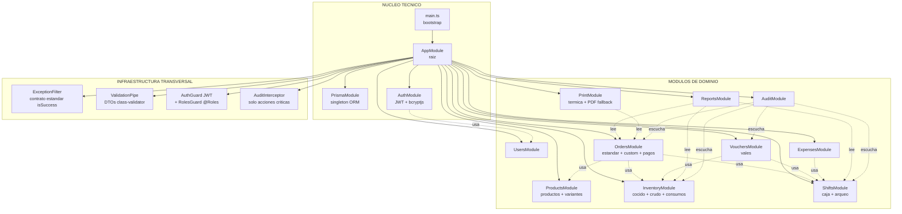
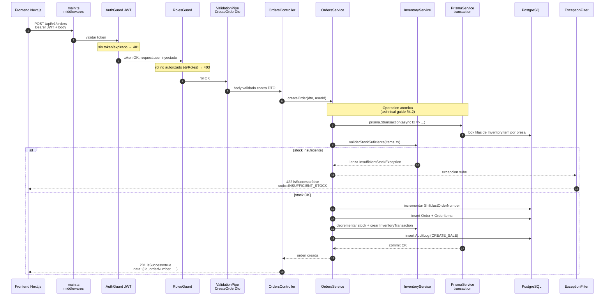
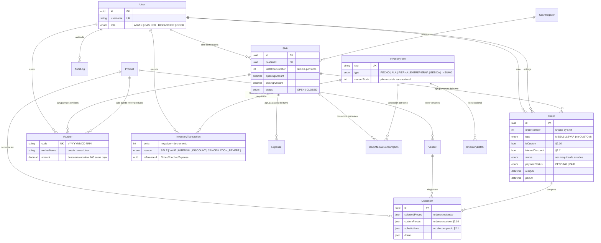

# Architecture Overview — Wonder Chicken Backend

**Propósito:** Servir como **mapa visual** del backend.
**Audiencia:** Quien recién aterriza en el repo y necesita entender (a) cómo se organizan los archivos del backend NestJS, (b) cómo viaja un request desde el frontend hasta la base de datos, y (c) qué endpoints existen y a qué recursos golpean.

**Fuentes:**
- Reglas de negocio → [`docs/pdr.md`](pdr.md)
- Modelo de datos + contrato API → [`docs/technical_guide.md`](technical_guide.md)
- Esquema real → [`prisma/schema.prisma`](../prisma/schema.prisma)

> Si un diagrama no coincide con el código, gana el código. Este documento se actualiza, no al revés.

---

## Índice

- [1. Arquitectura modular del backend (NestJS)](#1-arquitectura-modular-del-backend-nestjs)
- [2. Flujo interno: como viaja un request (lifecycle)](#2-flujo-interno-como-viaja-un-request-lifecycle)
- [3. Endpoints por dominio (mapa visual)](#3-endpoints-por-dominio-mapa-visual)
- [4. Modelo relacional (vista resumida del Prisma)](#4-modelo-relacional-vista-resumida-del-prisma)
- [5. Como leer este documento mientras codeas](#5-como-leer-este-documento-mientras-codeas)
- [Referencias cruzadas](#referencias-cruzadas)

---

## 1. Arquitectura modular del backend (NestJS)

NestJS organiza el backend en **módulos**. Cada módulo encapsula un dominio del negocio (productos, pedidos, inventario, etc.) y expone su funcionalidad al resto vía `imports/exports`. Esto NO es opcional, es la columna vertebral de NestJS — si lo entendés acá, el resto del backend cae solo.



**Decisiones que el grafico hace explicitas:**

- `OrdersModule` es el **modulo mas pesado** porque concentra: orden estandar, orden custom (PDR §2.10), confirmacion de pago, anulacion, descuento al personal (§2.11) y comanda digital. Ahi vive la transaccion atomica `pago + decremento de inventario` (technical guide §4.2).
- `InventoryModule` es **compartido**: lo usan ordenes, vales y los cocineros. Maneja los **dos planos** del pollo (cocido transaccional + crudo anotado por turno via `ShiftChickenLog`).
- `AuditModule` no se "inyecta" en cada modulo: **escucha** eventos via interceptor. Esto evita que cada controller tenga que recordar registrar el audit log a mano.
- **Control de permisos por rol enforced en el backend (V1)**. Dos guards globales (`APP_GUARD`): `AuthGuard` valida el JWT (401 si falta/expira) y `RolesGuard` valida el rol declarado con `@Roles()` (403 si no corresponde). La UI oculta pantallas, pero **no es la frontera de seguridad** (PDR §2.7 / FR-018; detalle en [`technical_guide.md` §5.2](technical_guide.md#52-autenticación-y-autorización)).

---

## 2. Flujo interno: como viaja un request (lifecycle)

Cuando el frontend dispara un `POST /api/v1/orders`, esto es lo que pasa **archivo por archivo**. Esta es la arquitectura clasica de NestJS: **Controller (HTTP) → Service (logica) → Prisma (DB)**. Si te saltas alguna capa, romper el modelo es cuestion de tiempo.



**Capas (las que importan):**

| Capa | Archivo tipico | Responsabilidad unica |
|------|----------------|----------------------|
| Entry point | `main.ts` | Bootstrap, pipes globales, CORS, swagger |
| Module | `orders.module.ts` | Declarar controllers, providers, imports |
| Controller | `orders.controller.ts` | Definir rutas HTTP, leer DTOs, NO contiene logica |
| DTO | `dto/create-order.dto.ts` | Validacion con `class-validator` |
| Service | `orders.service.ts` | **TODA la logica de negocio vive aca** |
| Repository (opcional) | `orders.repository.ts` | Abstraer queries complejas si el service crece |
| Prisma | `prisma.service.ts` | Cliente compartido, transacciones |
| Filter | `http-exception.filter.ts` | Formatear errores al contrato `isSuccess` |

**Regla de oro:** el controller NO sabe de Prisma. El service NO sabe de HTTP. Si rompes esto, perdes testabilidad y la transaccion atomica se te va al pasto.

---

## 3. Endpoints por dominio (mapa visual)

Los endpoints estan listados en [`docs/technical_guide.md` §5.1](technical_guide.md). Este diagrama los **agrupa por recurso y los conecta a su entidad** en la BD, para que veas de un vistazo quien toca a quien.

```mermaid
graph LR
    subgraph AUTH["AUTH (publico)"]
        A1["POST /auth/login<br/>200 + JWT"]
    end

    subgraph PRODUCTOS["PRODUCTOS"]
        P1["POST /products"]
        P2["GET /products"]
        P3["POST /variants"]
    end

    subgraph ORDENES["ORDENES"]
        O1["POST /orders<br/>estandar MESA/LLEVAR"]
        O2["POST /orders/custom<br/>presas surtidas §2.10"]
        O3["GET /orders/:id"]
        O4["GET /orders/:id/public<br/>vista cliente"]
        O5["PATCH /orders/:id/status<br/>preparing/ready/delivered"]
        O6["POST /orders/:id/pay<br/>pendingPayment to paid"]
        O7["POST /orders/:id/cancel<br/>anulacion FR-011b"]
    end

    subgraph INVENTARIO["INVENTARIO"]
        I1["POST /inventory/adjust"]
        I2["POST /inventory/manual-consumption"]
        I3["GET /inventory/shift-chicken-log/:shiftId<br/>autopobla reprocessRaw"]
        I4["POST /inventory/shift-chicken-log<br/>plano crudo §2.3"]
        I5["POST /inventory/shift-chicken-log/:shiftId/close"]
    end

    subgraph CAJA["CAJA Y TURNO"]
        S1["POST /shifts/open"]
        S2["POST /shifts/close<br/>arqueo CSV"]
    end

    subgraph VALES["VALES"]
        V1["POST /vouchers"]
        V2["GET /vouchers<br/>filtros trabajador/fecha"]
    end

    subgraph REPORTES["REPORTES"]
        R1["GET /reports/sales"]
        R2["GET /reports/inventory-presas"]
    end

    subgraph IMPRESION["IMPRESION"]
        PR1["POST /print/invoice<br/>termica a demanda"]
        PR2["GET /print/invoice/:id/pdf<br/>fallback PDF"]
    end

    subgraph DB[("PostgreSQL")]
        T_USERS[(users)]
        T_PROD[(products + variants)]
        T_ORDER[(orders + order_items)]
        T_INV[(inventory_items<br/>+ transactions<br/>+ shift_chicken_log)]
        T_SHIFT[(shifts + cash_registers<br/>+ expenses)]
        T_VOUCHER[(vouchers)]
        T_AUDIT[(audit_logs)]
    end

    A1 --> T_USERS

    P1 --> T_PROD
    P2 --> T_PROD
    P3 --> T_PROD

    O1 --> T_ORDER
    O1 -.al pagar.-> T_INV
    O2 --> T_ORDER
    O2 -.al pagar.-> T_INV
    O3 --> T_ORDER
    O4 --> T_ORDER
    O5 --> T_ORDER
    O6 --> T_ORDER
    O6 ==decremento atomico==> T_INV
    O7 --> T_ORDER
    O7 ==reversion==> T_INV

    I1 --> T_INV
    I2 --> T_INV
    I3 --> T_INV
    I4 --> T_INV
    I5 --> T_INV

    S1 --> T_SHIFT
    S2 --> T_SHIFT

    V1 --> T_VOUCHER
    V1 ==decremento==> T_INV
    V2 --> T_VOUCHER

    R1 --> T_ORDER
    R1 --> T_SHIFT
    R2 --> T_INV

    PR1 --> T_ORDER
    PR2 --> T_ORDER

    O1 -.audit.-> T_AUDIT
    O6 -.audit.-> T_AUDIT
    O7 -.audit.-> T_AUDIT
    V1 -.audit.-> T_AUDIT
    S1 -.audit.-> T_AUDIT
    S2 -.audit.-> T_AUDIT
    I1 -.audit.-> T_AUDIT
```

**Leyenda del grafico:**
- Linea solida `-->` : el endpoint **lee/escribe** la tabla directamente.
- Linea gruesa `==>` : operacion **atomica critica** (transaccion + auditoria obligatoria).
- Linea punteada `-.->` : efecto **lateral** (al pagar, al anular, audit).

**Lo que el grafico te grita:**
- `POST /orders/:id/pay` es el **endpoint mas critico del sistema** porque dispara el decremento atomico de inventario (PDR §2.3, technical guide §4.2). Si fallas la transaccion ahi, el restaurante pierde plata.
- `POST /orders/custom` es **un endpoint aparte de** `POST /orders` a proposito (technical guide §5.1, PDR §2.10). NO es overkill, es claridad de DTO: la orden custom permite `customPieces` y precio libre, la estandar no.
- Los vales **descuentan inventario pero NO contabilizan ingreso** (PDR §2.4) — por eso `POST /vouchers` golpea `inventory_items` pero NO toca `shifts` para sumar caja.

---

## 4. Modelo relacional (vista resumida del Prisma)

Vista compacta del `schema.prisma` real. **Solo las relaciones criticas**, no campos. Para campos completos ir al schema.



**Decisiones modeladas que vale la pena tener en la cabeza:**

| Regla del negocio | Como queda en el schema |
|---|---|
| CUSTOM no es un tipo de pedido (§2.10) | `Order.type` solo tiene `MESA` y `LLEVAR`. El flag es `Order.isCustom: boolean`. |
| Sustitucion no cambia precio (§2.1) | `OrderItem.substitutions: Json` existe, pero **NO hay** campo `priceAdjustment`. |
| Inventario decrementa al pagar (§2.3) | El decremento se hace en el service de `POST /orders/:id/pay`, NO al pasar a `preparing`. |
| Numeracion por turno (FR-007) | `Order.orderNumber` con `@@unique([shiftId, orderNumber])` + `Shift.lastOrderNumber` como contador atomico. |
| Cocido vs crudo (§2.3) | `InventoryItem.type IN (PECHO,...)` = COCIDO transaccional. El plano CRUDO vive aparte en `ShiftChickenLog` (a agregar en el schema — ver technical guide §3.1). |
| Vale no suma caja (§2.4) | `Voucher` no genera fila en ningun campo de monto de `Shift`. Aparece como linea separada en el arqueo via query. |

> El schema actual NO tiene aun el modelo `ShiftChickenLog` listado en [`docs/technical_guide.md` §3.1](technical_guide.md). Es deuda explicita del Sprint 0 / Sprint 2.

---

## 5. Como leer este documento mientras codeas

- **Antes de crear un modulo nuevo:** mira el grafico §1 y ubicate. Si tu modulo no esta ahi, preguntate por que.
- **Antes de tocar un endpoint:** mira el §3 y verifica que efectos laterales dispara (audit, inventario, caja).
- **Antes de escribir logica en un controller:** parate y leelo de nuevo §2. La logica va al **service**, no al controller.
- **Antes de agregar un campo al schema:** revisa el §4 y verifica que la regla del negocio no este ya cubierta por un campo existente.

---

## Referencias cruzadas

| Tema | Documento autoritativo |
|------|------------------------|
| Reglas de negocio (no negociables) | [`docs/pdr.md` §2](pdr.md) |
| Modelo de datos y entidades | [`docs/technical_guide.md` §3](technical_guide.md) |
| Maquina de estados de pedidos | [`docs/technical_guide.md` §4](technical_guide.md) + [`docs/pdr.md` §4](pdr.md) |
| Lista oficial de endpoints | [`docs/technical_guide.md` §5.1](technical_guide.md) |
| Mapeo negocio to tecnica | [`docs/technical_guide.md` §10](technical_guide.md) |
| Roadmap V1 vs V2 | [`docs/pdr.md` §13](pdr.md) |
