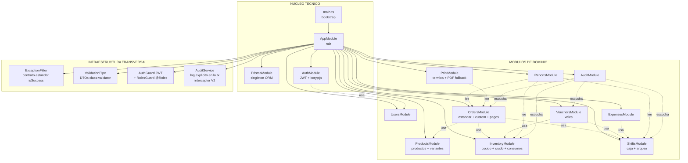
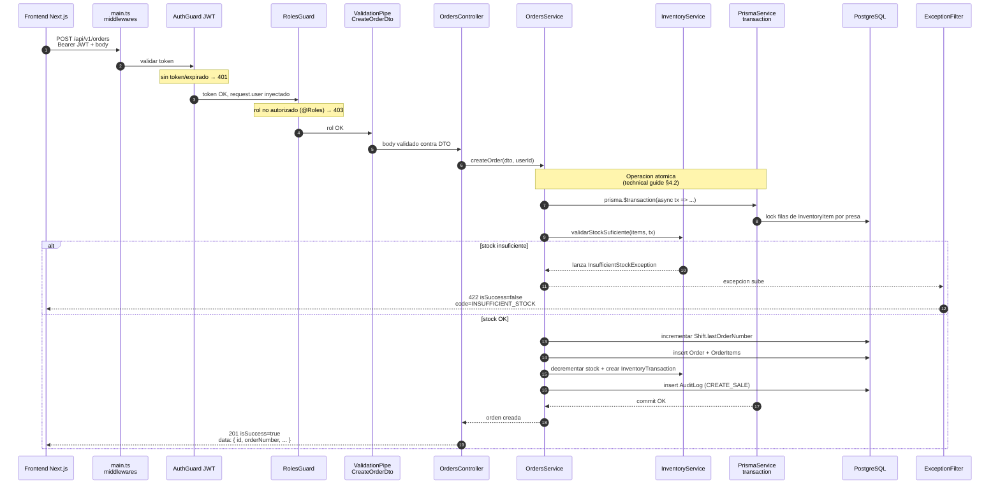
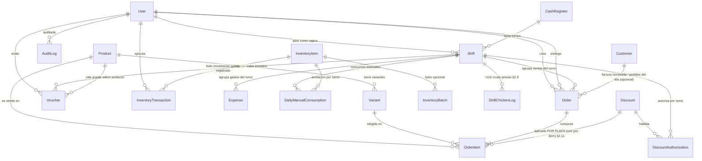

# Architecture Overview — Wonder Chicken Backend

**Propósito:** Servir como **mapa visual** del backend.
**Audiencia:** Quien recién aterriza en el repo y necesita entender (a) cómo se organizan los archivos del backend NestJS, (b) cómo viaja un request desde el frontend hasta la base de datos, y (c) qué endpoints existen y a qué recursos golpean.

**Fuentes:**
- Contexto / material de origen → [`docs/business_context.md`](business_context.md)
- Reglas de negocio → [`docs/pdr.md`](pdr.md)
- Modelo de datos + contrato API → [`docs/technical_guide.md`](technical_guide.md)
- Esquema real → [`prisma/schema.prisma`](../prisma/schema.prisma)

> Si un diagrama no coincide con el código, gana el código. Este documento se actualiza, no al revés.
>
> **Altitud de este documento:** el [ER de §3](#3-modelo-relacional-vista-resumida-del-prisma) es una **vista resumida** — solo relaciones críticas, **sin campos**. Es para **ubicarte, no para implementar**. El modelo lógico completo (todos los campos, snapshots, enums — el contrato del dato) vive en [`technical_guide.md` §3](technical_guide.md#3-modelo-de-datos-esquema-lógico-para-la-bd). Mismo sistema, distinta altitud.

---

## Índice

- [1. Arquitectura modular del backend (NestJS)](#1-arquitectura-modular-del-backend-nestjs)
- [2. Flujo interno: como viaja un request (lifecycle)](#2-flujo-interno-como-viaja-un-request-lifecycle)
- [3. Modelo relacional (vista resumida del Prisma)](#3-modelo-relacional-vista-resumida-del-prisma)
- [4. Como leer este documento mientras codeas](#4-como-leer-este-documento-mientras-codeas)
- [Referencias cruzadas](#referencias-cruzadas)

---

## 1. Arquitectura modular del backend (NestJS)

NestJS organiza el backend en **módulos**. Cada módulo encapsula un dominio del negocio (productos, pedidos, inventario, etc.) y expone su funcionalidad al resto vía `imports/exports`. Esto NO es opcional, es la columna vertebral de NestJS — si lo entendés acá, el resto del backend cae solo.

**Decisiones que el grafico hace explicitas:**

- `OrdersModule` es el **modulo mas pesado** porque concentra: orden estandar, orden custom (PDR §2.10), confirmacion de pago, anulacion, descuento al personal (§2.11) y comanda digital. Ahi vive la transaccion atomica `pago + decremento de inventario` (technical guide §4.2).
- `InventoryModule` es **compartido**: lo usan ordenes, vales y los cocineros. Maneja los **dos planos** del pollo (cocido transaccional + crudo anotado por turno via `ShiftChickenLog`).
- `AuditModule` en V1 expone un `AuditService.log(tx, ...)` que cada service crítico llama **explícitamente dentro de su misma transacción** (ver diagrama §2). Así el audit es **atómico** con la acción y tiene el estado *antes/después* para `details`. El patrón de **interceptor genérico** (que correría fuera de la transacción y sin estado previo) se **difiere a V2** con un caso real. Detalle en [`technical_guide.md` §4.3](technical_guide.md#43-auditoría--implementación-v1).
- **Control de permisos por rol enforced en el backend (V1)**. Dos guards globales (`APP_GUARD`): `AuthGuard` valida el JWT (401 si falta/expira) y `RolesGuard` valida el rol declarado con `@Roles()` (403 si no corresponde). La UI oculta pantallas, pero **no es la frontera de seguridad** (PDR §2.7 / FR-018; detalle en [`technical_guide.md` §5.2](technical_guide.md#52-autenticación-y-autorización)).

---

## 2. Flujo interno: como viaja un request (lifecycle)

Cuando el frontend dispara un `POST /api/v1/orders`, esto es lo que pasa **archivo por archivo**. Esta es la arquitectura clasica de NestJS: **Controller (HTTP) → Service (logica) → Prisma (DB)**. Si te saltas alguna capa, romper el modelo es cuestion de tiempo.

**Capas (las que importan):**

| Capa | Archivo tipico | Responsabilidad unica |
|------|----------------|----------------------|
| Entry point | `main.ts` | Bootstrap, pipes globales, CORS, swagger |
| Module | `orders.module.ts` | Declarar controllers, providers, imports |
| Controller | `orders.controller.ts` | Definir rutas HTTP, leer DTOs, NO contiene logica |
| DTO | `dto/create-order.dto.ts` | Validacion con `class-validator` |
| Service | `orders.service.ts` | **TODA la logica de negocio vive aca** |
| Repository (opcional) | `orders.repository.ts` | Abstraer queries complejas si el service crece |
| Prisma | `prisma.service.ts` | Cliente compartido, transacciones |
| Filter | `http-exception.filter.ts` | Formatear errores al contrato `isSuccess` |

**Regla de oro:** el controller NO sabe de Prisma. El service NO sabe de HTTP. Si rompes esto, perdes testabilidad y la transaccion atomica se te va al pasto.

---

## 3. Modelo relacional (vista resumida del Prisma)

Vista compacta del `schema.prisma` real. **Solo las relaciones criticas**, no campos. Para campos completos ir al schema.

**Decisiones modeladas que vale la pena tener en la cabeza:**

| Regla del negocio | Como queda en el schema |
|---|---|
| CUSTOM no es un tipo de pedido (§2.10) | `Order.type` solo tiene `MESA` y `LLEVAR`. El flag es `Order.isCustom: boolean`. |
| Cliente es entidad, no solo string (§2.12) | `Customer` (CI/NIT, datos personales) habilita factura nominada y vista del dia. `Order.customerId: UUID?` es **opcional** (anónimo = "S/N", legal < Bs 1.000). Detalle en technical_guide §3.1. |
| Vista pública por token, no por id (FR-015) | `Order.publicToken` aleatorio no adivinable es la credencial de `GET /public/orders/:token`. El `customerId` **agrupa** los pedidos del día; el token **da acceso**. El NIT no es llave. |
| Sustitucion no cambia precio (§2.1) | `OrderItem.substitutions: Json` existe, pero **NO hay** campo `priceAdjustment`. |
| Inventario decrementa al pagar (§2.3) | El decremento se hace en el service de `POST /orders/:id/pay`, NO al pasar a `preparing`. |
| Numeracion por turno (FR-007) | `Order.orderNumber` con `@@unique([shiftId, orderNumber])` + `Shift.lastOrderNumber` como contador atomico. |
| Cocido vs crudo (§2.3) | `InventoryItem.type IN (PECHO,...)` = COCIDO transaccional. El plano CRUDO vive aparte en `ShiftChickenLog` (a agregar en el schema — ver technical guide §3.1). |
| Vale no suma caja (§2.4) | `Voucher` no genera fila en ningun campo de monto de `Shift`. Aparece como linea separada en el arqueo via query. |
| Descuento al personal ya no es un flag, y aplica POR PLATO (§2.11) | Se eliminó `Order.internalDiscount`. El descuento vive a **nivel ítem**: `OrderItem.discountId` apunta al catálogo `Discount` y `OrderItem.discountAmount` congela el snapshot por unidad; la cajera marca qué platos lo llevan. La autorización por turno va en `DiscountAuthorization`. El descuento es puramente monetario (no hay `reason` de descuento en `InventoryTransaction`). Detalle de campos en technical_guide §3.1. |

> El schema actual NO tiene aun el modelo `ShiftChickenLog` listado en [`docs/technical_guide.md` §3.1](technical_guide.md). Es deuda explicita del Sprint 0 / Sprint 2.

---

## 4. Como leer este documento mientras codeas

- **Antes de crear un modulo nuevo:** mira el grafico §1 y ubicate. Si tu modulo no esta ahi, preguntate por que.
- **Antes de escribir logica en un controller:** parate y leelo de nuevo §2. La logica va al **service**, no al controller.
- **Antes de agregar un campo al schema:** revisa el §3 y verifica que la regla del negocio no este ya cubierta por un campo existente.
- **Lista de endpoints:** vive en [`docs/technical_guide.md` §5.1](technical_guide.md); en el código se documenta con **Swagger/OpenAPI** generado desde los controllers reales.

---

## Referencias cruzadas

| Tema | Documento autoritativo |
|------|------------------------|
| Reglas de negocio (no negociables) | [`docs/pdr.md` §2](pdr.md) |
| Modelo de datos y entidades | [`docs/technical_guide.md` §3](technical_guide.md) |
| Maquina de estados de pedidos | [`docs/technical_guide.md` §4](technical_guide.md) + [`docs/pdr.md` §4](pdr.md) |
| Lista oficial de endpoints | [`docs/technical_guide.md` §5.1](technical_guide.md) |
| Mapeo negocio to tecnica | [`docs/technical_guide.md` §10](technical_guide.md) |
| Roadmap V1 vs V2 | [`docs/pdr.md` §13](pdr.md) |
