# Modelo de datos y Endpoints — Referencia rápida

**Sistema Informático de Ventas — Wonder Chicken**

> **Qué es este documento:** una **vista de referencia rápida** (cheat-sheet) que reúne en un solo lugar (a) el **diagrama entidad-relación con todos los campos** y (b) los **endpoints más importantes con ejemplos de request/response**.
>
> **No es fuente de verdad.** Es una **derivación** de [`technical_guide.md` §3](technical_guide.md#3-modelo-de-datos-esquema-lógico-para-la-bd) (modelo) y [`technical_guide.md` §6](technical_guide.md#6-json-payloads-de-ejemplo) (payloads). Ante cualquier conflicto, **gana `technical_guide.md`**. El esquema real, cuando exista, vive en [`prisma/schema.prisma`](../prisma/schema.prisma).
>
> Todas las respuestas siguen el **contrato estándar** `{ isSuccess, message, data }` ([§5.3](technical_guide.md#53-estructura-de-respuesta-estándar)). Todos los endpoints exigen `Authorization: Bearer <token>` salvo los marcados **público**.

---

## Índice

- [1. Diagrama entidad-relación (con campos)](#1-diagrama-entidad-relación-con-campos)
- [2. Resumen de entidades](#2-resumen-de-entidades)
- [3. Endpoints importantes (request / response)](#3-endpoints-importantes-request--response)
  - [3.1 Autenticación](#31-autenticación)
  - [3.2 Órdenes](#32-órdenes)
  - [3.3 Inventario](#33-inventario)
  - [3.4 Caja y turno](#34-caja-y-turno)
  - [3.5 Vales](#35-vales)
  - [3.6 Descuentos](#36-descuentos)

---

## 1. Diagrama entidad-relación (con campos)

```mermaid
erDiagram
    User ||--o{ Order : "createdBy / deliveredBy"
    User ||--o{ Shift : "cashierId"
    User ||--o{ Voucher : "issuedBy"
    User ||--o{ InventoryTransaction : "ejecuta"
    User ||--o{ AuditLog : "actor"
    User ||--o{ DiscountAuthorization : "admin / cajera"

    CashRegister ||--o{ Shift : "tiene turnos"

    Shift ||--o{ Order : "agrupa"
    Customer ||--o{ Order : "factura nominada / pedidos del día (opcional)"
    Shift ||--o{ Voucher : "agrupa"
    Shift ||--o{ Expense : "agrupa"
    Shift ||--o{ DailyManualConsumption : "consumos"
    Shift ||--o{ ShiftChickenLog : "ciclo crudo"
    Shift ||--o{ DiscountAuthorization : "autoriza por turno"

    Product ||--o{ Variant : "tiene"
    Product ||--o{ OrderItem : "se vende en"
    Product ||--o{ Voucher : "puede referir"
    Variant ||--o{ OrderItem : "elegida en"

    Order ||--|{ OrderItem : "compone"
    Order ||--o{ InventoryTransaction : "reason=sale"

    Discount ||--o{ Order : "aplicado, uno por orden"
    Discount ||--o{ Voucher : "descuento personal (opcional)"
    Discount ||--o{ DiscountAuthorization : "habilita"

    InventoryItem ||--o{ InventoryTransaction : "movimientos"
    InventoryItem ||--o{ InventoryBatch : "lotes"
    InventoryItem ||--o{ DailyManualConsumption : "anotacion"

    User {
        uuid id PK
        string name
        enum role "ADMIN|CASHIER|DISPATCHER|COOK"
        string username
        string passwordHash
        bool active
    }

    CashRegister {
        uuid id PK
        string name
        bool active
    }

    Shift {
        uuid id PK
        uuid cashierId FK
        uuid cashRegisterId FK "nullable"
        datetime startAt
        datetime endAt "nullable"
        decimal openingAmount
        decimal closingAmount "nullable"
        decimal expectedAmount "nullable"
        decimal discrepancy "nullable"
    }

    Product {
        uuid id PK
        string name
        decimal basePrice
        string category
        bool active
        string description
    }

    Variant {
        uuid id PK
        uuid productId FK
        string name
        json components
        bool isDefault
    }

    Customer {
        uuid id PK
        string ci "único, buscable"
        string nit "nullable, buscable"
        string firstName
        string lastName
        enum sex "HOMBRE|MUJER"
        date birthDate "nullable"
        string phone "nullable"
        string email "nullable"
        bool active
    }

    Order {
        uuid id PK
        enum type "MESA|LLEVAR"
        string tableNumber "nullable"
        string customerName "nullable, snapshot / S/N si anónimo"
        uuid customerId FK "nullable, cliente registrado"
        string publicToken "único, no adivinable: vista pública"
        enum status "created..closed|pendingPayment|cancelled|onHold"
        enum paymentStatus "pending|paid|partial"
        enum paymentMethod "cash|card|vale, nullable"
        decimal originalAmount "antes de descuento"
        uuid discountId FK "nullable, uno por orden"
        decimal discountAmount "snapshot del monto fijo"
        decimal total "derivado: original menos descuento"
        bool isCustom "marca, no es un tipo"
        string cancelReason "nullable"
        string cancelDetails "nullable"
        uuid createdBy FK
        datetime createdAt
        datetime paidAt "nullable"
        datetime cancelledAt "nullable"
        datetime readyAt "nullable"
        datetime deliveredAt "nullable"
        uuid deliveredBy FK "nullable"
        uuid shiftId FK
    }

    OrderItem {
        uuid id PK
        uuid orderId FK
        uuid productId FK "nullable si custom"
        uuid variantId FK "nullable"
        int quantity
        decimal unitPrice
        decimal totalPrice
        string notes "nullable"
        json substitutions "nullable"
        json customPieces "nullable, presas surtidas"
    }

    InventoryItem {
        uuid id PK
        string sku
        string name
        enum unit "presa|bolsa|unidad"
        enum type "pecho|ala|pierna|entrepierna|bebida|insumo"
        int currentStock
        string unitMeasure
        decimal salePrice "nullable, precio venta por presa"
    }

    InventoryBatch {
        uuid id PK
        uuid inventoryItemId FK
        string batchCode
        datetime processedAt
        int quantityReceived
        int quantityRemaining
        string origin
    }

    InventoryTransaction {
        uuid id PK
        uuid inventoryItemId FK
        int delta
        enum reason "sale|adjustment|reception|vale|manualConsumption"
        uuid referenceId FK "nullable"
        uuid userId FK
        string note "nullable"
        datetime timestamp
    }

    DailyManualConsumption {
        uuid id PK
        uuid shiftId FK
        uuid inventoryItemId FK
        int quantity
        uuid recordedBy FK
        datetime recordedAt
    }

    ShiftChickenLog {
        uuid id PK
        uuid shiftId FK
        enum pieceType "pecho|ala|pierna|entrepierna"
        int reprocessRaw "autopoblado del turno previo"
        int processedRaw
        int rawLeftover "pasa a reprocessRaw del turno T+1"
        int cookedLeftover "habilita descuento personal"
        uuid recordedBy FK
        datetime recordedAt
        datetime closedAt "nullable"
    }

    Voucher {
        uuid id PK
        string code
        uuid workerId FK "nullable"
        string workerName "si no es usuario"
        uuid productId FK "nullable"
        string productName
        decimal originalAmount "precio del producto"
        uuid discountId FK "nullable, descuento personal"
        decimal discountAmount "nullable, snapshot"
        decimal amount "derivado: original menos descuento"
        uuid issuedBy FK
        datetime issuedAt
        uuid shiftId FK
        enum status "issued|redeemed|cancelled"
        string note "nullable"
    }

    Discount {
        uuid id PK
        string name
        decimal fixedAmount "monto fijo, no porcentaje"
        enum availability "always|endOfShift"
        bool requiresAuthorization
        bool active
    }

    DiscountAuthorization {
        uuid id PK
        uuid discountId FK
        uuid shiftId FK
        uuid cashierId FK
        uuid authorizedBy FK "admin"
        datetime authorizedAt
    }

    Expense {
        uuid id PK
        string description
        decimal amount
        enum paidBy "cash|register"
        uuid shiftId FK
        uuid createdBy FK
        datetime createdAt
    }

    AuditLog {
        uuid id PK
        string entity
        uuid entityId
        string action
        uuid userId FK
        datetime timestamp
        json details "nullable, before/after"
    }
```



> **Nota:** `Component` es una entidad **opcional** (`id`, `name`, `type`, `unitPrice`) que el modelo contempla para descomponer platos; no es obligatoria en V1. Detalle en [`technical_guide.md` §3.1](technical_guide.md#31-entidades-principales).

---

## 2. Resumen de entidades

| Entidad | Para qué sirve |
|---|---|
| `User` | Personal del sistema con su rol (ADMIN, CASHIER, DISPATCHER, COOK). |
| `CashRegister` / `Shift` | Caja física y turno de trabajo (apertura/cierre, arqueo). |
| `Product` / `Variant` | Catálogo de platos y sus variantes (composición). |
| `Order` / `OrderItem` | Pedido y sus ítems (estándar o custom; MESA/LLEVAR). |
| `Customer` | Cliente registrado (CI/NIT, datos personales) para **factura nominada** y la vista de **"pedidos del día"**. Opcional por venta — anónimo = "S/N". |
| `InventoryItem` | Inventario **cocido** transaccional (presas, bebidas, insumos). |
| `InventoryTransaction` | Todo movimiento de stock (venta, ajuste, vale, recepción). |
| `InventoryBatch` | Lotes (opcional). |
| `ShiftChickenLog` | Ciclo **crudo** de presas por turno (§2.3). |
| `DailyManualConsumption` | Consumos manuales por turno (bolsas, vasos, etc.). |
| `Voucher` | Vale de consumo del personal (descuenta nómina, no caja). |
| `Discount` / `DiscountAuthorization` | Catálogo de descuentos y su autorización por turno (§2.11). |
| `Expense` | Gasto pagado desde caja. |
| `AuditLog` | Rastro inmutable de acciones críticas (§2.9). |

---

## 3. Endpoints importantes (request / response)

> Los request bodies son **ejemplos representativos** de lo que recibirá cada endpoint; los DTOs definitivos se validan con `class-validator`. Lista completa de endpoints y matriz de roles en [`technical_guide.md` §5](technical_guide.md#5-contratos-de-la-api).

### 3.1 Autenticación

**`POST /api/v1/auth/login`** — **público**. Devuelve el JWT que el resto de llamadas envía como `Bearer`.

Request:
```json
{
  "username": "roxana",
  "password": "••••••••"
}
```
Response (200):
```json
{
  "isSuccess": true,
  "message": "Autenticación exitosa",
  "data": {
    "token": "eyJhbGciOiJIUzI1NiIsInR5cCI6IkpXVCJ9...",
    "user": { "id": "uuid-user-roxana", "username": "roxana", "role": "CASHIER" }
  }
}
```
> Sin token o token expirado/inválido en el resto de endpoints → **401**. Rol no autorizado → **403** (`FORBIDDEN`).

### 3.1a Clientes

**`GET /api/v1/customers?search=<ci|nit|nombre>`** — buscar cliente registrado para factura nominada. Rol: `CASHIER`, `ADMIN`.

Response (200):
```json
{
  "isSuccess": true,
  "message": "Clientes encontrados",
  "data": [
    {
      "id": "uuid-customer-001",
      "ci": "8351427",
      "nit": "120558027",
      "firstName": "MARCO",
      "lastName": "ORTEGA GUTIERREZ",
      "sex": "HOMBRE",
      "birthDate": "1990-03-14",
      "phone": "71234567",
      "email": "marco.ortega@example.com",
      "active": true
    }
  ]
}
```

**`POST /api/v1/customers`** — registrar cliente. Rol: `CASHIER`, `ADMIN`. El cliente puede dictar **CI o NIT** para su factura.

Request:
```json
{
  "ci": "8351427",
  "nit": "120558027",
  "firstName": "MARCO",
  "lastName": "ORTEGA GUTIERREZ",
  "sex": "HOMBRE",
  "birthDate": "1990-03-14",
  "phone": "71234567",
  "email": "marco.ortega@example.com"
}
```
Response (201): mismo objeto `Customer` dentro de `data` (con `id` y `active: true`).

**`GET /api/v1/public/orders/{token}`** — **público**: vista de la comanda del cliente por su `publicToken` (no por `id`). Si la orden tiene `customerId`, incluye además sus **otros pedidos del día**. El token habilita el acceso; el NIT **no** es llave. (Ver [`pdr.md` §2.12 / §7.4](pdr.md), FR-015 / FR-019.)

### 3.2 Órdenes

**`POST /api/v1/orders`** — crear orden estándar (MESA/LLEVAR). Rol: `CASHIER`.

Request (datos mínimos — ver [principios §5.0](technical_guide.md#50-principios-de-diseño-de-la-api-el-backend-manda-el-frontend-renderiza)):
```json
{
  "type": "MESA",
  "tableNumber": "70",
  "customerId": "uuid-customer-001",
  "paymentStatus": "paid",
  "paymentMethod": "cash",
  "items": [
    {
      "productId": "uuid-product-wonder",
      "variantId": "uuid-variant-wonder",
      "quantity": 2,
      "selectedPieces": [ {"type":"pecho","qty":2}, {"type":"ala","qty":2} ],
      "substitutions": [ {"from":"mixto","to":"arroz"} ]
    },
    { "productId": "uuid-product-fanta", "quantity": 1 },
    { "productId": "uuid-product-papas", "quantity": 2 }
  ]
}
```
> **N ítems libres:** un pedido estándar mezcla **platos + bebidas + extras** en cualquier cantidad (acá: Wonder×2, Fanta×1, Porción de Papas×2). Cada uno es un `Product`; el front solo manda `productId` + `quantity`, el backend pone el precio y suma el total (§2.2 / §5.0).
> **Mínimos:** `customerId` es **opcional** (omitirlo = venta anónima "S/N"); el backend lee `Customer` y snapshotea `customerName`. NO se envían `createdBy` ni `shiftId` (los deriva del JWT y del turno activo) ni precios (los calcula desde `Product`/`Variant`). Para venta nominada, el front ya obtuvo el `customerId` vía `GET /customers`.
Response:
```json
{
  "isSuccess": true,
  "message": "Pedido creado y pagado correctamente",
  "data": {
    "id": "uuid-order-001",
    "type": "MESA",
    "tableNumber": "70",
    "customerName": "GOMEZ",
    "customerId": "uuid-customer-001",
    "publicToken": "a3f9c2e81b4d7f60a9e35c8d2b1f4a7e",
    "status": "preparing",
    "paymentStatus": "paid",
    "paymentMethod": "cash",
    "items": [
      {
        "productId": "uuid-product-wonder",
        "variantId": "uuid-variant-wonder",
        "quantity": 2,
        "unitPrice": 36.00,
        "totalPrice": 72.00,
        "substitutions": [ {"from":"mixto","to":"arroz"} ],
        "selectedPieces": [ {"type":"pecho","qty":2}, {"type":"ala","qty":2} ]
      },
      { "productId": "uuid-product-fanta", "quantity": 1, "unitPrice": 8.00, "totalPrice": 8.00 },
      { "productId": "uuid-product-papas", "quantity": 2, "unitPrice": 12.00, "totalPrice": 24.00 }
    ],
    "total": 104.00,
    "createdBy": { "id": "uuid-user-roxana", "name": "Roxana" },
    "paidAt": "2026-05-01T22:10:00"
  }
}
```
> **Listo para render:** `createdBy` viene como `{ id, name }` (no id suelto); `customerName` ya resuelto desde `Customer`; `unitPrice`/`totalPrice`/`total` calculados. El frontend solo pinta.

**`POST /api/v1/orders/custom`** — crear orden custom (presas surtidas). Rol: `CASHIER`. La cajera arma las presas y confirma el precio.

Request:
```json
{
  "type": "LLEVAR",
  "customerId": "uuid-customer-002",
  "paymentStatus": "paid",
  "paymentMethod": "cash",
  "items": [
    {
      "customPieces": [ {"type":"pecho","qty":2}, {"type":"ala","qty":1} ],
      "extras": [ {"name":"papa","qty":1} ],
      "drinks": [ {"productId":"uuid-coca-500","qty":1} ],
      "quantity": 1,
      "unitPrice": 35.00
    }
  ]
}
```
> **Excepción de precio (§5.0):** acá el `unitPrice` **sí** lo envía el front porque es el **precio confirmado por la cajera** (§2.10). El backend igualmente calcula el **sugerido** para mostrarlo; lo que se persiste es el confirmado. `customerId` opcional; `createdBy`/`shiftId` del token/sesión.
Response:
```json
{
  "isSuccess": true,
  "message": "Pedido custom creado correctamente",
  "data": {
    "id": "uuid-order-003",
    "type": "LLEVAR",
    "isCustom": true,
    "customerName": "JUAN PEREZ",
    "customerId": "uuid-customer-002",
    "status": "preparing",
    "paymentStatus": "paid",
    "items": [
      {
        "customPieces": [ {"type":"pecho","qty":2}, {"type":"ala","qty":1} ],
        "extras": [ {"name":"papa","qty":1} ],
        "drinks": [ {"productId":"uuid-coca-500","qty":1} ],
        "quantity": 1,
        "unitPrice": 35.00,
        "totalPrice": 35.00
      }
    ],
    "total": 35.00,
    "createdBy": { "id": "uuid-user-roxana", "name": "Roxana" },
    "paidAt": "2026-05-01T13:20:00"
  }
}
```

**`POST /api/v1/orders/{id}/pay`** — confirmar pago (`pendingPayment` → `paid`). Acá se descuenta inventario. Rol: `CASHIER`.

Request:
```json
{ "paymentMethod": "cash" }
```
Response:
```json
{
  "isSuccess": true,
  "message": "Pago confirmado; inventario descontado",
  "data": {
    "id": "uuid-order-002",
    "status": "preparing",
    "paymentStatus": "paid",
    "paymentMethod": "cash",
    "total": 90.00,
    "paidAt": "2026-05-01T20:50:00"
  }
}
```

**`POST /api/v1/orders/{id}/discount`** — aplicar **un** descuento a la orden. Rol: `CASHIER`.

Request:
```json
{ "discountId": "uuid-discount-personal" }
```
Response:
```json
{
  "isSuccess": true,
  "message": "Descuento aplicado correctamente",
  "data": {
    "id": "uuid-order-004",
    "discountId": "uuid-discount-personal",
    "originalAmount": 30.00,
    "discountAmount": 7.00,
    "total": 23.00,
    "paymentStatus": "paid"
  }
}
```
> Errores posibles: `DISCOUNT_NOT_AVAILABLE` (fuera de su ventana), `DISCOUNT_NOT_AUTHORIZED` (la cajera no fue autorizada), `DISCOUNT_ALREADY_APPLIED` (sin apilamiento).

**`POST /api/v1/orders/{id}/cancel`** — anular pedido pagado (revierte inventario). Rol: `CASHIER`. `reason` y `details` obligatorios.

Request:
```json
{
  "reason": "Cliente cambió de opinión",
  "details": "Se devolvió el dinero en efectivo. Sin factura emitida."
}
```
Response:
```json
{
  "isSuccess": true,
  "message": "Pedido anulado correctamente",
  "data": {
    "id": "uuid-order-001",
    "status": "cancelled",
    "cancelReason": "Cliente cambió de opinión",
    "cancelDetails": "Se devolvió el dinero en efectivo. Sin factura emitida.",
    "cancelledAt": "2026-05-01T22:30:00",
    "inventoryReverted": true
  }
}
```

**`PATCH /api/v1/orders/{id}/status`** — despacho marca `ready` / `delivered`. Rol: `DISPATCHER`.

Request:
```json
{ "status": "ready" }
```
Response:
```json
{
  "isSuccess": true,
  "message": "Estado actualizado",
  "data": { "id": "uuid-order-001", "status": "ready", "readyAt": "2026-05-01T22:15:00" }
}
```

### 3.3 Inventario

**`POST /api/v1/inventory/adjust`** — ajuste manual con motivo. Rol: `ADMIN`.

Request:
```json
{
  "inventoryItemId": "uuid-inv-pecho",
  "delta": -2,
  "reason": "adjustment",
  "note": "Merma por presas quebradas"
}
```
Response:
```json
{
  "isSuccess": true,
  "message": "Ajuste de inventario registrado correctamente",
  "data": {
    "id": "uuid-invtx-001",
    "inventoryItemId": "uuid-inv-pecho",
    "delta": -2,
    "reason": "adjustment",
    "userId": { "id": "uuid-user-admin", "name": "Admin" }
  }
}
```
> `userId` se deriva del JWT (no del body) y se devuelve resuelto como `{ id, name }` (§5.0).

### 3.4 Caja y turno

**`POST /api/v1/shifts/open`** — abrir caja/turno. Rol: `CASHIER`.

Request:
```json
{ "openingAmount": 200.00, "cashRegisterId": "uuid-caja-1" }
```
Response:
```json
{
  "isSuccess": true,
  "message": "Caja abierta correctamente",
  "data": {
    "id": "uuid-shift-001",
    "cashierId": { "id": "uuid-user-roxana", "name": "Roxana" },
    "openingAmount": 200.00,
    "startAt": "2026-05-01T09:00:00"
  }
}
```

**`POST /api/v1/shifts/close`** — cerrar caja/turno con arqueo. Rol: `CASHIER`.

Request:
```json
{ "countedAmount": 1450.00 }
```
Response (ejemplo de arqueo):
```json
{
  "isSuccess": true,
  "message": "Caja cerrada; arqueo generado",
  "data": {
    "id": "uuid-shift-001",
    "openingAmount": 200.00,
    "closingAmount": 1450.00,
    "expectedAmount": 1455.00,
    "discrepancy": -5.00,
    "totals": {
      "sales": 1255.00,
      "byMethod": { "cash": 1100.00, "card": 155.00, "vale": 0.00 },
      "expenses": 30.00,
      "vouchers": 60.00,
      "cancellations": { "count": 1, "amount": 36.00 }
    }
  }
}
```

### 3.5 Vales

**`POST /api/v1/vouchers`** — emitir vale (descuenta inventario, NO suma a caja). Rol: `CASHIER`.

Request (con descuento personal aplicado):
```json
{
  "workerName": "MARIA LOPEZ",
  "productId": "uuid-product-porcion-media",
  "discountId": "uuid-discount-personal"
}
```
> **Mínimos (§5.0):** el `amount` **NO se envía** — el backend toma `originalAmount` de `productId` y, si viene `discountId`, le resta el `fixedAmount` (snapshot). `discountId` es **opcional** (sin él, el vale vale el precio pleno). `issuedBy` y `shiftId` salen del JWT y del turno activo; el `code` lo genera el backend.

Response:
```json
{
  "isSuccess": true,
  "message": "Vale registrado correctamente",
  "data": {
    "id": "uuid-voucher-001",
    "code": "V-20260501-001",
    "workerName": "MARIA LOPEZ",
    "productName": "Porción Media",
    "originalAmount": 30.00,
    "discountId": "uuid-discount-personal",
    "discountAmount": 7.00,
    "amount": 23.00,
    "issuedBy": { "id": "uuid-user-roxana", "name": "Roxana" },
    "issuedAt": "2026-05-01T14:30:00",
    "shiftId": "uuid-shift-001",
    "status": "issued"
  }
}
```

### 3.6 Descuentos

**`POST /api/v1/discounts`** — crear descuento en el catálogo. Rol: `ADMIN`.

Request:
```json
{
  "name": "Compensación al cliente",
  "fixedAmount": 7.00,
  "availability": "always",
  "requiresAuthorization": true,
  "active": true
}
```
Response:
```json
{
  "isSuccess": true,
  "message": "Descuento creado correctamente",
  "data": {
    "id": "uuid-discount-compensacion",
    "name": "Compensación al cliente",
    "fixedAmount": 7.00,
    "availability": "always",
    "requiresAuthorization": true,
    "active": true
  }
}
```

**`POST /api/v1/discounts/{id}/authorize`** — el admin autoriza a la sesión de cajera del turno. Rol: `ADMIN`. Deja `AuditLog`.

Request:
```json
{ "cashierId": "uuid-user-roxana" }
```
> **Mínimos (§5.0):** solo `cashierId` (a qué cajera se habilita). El `shiftId` lo deriva el backend del **turno activo de esa cajera**; `authorizedBy` sale del JWT del admin.

Response:
```json
{
  "isSuccess": true,
  "message": "Cajera autorizada para el descuento en este turno",
  "data": {
    "id": "uuid-auth-001",
    "discountId": "uuid-discount-compensacion",
    "shiftId": "uuid-shift-001",
    "cashierId": { "id": "uuid-user-roxana", "name": "Roxana" },
    "authorizedBy": { "id": "uuid-user-admin", "name": "Admin" },
    "authorizedAt": "2026-06-06T15:05:00"
  }
}
```

---

> **Para profundizar:** modelo completo en [`technical_guide.md` §3](technical_guide.md#3-modelo-de-datos-esquema-lógico-para-la-bd), todos los endpoints + matriz de roles en [`technical_guide.md` §5](technical_guide.md#5-contratos-de-la-api), payloads completos en [`technical_guide.md` §6](technical_guide.md#6-json-payloads-de-ejemplo). Las reglas de negocio mandan: [`pdr.md` §2](pdr.md).
