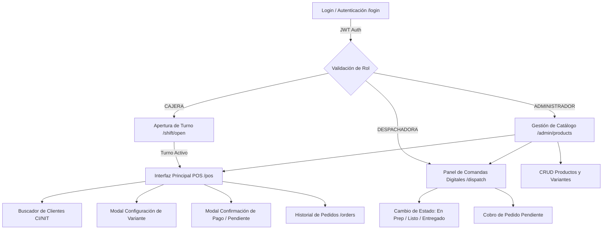

# Propuesta de Interfaces Frontend — Sprint 1 (Catálogo + POS Básico)

**Proyecto:** Wonder Chicken — Sistema Informático de Ventas  
**Documentos de Referencia:** [`docs/pdr.md`](pdr.md), [`docs/requirements.md`](requirements.md), [`docs/technical_guide.md`](technical_guide.md), [`docs/implementation_guide.md`](implementation_guide.md)  
**Alcance:** Sprint 1 — Catálogo de Productos/Variantes + POS Básico (MESA/LLEVAR) + Comanda Digital + Manejo Mínimo de Turnos + Gestión de Clientes.  
**Versión:** 1.0  
**Fecha:** Agosto 2026  

---

## 1. Resumen Ejecutivo del Sprint 1

El **Sprint 1** se enfoca en resolver el núcleo operativo de ventas del restaurante: eliminar las anotaciones manuales en papel, estructurar el catálogo dinámico de productos con sus variantes/sustituciones sin costo adicional, habilitar el registro ultrarrápido de ventas en caja (MESA y LLEVAR) y publicar la comanda digital en el panel de despacho de cocina.

### Requerimientos Funcionales Cubiertos en este Sprint:
- **FR-001 (Gestión de Productos y Variantes):** Administración del catálogo, variantes, presas obligatorias, acompañamientos por defecto y reglas de sustitución permitida.
- **FR-002 (Registro de Pedidos POS):** Flujo ágil en 3 pasos para armar pedidos (MESA / LLEVAR) con N ítems, variantes, sustituciones, bebidas y extras.
- **FR-003 (Comanda Digital - Parcial):** Generación automática e instantánea de la comanda digital visualizable en la pantalla de despacho al confirmar o registrar el pedido.
- **FR-004 / Shift Mínimo (Apertura de Caja):** Apertura obligatoria de turno declarando el **Período** (Mañana/Noche) y Monto Inicial para emitir el `orderNumber` atómico.
- **FR-008 / FR-013 (UI Diferenciada y Limpia por Rol):** Adaptación estricta de la pantalla según el rol (Cajera, Despachadora, Administrador).
- **FR-011 (Pedidos con Pago Pendiente - Parcial):** Registro de pedidos LLEVAR/delivery en estado `pending` para envío directo a cocina, con cobro posterior vía `POST /orders/{id}/pay`.
- **FR-018 / FR-019 (Autenticación JWT y Clientes):** Inicio de sesión seguro y búsqueda/asociación rápida de clientes por CI/NIT (o venta anónima S/N).

---

## 2. Mapa de Navegación e Interfaces por Rol



---

## 3. Especificación Detallada de Pantallas e Interfaces

### 3.1. Pantalla de Autenticación (`/login`)
- **Propósito:** Permitir el acceso seguro al sistema según el rol del trabajador, retornando un token JWT.
- **Usuarios Destino:** Todos (Cajera, Despachadora, Administrador, Cocinero).
- **Componentes Visuales:**
  - Selector de Sucursal (para entorno multi-sucursal según FR-000/FR-018).
  - Formulario limpio con campos: *Usuario / Clave única* y *Contraseña*.
  - Botón de acción principal: `"Iniciar Sesión"`.
  - Mensajes de error claros (ej. `"Credenciales inválidas"`, `"Usuario inactivo"`).
- **Comportamiento UX:**
  - Al autenticar con éxito, redirige automáticamente según el rol:
    - **CAJERA:** Redirige a `/shift/open` (si no hay turno abierto) o directamente a `/pos` (si ya posee turno activo).
    - **DESPACHADORA:** Redirige directamente al Panel de Comandas Digitales (`/dispatch`).
    - **ADMINISTRADOR:** Redirige a la Gestión de Catálogo (`/admin/products`) o POS.

---

### 3.2. Modal / Pantalla de Apertura de Turno (`/shift/open`)
- **Propósito:** Cumplir con el requerimiento de control de caja e iniciar el contador atómico de comandas (`lastOrderNumber`).
- **Regla de Negocio Crítica ([PDR §13.3]):** El **Período del Turno** (*Mañana* / *Noche*) **DEBE declararse explícitamente**, el sistema jamás lo infiere del reloj.
- **Componentes Visuales:**
  - Campo numérico: *Monto Inicial en Caja (Bs.)* (Ej. `200.00`).
  - Desplegable / Radio Buttons: *Período del Turno* (`MAÑANA` / `NOCHE` predeterminado pero editable).
  - Selector de Caja Asignada (Caja 1, Caja 2).
  - Resumen del Usuario activo y Fecha/Hora actual.
  - Botón principal: `"Abrir Turno y Entrar al POS"`.
- **Integración Backend:** Executa `POST /shifts/open` enviando `{ initialAmount, shiftPeriodId, cashRegisterId }`.

---

### 3.3. Interfaz Principal POS — Registro de Ventas (`/pos`)
La pantalla estrella para la Cajera. Diseñada para operar de manera táctil o mediante teclado rápido en horas pico, dividida en 3 zonas principales:

```text
+---------------------------------------------------------------------------------------------------+
| BARRA SUPERIOR: [Sucursal Central] | Turno: MAÑANA | Cajera: Roxana | [Cliente: 1234567 - LUIS I. v]  |
+-----------------------------------------------------------+---------------------------------------+
| CATÁLOGO Y CATEGORÍAS                                    | RESUMEN DE LA ORDEN                   |
| [Platos Principales] [Bebidas] [Extras]                   |                                       |
|                                                           | Tipo: (o) MESA [ N° 67 ]   ( ) LLEVAR |
| +-------------------+ +-------------------+               | ------------------------------------- |
| | Cuarto de Pollo   | | Porción Media     |               | 2x WONDER                     72.00 Bs|
| | 2 Presas          | | 2 Presas + Mixto  |               |    • 2x PECHO-ALA                     |
| | 23.00 Bs          | | 30.00 Bs          |               |    • 1x COCA COLA 500ml (Fría)         |
| +-------------------+ +-------------------+               |    • 1x AQUARIUS PERA 500ml (Fría)     |
| +-------------------+ +-------------------+               | ------------------------------------- |
| | Wonder            | | Medio Pollo       |               | CLIENTE: LUIS IGLESIAS (CI: 1234567)  |
| | Combo 2 P + Bebida| | 4 Presas          |               | ------------------------------------- |
| | 36.00 Bs          | | 46.00 Bs          |               | TOTAL A PAGAR:               72.00 Bs |
| +-------------------+ +-------------------+               |                                       |
|                                                           | [ REGISTRAR PAGO (F1) ]               |
|                                                           | [ PAGO PENDIENTE (LLEVAR) ]           |
+-----------------------------------------------------------+---------------------------------------+
```

#### A. Barra Superior (Header de Contexto)
- Indicador de estado del Turno activo (Sucursal, Período, Cajera).
- Buscador rápido de Cliente (Input con autocompletado por CI/NIT o Nombre). Botón rápido `"Cliente S/N"` para ventas anónimas.
- Acceso directo a la apertura/cierre de turno y al historial de pedidos.

#### B. Panel Izquierdo / Central — Catálogo y Selección de Productos
- Tabs de Filtrado Rápido: *Todos, Platos Principales, Bebidas, Extras*.
- Tarjetas de Productos con foto, título, composición breve y precio.
- Al hacer clic en un plato con variantes (ej. *Wonder* o *Porción Media*), se despliega el **Modal de Configuración de Variante**.

#### C. Modal de Configuración de Variante (Descomposición del Ítem)
Permite armar la composición exacta del plato evitando anotaciones manuales:
1. **Selección de Presas (Componentes Obligatorios):**
   - Muestra las presas requeridas por el plato (ej. 2 presas).
   - Botones contadores para seleccionar tipos de presas: *Ala, Pecho, Pierna, Entrepierna* (ej. 1 Pecho + 1 Ala).
   - Validación automática: No permite confirmar si faltan o sobran presas respecto a la regla del plato.
2. **Acompañamientos y Sustitución ([PDR §2.1]):**
   - Muestra el acompañamiento por defecto (ej. *Mixto: Papa + Arroz*).
   - Selector de Sustitución Permitida (1 sola cambio sin alterar el precio):
     - *Sin cambio (Mixto: Papa y Arroz)*
     - *Cambiar Papa por Arroz (Todo Arroz)*
     - *Cambiar Papa por Smiles McCain*
3. **Selección de Bebida (Si el plato es un Combo tipo Wonder / Super Wonder):**
   - Dropdown de Bebidas de 500 ml disponibles (Coca Cola, Mocochinchi, Fanta, Aquarius).
   - Selector de Temperatura: `FRÍA` / `TIEMPO`.
4. Botón: `"Agregar a la Orden (Bs. 36.00)"`.

#### D. Panel Derecho — Carrito / Resumen de la Orden
- Selector de Tipo de Pedido:
  - **MESA:** Activa campo obligatorio *Número de Mesa* (ej. Mesa 67).
  - **LLEVAR:** Activa campo de *Nombre de Cliente / Referencia* (ej. LLEVAR 48 - Marco Ortega).
- Lista de Ítems agregados con su desglose en sub-puntos (*Presas, Bebidas, Sustituciones*).
- Botones por ítem: Modificar cantidad (`+` / `-`), Editar composición, Eliminar.
- Totalizador final calculado por el backend (Suma exacta de precios unitarios por cantidad).
- **Acciones de Cierre de Venta:**
  - **Botón "Registrar Pago (Efectivo/QR)":** Abre el modal de Cobro Inmediato. Genera pedido en estado `PAGADO` (`paid`).
  - **Botón "Pago Pendiente (Solo LLEVAR/Delivery) [FR-011]":** Registra el pedido en estado `PENDIENTE` (`pending`), enviando la comanda a cocina sin sumar monto a caja ni descontar inventario en este momento.

#### E. Modal de Cobro Inmediato
- Muestra el Total a Cobrar (ej. `72.00 Bs`).
- Campo *Efectivo Recibido* (ej. `100.00 Bs`).
- Cálculo automático de *Cambio / Vuelto* (ej. `28.00 Bs`).
- Método de Pago: `EFECTIVO` / `QR`.
- Checkbox: `Facturar` (Desactivado por defecto; solo si el cliente lo solicita según FR-003).
- Botón principal: `"Confirmar Venta y Generar Comanda"`.

---

### 3.4. Panel de Comandas Digitales / Despacho (`/dispatch`)
- **Propósito:** Interfaz dedicada para el rol **DESPACHADORA**. Reemplaza los tickets físicos y las llamadas a viva voz.
- **Diseño Visual:** Vista Grid / Kanban de alto contraste optimizada para pantallas táctiles en la zona de despacho.

```text
+---------------------------------------------------------------------------------------------------+
| PANEL DE DESPACHO DE COMANDAS                                [Filtro: Todos | MESA | LLEVAR]     |
+----------------------------------+----------------------------------+-----------------------------+
| #102 | MESA 67          [PAGADO] | #103 | LLEVAR 48      [PENDIENTE]| #101 | MESA 51    [EN PREP] |
| Cliente: LUIS IGLESIAS           | Cliente: MARCO ORTEGA            | Cliente: FREDY AREVALO      |
| Hora: 22:07                      | Hora: 20:37                      | Hora: 20:46                 |
| -------------------------------- | -------------------------------- | --------------------------- |
| 2x WONDER                        | 3x PORCION MEDIA                 | 2x WONDER                   |
|   • 2 PECHO-ALA                  |   • 1 PECHO-ALA                  |   • 2 PECHO-ALA             |
|   • 1 COCA COLA 500ml (FRÍA)     |   • 2 PIERNA-ENTREPIERNA         |   • 1 PIERNA-ENTREPIERNA    |
|   • 1 AQUARIUS PERA (FRÍA)       |   • Sustitución: Papa -> Arroz   |   • 2 COCA COLA (FRÍAS)     |
| -------------------------------- | -------------------------------- | --------------------------- |
| [ PREPARAR ]  [ MARCAR LISTO ]   | [ COBRAR Y CONFIRMAR ]           | [ ENTREGAR PEDIDO ]         |
+----------------------------------+----------------------------------+-----------------------------+
```

#### Funcionalidades Clave de la Comanda Digital:
- **Estados Visibles:**
  - `PENDING` (Pendiente de preparación / Pago pendiente).
  - `IN_PREPARATION` (En cocina / freidora).
  - `READY` (Listo para entrega al cliente).
- **Tarjetas Diferenciadas por Color:**
  - Cabecera Verde para pedidos **MESA**.
  - Cabecera Naranja/Azul para pedidos **LLEVAR**.
  - Insignia o borde Rojo/Naranja si el pedido tiene **PAGO PENDIENTE**.
- **Acciones Rápidas con 1 Clic:**
  - **"Iniciar Preparación":** Cambia estado a `IN_PREPARATION`.
  - **"Cobrar Pedido" (para pagos pendientes):** Abre modal de cobro y ejecuta `POST /orders/{id}/pay`.
  - **"Marcar Listo":** Cambia estado a `READY` y notifica a la pantalla pública del local.
  - **"Entregar":** Cambia estado a `DELIVERED` y retira la comanda del panel activo.

---

### 3.5. Gestión de Catálogo de Productos y Variantes (`/admin/products`)
- **Propósito:** Permite al **ADMINISTRADOR** mantener el menú actualizado, añadir o modificar platos, precios base, presas requeridas y sustituciones permitidas sin tocar código.
- **Componentes Visuales:**
  - **Tabla de Productos:** Columnas de Código, Nombre, Categoría, Precio Base, Cantidad de Variantes, Estado y Botones de Acción (Editar / Desactivar).
  - **Modal de Creación / Edición de Producto:**
    - Nombre del Producto (ej. *Porción Media*).
    - Código interno (ej. `P-002`).
    - Categoría (*Plato Principal, Bebida, Extra*).
    - Precio Base (ej. `30.00 Bs`).
  - **Sección de Variantes y Componentes:**
    - Formulario de definición de presas requeridas (ej. `2 presas`).
    - Configuración de Acompañamiento por defecto (ej. *Mixto*).
    - Lista de sustituciones habilitadas (ej. *Papa frita por Arroz / Papa frita por Smiles*).

---

### 3.6. Historial y Búsqueda de Pedidos (`/orders`)
- **Propósito:** Permitir a la Cajera y Administrador consultar pedidos pasados, verificar montos o resolver reclamos.
- **Filtros de Búsqueda:** Por Número de Pedido (`orderNumber`), Rango de Fechas, Estado (`paid`, `pending`, `cancelled`), Tipo (`MESA`, `LLEVAR`), o Datos del Cliente (CI/NIT/Nombre).
- **Detalle de Comanda (Modal de Inspección):** Despliega el snapshot completo guardado en la base de datos (`OrderItem.snapshot`), mostrando exactamente lo que se vendió, precios aplicados, presas seleccionadas y timestamp.

---

## 4. Estructura de Proyecto Sugerida para el Frontend (Next.js / React)

Para asegurar un código mantenible, limpio y escalable acorde al backend NestJS, se propone la siguiente arquitectura basada en **App Router** de Next.js, **TailwindCSS** y **Zustand / TanStack Query**:

```text
src/
├── app/
│   ├── (auth)/
│   │   └── login/page.tsx               # FR-018: Autenticación
│   ├── (dashboard)/
│   │   ├── layout.tsx                   # Layout con Navbar/Sidebar por Rol
│   │   ├── shift/
│   │   │   └── open/page.tsx            # FR-004: Apertura de Turno (Período)
│   │   ├── pos/
│   │   │   └── page.tsx                 # FR-002: Pantalla Principal POS
│   │   ├── dispatch/
│   │   │   └── page.tsx                 # FR-003: Panel de Comandas Despachadora
│   │   ├── orders/
│   │   │   └── page.tsx                 # FR-012: Historial y Búsqueda de Pedidos
│   │   └── admin/
│   │       └── products/page.tsx        # FR-001: CRUD de Productos y Variantes
│   └── layout.tsx
├── components/
│   ├── ui/                              # Botones, Modales, Inputs, Badges (Shadcn UI)
│   ├── pos/
│   │   ├── product-card.tsx             # Tarjeta de producto en POS
│   │   ├── variant-modal.tsx            # Modal de presas/sustituciones
│   │   ├── order-summary.tsx            # Carrito lateral
│   │   ├── payment-modal.tsx            # Modal de cobro rápido
│   │   └── customer-search.tsx          # FR-019: Buscador CI/NIT
│   ├── dispatch/
│   │   └── order-ticket.tsx             # Comanda digital para cocina
│   └── shift/
│       └── shift-open-form.tsx          # Formulario de apertura de turno
├── store/
│   ├── auth-store.ts                    # Token JWT, datos de usuario y rol
│   ├── pos-store.ts                     # Estado del carrito actual y selecciones
│   └── shift-store.ts                    # Estado del turno activo
├── services/
│   ├── api.ts                           # Instancia Axios con Interceptor de Bearer Token
│   ├── products.service.ts              # Endpoints GET/POST productos
│   ├── orders.service.ts                # Endpoints de creación y pago de pedidos
│   ├── shifts.service.ts                # Endpoints de apertura/cierre de turno
│   └── customers.service.ts             # FR-019: Búsqueda y registro de clientes
└── types/
    ├── product.ts
    ├── order.ts
    ├── shift.ts
    └── customer.ts
```

---

## 5. Matriz de Cumplimiento de Criterios de Aceptación (Sprint 1)

| Requerimiento | Criterio de Aceptación Cumplido en la Interfaz Propuesta |
| :--- | :--- |
| **FR-001 (Productos)** | El Admin administra productos y variantes en `/admin/products`. Las variantes quedan disponibles de inmediato en el POS con su descomposición y precio. |
| **FR-002 (POS)** | El POS permite registrar ventas MESA/LLEVAR en 3 pasos o menos (Seleccionar plato → Configurar presas/sustitución → Confirmar pago). El total es exacto. |
| **FR-003 (Comanda)** | Al confirmar el pedido en el POS, la comanda digital aparece al instante en el panel de despacho `/dispatch` con presas y bebidas detalladas. |
| **FR-004 (Shift Mínimo)** | Pantalla `/shift/open` exige seleccionar el Período del turno (`MAÑANA`/`NOCHE`) y monto inicial antes de vender. Inicializa `lastOrderNumber`. |
| **FR-008 / FR-013 (UI por Rol)**| Interfaz limpia e independiente por rol. Cajera ve POS/Caja; Despachadora ve Comandas; Admin ve Gestión Completa. |
| **FR-011 (Pago Pendiente)**| Botón *"Pago Pendiente"* en POS crea orden `pending` para cocina. Panel de despacho permite cobrarlo posteriormente vía `POST /orders/{id}/pay`. |
| **FR-018 (Auth JWT)** | Login `/login` genera token Bearer JWT. Rutas protegidas según rol con redirección automática. |
| **FR-019 (Clientes)** | Buscador rápido en header del POS por CI o NIT. Permite vincular cliente a la orden o seleccionar "S/N". |

---

## 6. Siguientes Pasos Recomendados

1. **Aprobación de la Propuesta Visual:** Validar los flujos y prototipos con el equipo/cliente.
2. **Implementación de Componentes Base:** Desarrollar los componentes reutilizables (`VariantModal`, `OrderSummary`, `OrderTicket`).
3. **Conexión con Endpoints de Sprint 1:** Probar la integración con `POST /orders`, `POST /shifts/open`, `GET /pos/context` y `POST /auth/login`.
