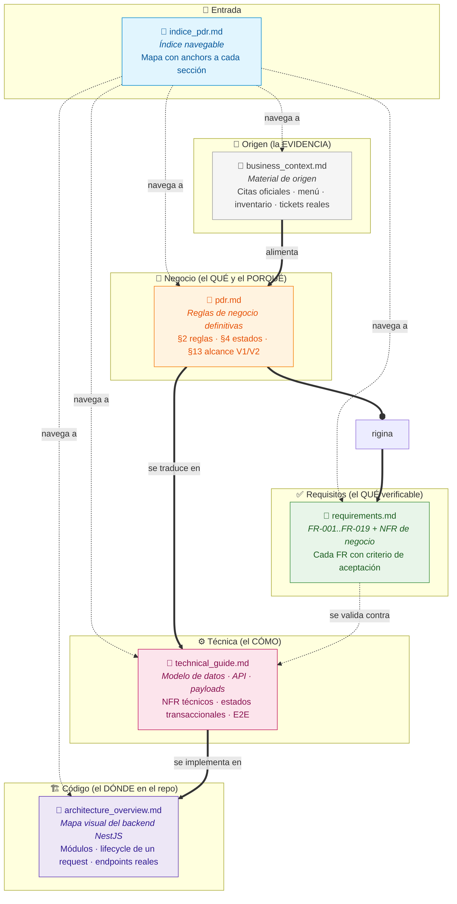
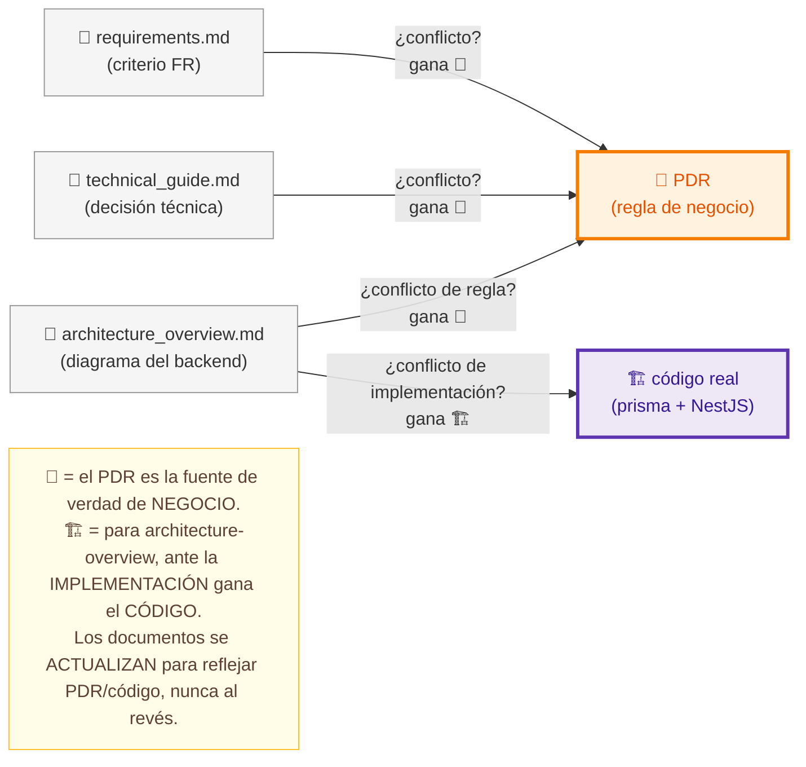
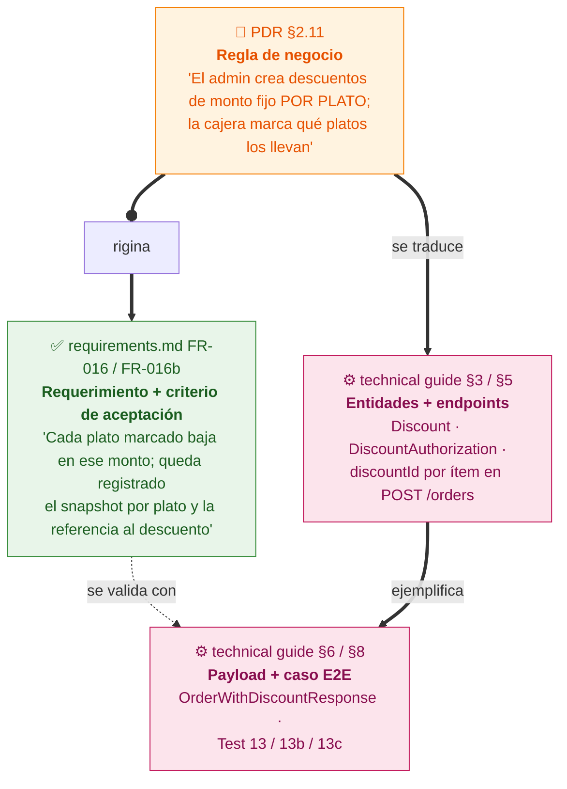
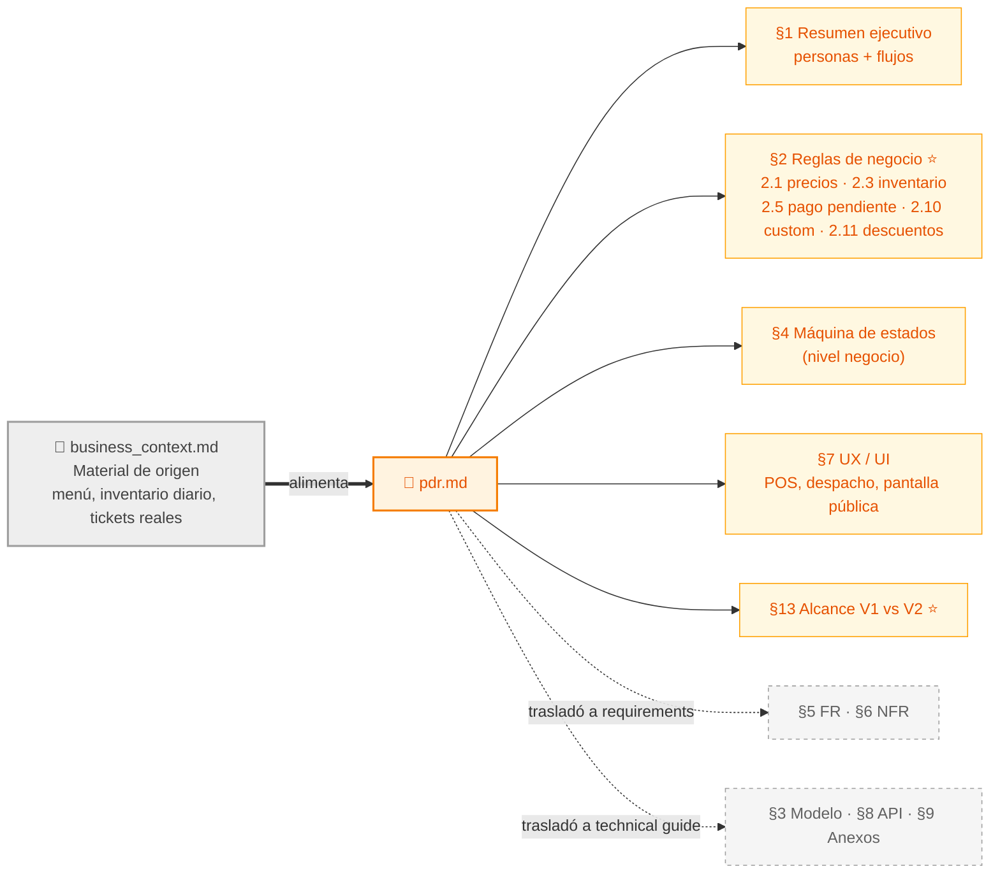

# Índice de Documentación — Wonder Chicken

> Punto de entrada a la documentación del proyecto.
> **Cada documento tiene ahora su propio índice interno** (sección `## Índice` al inicio):
> entrá al que necesites y navegá desde ahí.
>
> **Precedencia:** si un criterio de `requirements.md` o una decisión de `technical_guide.md`
> entra en conflicto con una regla de negocio del PDR, **gana la regla del PDR**.

---

## Índice

- [Documentos y orden de lectura](#documentos-y-orden-de-lectura)
- [Documentos de trabajo (no normativos)](#documentos-de-trabajo-no-normativos)
- [Mapa de relaciones entre documentos](#mapa-de-relaciones-entre-documentos)
  - [1. Los documentos y su rol](#1-los-documentos-y-su-rol)
  - [2. La regla de oro: PRECEDENCIA](#2-la-regla-de-oro-precedencia)
  - [3. Cómo "viaja" una decisión: del negocio al código](#3-cómo-viaja-una-decisión-del-negocio-al-código)
  - [4. Ruta de lectura según tu rol](#4-ruta-de-lectura-según-tu-rol)
  - [5. Mapa interno del PDR (la fuente de verdad)](#5-mapa-interno-del-pdr-la-fuente-de-verdad)
  - [6. Resumen de navegación](#6-resumen-de-navegación)

---

## Documentos y orden de lectura

El orden va de lo abstracto a lo concreto: cada documento **depende del anterior** (no entendés los FR sin las reglas, ni los endpoints sin el modelo, ni el código sin la guía técnica). ¿Sin tiempo para todo? Usá la **[ruta según tu rol](#4-ruta-de-lectura-según-tu-rol)**.

| # | Documento | Qué es y qué responde |
| - | --------- | --------------------- |
| 1 | [Mapa de relaciones (abajo)](#mapa-de-relaciones-entre-documentos) | **Orientación primero:** cómo se relacionan los documentos y la regla de precedencia. |
| 2 | [business_context.md](business_context.md) | **El origen (la EVIDENCIA).** Citas del documento de titulación, menú 2026, inventario diario, tickets reales. Alimenta al PDR. *No normativo.* |
| 3 | [pdr.md](pdr.md) | **El negocio (QUÉ y PORQUÉ) — fuente de verdad.** Reglas definitivas, estados, alcance V1/V2, UX. |
| 4 | [requirements.md](requirements.md) | **El QUÉ verificable.** FR-001…FR-019 + NFR de negocio, con criterios de aceptación. |
| 5 | [technical_guide.md](technical_guide.md) | **El CÓMO.** Modelo de datos, contrato de la API, payloads, NFR técnicos, casos E2E, despliegue. |
| 6 | [architecture_overview.md](architecture_overview.md) | **El código.** Mapa del backend NestJS: módulos, lifecycle de un request, dónde vive cada cosa. |

---

## Documentos de trabajo (no normativos)

> ⚠️ Estos archivos **no son fuente de verdad** y **no entran en el orden de lectura** de arriba.
> Son insumos de trabajo que **alimentan** al PDR. No los uses para implementar — usalos para
> *cerrar definiciones* antes de que lleguen al PDR.

| Archivo | Qué es | Cómo usarlo |
| ------- | ------ | ----------- |
| [pdr_questions_pending.txt](pdr_questions_pending.txt) | **Backlog de preguntas abiertas del negocio**: decisiones aún `[SIN RESPUESTA]`, `[AMBIGUA]` o `[FALTANTE EN DOC]`, priorizadas (críticas / importantes / a verificar). | A medida que el negocio responde, **trasladá la decisión al [pdr.md](pdr.md)** (la fuente de verdad) y remové/marcá la pregunta acá. El PDR manda; este archivo solo lista lo que falta definir. |

> **Estado actual:** las preguntas críticas de Fase 1 (máquina de estados, arqueo, vales) ya fueron
> respondidas y están codificadas como reglas en [PDR §2](pdr.md#2-reglas-de-negocio-definitivas-y-no-negociables).
> Lo que sigue abierto vive en la tabla de decisiones residuales de [PDR §13.3](pdr.md#133-decisiones-residuales-pendientes-de-cierre-antes-de-v1).

---

## Mapa de relaciones entre documentos

> Diagramas para **entender los documentos** del proyecto y **cómo se relacionan**.
> La máquina de estados transaccional vive en [`technical_guide.md` §4](technical_guide.md#4-máquina-de-estados-de-pedidos-transaccional);
> el **diagrama ER se genera** desde [`prisma/schema.prisma`](../prisma/schema.prisma) — no se dibuja a mano (ver nota en [`technical_guide.md` §3.3](technical_guide.md#33-diagrama-de-relaciones-er)).

### 1. Los documentos y su rol

Cada archivo tiene **una responsabilidad** y **no se pisan** entre sí. El PDR define el QUÉ y el PORQUÉ del negocio; los otros lo aterrizan, hasta llegar al código.

| Documento | Responde a | Contiene | NO contiene |
| --- | --- | --- | --- |
| [`indice_pdr.md`](indice_pdr.md) | *"¿Dónde está X?"* | Anchors a cada sección de los otros 4 | Contenido propio |
| [`business_context.md`](business_context.md) | *"¿De dónde sacamos esto?"* | Citas del documento oficial, menú, inventario diario, tickets reales | Reglas normativas (las deriva el PDR) |
| [`pdr.md`](pdr.md) | *"¿Por qué el negocio funciona así?"* | Reglas (§2), estados (§4), alcance V1/V2 (§13), UX (§7) | Modelo de datos, endpoints, FR detallados (los **trasladó**) |
| [`requirements.md`](requirements.md) | *"¿Qué debe hacer y cómo lo pruebo?"* | FR-001..FR-019 + criterios de aceptación, NFR de negocio | Reglas (referencia al PDR), detalle técnico |
| [`technical_guide.md`](technical_guide.md) | *"¿Cómo lo construyo?"* | Stack, modelo Prisma, endpoints, payloads, E2E, despliegue | Reglas de negocio (referencia al PDR) |
| [`architecture_overview.md`](architecture_overview.md) | *"¿Dónde vive esto en el repo?"* | Módulos NestJS, lifecycle de un request, endpoints reales, vista del Prisma | Reglas, FR, contrato detallado (referencia al PDR y a la guía técnica) |

### 2. La regla de oro: PRECEDENCIA

Esto es lo más importante de toda la arquitectura documental. **Si dos documentos se contradicen, gana el PDR.** Siempre. Sin excepciones.

> Lo declaran los tres documentos explícitamente en sus cabeceras:
> [`requirements.md`](requirements.md) · [`technical_guide.md`](technical_guide.md) · [`architecture_overview.md`](architecture_overview.md)

### 3. Cómo "viaja" una decisión: del negocio al código

Una misma idea (ej. *descuentos*) aparece en los tres documentos, pero **en distinto nivel de abstracción**. Entender este recorrido es la clave para no perderse.

**El mismo patrón aplica a cada feature.** Ejemplos de trazabilidad completa:

| Concepto | Regla (PDR) | Requerimiento | Técnica |
| --- | --- | --- | --- |
| Venta custom | [§2.10](pdr.md#210-ventas-custom-presas-surtidas) | [FR-002b](requirements.md#fr-002b--venta-custom-de-presas-surtidas-alta) | `POST /orders/custom`, `Order.isCustom`, `customPieces` |
| Inventario por presas | [§2.3](pdr.md#23-inventario-por-presas) | [FR-006](requirements.md#fr-006--inventario-por-presas-alta), [FR-017](requirements.md#fr-017--registro-de-consumos-manuales-y-ciclo-crudo-de-presas-por-turno-media) | `InventoryItem`, `ShiftChickenLog`, `InventoryTransaction` |
| Pago pendiente | [§2.5](pdr.md#25-pedidos-delivery-y-pago-pendiente) | [FR-011](requirements.md#fr-011--pedidos-con-pago-pendiente-alta) | `Order.status=pendingPayment`, sin auto-cancel |
| Descuentos | [§2.11](pdr.md#211-descuentos-sobre-la-orden-incluye-descuento-al-personal) | [FR-016/016b](requirements.md#fr-016--gestión-de-descuentos-y-aplicación-en-pos-media) | `Discount`, `DiscountAuthorization` |
| Clientes y vista del cliente | [§2.12](pdr.md#212-clientes-y-facturación-nominada) | [FR-015](requirements.md#fr-015--vista-pública-del-cliente-alta) / [FR-019](requirements.md#fr-019--registro-y-búsqueda-de-clientes-alta) | `Customer`, `Order.customerId`, `Order.publicToken`, `GET /public/orders/{token}`, `GET/POST /customers` |
| Notificación listo | [§2.8](pdr.md#28-comandas-tickets-factura-y-notificaciones) | [FR-007](requirements.md#fr-007--notificación-de-pedido-listo-alta) | `Order.readyAt`, pantalla pública |
| Auth y roles | [§2.7](pdr.md#27-roles-e-interfaces-v1-con-autenticación-jwt-y-control-de-permisos-por-rol-en-backend) | [FR-008](requirements.md#fr-008--interfaces-diferenciadas-por-rol-alta) / [FR-018](requirements.md#fr-018--autenticación-jwt-y-autorización-por-rol-alta) | `AuthGuard` (JWT) + `RolesGuard` + `@Roles` ([tech §5.2](technical_guide.md#52-autenticación-y-autorización)) |
| Auditoría | [§2.9](pdr.md#29-auditoría) | — | `AuditLog`, audit explícito en la transacción ([tech §4.3](technical_guide.md#43-auditoría--implementación-v1)) |

> La tabla completa de mapeo Negocio → Técnica está en [`technical_guide.md` §10](technical_guide.md#10-mapeo-negocio--técnica).

### 4. Ruta de lectura según tu rol

No los leas todos de corrido. **Empezá por donde tu trabajo lo necesita.**

### 5. Mapa interno del PDR (la fuente de verdad)

El PDR es el documento más grande. Esto es lo que vive adentro y qué **trasladó** a otros archivos (para no duplicar).

> ⭐ = secciones núcleo. Las cajas grises (`trasladó a...`) son secciones que el PDR vació a propósito y apuntan a otro documento — **no busques el detalle ahí, seguí el link.**

### 6. Resumen de navegación

| Si buscás... | Andá a |
| --- | --- |
| El porqué de una regla | [`pdr.md` §2](pdr.md#2-reglas-de-negocio-definitivas-y-no-negociables) |
| Qué hace una feature + cómo se prueba | [`requirements.md` §1](requirements.md#1-requerimientos-funcionales-completos-y-criterios-de-aceptación) |
| Entidades y campos | [`technical_guide.md` §3](technical_guide.md#3-modelo-de-datos-esquema-lógico-para-la-bd) |
| Endpoints y payloads | [`technical_guide.md` §5 / §6](technical_guide.md#5-contratos-de-la-api) |
| Casos E2E | [`technical_guide.md` §8](technical_guide.md#8-test-cases-e2e-casos-prioritarios) |
| Qué entra en V1 vs V2 | [`pdr.md` §13](pdr.md#13-alcance-v1-mvp-vs-v2-futuro) |
| Dónde vive algo en el repo (módulos, lifecycle) | [`architecture_overview.md`](architecture_overview.md) |

---

> **Recordá la regla de oro:** ante cualquier contradicción, **gana el PDR**. Los diagramas de arriba son un mapa, no la fuente de verdad.
