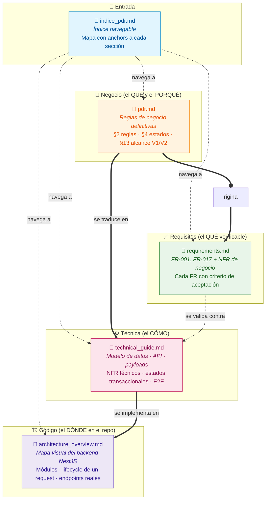
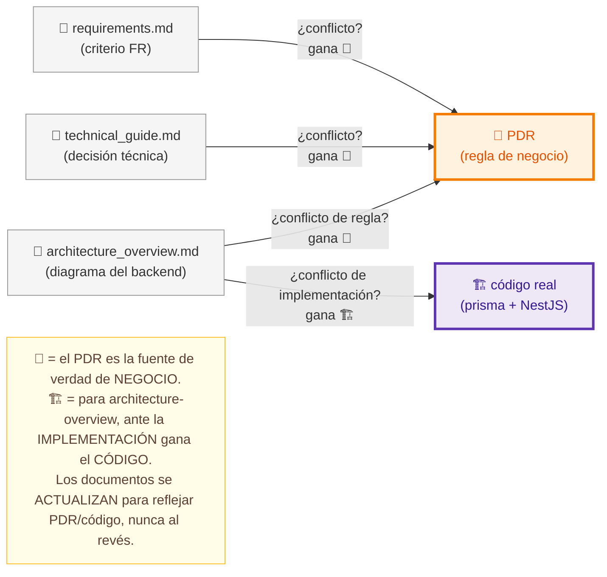
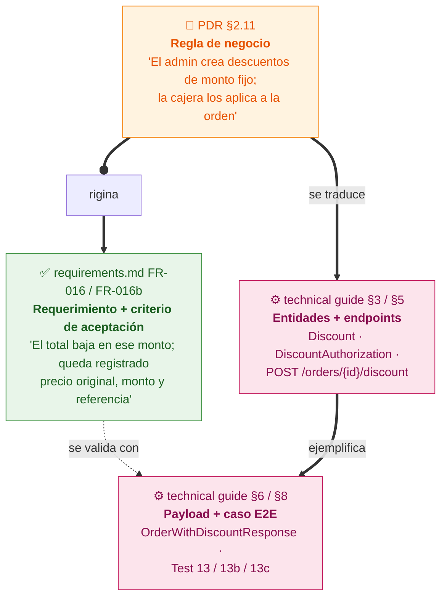
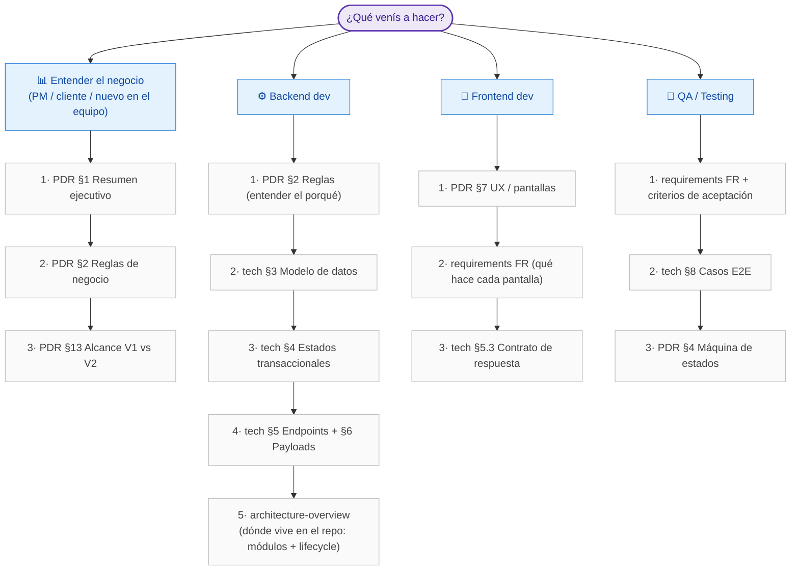
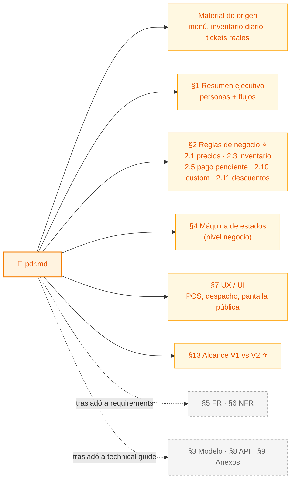
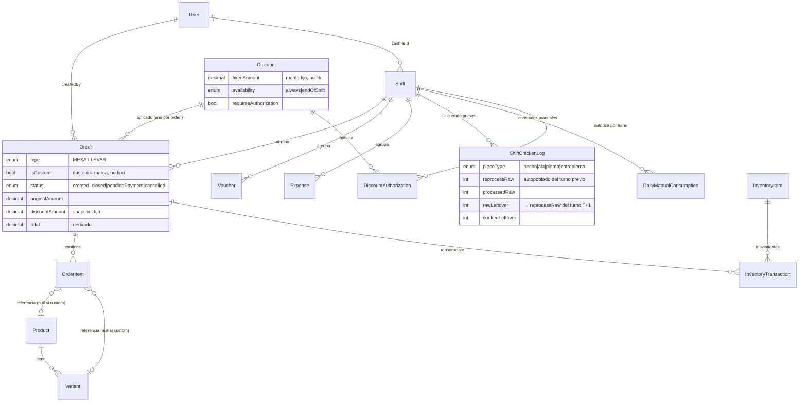
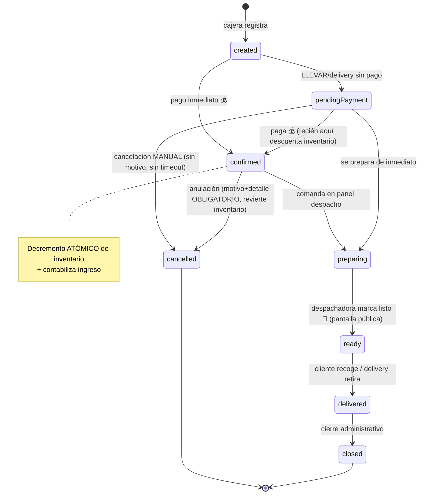
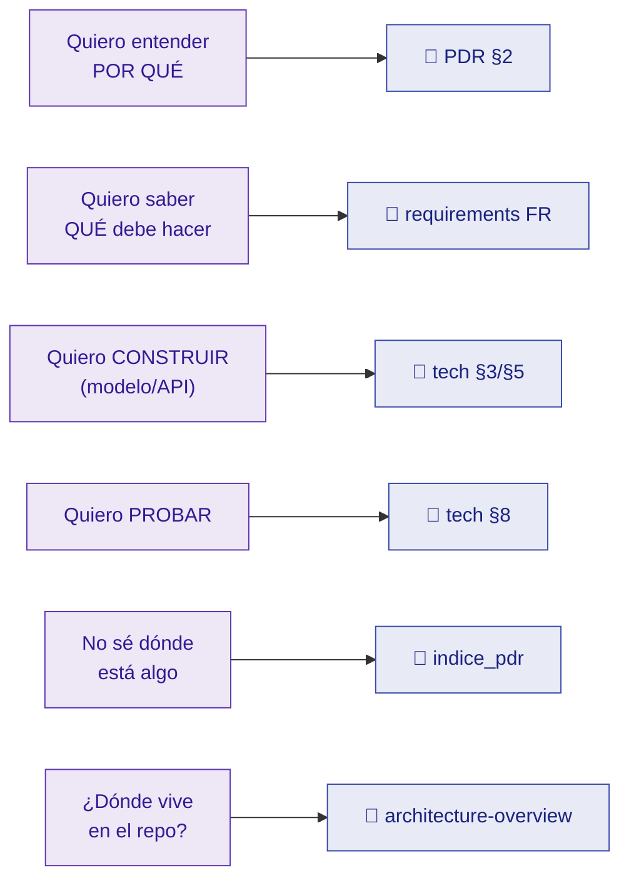

# Mapa de Documentación — Wonder Chicken

> Diagramas para **entender los documentos** del proyecto y **cómo se relacionan**.
> Pensado como puerta de entrada: leé esto primero, después saltá al documento que necesites.
>
> Documentos cubiertos:
> - [`indice_pdr.md`](indice_pdr.md) — índice navegable
> - [`pdr.md`](pdr.md) — reglas de negocio (la fuente de verdad)
> - [`requirements.md`](requirements.md) — requerimientos funcionales (FR) y no funcionales (NFR)
> - [`technical_guide.md`](technical_guide.md) — traducción técnica (modelo, API, payloads)
> - [`architecture_overview.md`](architecture_overview.md) — mapa visual del backend NestJS (módulos, lifecycle, endpoints reales)

---

## Índice

- [1. Los documentos y su rol](#1-los-documentos-y-su-rol)
- [2. La regla de oro: PRECEDENCIA](#2-la-regla-de-oro-precedencia)
- [3. Cómo "viaja" una decisión: del negocio al código](#3-cómo-viaja-una-decisión-del-negocio-al-código)
- [4. Ruta de lectura según tu rol](#4-ruta-de-lectura-según-tu-rol)
- [5. Mapa interno del PDR (la fuente de verdad)](#5-mapa-interno-del-pdr-la-fuente-de-verdad)
- [6. Modelo de datos (vista de relaciones)](#6-modelo-de-datos-vista-de-relaciones)
- [7. Máquina de estados de pedidos](#7-máquina-de-estados-de-pedidos)
- [8. Resumen de navegación](#8-resumen-de-navegación)

---

## 1. Los documentos y su rol

Cada archivo tiene **una responsabilidad** y **no se pisan** entre sí. El PDR define el QUÉ y el PORQUÉ del negocio; los otros lo aterrizan, hasta llegar al código.

| Documento | Responde a | Contiene | NO contiene |
| --- | --- | --- | --- |
| [`indice_pdr.md`](indice_pdr.md) | *"¿Dónde está X?"* | Anchors a cada sección de los otros 4 | Contenido propio |
| [`pdr.md`](pdr.md) | *"¿Por qué el negocio funciona así?"* | Reglas (§2), estados (§4), alcance V1/V2 (§13), UX (§7) | Modelo de datos, endpoints, FR detallados (los **trasladó**) |
| [`requirements.md`](requirements.md) | *"¿Qué debe hacer y cómo lo pruebo?"* | FR-001..FR-017 + criterios de aceptación, NFR de negocio | Reglas (referencia al PDR), detalle técnico |
| [`technical_guide.md`](technical_guide.md) | *"¿Cómo lo construyo?"* | Stack, modelo Prisma, endpoints, payloads, E2E, despliegue | Reglas de negocio (referencia al PDR) |
| [`architecture_overview.md`](architecture_overview.md) | *"¿Dónde vive esto en el repo?"* | Módulos NestJS, lifecycle de un request, endpoints reales, vista del Prisma | Reglas, FR, contrato detallado (referencia al PDR y a la guía técnica) |

---

## 2. La regla de oro: PRECEDENCIA

Esto es lo más importante de toda la arquitectura documental. **Si dos documentos se contradicen, gana el PDR.** Siempre. Sin excepciones.

> Lo declaran los documentos explícitamente:
> [`indice_pdr.md` L6](indice_pdr.md#L6) · [`requirements.md` L11](requirements.md#L11) · [`technical_guide.md` L10](technical_guide.md#L10) · [`architecture_overview.md` L11](architecture_overview.md#L11)

> 📝 **Antes de la fuente de verdad está el backlog.** Las definiciones de negocio que **todavía no
> se decidieron** viven en [`pdr_questions_pending.txt`](pdr_questions_pending.txt) (preguntas
> `[SIN RESPUESTA]` / `[AMBIGUA]`). Ese archivo **no es normativo**: cuando el negocio responde, la
> decisión se **traslada al PDR** y recién ahí pasa a ser fuente de verdad. No implementes desde el backlog.

---

## 3. Cómo "viaja" una decisión: del negocio al código

Una misma idea (ej. *descuentos*) aparece en los tres documentos, pero **en distinto nivel de abstracción**. Entender este recorrido es la clave para no perderse.

**El mismo patrón aplica a cada feature.** Ejemplos de trazabilidad completa:

| Concepto | Regla (PDR) | Requerimiento | Técnica |
| --- | --- | --- | --- |
| Venta custom | [§2.10](pdr.md#L380) | [FR-002b](requirements.md#L26) | `POST /orders/custom`, `Order.isCustom`, `customPieces` |
| Inventario por presas | [§2.3](pdr.md#L310) | [FR-006](requirements.md#L42), [FR-017](requirements.md#L105) | `InventoryItem`, `ShiftChickenLog`, `InventoryTransaction` |
| Pago pendiente | [§2.5](pdr.md#L344) | [FR-011](requirements.md#L70) | `Order.status=pendingPayment`, sin auto-cancel |
| Descuentos | [§2.11](pdr.md#L401) | [FR-016/016b](requirements.md#L94) | `Discount`, `DiscountAuthorization` |
| Notificación listo | [§2.8](pdr.md#L368) | [FR-007](requirements.md#L49) | `Order.readyAt`, pantalla pública |
| Auth y roles | [§2.7](pdr.md#L357) | [FR-008](requirements.md#L53) / [FR-018](requirements.md#L112) | `AuthGuard` (JWT) + `RolesGuard` + `@Roles` ([tech §5.2](technical_guide.md#52-autenticación-y-autorización)) |

> La tabla completa de mapeo Negocio → Técnica está en [`technical_guide.md` §10](technical_guide.md#L627).

---

## 4. Ruta de lectura según tu rol

No los leas todos de corrido. **Empezá por donde tu trabajo lo necesita.**

---

## 5. Mapa interno del PDR (la fuente de verdad)

El PDR es el documento más grande. Esto es lo que vive adentro y qué **trasladó** a otros archivos (para no duplicar).

> ⭐ = secciones núcleo. Las cajas grises (`trasladó a...`) son secciones que el PDR vació a propósito y apuntan a otro documento — **no busques el detalle ahí, seguí el link.**

---

## 6. Modelo de datos (vista de relaciones)

Para devs: así se conectan las entidades clave de [`technical_guide.md` §3](technical_guide.md#L41). Es el corazón transaccional del sistema.

> **Dos sutilezas de negocio que el modelo refleja** (y que hay que entender, no solo copiar):
> - `Order.isCustom` es un **flag**, no un valor de `type`. Una venta custom sigue siendo `MESA` o `LLEVAR` ([§2.10](pdr.md#L380)).
> - `discountAmount` es un **snapshot** del monto fijo, NO una resta. El `total` es lo derivado ([§2.11](pdr.md#L401)).

---

## 7. Máquina de estados de pedidos

El flujo de vida de una orden. Negocio en [PDR §4](pdr.md#L444), efectos transaccionales en [technical guide §4](technical_guide.md#L163).

> **Reglas clave que el diagrama codifica:**
> - El inventario se descuenta **al confirmar el pago**, nunca antes ([§2.3](pdr.md#L324)).
> - `pendingPayment` se prepara **igual** que un pedido pagado, pero sin tocar inventario ni caja ([§2.5](pdr.md#L344)).
> - Cancelar pendiente: **manual, sin motivo**. Anular pagado: **motivo + detalle obligatorios** + revierte inventario ([FR-011b](requirements.md#L74)).

---

## 8. Resumen de navegación

| Si buscás... | Andá a |
| --- | --- |
| El porqué de una regla | [`pdr.md` §2](pdr.md#L296) |
| Qué hace una feature + cómo se prueba | [`requirements.md` §1](requirements.md#L15) |
| Entidades y campos | [`technical_guide.md` §3](technical_guide.md#L41) |
| Endpoints y payloads | [`technical_guide.md` §5 / §6](technical_guide.md#L213) |
| Casos E2E | [`technical_guide.md` §8](technical_guide.md#L594) |
| Qué entra en V1 vs V2 | [`pdr.md` §13](pdr.md#L555) |
| Dónde vive algo en el repo (módulos, lifecycle) | [`architecture_overview.md`](architecture_overview.md) |
| Cualquier sección por anchor | [`indice_pdr.md`](indice_pdr.md) |

---

> **Recordá la regla de oro:** ante cualquier contradicción, **gana el PDR**. Los diagramas de arriba son un mapa, no la fuente de verdad.
