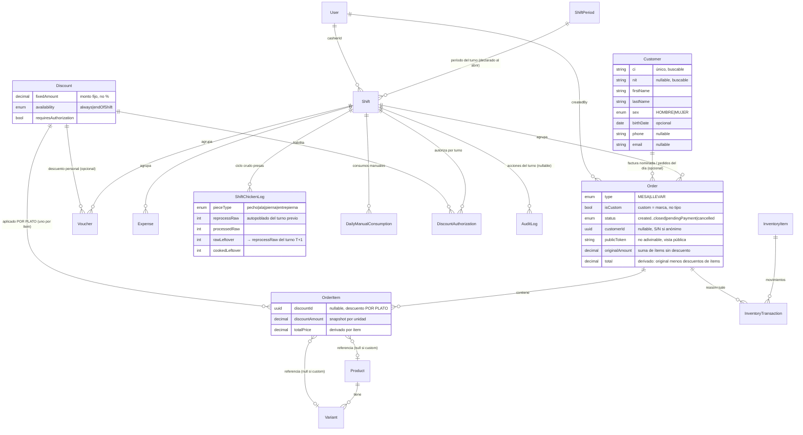
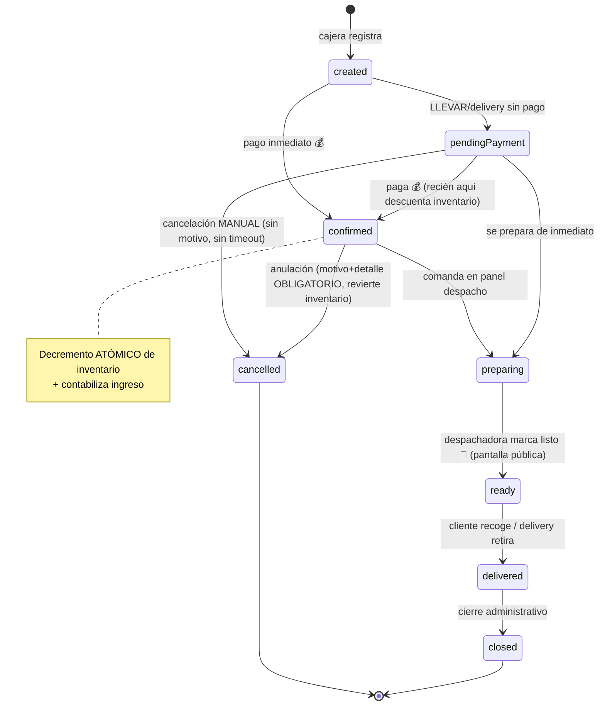

# Technical Guide — Wonder Chicken
**Sistema Informático de Ventas — Documento Técnico de Implementación**
**Complementa:** [docs/pdr.md](pdr.md)
**Material de origen:** [docs/business_context.md](business_context.md) (evidencia del trabajo de titulación que alimenta el PDR — citas, menú, inventario, tickets reales)
**Audiencia:** LLM generador de código y equipo de desarrollo backend/frontend
**Versión:** 1.6 (catálogo `ShiftPeriod` + `Shift.periodId` + `AuditLog.shiftId`: el turno se **declara al abrir**, nunca se infiere del reloj; consulta de auditoría por caja+turno vía FK directa, sin ventanas horarias)
**Fecha:** 2026-07-09

> Este documento es la **traducción técnica** de las reglas de negocio definidas en el PDR. Contiene modelo de datos, contrato de la API, requerimientos no funcionales técnicos, máquina de estados con detalles transaccionales, payloads, OpenAPI skeleton, casos de prueba E2E y despliegue.
>
> **Precedencia:** Si una decisión técnica de este documento entra en conflicto con una regla de negocio del PDR, **la regla de negocio del PDR gana**. Este documento se actualiza para reflejar el negocio, no al revés.
>
> **Altitud de este documento:** el modelo de datos de §3 (incluido el [ER de §3.3](#33-diagrama-de-relaciones-er)) es el **modelo lógico completo** — todos los campos, snapshots y enums. Es el **contrato del dato**. Para la vista estructural resumida (cómo se conectan las entidades, sin campos) mirá [`architecture_overview.md` §3](architecture_overview.md#3-modelo-relacional-vista-resumida-del-prisma). Misma realidad, distinto zoom.

---

## Índice

- [1. Stack tecnológico (obligatorio)](#1-stack-tecnológico-obligatorio)
- [2. Requerimientos no funcionales (NFR)](#2-requerimientos-no-funcionales-nfr)
- [3. Modelo de datos (esquema lógico para la BD)](#3-modelo-de-datos-esquema-lógico-para-la-bd)
  - [3.1 Entidades principales](#31-entidades-principales)
  - [3.2 Relaciones clave](#32-relaciones-clave)
  - [3.3 Diagrama de relaciones (ER)](#33-diagrama-de-relaciones-er)
- [4. Máquina de estados de pedidos (transaccional)](#4-máquina-de-estados-de-pedidos-transaccional)
  - [4.1 Transiciones y efectos](#41-transiciones-y-efectos)
  - [4.2 Reglas transaccionales](#42-reglas-transaccionales)
  - [4.3 Auditoría — implementación (V1)](#43-auditoría--implementación-v1)
- [5. Contratos de la API](#5-contratos-de-la-api)
  - [5.1 Endpoints principales](#51-endpoints-principales)
  - [5.2 Autenticación y autorización](#52-autenticación-y-autorización)
  - [5.3 Estructura de respuesta estándar](#53-estructura-de-respuesta-estándar)
  - [5.4 Reglas del contrato](#54-reglas-del-contrato)
- [6. JSON payloads de ejemplo](#6-json-payloads-de-ejemplo)
  - [6.1 ProductCreateResponse](#61-productcreateresponse-éxito)
  - [6.2 VariantCreateResponse](#62-variantcreateresponse-éxito)
  - [6.3 OrderCreateResponse (mesa, pagado, con sustitución)](#63-ordercreateresponse-mesa-pagado-con-sustitución)
  - [6.4 OrderCreateResponse (llevar, pendingPayment)](#64-ordercreateresponse-llevar-pendingpayment)
  - [6.5 CustomOrderCreateResponse (presas surtidas)](#65-customordercreateresponse-orden-llevar-custom--presas-surtidas-vía-post-apiv1orderscustom)
  - [6.6 OrderCreateWithDiscountResponse (descuento al personal por plato, una sola llamada)](#66-ordercreatewithdiscountresponse-descuento-al-personal-por-plato-en-la-creación--una-sola-llamada)
  - [6.6b DiscountCreateResponse (catálogo — admin)](#66b-discountcreateresponse-catálogo--admin)
  - [6.6c DiscountAuthorizationResponse](#66c-discountauthorizationresponse-admin-autoriza-a-la-sesión-de-cajera-por-turno)
  - [6.7 VoucherCreateResponse](#67-vouchercreateresponse)
  - [6.8 InventoryAdjustResponse](#68-inventoryadjustresponse-éxito)
  - [6.9 ManualConsumptionResponse (cierre turno cocina)](#69-manualconsumptionresponse-cierre-turno-cocina)
  - [6.10 CashOpenResponse](#610-cashopenresponse-éxito)
  - [6.11 CancelOrderResponse (anulación)](#611-cancelorderresponse-anulación-de-pedido-pagado)
  - [6.12 PosContextResponse (carga del POS en una llamada)](#612-poscontextresponse-carga-del-pos-en-una-llamada)
  - [6.13 ExpenseCreateResponse (gasto desde caja — FR-009)](#613-expensecreateresponse-gasto-desde-caja--fr-009)
  - [6.14 AuditLogsByShiftResponse (consulta del rastro por turno — admin)](#614-auditlogsbyshiftresponse-consulta-del-rastro-por-turno--admin)
- [7. OpenAPI skeleton (recomendación)](#7-openapi-skeleton-recomendación)
- [8. Test cases E2E (casos prioritarios)](#8-test-cases-e2e-casos-prioritarios)
- [9. Despliegue, backups y sincronización](#9-despliegue-backups-y-sincronización)
- [10. Mapeo Negocio → Técnica](#10-mapeo-negocio--técnica)
- [Notas finales](#notas-finales)

---

# 1. Stack tecnológico (obligatorio)

- **Backend:** **NestJS**, **TypeScript**, **Prisma** (ORM), **PostgreSQL**.
- **Frontend:** **Next.js**, **React**, **Zustand** (estado global), **MUI** (Material UI) + MUI Icons.
- **Autenticación:** **JWT** vía `@nestjs/jwt` (enfoque liviano y explícito, **sin Passport**) + **bcryptjs** para hashing de contraseñas. Autorización por rol con **guards de NestJS** (`AuthGuard` + `RolesGuard`) registrados globales. Validación de entrada con `ValidationPipe` + **class-validator** en los DTOs. Detalle en [§5.2](#52-autenticación-y-autorización).
- **Impresión/PDF:** `react-to-print` u otro paquete equivalente con buenos resultados personalizables.
- **Multiplataforma:** El código debe correr en Windows y Linux. Usar `path.join` (nunca strings con `\` o `/` hardcodeados) y manejar fechas en UTC con timezone explícito al presentar.

---

# 2. Requerimientos no funcionales (NFR)

- **Usabilidad:** POS en 3 pasos máximo; interfaces limpias y reactivas; español por defecto. Soporte para tema claro y oscuro usando `paper` y colores de MUI (evitar fondos sólidos no reactivos).
- **Rendimiento:** Respuesta objetivo en LAN: **≤300 ms** para operaciones de venta; tolerancia a picos.
- **Disponibilidad:** Modo local (on-premise) con opción de sincronización a nube en v2; objetivo **99.5% uptime** en horario operativo.
- **Seguridad:** Autenticación JWT; contraseñas hasheadas con **bcryptjs**; auditoría de acciones críticas. **El control de permisos por rol SÍ se aplica en el backend en V1** (PDR §2.7): cada endpoint valida el rol vía `RolesGuard`. **La UI no es la frontera de seguridad** — oculta pantallas, pero el backend devuelve **401** sin token válido o expirado y **403** si el rol no corresponde. Detalle de arquitectura en [§5.2](#52-autenticación-y-autorización).
- **Escalabilidad:** Backend modular (NestJS) con Prisma ORM; separación por módulos (productos, pedidos, inventario, notificaciones, reportes). Frontend modular con Next.js, Zustand, MUI.
- **Mantenibilidad:** TypeScript en todo el stack. Reutilizable, modular (funciones, componentes, hooks, estados globales). Fácil de leer y mantener.
- **Localización:** Español; formatos de fecha y moneda locales (Bs).
- **Multiplataforma:** Windows + Linux. Paths con `path.join`. Fechas en UTC + timezone explícito en presentación.
- **Impresión:** Soporte para impresoras térmicas 7cm; **PDF fallback** automático. Generación de PDF para factura mediante `react-to-print` o equivalente.
- **Accesibilidad:** Contraste y tamaño de fuente adecuados para uso en ambientes con iluminación variable.
- **Despliegue V1:** Aplicación web local en Windows 10. **Sin Docker requerido**, pero deseable para portabilidad.
- **Backup (V2):** Backup automático diario de BD + opción de backup manual on-demand para administrador.

---

# 3. Modelo de datos (esquema lógico para la BD)

> Entidades principales y campos mínimos. Diseñado para ORM (**Prisma**) y para que el LLM genere migraciones.

## 3.1 Entidades principales

- **Product**
  - `id: UUID`, `name: string`, `basePrice: decimal`, `category: string`, `active: boolean`, `description: string`

- **Variant**
  - `id: UUID`, `productId: UUID`, `name: string`, `components: JSON`, `isDefault: boolean`
  - *Nota: NO se incluye campo de ajuste de precio. Por regla del negocio (PDR §2.1) las variantes y sustituciones no modifican el precio del producto. Si en V2 alguna variante necesita ajustar el precio base, se introducirá el campo con el nombre `priceAdjustment`.*

- **Component** *(opcional)*
  - `id: UUID`, `name: string`, `type: enum(presa, acompanamiento, bebida, extra)`, `unitPrice: decimal`

- **Customer (Cliente)** *(cliente registrado para factura nominada y vista de "pedidos del día" — PDR §2.12 / FR-019)*
  - `id: UUID`
  - `ci: string` *(cédula de identidad — **único**, indexado; clave de búsqueda)*
  - `nit: string?` *(para factura a nombre de empresa; también buscable. El cliente puede dictar **CI o NIT** para su factura)*
  - `firstName: string` *(nombres)*, `lastName: string` *(apellidos)*
  - `sex: enum(HOMBRE, MUJER)`
  - `birthDate: date?` *(opcional — tipo `date`, NO `datetime`: una fecha de nacimiento no lleva hora)*
  - `phone: string?` *(celular)*, `email: string?` *(la factura electrónica se envía por correo)*
  - `active: boolean`, `createdAt: datetime`, `updatedAt: datetime`
  - *Nota legal (SIN / RND 102100000011): registrar al cliente es **opcional por venta**. La nominatividad solo es obligatoria para ventas **> Bs 1.000**; bajo ese umbral se factura **"S/N" (sin nombre, sin NIT)**. Por eso `Order.customerId` es nullable. NO usar NIT `99001` para "sin nombre" (es exclusivo de misiones diplomáticas).*

- **Order**
  - `id: UUID`, `type: enum(MESA, LLEVAR)` *(CUSTOM no es un tipo — es propiedad de la orden vía `isCustom`; ver PDR §2.8 / §2.10)*
  - `tableNumber: string?`, `customerName: string?` *(nombre para mostrar en comanda/factura; "S/N" si el cliente no se identifica. Es **snapshot** de visualización: no cambia si luego se edita el `Customer`)*
  - `customerId: UUID?` *(referencia al `Customer` registrado; null si la venta es anónima/"S/N". **Agrupa** los pedidos del cliente para la vista del día — PDR §2.12 / FR-019)*
  - `publicToken: string` *(token aleatorio no adivinable — ej. `crypto.randomBytes(16).toString('hex')`, 128 bits — generado al crear la orden, **único** e indexado. Es la **credencial** de la vista pública del cliente: NO se usa el `id` interno ni un valor secuencial. Espacio 2^128 → no enumerable, FR-015)*
  - `status: enum(created, confirmed, preparing, ready, delivered, closed, pendingPayment, cancelled, onHold)`
  - `paymentStatus: enum(pending, paid, partial)`, `paymentMethod: enum(cash, card, vale)?`
  - `originalAmount: decimal` *(precio original de la orden ANTES de cualquier descuento = `Σ(unitPrice × quantity)` de los ítems; PDR §2.11)*
  - `total: decimal` *(total cobrado = `originalAmount − Σ(descuentos de los ítems)`; es el valor **derivado** y lo que entra a caja — PDR §2.11)*
  - `isCustom: boolean` *(PDR §2.10 — true si la orden se creó vía endpoint custom; default false)*
  - *Nota de migración (v1.2): el descuento **ya NO vive en `Order`** — los antiguos `Order.discountId` / `Order.discountAmount` quedan **eliminados**. El descuento se aplica **por plato** y vive en `OrderItem.discountId` / `OrderItem.discountAmount` (ver `OrderItem` abajo). El antiguo `internalDiscount: boolean` sigue eliminado: el "descuento al personal" es una instancia del catálogo `Discount` (availability `endOfShift`, sin autorización). Ver PDR §2.11.*
  - `cancelReason: string?`, `cancelDetails: string?`
  - `createdBy: userId`, `createdAt: datetime`, `paidAt: datetime?`, `cancelledAt: datetime?`
  - `readyAt: datetime?` *(timestamp de transición a `ready`; reemplaza una eventual entidad `NotificationLog`)*
  - `deliveredAt: datetime?`, `deliveredBy: userId?`
  - `shiftId: UUID`

- **OrderItem**
  - `id: UUID`, `orderId: UUID`, `productId: UUID?` *(null si custom)*, `variantId: UUID?`
  - `quantity: int`, `unitPrice: decimal`
  - `discountId: UUID?` *(referencia al `Discount` aplicado **a este plato**; null si el ítem no lleva descuento. La cajera **marca qué ítems** lo llevan; máximo **un descuento por ítem** — sin apilamiento. En una orden conviven ítems con y sin descuento — PDR §2.11)*
  - `discountAmount: decimal?` *(**snapshot por unidad** del monto fijo del descuento al aplicarlo, ej. 7.00. NO se deriva de una resta: es el `fixedAmount` que tenía el `Discount` en ese instante. Se congela en el ítem para que, si el admin edita el descuento después, las ventas viejas conserven el monto real cobrado. Aplica a TODAS las unidades del ítem; para descuento parcial el POS parte el ítem en dos líneas — PDR §2.11)*
  - `totalPrice: decimal` *(**derivado**: `(unitPrice − (discountAmount ?? 0)) × quantity`)*
  - `notes: string?`, `substitutions: JSON?`
  - `customPieces: JSON?` *(ej. `[{type:"pecho",qty:2},{type:"ala",qty:1}]` — composición libre de presas para ítems de órdenes custom; ver PDR §2.10)*

- **InventoryItem** *(inventario transaccional — para presas representa el plano COCIDO del expositor; ver PDR §2.3)*
  - `id: UUID`, `sku: string`, `name: string`
  - `unit: enum(presa, bolsa, unidad)`, `type: enum(pecho, ala, pierna, entrepierna, bebida, insumo)`
  - `currentStock: int`, `unitMeasure: string`
  - `salePrice: decimal?` *(precio de venta unitario configurado por el admin. Para `type ∈ {pecho, ala, pierna, entrepierna}` es el precio de venta por presa que alimenta el **precio sugerido** de la venta custom — **ahora V1**, PDR §2.10. Es solo precio de VENTA: el sistema NO registra costo del pollo ni calcula margen.)*
  - *Nota: el ciclo CRUDO de presas (reproceso, procesado, sobrante crudo) se modela aparte en `ShiftChickenLog`. `InventoryItem` con `type ∈ {pecho, ala, pierna, entrepierna}` representa siempre el inventario cocido vendible.*

- **InventoryBatch** *(opcional)*
  - `id: UUID`, `inventoryItemId: UUID`, `batchCode: string`, `processedAt: datetime`, `quantityReceived: int`, `quantityRemaining: int`, `origin: string`

- **InventoryTransaction**
  - `id: UUID`, `inventoryItemId: UUID`, `delta: int`
  - `reason: enum(sale, adjustment, reception, vale, manualConsumption)`
  - *Nota: NO hay `reason` de descuento. Un descuento es **puramente monetario** (PDR §2.11): la venta con descuento descuenta inventario con `reason = sale` igual que cualquier otra, sobre el producto real vendido.*
  - `referenceId: UUID?`, `userId: UUID`, `note: string?`, `timestamp: datetime`

- **DailyManualConsumption** *(consumos anotados por turno — bolsas de papa, smile, vasos, etc.)*
  - `id: UUID`, `shiftId: UUID`, `inventoryItemId: UUID`, `quantity: int`, `recordedBy: userId`, `recordedAt: datetime`

- **ShiftChickenLog** *(ciclo CRUDO de presas anotado por el cocinero al cierre de turno — PDR §2.3 / FR-017)*
  - `id: UUID`, `shiftId: UUID`, `pieceType: enum(pecho, ala, pierna, entrepierna)`
  - `reprocessRaw: int` *(pollo crudo sobrante del turno anterior — autopoblado con `rawLeftover` del último `ShiftChickenLog` cerrado para el mismo `pieceType`; editable por el cocinero antes de confirmar)*
  - `processedRaw: int` *(pollo fresco marinado en este turno)*
  - `rawLeftover: int` *(sobrante procesado crudo al cierre — se convierte en el `reprocessRaw` del turno siguiente)*
  - `cookedLeftover: int` *(sobrante cocido en expositor al cierre — habilita venta con descuento al personal §2.11)*
  - `recordedBy: userId`, `recordedAt: datetime`, `closedAt: datetime?`
  - *Cantidad cocinada en el turno (derivada, NO se almacena): `reprocessRaw + processedRaw − rawLeftover`*
  - *Constraint: `UNIQUE(shiftId, pieceType)` — un log por turno por tipo de presa*

- **Voucher (Vale)**
  - `id: UUID`, `code: string` *(generado por el backend)*
  - `workerId: UUID?` *(o `workerName: string` si el trabajador no es usuario del sistema)*
  - `productId: UUID?`, `productName: string` *(snapshot derivado de `productId`)*
  - `originalAmount: decimal` *(precio del producto, **derivado** de `productId`; el front NO lo envía)*
  - `discountId: UUID?` *(opcional — instancia `Discount` "Descuento personal" aplicada al vale; null si el vale no lleva descuento — PDR §2.4 / §2.11)*
  - `discountAmount: decimal?` *(**snapshot** del monto fijo del descuento al aplicarlo, ej. 7.00)*
  - `amount: decimal` *(monto final que se descuenta de nómina = `originalAmount − (discountAmount ?? 0)`; **derivado** por el backend, no lo manda el front)*
  - `issuedBy: userId`, `issuedAt: datetime`, `shiftId: UUID`
  - `status: enum(issued, redeemed, cancelled)`, `note: string?`
  - *Nota: el vale **no es un tipo de descuento** (PDR §2.4): no suma a caja y descuenta nómina. Pero **sí puede llevar aplicado** el "Descuento personal" sobre su monto, con el mismo patrón snapshot que `Order` (§2.11). El inventario descuenta las presas reales en ambos casos.*

- **Discount** *(catálogo de descuentos creado por el admin — PDR §2.11. Catálogo mínimo, NO motor de reglas: monto fijo **por plato**, aplicado a nivel ítem, uno por plato, sin apilamiento.)*
  - `id: UUID`, `name: string`
  - `fixedAmount: decimal` *(monto fijo en Bs **por plato** — NO porcentaje en V1)*
  - `availability: enum(always, endOfShift)` *(`always` = todo el turno; `endOfShift` = solo a fin de turno)*
  - `requiresAuthorization: boolean` *(si `true`, la cajera solo puede aplicarlo si el admin la autorizó en ese turno — ver `DiscountAuthorization`)*
  - `active: boolean`
  - *Instancias principales (PDR §2.11): "Descuento personal" (`fixedAmount = 7` por plato, `availability = endOfShift`, `requiresAuthorization = false` — dedicado a los **trabajadores del negocio**) y "Compensación al cliente" (`fixedAmount = 7` por plato afectado, `availability = always`, `requiresAuthorization = true`).*
  - *El descuento es **puramente monetario**: el inventario siempre descuenta el producto real vendido, nunca el equivalente al precio descontado.*

- **DiscountAuthorization** *(habilitación que el admin otorga a la sesión de cajera de un turno para aplicar un `Discount` con `requiresAuthorization = true` — PDR §2.11 / FR-016b)*
  - `id: UUID`, `discountId: UUID`
  - `shiftId: UUID`, `cashierId: UUID` *(sesión/cajera beneficiada del turno)*
  - `authorizedBy: UUID` *(admin que la otorgó)*, `authorizedAt: datetime`
  - *Alcance **por turno, no por orden**: se otorga una sola vez y vale para todo el turno. Una vez autorizada, la cajera aplica el descuento las veces que necesite hasta el cierre.*
  - *Se **extingue al cerrar el turno** (vive y muere con la sesión de cajera, §2.7 / FR-008b) y no se hereda al turno siguiente.*
  - *El **acto de autorizar** es auditable por sí mismo (`AuditLog`), independientemente de cada aplicación posterior del descuento sobre una venta.*
  - *Constraint sugerido: `UNIQUE(discountId, shiftId, cashierId)` — una autorización por descuento por sesión de cajera por turno.*

- **User**
  - `id: UUID`, `name: string`, `role: enum(ADMIN, CASHIER, DISPATCHER, COOK)`
  - `username: string`, `passwordHash: string`, `active: boolean`

- **ShiftPeriod** *(catálogo de períodos de turno — "Mañana", "Noche"; el dueño puede crear "Tarde" sin migración. Por eso es catálogo y NO enum.)*
  - `id: UUID`, `name: string` *(único)*, `displayOrder: int` *(orden dentro del día)*
  - `referenceStart: string?`, `referenceEnd: string?` *(horarios de REFERENCIA informativos, ej. "09:00"–"16:00" — **jamás se usan para clasificar**: el reloj puede estar mal configurado y los horarios cambian)*
  - `active: boolean`
  - *El período se **declara al abrir el turno** (preselección sugerida editable en la pantalla de apertura). NO es atributo del `User`: el personal rota días/turnos/roles (PDR §2.7). Política de quién confirma → PDR §13.3; agenda semanal → V2 (PDR §13.2).*

- **Shift / CashRegister**
  - `id: UUID`, `cashierId: UUID`, `cashRegisterId: UUID?`
  - `periodId: UUID` *(período del turno, del catálogo `ShiftPeriod` — asignado al abrir, nunca inferido del reloj)*
  - `startAt: datetime`, `endAt: datetime?`
  - `openingAmount: decimal`, `closingAmount: decimal?`, `expectedAmount: decimal?`, `discrepancy: decimal?`

- **Expense**
  - `id: UUID`, `description: string`, `amount: decimal`, `paidBy: enum(cash, register)`, `shiftId: UUID`, `createdBy: userId`, `createdAt: datetime`

- **AuditLog**
  - `id: UUID`, `entity: string`, `action: string`, `userId: UUID`, `timestamp: datetime`, `details: JSON?`
  - `entityId: string` *(**no** UUID: es una referencia **polimórfica** — apunta a distintas tablas según `entity`, por lo que **no lleva FK** y el tipo `uuid` no aportaba integridad alguna. Guarda el UUID cuando la entidad está persistida (`Order`, `Shift`, …) y una **clave legible** cuando es lógica (`Report` → `"sales:2026-07"`). Siempre requerido.)*
  - `shiftId: UUID?` *(turno en el que ocurrió la acción — el log **nace sabiendo su turno**, sin cálculos de ventana horaria. NULL = acción crítica fuera de una sesión de caja: `ADJUST_INVENTORY` / `GENERATE_REPORT` del admin. En `OPEN_SHIFT`/`CLOSE_SHIFT` es el propio turno.)*

## 3.2 Relaciones clave

- `Product` 1..* `Variant`
- `Customer` 1..* `Order` (vía `Order.customerId`, opcional — null si venta anónima "S/N")
- `Order` 1..* `OrderItem`
- `OrderItem` → `Product` / `Variant` (ambos opcionales si pertenece a una orden custom — `Order.isCustom = true` con item poblando `customPieces`)
- `InventoryTransaction` referencia `Order`, `Voucher` o `Expense` por `referenceId`
- `Shift` vincula `CashRegister`, `ShiftPeriod` (período del turno), `User` (cajera), `Expense`, `Voucher`, `Order`, `DailyManualConsumption`, `ShiftChickenLog`, `DiscountAuthorization`, `AuditLog` (vía `AuditLog.shiftId`, nullable)
- `ShiftPeriod` 1..* `Shift` (vía `Shift.periodId` — el turno se autodescribe: caja + período + cajera)
- `Discount` 1..* `OrderItem` (vía `OrderItem.discountId`, opcional — el descuento se aplica **por plato**; solo uno por ítem)
- `Discount` 1..* `Voucher` (vía `Voucher.discountId`, opcional — "Descuento personal" sobre el vale)
- `Discount` 1..* `DiscountAuthorization`
- `DiscountAuthorization` vincula `Discount`, `Shift` y `User` (cajera) — autorización por turno otorgada por un admin

## 3.3 Diagrama de relaciones (ER)

Así se conectan las entidades clave descritas en [§3.1](#31-entidades-principales). Es el corazón transaccional del sistema.



> **Tres sutilezas de negocio que el modelo refleja** (y que hay que entender, no solo copiar):
> - `Order.isCustom` es un **flag**, no un valor de `type`. Una venta custom sigue siendo `MESA` o `LLEVAR` ([PDR §2.10](pdr.md#L380)).
> - El descuento vive en el **ítem**, no en la orden: se aplica **por plato** — la cajera marca qué ítems lo llevan ([PDR §2.11](pdr.md#L401)).
> - `OrderItem.discountAmount` es un **snapshot por unidad** del monto fijo, NO una resta. `OrderItem.totalPrice` y `Order.total` son los derivados ([PDR §2.11](pdr.md#L401)).

---

# 4. Máquina de estados de pedidos (transaccional)

**Estados:**
`created → confirmed → preparing → ready → delivered → closed`
Estados adicionales: `pendingPayment`, `cancelled`, `onHold`.

El flujo de vida de una orden. Negocio en [PDR §4](pdr.md#L444), efectos transaccionales en [§4.1](#41-transiciones-y-efectos).



> **Reglas clave que el diagrama codifica:**
> - El inventario se descuenta **al confirmar el pago**, nunca antes ([PDR §2.3](pdr.md#L324)).
> - `pendingPayment` se prepara **igual** que un pedido pagado, pero sin tocar inventario ni caja ([PDR §2.5](pdr.md#L344)).
> - Cancelar pendiente: **manual, sin motivo**. Anular pagado: **motivo + detalle obligatorios** + revierte inventario ([FR-011b](requirements.md#L74)).

## 4.1 Transiciones y efectos

- **created → confirmed (con pago)**
  - Acción: cajera confirma pedido con pago inmediato.
  - Efecto: `paymentStatus = paid` → **decremento atómico de inventario** → contabiliza ingreso → genera comanda digital → (opcional) imprime factura si cliente la pide.

- **created → pendingPayment**
  - Acción: cajera registra pedido LLEVAR/delivery sin pago aún.
  - Efecto: `paymentStatus = pending`. **NO decrementa inventario, NO contabiliza ingreso**. Se genera comanda digital y el pedido pasa directamente a preparación. La cancelación, si ocurre, es siempre manual y la realiza la cajera (PDR §2.5).

- **confirmed → preparing / pendingPayment → preparing**
  - Acción: comanda digital aparece automáticamente en panel de despacho.
  - Efecto: ningún cambio en inventario (ya se hizo en confirmed con pago, o aún no se hace si es pendingPayment).

- **pendingPayment → confirmed**
  - Acción: delivery / cliente paga.
  - Efecto: `paymentStatus = paid`, `paidAt = now`. **Decremento atómico de inventario**. Contabiliza ingreso.

- **pendingPayment → cancelled (manual — única forma)**
  - Acción: cajera cancela manualmente. **No existe auto-cancelación por timeout** (PDR §2.5).
  - Efecto: `cancelledAt = now`, `cancelReason = "manual"`. Sin requerir motivo detallado. Inventario no se tocó, ingreso no se contabilizó.

- **preparing → ready**
  - Acción: despachadora marca listo.
  - Efecto: `Order.readyAt = now`. El pedido aparece en la pantalla pública mostrando **únicamente el número de pedido** (aplica tanto a MESA como a LLEVAR) y suena alerta breve.

- **ready → delivered**
  - Acción: cliente recoge / delivery retira / despachadora entrega en mesa; despachadora marca entregado.
  - Efecto: `Order.deliveredAt = now`, `Order.deliveredBy = userId` registrados.

- **delivered → closed**
  - Acción: cierre administrativo (típicamente al cierre de turno).

- **(cualquier estado pagado) → cancelled (anulación)**
  - Acción: admin / cajera anula un pedido ya pagado.
  - Efecto requerido: `cancelReason` y `cancelDetails` obligatorios. **Reversión de inventario** (restituir presas y bebidas). Se registra en arqueo bajo `anulaciones` con monto. `AuditLog` obligatorio.

## 4.2 Reglas transaccionales

- El decremento de inventario y la marca de pago deben ocurrir en una **transacción atómica**. Si falla inventario (stock insuficiente), la orden permanece en su estado anterior y se notifica a la cajera con detalle del faltante.
- **No existe job de auto-cancelación**: los pedidos `pendingPayment` solo transitan a `cancelled` por acción manual de la cajera o a `paid` al confirmar el pago.
- **El registro de auditoría forma parte de la transacción.** En las acciones críticas, el `INSERT` en `AuditLog` ocurre **dentro de la misma `$transaction`** que la acción: si la operación se revierte, el audit tampoco queda (no hay constancia de algo que no pasó). Detalle en [§4.3](#43-auditoría--implementación-v1).

---

## 4.3 Auditoría — implementación (V1)

> Traducción técnica de la regla de negocio [PDR §2.9](pdr.md#29-auditoría). La auditoría registra el rastro inmutable de las **acciones críticas** (quién, cuándo, qué entidad, qué cambió) sobre la entidad [`AuditLog`](#31-entidades-principales). **No confundir con el logging técnico** (errores/debug): la auditoría es un registro **de negocio**, persistido en BD, inmutable y consultable por el admin.

### Patrón V1: audit explícito dentro del service y la transacción
- La escritura del `AuditLog` se hace de forma **explícita dentro del service** de cada acción crítica, en la **misma `prisma.$transaction`** que la operación. Dos motivos lo imponen:
  1. **Atomicidad:** acción y audit se graban juntos o no se graban (§4.2). Evita auditar ventas que terminaron revertidas.
  2. **Estado *antes/después*:** el `details` necesita el valor previo, que solo está disponible **antes de mutar**, dentro del service.
- Recomendado: un `AuditService` con un único método `log(tx, { entity, entityId, action, userId, details })` invocado desde cada punto crítico, reutilizando la transacción activa.

### Las 6 acciones auditadas (§2.9) y su punto de captura
| Acción (`action`) | Punto de captura | `entity` |
|---|---|---|
| `CREATE_SALE` | `POST /orders` y `POST /orders/custom` (al confirmar pago). Los **descuentos por ítem** aplicados en la creación van en `details` (`discountId`, `discountAmount`, ítems afectados) — no hay acción de audit separada para "aplicar descuento" | `Order` |
| `CANCEL_SALE` | `POST /orders/{id}/cancel` | `Order` |
| `ADJUST_INVENTORY` | `POST /inventory/adjust` | `InventoryItem` |
| `CREATE_VOUCHER` | `POST /vouchers` | `Voucher` |
| `OPEN_SHIFT` / `CLOSE_SHIFT` | `POST /shifts/open` · `/close` | `Shift` |
| `GENERATE_REPORT` | `GET /reports/...` | `Report` (lógico — sin fila en BD; `entityId` es una clave legible, ver abajo) |

> El **acto de autorizar un descuento** ya queda auditado aparte (`AUTHORIZE_DISCOUNT`, §2.11 / FR-016b) — ver [§5.1](#51-endpoints-principales).

### Cómo se llena cada campo
- **`userId`** (quién): del JWT, `request.user.sub`. Disponible en toda petición autenticada.
- **`shiftId`** (en qué turno): del **turno activo de la sesión** que ejecuta la acción (en `OPEN_SHIFT`/`CLOSE_SHIFT` es el propio `Shift`). NULL en acciones de admin fuera de una sesión de caja (`ADJUST_INVENTORY`, `GENERATE_REPORT`). El log nace sabiendo su turno — la consulta por turno es una FK directa, sin ventanas horarias.
- **`timestamp`** (cuándo): reloj del server (`@default(now())`).
- **`entity` + `entityId`** (qué entidad): tipo e id del registro afectado. En una **creación**, el `entityId` está disponible **tras el insert dentro de la misma `tx`**.
  - `entityId` es **`string`, no `uuid`** (ver [§3.1](#31-entidades-principales)): al ser una referencia polimórfica no tiene FK, así que el tipo `uuid` no daba integridad — solo impedía representar entidades **lógicas**.
  - **Entidades persistidas** (`Order`, `Voucher`, `InventoryItem`, `Shift`, `DiscountAuthorization`): se guarda su UUID.
  - **Entidad lógica `Report`** (`GENERATE_REPORT` no crea fila en ninguna tabla): se guarda una **clave legible y consultable** con formato `<reporte>:<alcance>` — ej. `"sales:2026-07"`, `"inventory-presas:2026-07-08"`. Nunca un UUID inventado: un identificador falso en la tabla que existe para ser prueba destruye su valor. Así el admin puede filtrar por `entityId` y ver quién generó ese reporte exacto.
- **`action` + `details`** (qué cambió): `action` es el verbo fijo del endpoint; `details: JSON` guarda el cambio concreto:
  - **Creaciones** (venta, vale): qué se creó → `{ total, items, paymentMethod }`, `{ worker, product, amount }`.
  - **Mutaciones** (ajuste de inventario, cierre de caja): estado previo y nuevo → `{ before, after, reason }`, `{ expected, counted, difference }`.

### Inmutabilidad: tabla append-only
- A `AuditLog` solo se le hace **`INSERT`** y **`SELECT`**. **Nunca `UPDATE` ni `DELETE`.** Un registro de auditoría editable no sirve como prueba — la inmutabilidad **es** la feature.

### Consulta
- El rastro se consulta **como lo piensa el negocio, sin paginación** (admin): **`POST /api/v1/audit-logs/shift`** con `{ date, periodId, cashRegisterId? }` → los logs de ese turno (~50-80 filas; caja opcional — omitida = todas las cajas de ese período), y **`POST /api/v1/audit-logs/month`** con `{ month }` → el mes completo. Resolución por **FK directa**: `Shift` por fecha + período (+ caja) → `AuditLog WHERE shiftId IN (...)` — cero ventanas horarias. URLs limpias, datos por body, orden `timestamp DESC`. Ver [§5.1](#51-endpoints-principales) y payload en [§6.14](#614-auditlogsbyshiftresponse-consulta-del-rastro-por-turno--admin). Auditar sin poder consultar no aporta valor — por eso la consulta es parte del contrato V1.

### Por qué NO un interceptor genérico en V1
- Un `AuditInterceptor` global corre **fuera de la transacción** del service y **no tiene el estado previo**, así que no puede garantizar atomicidad ni llenar `details` con el *antes/después*. Por eso V1 usa audit explícito.
- Un interceptor (para las acciones simples, sin before/after) es una **optimización diferida a V2**, y se sumará **con un caso real** cuando la repetición lo justifique — misma disciplina que el catálogo de descuentos ([PDR §2.11](pdr.md#211-descuentos-sobre-la-orden-incluye-descuento-al-personal)). No se introduce antes.

---

# 5. Contratos de la API

## 5.0 Principios de diseño de la API (el backend manda, el frontend renderiza)

Reglas transversales que **todos** los endpoints respetan. El frontend envía el **mínimo**; el backend resuelve el resto y devuelve respuestas **listas para pintar**.

1. **Lo que viene del token NUNCA viaja en el body.** El JWT lleva `{ sub: userId, username, role }`. El backend toma de `request.user` (no del request body) todos los campos de **actor/sesión**: `Order.createdBy`, `Voucher.issuedBy`, `Shift.cashierId`, `InventoryTransaction.userId`, `DiscountAuthorization.authorizedBy`. Si el front los manda, el backend los **ignora**.
2. **El `shiftId` se deriva del turno activo.** Las operaciones de venta (órdenes, vales, gastos) NO reciben `shiftId`: el backend resuelve el **turno abierto de la sesión de cajera** autenticada (1 sesión activa por turno, FR-008b) y lo asigna. Mismo criterio para cualquier vínculo deducible de la sesión.
3. **Precios y totales los calcula el backend desde la BD.** En la **orden estándar** el front **NO** envía `unitPrice` ni `total`: el backend los toma de `Product.basePrice` / `Variant` y calcula `totalPrice` y `total`. **Única excepción:** la **venta custom**, donde la cajera confirma un `unitPrice` (input de negocio legítimo, §2.10). Snapshots (`discountAmount`, `customerName`) también los congela el backend, no el front.
4. **El front manda referencias (ids), no datos copiados.** Para vincular un cliente, manda `customerId` (lo obtuvo de `GET /customers`), **no** `customerName`: el backend lee la tabla `Customer` y snapshotea el nombre. Idéntico criterio para los **descuentos**: el ítem lleva `discountId` (referencia al catálogo) y el backend valida, congela el snapshot y deriva los totales. El front jamás manda montos de descuento.
5. **Respuestas listas para renderizar.** El backend devuelve todo lo que la UI muestra, **ya calculado y con nombres resueltos**. Los campos de actor se devuelven como objeto `{ id, name }` (ej. `createdBy: { id, name }`), no como id suelto, para que el frontend **solo pinte** sin segundas consultas ni cálculos.
6. **Una operación de negocio = una llamada.** Todo lo que la cajera decide en una misma pantalla viaja en **un solo request** y el backend lo resuelve en **una sola transacción**. Los descuentos por plato van como `discountId` en cada ítem de `POST /orders` — **no existe** un endpoint separado para "aplicar descuento". Los endpoints separados se reservan para **momentos distintos en el tiempo** (`/pay` cuando el delivery paga al retirar, `/cancel`, `/status`), nunca para pasos de una misma operación.

## 5.1 Endpoints principales

> El rol requerido por cada endpoint está en la **matriz de autorización** de [§5.2](#52-autenticación-y-autorización). Todos exigen `Authorization: Bearer <token>` salvo los marcados **público**. Todos respetan los [principios de §5.0](#50-principios-de-diseño-de-la-api-el-backend-manda-el-frontend-renderiza).

- `POST /api/v1/auth/login` — **público** (`@Public()`): autentica con `username` + `password`; responde **200** + `{ token, user: { id, username, role } }`. El `token` es un JWT con payload `{ sub: userId, username, role }` que el frontend envía como `Bearer` en el resto de las llamadas. Sin token o token expirado/ inválido → **401** (FR-018).
- `POST /api/v1/products` — crear producto
- `GET /api/v1/products` — listar productos
- `POST /api/v1/variants` — crear variante
- `POST /api/v1/orders` — crear orden estándar (MESA / LLEVAR). Solo acepta items con `productId`/`variantId` (sin `customPieces`). Admite **N ítems**: platos, extras y bebidas son todos `Product` del catálogo (por `category`), cada uno un ítem con su `quantity`. Cada ítem acepta un **`discountId?` opcional** (§2.11): el backend valida el descuento (activo, ventana `availability` vigente y, si `requiresAuthorization`, autorización de la sesión de cajera en el turno — errores `DISCOUNT_NOT_AVAILABLE` / `DISCOUNT_NOT_AUTHORIZED`), congela `discountAmount` (snapshot por unidad del `fixedAmount` vigente) y deriva los totales — **todo en la misma llamada y transacción de creación**. El backend resuelve `unitPrice` desde `Product.basePrice`, calcula `totalPrice = (unitPrice − (discountAmount ?? 0)) × quantity` por ítem y `total = originalAmount − Σ(descuentos)` (el front NO manda precios ni montos, §5.0). Setea `Order.isCustom = false`.
  > **No existe endpoint separado para aplicar descuentos** (§5.0, principio 6). Descuento post-creación: sin soporte en V1 (sin caso real) — para una orden `pendingPayment` sin pagar, cancelar (gratis, nada se contabilizó) y recrear con descuento; para una pagada, anulación FR-011b.
- `POST /api/v1/orders/custom` — crear orden custom (MESA / LLEVAR) con presas surtidas. Items llevan `customPieces` + extras/bebidas opcionales, un **precio unitario confirmado** por la cajera y un **`discountId?` opcional** (mismas validaciones y snapshot que la orden estándar, §2.11). El **precio sugerido** = `sum(customPieces[].qty × salePrice)` + extras + bebidas lo calcula el **POS en el cliente** con los `piecePrices` que ya recibió en `GET /pos/context` (sin llamadas por cada cambio de selección); la cajera puede aceptarlo o pisarlo y se persiste el precio **confirmado**, nunca la sugerencia (§2.10, **V1**). Setea `Order.isCustom = true`. Endpoint **separado** para mantener DTOs y validaciones limpias por flujo (PDR §2.10).
- `GET /api/v1/orders/{id}` — obtener orden
- `GET /api/v1/public/orders/{token}` — **público**: vista de la comanda del cliente, accedida por el `publicToken` no adivinable del pedido (no por `id`). Devuelve solo campos seguros. Si la orden tiene `customerId`, incluye además los **otros pedidos del mismo cliente del día** (vista "mis pedidos del día"); el agrupado se hace por `customerId` + fecha, pero el acceso lo habilita el token, no el NIT (FR-015 / FR-019)
- `PATCH /api/v1/orders/{id}/status` — cambiar estado
- `POST /api/v1/orders/{id}/pay` — confirmar pago (transita `pendingPayment` → `paid`)
- `POST /api/v1/orders/{id}/cancel` — anular pedido pagado (requiere `reason` + `details`)
- `GET /api/v1/customers?search=<ci|nit|nombre>` — buscar cliente registrado por CI, NIT o nombre (la cajera lo usa al facturar nominado)
- `POST /api/v1/customers` — registrar cliente (`ci`, `nit?`, `firstName`, `lastName`, `sex`, `birthDate?`, `phone?`, `email?`)
- `GET /api/v1/customers/{id}` — obtener datos del cliente
- `PATCH /api/v1/customers/{id}` — editar datos personales del cliente
- `POST /api/v1/inventory/adjust` — ajustar inventario (admin, con motivo)
- `POST /api/v1/inventory/manual-consumption` — registrar consumos manuales por turno
- `GET /api/v1/inventory/shift-chicken-log/{shiftId}` — obtener el `ShiftChickenLog` del turno (al abrir, viene precargado con `reprocessRaw` = `rawLeftover` del último turno cerrado por `pieceType`)
- `POST /api/v1/inventory/shift-chicken-log` — registrar/actualizar el ciclo crudo del turno (reproceso, procesado, sobrante crudo, sobrante cocido en expositor) por tipo de presa
- `POST /api/v1/inventory/shift-chicken-log/{shiftId}/close` — cerrar el ShiftChickenLog del turno; dispara la reconciliación contra ventas y registra discrepancias
- `POST /api/v1/shifts/open` — abrir caja/turno. Body: `{ openingAmount, cashRegisterId, periodId }` — el **período se declara** (la pantalla de apertura lo trae preseleccionado como sugerencia **editable**; quién lo confirma → PDR §13.3). El backend valida que el `periodId` exista y esté activo; **nunca lo infiere del reloj**
- `POST /api/v1/shifts/close` — cerrar caja/turno (arqueo con anulaciones, vales, métodos)
- `GET /api/v1/shift-periods` — listar períodos del catálogo (admin y cajera — la pantalla de apertura los muestra)
- `POST /api/v1/shift-periods` — crear período (admin): `{ name, displayOrder, referenceStart?, referenceEnd? }`. Permite el tercer turno del futuro ("Tarde") **sin migración ni código nuevo**
- `PATCH /api/v1/shift-periods/{id}` — editar/desactivar período (admin). Los horarios de referencia son informativos: cambiarlos no reclasifica nada
- `POST /api/v1/expenses` — registrar gasto pagado desde caja (FR-009). Body mínimo: `{ description, amount, paidBy }` — `createdBy` sale del JWT y `shiftId` del turno activo de la cajera (§5.0); falla con error claro si no hay turno abierto. El gasto aparece en el arqueo (`totals.expenses`) y en reportes; NO es acción crítica auditada (§2.9). Sin GET de listado en V1: los gastos se leen en arqueo y reportes (se agrega con un caso real)
- `POST /api/v1/vouchers` — crear vale
- `GET /api/v1/vouchers` — listar vales con filtros
- `PATCH /api/v1/inventory/{id}/sale-price` — configurar el precio de venta por presa cocida (admin; alimenta el precio sugerido de la venta custom, §2.10)
- `POST /api/v1/discounts` — crear descuento (admin): `name`, `fixedAmount`, `availability`, `requiresAuthorization`, `active`
- `GET /api/v1/discounts` — listar descuentos del catálogo (admin; filtros: `availability`, `active`). El POS **no consume este endpoint** en operación normal: los descuentos aplicables a la sesión llegan en `GET /pos/context`
- `PATCH /api/v1/discounts/{id}` — editar descuento (admin). Editar el `fixedAmount` NO afecta ventas pasadas: el snapshot quedó congelado en cada `OrderItem` (§2.11)
- `GET /api/v1/pos/context` — **carga del POS en UNA llamada** (§5.0, principio 6). Devuelve el contexto operativo completo de la sesión de cajera, **liviano y listo para pintar** (solo datos activos, sin históricos — el menú completo son ~15 productos, pocos KB): `products` (activos, con sus `variants`), `discounts` **aplicables ahora** a la sesión (`active = true`, disponibilidad vigente — `always`, o `endOfShift` solo en su ventana — y, si `requiresAuthorization`, solo los que tienen `DiscountAuthorization` vigente para esta cajera/turno: el POS no filtra nada), `piecePrices` (los `salePrice` de las 4 presas cocidas, para calcular el **precio sugerido custom en el cliente**), `shiftPeriods` (períodos activos del catálogo — la pantalla de apertura los ofrece) y `shift` (`{ id, orderCount, startAt, period }` del turno activo, o `null` si aún no abrió). Ver payload en [§6.12](#612-poscontextresponse-carga-del-pos-en-una-llamada)
- `POST /api/v1/discounts/{id}/authorize` — el admin otorga la **autorización por turno** a una sesión de cajera (body mínimo: `cashierId`; el `shiftId` se deriva del turno activo de esa cajera y `authorizedBy` del JWT, §5.0). Crea `DiscountAuthorization` y deja `AuditLog` del acto de autorizar
- `GET /api/v1/discounts/authorizations` — listar autorizaciones vigentes del turno (filtro: `shiftId`, `cashierId`)
- `GET /api/v1/reports/sales` — reporte ventas
- `GET /api/v1/reports/inventory-presas` — reporte inventario presas
- `POST /api/v1/audit-logs/shift` — logs de auditoría de **UN turno** (admin; §4.3). Body mínimo: `{ date: "2026-07-08", periodId: "uuid-period-noche", cashRegisterId?: "uuid-caja-2" }` — `cashRegisterId` **opcional**: omitido = todas las cajas de ese período (hoy hay 1 caja; el contrato ya soporta N simultáneas, §2.7). **Sin paginación**: un turno son ~50-80 filas. Resolución por **FK directa, sin ventanas horarias**: `Shift` por fecha + `periodId` (+ caja) → `AuditLog WHERE shiftId IN (...)`, filas **tal cual** (rastro crudo) con `user` resuelto `{ id, name }` (§5.0), orden `timestamp DESC`. Día sin turnos en ese período → `shifts: []`, `rows: []` (no es error). Ver payload en [§6.14](#614-auditlogsbyshiftresponse-consulta-del-rastro-por-turno--admin)
- `POST /api/v1/audit-logs/month` — logs de auditoría de un **mes calendario completo** (admin). Body: `{ month: "2026-07" }`. **Sin paginación**: un mes ≈ 3-4 mil filas (~cientos de KB) — aceptable para pantalla de admin. Un **año** completo NO se consulta por acá: eso es un export CSV de reportes (V2), no una consulta de pantalla. Incluye también los logs con `shiftId = null` (acciones de admin fuera de turno), que NO aparecen en `/shift`. Misma forma de fila. **Solo lectura** en ambos — coherente con la tabla append-only; la consulta en sí NO se audita (no es una de las 6 acciones críticas)
- `POST /api/v1/print/invoice` — imprimir factura térmica (a demanda)
- `GET /api/v1/print/invoice/{orderId}/pdf` — descargar PDF factura (fallback)

## 5.2 Autenticación y autorización

> **Decisión V1 (PDR §2.7 / FR-018):** el control de permisos por rol se aplica **en el backend**, no solo en la UI. La UI oculta pantallas por comodidad, pero **la frontera de seguridad es el backend**: valida el token y el rol en **cada** petición.

### Enfoque elegido — liviano, sin Passport

Se usan los **guards de NestJS** de caja, con `@nestjs/jwt` directo (sin `@nestjs/passport`). Dos guards encadenados, ambos registrados **globales** vía `APP_GUARD` — así todo queda protegido por default y se abre solo lo necesario:

1. **`AuthGuard` (autenticación).** Corre primero. Extrae el token del header `Authorization: Bearer <token>`, lo verifica con `jwtService.verifyAsync(token)`:
   - sin token, o token **inválido / expirado** → lanza `UnauthorizedException` → **401**.
   - token OK → inyecta el payload en `request.user` (`{ sub, username, role }`) y deja pasar.
   - respeta el decorator **`@Public()`**: las rutas marcadas (ej. `POST /auth/login`) saltan la verificación.
2. **`RolesGuard` (autorización).** Corre después del `AuthGuard`. Lee los roles declarados con `@Roles(...)` usando `Reflector.getAllAndOverride([handler, class])`:
   - el endpoint **no declara** `@Roles` → pasa (autenticado alcanza).
   - declara roles y `request.user.role` **no** está en la lista → lanza `ForbiddenException` → **403**.

### Piezas (qué archivo hace qué)

| Pieza | Rol en el sistema |
|------|-------------------|
| `@Public()` | Marca una ruta como abierta (sin token). Vía `SetMetadata(IS_PUBLIC_KEY, true)`. |
| `@Roles(UserRole.ADMIN, ...)` | Declara qué roles pueden tocar el handler. Vía `SetMetadata(ROLES_KEY, roles)`. |
| `AuthGuard` | Verifica el JWT, inyecta `request.user`, respeta `@Public()`. → 401 |
| `RolesGuard` | Compara `request.user.role` contra `@Roles`. → 403 |
| `JwtModule` | Firma/verifica el token (secret + expiración). |
| `bcryptjs` | Hashea/compara contraseñas en el login (`User.passwordHash`). |
| `ValidationPipe` (global) | Valida el body contra los DTOs (class-validator). |

> **Por qué guards y no middleware:** el middleware corre **antes** del routing y no conoce el handler destino, así que no puede leer el `@Roles` de ese endpoint. El guard corre **después** del routing, con `ExecutionContext` completo, y por eso puede leer los metadatos del decorator. La autorización por rol **va en guard**, no en middleware.

### Snippets de referencia (patrón NestJS estándar)

```typescript
// roles.decorator.ts
export const ROLES_KEY = 'roles';
export const Roles = (...roles: UserRole[]) => SetMetadata(ROLES_KEY, roles);

// public.decorator.ts
export const IS_PUBLIC_KEY = 'isPublic';
export const Public = () => SetMetadata(IS_PUBLIC_KEY, true);
```

```typescript
// roles.guard.ts (autorización)
@Injectable()
export class RolesGuard implements CanActivate {
  constructor(private reflector: Reflector) {}
  canActivate(ctx: ExecutionContext): boolean {
    const required = this.reflector.getAllAndOverride<UserRole[]>(ROLES_KEY, [
      ctx.getHandler(),
      ctx.getClass(),
    ]);
    if (!required) return true;               // endpoint sin @Roles → autenticado alcanza
    const { user } = ctx.switchToHttp().getRequest();
    return required.includes(user.role);      // false → 403 ForbiddenException
  }
}
```

```typescript
// app.module.ts — ambos guards globales, orden importa (Auth primero)
providers: [
  { provide: APP_GUARD, useClass: AuthGuard },
  { provide: APP_GUARD, useClass: RolesGuard },
];
```

```typescript
// uso en un controller
@Roles(UserRole.CASHIER)
@Post('orders')                 // solo cajera
registrarVenta() { /* ... */ }

@Roles(UserRole.ADMIN, UserRole.CASHIER)
@Post('orders/:id/discount')    // dos roles, sin función nueva
aplicarDescuento() { /* ... */ }
```

### Matriz de autorización endpoint → roles

Es la **spec que el `RolesGuard` implementa** — aterriza la matriz de negocio del PDR §2.7 a roles por endpoint. `ADMIN` siempre puede operar lo administrativo; las lecturas que el POS necesita se abren a los roles que las consumen.

| Endpoint | Roles permitidos |
|----------|------------------|
| `POST /auth/login` | **público** (`@Public()`) |
| `POST /products`, `POST /variants` | `ADMIN` |
| `GET /products` | `ADMIN`, `CASHIER` *(el POS lo consume)* |
| `POST /orders`, `POST /orders/custom` *(incluye descuentos por ítem vía `discountId`)* | `CASHIER` |
| `POST /orders/{id}/pay`, `POST /orders/{id}/cancel` | `CASHIER` |
| `GET /pos/context` | `CASHIER` |
| `GET /orders/{id}` | `CASHIER`, `DISPATCHER`, `ADMIN` |
| `PATCH /orders/{id}/status` (ready / delivered) | `DISPATCHER` |
| `GET /public/orders/{token}` | **público** (vista del cliente por token no adivinable, sin datos sensibles) |
| `GET /customers`, `POST /customers`, `GET /customers/{id}`, `PATCH /customers/{id}` | `CASHIER`, `ADMIN` |
| `POST /shifts/open`, `POST /shifts/close` | `CASHIER` |
| `GET /shift-periods` | `CASHIER`, `ADMIN` *(la pantalla de apertura los muestra)* |
| `POST /shift-periods`, `PATCH /shift-periods/{id}` | `ADMIN` |
| `POST /expenses` | `CASHIER` |
| `POST /vouchers` | `CASHIER` |
| `GET /vouchers` | `CASHIER`, `ADMIN` |
| `POST /print/invoice`, `GET /print/invoice/{id}/pdf` | `CASHIER` |
| `POST /inventory/adjust` | `ADMIN` |
| `PATCH /inventory/{id}/sale-price` | `ADMIN` |
| `POST /inventory/manual-consumption` | `COOK` |
| `POST/GET /inventory/shift-chicken-log[...]` | `COOK` |
| `POST /discounts`, `PATCH /discounts/{id}` | `ADMIN` |
| `GET /discounts` | `ADMIN` *(el POS recibe los aplicables en `GET /pos/context`)* |
| `POST /discounts/{id}/authorize`, `GET /discounts/authorizations` | `ADMIN` |
| `GET /reports/sales`, `GET /reports/inventory-presas` | `ADMIN` |
| `POST /audit-logs/shift`, `POST /audit-logs/month` | `ADMIN` |
| Crear usuarios | `ADMIN` |

> El **payload del JWT** lleva `{ sub: userId, username, role }`; el `RolesGuard` compara `role` contra la columna de arriba. El código de error de contrato para el 403 es `FORBIDDEN` (ver §5.4).

### Sesión única por turno (FR-008b)

Dentro de un mismo turno, un usuario solo puede tener **1 sesión activa con 1 rol** (PDR §2.7). El login rechaza abrir una segunda sesión con otro rol en el turno vigente con un mensaje claro. No es responsabilidad del guard sino del servicio de auth/turnos.

## 5.3 Estructura de respuesta estándar

**Éxito:**
```json
{
  "isSuccess": true,
  "message": "Operacion exitosa",
  "data": {}
}
```

**Error:**
```json
{
  "isSuccess": false,
  "message": "Error de validacion",
  "data": null,
  "error": {
    "code": "VALIDATION_ERROR",
    "details": [
      {
        "field": "items[0].quantity",
        "message": "Debe ser mayor a 0"
      }
    ]
  }
}
```

## 5.4 Reglas del contrato

- Frontend valida flujo con `isSuccess`.
- `error` será singular.
- `details` será array.
- `code` será string estable: `VALIDATION_ERROR`, `NOT_FOUND`, `FORBIDDEN`, `INSUFFICIENT_STOCK`, `DISCOUNT_NOT_AVAILABLE` (descuento inactivo o fuera de su ventana de disponibilidad — rechaza la creación de la orden completa), `DISCOUNT_NOT_AUTHORIZED` (la sesión de cajera no tiene autorización vigente para ese descuento), etc. *Nota: no existe `DISCOUNT_ALREADY_APPLIED` — con un único campo `discountId` por ítem en el payload de creación, el apilamiento es **irrepresentable por construcción** (no hay estado inválido que validar).*
- En NestJS se implementará con `ValidationPipe` + excepciones HTTP + `ExceptionFilter` global para mantener este contrato en todos los endpoints.

---

# 6. JSON payloads de ejemplo

## 6.1 ProductCreateResponse (éxito)
```json
{
  "isSuccess": true,
  "message": "Producto creado correctamente",
  "data": {
    "id": "uuid-product-porcion-media",
    "name": "Porción Media",
    "basePrice": 30.00,
    "category": "Plato principal",
    "description": "2 presas + porción mixto",
    "active": true
  }
}
```

## 6.2 VariantCreateResponse (éxito)
```json
{
  "isSuccess": true,
  "message": "Variante creada correctamente",
  "data": {
    "id": "uuid-variant-porcion-media-mixto",
    "productId": "uuid-product-porcion-media",
    "name": "Porción Media - Mixto",
    "components": [
      {"type":"presa","count":2},
      {"type":"acompanamiento","name":"mixto","count":1}
    ],
    "isDefault": true
  }
}
```

## 6.2a CustomerCreateResponse / CustomerSearchResponse
> Alta de cliente para factura nominada. La búsqueda (`GET /customers?search=`) devuelve un array con la misma forma en `data`.
```json
{
  "isSuccess": true,
  "message": "Cliente registrado correctamente",
  "data": {
    "id": "uuid-customer-001",
    "ci": "8351427",
    "nit": "120558027",
    "firstName": "MARCO",
    "lastName": "ORTEGA GUTIERREZ",
    "sex": "HOMBRE",
    "birthDate": "1990-03-14",
    "phone": "71234567",
    "email": "marco.ortega@example.com",
    "active": true
  }
}
```

## 6.3 OrderCreateResponse (mesa, pagado, con sustitución)
```json
{
  "isSuccess": true,
  "message": "Pedido creado y pagado correctamente",
  "data": {
    "id": "uuid-order-001",
    "type": "MESA",
    "tableNumber": "70",
    "customerName": "GOMEZ",
    "customerId": "uuid-customer-001",
    "publicToken": "a3f9c2e81b4d7f60a9e35c8d2b1f4a7e",
    "status": "preparing",
    "paymentStatus": "paid",
    "paymentMethod": "cash",
    "items": [
      {
        "productId": "uuid-product-wonder",
        "variantId": "uuid-variant-wonder",
        "quantity": 2,
        "unitPrice": 36.00,
        "totalPrice": 72.00,
        "substitutions": [
          {"from":"mixto","to":"arroz"}
        ],
        "selectedPieces": [
          {"type":"pecho","qty":2},
          {"type":"ala","qty":2}
        ]
      },
      {
        "productId": "uuid-product-fanta",
        "quantity": 1,
        "unitPrice": 8.00,
        "totalPrice": 8.00
      }
    ],
    "total": 80.00,
    "createdBy": { "id": "uuid-user-roxana", "name": "Roxana" },
    "paidAt": "2026-05-01T22:10:00"
  }
}
```

## 6.4 OrderCreateResponse (llevar, pendingPayment)
```json
{
  "isSuccess": true,
  "message": "Pedido creado en estado pendiente de pago",
  "data": {
    "id": "uuid-order-002",
    "type": "LLEVAR",
    "customerName": "MARCO ORTEGA",
    "status": "preparing",
    "paymentStatus": "pending",
    "items": [
      {
        "productId": "uuid-product-porcion-media",
        "quantity": 3,
        "unitPrice": 30.00,
        "totalPrice": 90.00,
        "selectedPieces": [
          {"type":"pecho","qty":1},{"type":"ala","qty":1},
          {"type":"pierna","qty":2},{"type":"entrepierna","qty":2}
        ]
      }
    ],
    "total": 90.00,
    "createdBy": { "id": "uuid-user-roxana", "name": "Roxana" }
  }
}
```

## 6.5 CustomOrderCreateResponse (orden LLEVAR custom — presas surtidas, vía `POST /api/v1/orders/custom`)
```json
{
  "isSuccess": true,
  "message": "Pedido custom creado correctamente",
  "data": {
    "id": "uuid-order-003",
    "type": "LLEVAR",
    "isCustom": true,
    "customerName": "JUAN PEREZ",
    "status": "preparing",
    "paymentStatus": "paid",
    "items": [
      {
        "customPieces": [
          {"type":"pecho","qty":2},
          {"type":"ala","qty":1}
        ],
        "extras": [
          {"name":"papa","qty":1}
        ],
        "drinks": [
          {"productId":"uuid-coca-500","qty":1}
        ],
        "quantity": 1,
        "unitPrice": 35.00,
        "totalPrice": 35.00
      }
    ],
    "total": 35.00,
    "createdBy": { "id": "uuid-user-roxana", "name": "Roxana" },
    "paidAt": "2026-05-01T13:20:00"
  }
}
```

## 6.6 OrderCreateWithDiscountResponse (descuento al personal POR PLATO en la creación — una sola llamada)
> El descuento viaja como **`discountId` en cada ítem** del request de `POST /orders` — **no existe llamada separada** para aplicarlo (§5.0, principio 6). El backend valida (disponibilidad + autorización), congela el snapshot por unidad y deriva los totales en la misma transacción. Acá: 3 Porciones Media (2 ítems: uno con qty 2 y otro con qty 1), las 3 con "Descuento personal" (7 Bs por plato, `endOfShift`) → `total = 90 − 21 = 69`. Los productos reales se registran tal cual y el inventario descuenta las presas reales.

Request (lo único que el front decide: referencias + cantidades):
```json
{
  "type": "MESA",
  "paymentStatus": "paid",
  "paymentMethod": "cash",
  "items": [
    {
      "productId": "uuid-product-porcion-media",
      "quantity": 2,
      "discountId": "uuid-discount-personal",
      "selectedPieces": [ {"type":"pierna","qty":2}, {"type":"entrepierna","qty":2} ]
    },
    {
      "productId": "uuid-product-porcion-media",
      "quantity": 1,
      "discountId": "uuid-discount-personal",
      "selectedPieces": [ {"type":"pecho","qty":1}, {"type":"ala","qty":1} ]
    }
  ]
}
```

Response (todo calculado por el backend, listo para pintar):
```json
{
  "isSuccess": true,
  "message": "Pedido creado y pagado correctamente",
  "data": {
    "id": "uuid-order-004",
    "type": "MESA",
    "status": "preparing",
    "paymentStatus": "paid",
    "originalAmount": 90.00,
    "items": [
      {
        "productId": "uuid-product-porcion-media",
        "quantity": 2,
        "unitPrice": 30.00,
        "discountId": "uuid-discount-personal",
        "discountAmount": 7.00,
        "totalPrice": 46.00,
        "selectedPieces": [
          {"type":"pierna","qty":2},
          {"type":"entrepierna","qty":2}
        ]
      },
      {
        "productId": "uuid-product-porcion-media",
        "quantity": 1,
        "unitPrice": 30.00,
        "discountId": "uuid-discount-personal",
        "discountAmount": 7.00,
        "totalPrice": 23.00,
        "selectedPieces": [
          {"type":"pecho","qty":1},
          {"type":"ala","qty":1}
        ]
      }
    ],
    "total": 69.00,
    "createdBy": { "id": "uuid-user-roxana", "name": "Roxana" }
  }
}
```

## 6.6b DiscountCreateResponse (catálogo — admin)
```json
{
  "isSuccess": true,
  "message": "Descuento creado correctamente",
  "data": {
    "id": "uuid-discount-compensacion",
    "name": "Compensación al cliente",
    "fixedAmount": 7.00,
    "availability": "always",
    "requiresAuthorization": true,
    "active": true
  }
}
```

## 6.6c DiscountAuthorizationResponse (admin autoriza a la sesión de cajera por turno)
```json
{
  "isSuccess": true,
  "message": "Cajera autorizada para el descuento en este turno",
  "data": {
    "id": "uuid-auth-001",
    "discountId": "uuid-discount-compensacion",
    "shiftId": "uuid-shift-001",
    "cashierId": { "id": "uuid-user-roxana", "name": "Roxana" },
    "authorizedBy": { "id": "uuid-user-admin", "name": "Admin" },
    "authorizedAt": "2026-06-06T15:05:00"
  }
}
```

## 6.7 VoucherCreateResponse
```json
{
  "isSuccess": true,
  "message": "Vale registrado correctamente",
  "data": {
    "id": "uuid-voucher-001",
    "code": "V-20260501-001",
    "workerName": "MARIA LOPEZ",
    "productName": "Porción Media",
    "originalAmount": 30.00,
    "discountId": "uuid-discount-personal",
    "discountAmount": 7.00,
    "amount": 23.00,
    "issuedBy": { "id": "uuid-user-roxana", "name": "Roxana" },
    "issuedAt": "2026-05-01T14:30:00",
    "shiftId": "uuid-shift-001",
    "status": "issued"
  }
}
```

## 6.8 InventoryAdjustResponse (éxito)
```json
{
  "isSuccess": true,
  "message": "Ajuste de inventario registrado correctamente",
  "data": {
    "id": "uuid-invtx-001",
    "inventoryItemId": "uuid-inv-pecho",
    "delta": -2,
    "reason": "sale",
    "referenceId": "uuid-order-123",
    "userId": { "id": "uuid-user-roxana", "name": "Roxana" }
  }
}
```

## 6.9 ManualConsumptionResponse (cierre turno cocina)
```json
{
  "isSuccess": true,
  "message": "Consumos manuales registrados",
  "data": {
    "shiftId": "uuid-shift-001",
    "entries": [
      {"inventoryItemId":"uuid-bolsa-papa","quantity":3},
      {"inventoryItemId":"uuid-bolsa-smile","quantity":1},
      {"inventoryItemId":"uuid-envase-arroz","quantity":45}
    ]
  }
}
```

## 6.10 CashOpenResponse (éxito)
> Request: `{ openingAmount, cashRegisterId, periodId }` — el período viene preseleccionado en la pantalla (sugerencia **editable**, PDR §13.3), nunca inferido del reloj.
```json
{
  "isSuccess": true,
  "message": "Caja abierta correctamente",
  "data": {
    "id": "uuid-shift-001",
    "cashierId": { "id": "uuid-user-roxana", "name": "Roxana" },
    "cashRegister": { "id": "uuid-caja-1", "name": "Caja 1" },
    "period": { "id": "uuid-period-manana", "name": "Mañana" },
    "openingAmount": 200.00,
    "startAt": "2026-05-01T09:00:00"
  }
}
```

## 6.11 CancelOrderResponse (anulación de pedido pagado)
```json
{
  "isSuccess": true,
  "message": "Pedido anulado correctamente",
  "data": {
    "id": "uuid-order-001",
    "status": "cancelled",
    "cancelReason": "Cliente cambió de opinión",
    "cancelDetails": "Se devolvió el dinero en efectivo. Sin factura emitida.",
    "cancelledAt": "2026-05-01T22:30:00",
    "inventoryReverted": true
  }
}
```

## 6.12 PosContextResponse (carga del POS en una llamada)
> `GET /api/v1/pos/context` — el POS carga con **una sola llamada liviana** (solo datos activos, sin históricos; el menú completo son ~15 productos → pocos KB). Los `discounts` ya vienen **filtrados por el backend** para esta sesión (activos + ventana vigente + autorización si corresponde): el POS pinta lo que recibe, no filtra nada (§5.0). Con `piecePrices` el POS calcula el **precio sugerido custom en el cliente**, sin más llamadas.
```json
{
  "isSuccess": true,
  "message": "Contexto POS",
  "data": {
    "shift": { "id": "uuid-shift-001", "orderCount": 27, "startAt": "2026-05-01T09:00:00",
               "period": { "id": "uuid-period-manana", "name": "Mañana" } },
    "shiftPeriods": [
      { "id": "uuid-period-manana", "name": "Mañana", "displayOrder": 1, "referenceStart": "09:00", "referenceEnd": "16:00" },
      { "id": "uuid-period-noche", "name": "Noche", "displayOrder": 2, "referenceStart": "16:00", "referenceEnd": "23:00" }
    ],
    "products": [
      {
        "id": "uuid-product-porcion-media",
        "name": "Porción Media",
        "basePrice": 30.00,
        "category": "Plato principal",
        "variants": [
          { "id": "uuid-variant-pm-mixto", "name": "Porción Media - Mixto",
            "components": [ {"type":"presa","count":2}, {"type":"acompanamiento","name":"mixto","count":1} ],
            "isDefault": true }
        ]
      },
      { "id": "uuid-product-coca-500", "name": "Coca Cola 500 ml", "basePrice": 8.00, "category": "Bebida", "variants": [] }
    ],
    "discounts": [
      { "id": "uuid-discount-personal", "name": "Descuento personal", "fixedAmount": 7.00, "availability": "endOfShift" }
    ],
    "piecePrices": [
      { "type": "pecho", "salePrice": 12.00 },
      { "type": "ala", "salePrice": 10.00 },
      { "type": "pierna", "salePrice": 11.00 },
      { "type": "entrepierna", "salePrice": 11.00 }
    ]
  }
}
```

## 6.13 ExpenseCreateResponse (gasto desde caja — FR-009)
> `POST /api/v1/expenses` — body mínimo `{ description, amount, paidBy }`; `createdBy` sale del JWT y `shiftId` del turno activo (§5.0). Sin turno abierto → error claro.
```json
{
  "isSuccess": true,
  "message": "Gasto registrado correctamente",
  "data": {
    "id": "uuid-expense-001",
    "description": "Compra de arroz",
    "amount": 35.50,
    "paidBy": "cash",
    "shiftId": "uuid-shift-001",
    "createdBy": { "id": "uuid-user-roxana", "name": "Roxana" },
    "createdAt": "2026-05-01T11:20:00"
  }
}
```

## 6.14 AuditLogsByShiftResponse (consulta del rastro por turno — admin)
> `POST /api/v1/audit-logs/shift` — body mínimo `{ date, periodId, cashRegisterId? }`, **sin paginación** (un turno son ~50-80 filas). Resolución por **FK directa** (`Shift` por fecha+período+caja → `AuditLog.shiftId IN`), sin ventanas horarias. Filas **tal cual** están en `audit_logs` (rastro crudo), con `user` resuelto (§5.0), orden `timestamp DESC`. La respuesta **ecoa lo resuelto** (`period`, `shifts` con su caja) para transparencia.

Request (`cashRegisterId` opcional — omitido = todas las cajas de ese período):
```json
{ "date": "2026-07-07", "periodId": "uuid-period-noche" }
```

Response:
```json
{
  "isSuccess": true,
  "message": "Registros de auditoría del turno",
  "data": {
    "date": "2026-07-07",
    "period": { "id": "uuid-period-noche", "name": "Noche" },
    "shifts": [
      { "id": "uuid-shift-002",
        "cashRegister": { "id": "uuid-caja-1", "name": "Caja 1" },
        "cashier": { "id": "uuid-user-roxana", "name": "Roxana" } }
    ],
    "count": 2,
    "rows": [
      {
        "id": "uuid-audit-002",
        "entity": "Order",
        "entityId": "uuid-order-004",
        "action": "CREATE_SALE",
        "user": { "id": "uuid-user-roxana", "name": "Roxana" },
        "timestamp": "2026-07-07T21:42:00",
        "details": {
          "total": 69.00,
          "paymentMethod": "cash",
          "discounts": [ { "discountId": "uuid-discount-personal", "amount": 7.00, "items": 3 } ]
        }
      },
      {
        "id": "uuid-audit-003",
        "entity": "Shift",
        "entityId": "uuid-shift-002",
        "action": "CLOSE_SHIFT",
        "user": { "id": "uuid-user-roxana", "name": "Roxana" },
        "timestamp": "2026-07-07T23:05:00",
        "details": { "expected": 1455.00, "counted": 1450.00, "difference": -5.00 }
      }
    ]
  }
}
```

**`POST /api/v1/audit-logs/month`** — misma forma de fila, ventana = mes calendario:

Request / response (resumen):
```json
{ "month": "2026-07" }
```
```json
{ "isSuccess": true, "message": "Registros de auditoría del mes",
  "data": { "month": "2026-07", "count": 3180, "rows": [ "..." ] } }
```
> Día sin turnos en el período pedido → `shifts: []`, `rows: []` (no es error). `/month` incluye también los logs con `shiftId = null` (acciones de admin fuera de turno), que no aparecen en `/shift`. Un **año** completo no se consulta por acá: es un export CSV de reportes (V2).

**`GET /api/v1/shift-periods`** — catálogo para la pantalla de apertura y el admin:
```json
{ "isSuccess": true, "message": "Períodos de turno",
  "data": [
    { "id": "uuid-period-manana", "name": "Mañana", "displayOrder": 1, "referenceStart": "09:00", "referenceEnd": "16:00", "active": true },
    { "id": "uuid-period-noche", "name": "Noche", "displayOrder": 2, "referenceStart": "16:00", "referenceEnd": "23:00", "active": true }
  ] }
```

---

# 7. OpenAPI skeleton (recomendación)

El LLM debe generar `openapi: 3.0.3` con:
- `securitySchemes` JWT Bearer
- `paths` para todos los endpoints listados en §5.1
- `tags` para agrupar requests (Products, Orders, Pos, Inventory, Shifts, Expenses, Vouchers, Discounts, Reports, Audit, Print)
- `components/schemas` con los DTOs de request y response
- Ejemplos de request/response basados en los payloads de §6

---

# 8. Test cases E2E (casos prioritarios)

1. Crear producto + variante → aparece en POS.
2. Registrar venta MESA con sustitución → precio NO cambia; inventario decrementa al confirmar pago.
2b. Pedido estándar con bebida agregada y extras opcionales: `items = [Porción Media (30, sin bebida incluida), Bebida 2L (16)]` → `total = 46` (suma de ítems). Agregar también Porción de Papas (12) → `total = 58`. Un pedido de solo el plato (sin extras ni bebidas) → `total = 30`. Extras y bebidas sueltas son **opcionales**; cada uno es un `Product` y el backend calcula `Σ(unitPrice × quantity)`.
3. Registrar venta LLEVAR `pendingPayment` → comanda se prepara; inventario NO decrementa hasta confirmar pago.
4. Pedido `pendingPayment` cancelado manualmente por la cajera → inventario nunca tocado, ingreso nunca contabilizado, no requiere motivo. (No existe auto-cancelación por tiempo.)
5. Crear orden custom LLEVAR vía `POST /api/v1/orders/custom` (item con `customPieces`: 2 pechos + 1 ala + 1 papa + 1 cocacola) → el sistema devuelve un **precio sugerido** = `2×salePrice(pecho) + 1×salePrice(ala) + precio papa + precio cocacola`; la cajera lo **pisa** con un precio distinto → se persiste el precio **confirmado**, no la sugerencia. Al pagar, decrementa exactamente 2 pechos, 1 ala y 1 cocacola. La orden queda con `type = LLEVAR` y `isCustom = true` (no existe `type = CUSTOM`).
6. Abrir caja → registrar ventas (incl. vale, anulación, orden con descuento) → cerrar caja → arqueo correcto con desglose por método, vales y descuentos.
7. Emitir vale → el front manda `productId` (sin `amount`) → el backend deriva `originalAmount` del producto y el `amount` = original; aparece en arqueo y en listado de vales; decrementa inventario.
7b. Emitir vale con "Descuento personal": front manda `productId` + `discountId` → backend calcula `amount = originalAmount − discountAmount` (ej. 30 − 7 = 23, snapshot del descuento); el inventario descuenta las presas reales (no el equivalente al precio); el vale registra `originalAmount`, `discountAmount` y `amount`. Fuera de la ventana `endOfShift` el descuento no se ofrece.
8. Pedido `preparing` → comanda digital aparece en panel despacho → marcar `ready` → pantalla pública muestra → marcar `delivered`.
9. Cliente accede a `GET /public/orders/{token}` con el `publicToken` de su pedido → ve su comanda; probar un token aleatorio o el `id` interno → **404** (el token es no adivinable, FR-015).
9b. Registrar cliente nuevo vía `POST /customers` → queda buscable por CI **y** por NIT vía `GET /customers?search=`. Crear orden con ese `customerId` → al abrir el `publicToken` de uno de sus pedidos, la vista lista **todos sus pedidos del día** (agrupados por `customerId` + fecha). Acceder con el NIT crudo en la URL → no funciona (el NIT no es llave; FR-019).
9c. Venta anónima "S/N" (sin `customerId`) → su `publicToken` muestra **solo ese pedido**; no hay vista del día porque no hay identidad para agrupar.
10. Cliente pide factura → impresora térmica imprime; impresora desconectada → PDF se descarga.
11. Anular pedido pagado → motivo y detalles obligatorios → inventario revertido → aparece en arqueo.
12. Reconciliación diaria: comparar `InventoryTransaction` vs `InventoryItem.currentStock`.
13. Descuento al personal POR PLATO en **una sola llamada**: `POST /orders` con 3 Porciones Media (30 Bs c/u) donde cada ítem lleva `discountId` del "Descuento personal" (7 Bs por plato, `endOfShift`) → la orden se crea con `originalAmount = 90`, cada ítem con `discountAmount = 7` (snapshot por unidad) y `total = 90 − 21 = 69`, todo en la misma transacción (sin segunda llamada); los productos reales e inventario (6 presas) descuentan correcto; caja cuadra; el audit `CREATE_SALE` incluye los descuentos en `details`. Mandar `discountId` solo en 2 de los 3 platos → descuento 14, `total = 76`. Fuera de la ventana de fin de turno, la creación se rechaza completa con `DISCOUNT_NOT_AVAILABLE` (no se crea orden parcial).
13b. Descuento que requiere autorización: sin `DiscountAuthorization`, `POST /orders` con ítems que llevan `discountId` de "Compensación al cliente" (7 Bs por plato, `always`, `requiresAuthorization`) se rechaza con `DISCOUNT_NOT_AUTHORIZED`. El admin autoriza la sesión de cajera vía `POST /discounts/{id}/authorize` (queda `AuditLog`) → la cajera crea **una o varias órdenes** del turno con ese `discountId` en los platos afectados, sin renovar la autorización por orden ni por plato. Al cerrar el turno la autorización deja de estar vigente y no pasa al turno siguiente.
13c. Snapshot del monto: crear una orden con platos a 7 Bs de descuento → el admin luego edita el `Discount` a 10 Bs (`PATCH /discounts/{id}`) → los ítems viejos conservan `discountAmount = 7`; una orden nueva toma 10.
13d. Contexto POS: `GET /pos/context` con sesión de cajera autorizada para "Compensación al cliente" → `discounts` incluye ambas instancias vigentes; sin autorización → "Compensación al cliente" NO aparece (el backend filtra, el POS no); fuera de la ventana de fin de turno → "Descuento personal" NO aparece. `piecePrices` trae los 4 `salePrice` y el precio sugerido custom se calcula en el cliente sin llamadas adicionales.
14. Cocinero registra consumos manuales al cierre → se vinculan al `Shift` y aparecen en reporte diario.
14b. Ciclo crudo de presas — continuidad entre turnos: al cierre del turno mañana, cocinero registra `ShiftChickenLog` con `rawLeftover = 64` para cada `pieceType`. Al abrir el turno noche, `GET /api/v1/inventory/shift-chicken-log/{shiftIdNoche}` devuelve `reprocessRaw = 64` autopoblado por `pieceType`. Cocinero confirma o ajusta. Al cerrar el turno noche, el sistema reconcilia `(reprocessRaw + processedRaw − rawLeftover) − vendido_cocido_del_turno` vs `cookedLeftover` anotado y reporta discrepancia si existe.
15. Usuario logueado como CASHIER intenta logear como DISPATCHER en mismo turno → falla.
16. Registro de gastos (FR-009): `POST /expenses` con `{ description, amount, paidBy }` → el gasto queda ligado al turno activo de la cajera (`shiftId` derivado, no enviado) y aparece en el arqueo del cierre bajo `totals.expenses`; intentar registrar sin turno abierto → error claro; el gasto NO genera `AuditLog` (no es acción crítica §2.9).
17. Consulta de auditoría por turno (FK directa): generar ventas en turno Mañana y turno Noche del mismo día → `POST /audit-logs/shift` con `{ date, periodId: noche }` devuelve **solo** los logs con `shiftId` de ese turno (los de la mañana no aparecen), orden `timestamp DESC`, con `user`, `period` y `shifts` (con su `cashRegister`) resueltos; con **dos cajas** abiertas en el mismo período, agregar `cashRegisterId` al body separa los logs por caja y omitirlo devuelve ambas; día sin turnos → `shifts: []`, `rows: []` (no error); la respuesta NO tiene `page`/`pageSize` (sin paginación). Un `ADJUST_INVENTORY` del admin (sin turno, `shiftId = null`) NO aparece en `/shift` pero SÍ en `POST /audit-logs/month`. Con token de CASHIER → **403**. La consulta en sí NO crea filas de audit.
17b. Catálogo de períodos sin migración: el admin crea el período "Tarde" vía `POST /shift-periods` → aparece en `GET /shift-periods` y en `pos/context.shiftPeriods` → una cajera abre turno con ese `periodId` → `POST /audit-logs/shift` con ese período lo consulta normalmente. Todo sin tocar schema ni código. Los horarios de referencia son informativos: editarlos (`PATCH /shift-periods/{id}`) no reclasifica ningún turno existente.
17c. El período se declara, no se infiere: abrir un turno a las 20:00 declarando `periodId = Mañana` → el sistema lo acepta (el reloj NO clasifica); `shifts/open` sin `periodId` → `VALIDATION_ERROR`.

---

# 9. Despliegue, backups y sincronización

- **Modo inicial (V1):** Servidor local (Windows 10) ejecutando aplicación web; **PostgreSQL local**. Código multiplataforma (también funciona en Linux).
- **Distribución (V1):** Aplicación web local. **Docker Compose opcional** para portabilidad pero no requerido.
- **Sincronización (V2):** Operación local en V1; sincronización a nube en **V2** (fase posterior).
- **Backups (V2):** Copia diaria automática de BD + opción de backup manual disponible para administrador.
- **Conflictos de sincronización (V2):** Priorizar cambios locales recientes; registrar conflictos para resolución manual.

---

# 10. Mapeo Negocio → Técnica

Tabla de referencia rápida entre los conceptos del PDR y su contraparte técnica en este documento.

| Concepto de negocio (PDR) | Contraparte técnica |
|---------------------------|---------------------|
| Pedido estándar multi-ítem (§2.2 / FR-002) | `Order.items[]` con N `Product` (platos + extras + bebidas, por `category`), cada uno con `quantity`; `total = Σ(unitPrice × quantity)`, `unitPrice` tomado de `Product.basePrice` por el backend |
| Venta custom de presas surtidas (§2.10) | Endpoint `POST /api/v1/orders/custom`; flag `Order.isCustom = true`; ítem con `customPieces: JSON` |
| Tipo de pedido (MESA / LLEVAR) (§2.8) | `Order.type: enum(MESA, LLEVAR)` — CUSTOM **no** es un valor de `type` |
| Sustitución de acompañamiento sin afectar precio (§2.1) | `OrderItem.substitutions: JSON` con `{from, to}`; sin campo de ajuste de precio |
| Feature de descuentos — catálogo (§2.11 / FR-016) | Entidad `Discount` (`name`, `fixedAmount` **por plato**, `availability`, `requiresAuthorization`, `active`); CRUD vía `/api/v1/discounts` |
| Aplicar descuento POR PLATO (§2.11 / FR-016) | `discountId?` opcional **en cada ítem** de `POST /orders` / `POST /orders/custom` — una sola llamada, sin endpoint dedicado (§5.0 principio 6); el backend valida, congela `OrderItem.discountAmount` (snapshot por unidad) y deriva `OrderItem.totalPrice` y `Order.total`; uno por ítem (apilamiento irrepresentable) |
| Descuento al personal por sobrante de pollo cocido (§2.11) | Instancia de `Discount` "Descuento personal" (`fixedAmount = 7` por plato, `availability = endOfShift`, `requiresAuthorization = false`) referenciada vía `OrderItem.discountId`. **Los antiguos `Order.internalDiscount` y `Order.discountId`/`Order.discountAmount` quedan eliminados** |
| Compensación al cliente por pollo defectuoso (§2.11) | Instancia de `Discount` "Compensación al cliente" (`fixedAmount = 7` por plato afectado, `availability = always`, `requiresAuthorization = true`) |
| Autorización de descuentos por turno (§2.11 / FR-016b) | Entidad `DiscountAuthorization` (admin → sesión de cajera del turno); `POST /discounts/{id}/authorize`; se extingue al cerrar turno; acto auditado en `AuditLog` |
| Precio sugerido en venta custom (§2.10) — **V1** | `InventoryItem.salePrice` por presa cocida (config admin vía `PATCH /inventory/{id}/sale-price`); cálculo `sum(customPieces[].qty × salePrice) + extras + bebidas`; la cajera puede pisarlo, se persiste el confirmado |
| Pedido con pago pendiente (§2.5) | `Order.status = pendingPayment` + `paymentStatus = pending`; cancelación solo manual |
| Confirmación de pago | Endpoint `POST /api/v1/orders/{id}/pay`; transición a `paid` + decremento atómico de inventario |
| Anulación de pedido pagado (FR-011b) | Endpoint `POST /api/v1/orders/{id}/cancel` con `reason` + `details`; reversión de `InventoryTransaction` |
| Notificación de pedido listo (§2.8 / FR-007) | `Order.readyAt` registrado; pantalla pública lee órdenes con `status = ready` |
| Entrega del pedido | `Order.deliveredAt` + `Order.deliveredBy` |
| Inventario por presas (§2.3) | `InventoryItem.type ∈ {pecho, ala, pierna, entrepierna}`; decremento vía `InventoryTransaction` con `reason = sale` |
| Consumos manuales por turno (FR-017) | `DailyManualConsumption` ligado a `Shift` |
| Ciclo crudo de presas por turno — plano crudo (§2.3, FR-017) | `ShiftChickenLog` ligado a `Shift`; campos `reprocessRaw`, `processedRaw`, `rawLeftover`, `cookedLeftover` por `pieceType`; regla de continuidad entre turnos: `rawLeftover(T) → reprocessRaw(T+1)` vía autopoblado en `GET /shift-chicken-log/{shiftId}` |
| Vales (§2.4) | Entidad `Voucher`; `amount` **derivado** de `productId` (`originalAmount`) menos `discountAmount` si lleva "Descuento personal" (`discountId`, snapshot); `InventoryTransaction.reason = vale`; NO suma al ingreso de `Shift` |
| Apertura/cierre de caja por turno (§2.6) | Entidad `Shift` con `openingAmount`, `closingAmount`, `expectedAmount`, `discrepancy` |
| Caja = 1 cajera por turno (§2.7) | `Shift.cashierId` único activo por `cashRegisterId` |
| Sesión única por turno (FR-008b) | Constraint a nivel servicio: 1 sesión activa por `userId` por `shiftId` |
| Roles funcionales (§2.7) | `User.role: enum(ADMIN, CASHIER, DISPATCHER, COOK)` — enforcement por rol en el backend vía `RolesGuard` + `@Roles` (V1, FR-018); ver §5.2 |
| Auditoría de acciones críticas (§2.9) | Entidad `AuditLog` con `userId`, `shiftId?` (el log nace sabiendo su turno; null = acción de admin fuera de turno), `entity`, `entityId`, `action`, `details: JSON`; consulta **sin paginación** vía `POST /audit-logs/shift` (`{ date, periodId, cashRegisterId? }` — FK directa, sin ventanas horarias) y `POST /audit-logs/month` (`{ month }`) — admin, §4.3 |
| Turnos del día (Mañana/Noche, §2.3) y tercer turno futuro | Catálogo `ShiftPeriod` (no enum — sin migración para "Tarde"); `Shift.periodId` **declarado al abrir** (`POST /shifts/open`), nunca inferido del reloj; horarios de referencia informativos; política de confirmación → PDR §13.3; agenda semanal → V2 (PDR §13.2) |
| Registro de gastos desde caja (§2.6 / FR-009) | `POST /expenses` (`description`, `amount`, `paidBy`); `Expense.shiftId` derivado del turno activo y `createdBy` del JWT (§5.0); aparece en arqueo (`totals.expenses`) y reportes |
| Clientes y facturación nominada (§2.12 / FR-019) | Entidad `Customer` (`ci` único, `nit?`, datos personales); búsqueda por CI/NIT vía `GET /customers?search=`; `Order.customerId` opcional (anónimo = "S/N", legal ≤ Bs 1.000) |
| Vista del cliente — por pedido y pedidos del día (§7.4 / FR-015 / FR-019) | `Order.publicToken` no adivinable; `GET /public/orders/{token}` (público); identidad (`customerId`) **agrupa** los pedidos del día, el **token** da acceso — el NIT no es llave |
| Visión V2: auto-servicio (§2.10) | El cliente arma su pedido custom; el total se calcula automáticamente con `InventoryItem.salePrice` (ya definido en V1), sin intervención de la cajera |
| Visión V2: cuenta de cliente (§2.12 / §7.4) | Auto-registro + login del cliente; `GET /me/orders` seguro por auth, sin token por pedido |

---

## Notas finales

- Este documento se mantiene sincronizado con el PDR. Cuando una regla de negocio cambia, esta guía se actualiza en consecuencia, **nunca al revés**.
- Las **decisiones residuales** (umbral de discrepancia de arqueo, política contable de vales, etc.) están en [PDR §13.3 / §14](pdr.md) — no se duplican aquí.
- Las **decisiones de scope V1 vs V2** están en [PDR §13](pdr.md) — este documento solo refleja **detalles técnicos** de cada decisión.
