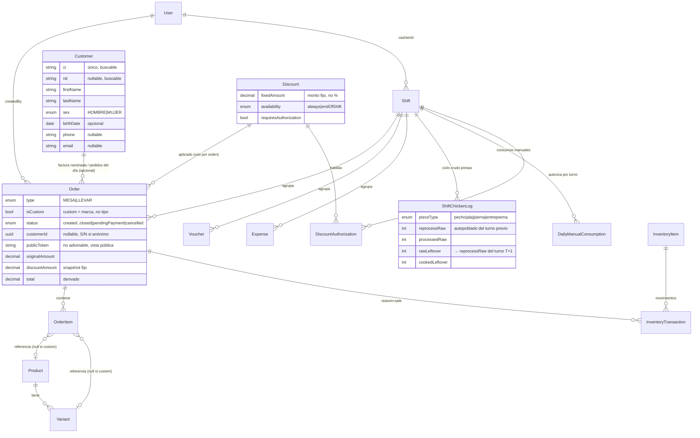
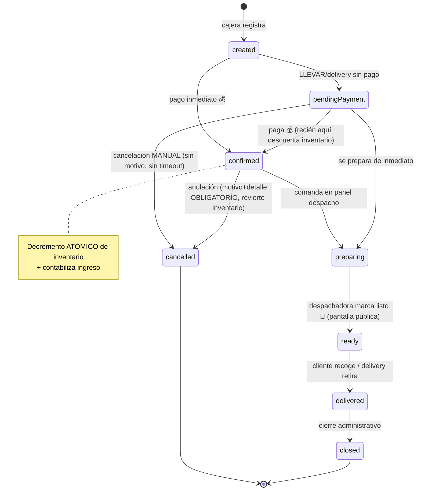

# Technical Guide — Wonder Chicken
**Sistema Informático de Ventas — Documento Técnico de Implementación**
**Complementa:** [docs/pdr.md](pdr.md)
**Material de origen:** [docs/business_context.md](business_context.md) (evidencia del trabajo de titulación que alimenta el PDR — citas, menú, inventario, tickets reales)
**Audiencia:** LLM generador de código y equipo de desarrollo backend/frontend
**Versión:** 1.1 (sincroniza feature de descuentos con catálogo/autorización y precio de venta por presa en V1 — PDR §2.10 / §2.11)
**Fecha:** 2026-06-06

> Este documento es la **traducción técnica** de las reglas de negocio definidas en el PDR. Contiene modelo de datos, contrato de la API, requerimientos no funcionales técnicos, máquina de estados con detalles transaccionales, payloads, OpenAPI skeleton, casos de prueba E2E y despliegue.
>
> **Precedencia:** Si una decisión técnica de este documento entra en conflicto con una regla de negocio del PDR, **la regla de negocio del PDR gana**. Este documento se actualiza para reflejar el negocio, no al revés.
>
> **Altitud de este documento:** el modelo de datos de §3 (incluido el [ER de §3.3](#33-diagrama-de-relaciones-er)) es el **modelo lógico completo** — todos los campos, snapshots y enums. Es el **contrato del dato**. Para la vista estructural resumida (cómo se conectan las entidades, sin campos) mirá [`architecture_overview.md` §3](architecture_overview.md#3-modelo-relacional-vista-resumida-del-prisma). Misma realidad, distinto zoom.

---

## Índice

- [1. Stack tecnológico (obligatorio)](#1-stack-tecnológico-obligatorio)
- [2. Requerimientos no funcionales (NFR)](#2-requerimientos-no-funcionales-nfr)
- [3. Modelo de datos (esquema lógico para la BD)](#3-modelo-de-datos-esquema-lógico-para-la-bd)
  - [3.1 Entidades principales](#31-entidades-principales)
  - [3.2 Relaciones clave](#32-relaciones-clave)
  - [3.3 Diagrama de relaciones (ER)](#33-diagrama-de-relaciones-er)
- [4. Máquina de estados de pedidos (transaccional)](#4-máquina-de-estados-de-pedidos-transaccional)
  - [4.1 Transiciones y efectos](#41-transiciones-y-efectos)
  - [4.2 Reglas transaccionales](#42-reglas-transaccionales)
  - [4.3 Auditoría — implementación (V1)](#43-auditoría--implementación-v1)
- [5. Contratos de la API](#5-contratos-de-la-api)
  - [5.1 Endpoints principales](#51-endpoints-principales)
  - [5.2 Autenticación y autorización](#52-autenticación-y-autorización)
  - [5.3 Estructura de respuesta estándar](#53-estructura-de-respuesta-estándar)
  - [5.4 Reglas del contrato](#54-reglas-del-contrato)
- [6. JSON payloads de ejemplo](#6-json-payloads-de-ejemplo)
  - [6.1 ProductCreateResponse](#61-productcreateresponse-éxito)
  - [6.2 VariantCreateResponse](#62-variantcreateresponse-éxito)
  - [6.3 OrderCreateResponse (mesa, pagado, con sustitución)](#63-ordercreateresponse-mesa-pagado-con-sustitución)
  - [6.4 OrderCreateResponse (llevar, pendingPayment)](#64-ordercreateresponse-llevar-pendingpayment)
  - [6.5 CustomOrderCreateResponse (presas surtidas)](#65-customordercreateresponse-orden-llevar-custom--presas-surtidas-vía-post-apiv1orderscustom)
  - [6.6 OrderWithDiscountResponse (descuento al personal)](#66-orderwithdiscountresponse-descuento-al-personal-aplicado)
  - [6.6b DiscountCreateResponse (catálogo — admin)](#66b-discountcreateresponse-catálogo--admin)
  - [6.6c DiscountAuthorizationResponse](#66c-discountauthorizationresponse-admin-autoriza-a-la-sesión-de-cajera-por-turno)
  - [6.7 VoucherCreateResponse](#67-vouchercreateresponse)
  - [6.8 InventoryAdjustResponse](#68-inventoryadjustresponse-éxito)
  - [6.9 ManualConsumptionResponse (cierre turno cocina)](#69-manualconsumptionresponse-cierre-turno-cocina)
  - [6.10 CashOpenResponse](#610-cashopenresponse-éxito)
  - [6.11 CancelOrderResponse (anulación)](#611-cancelorderresponse-anulación-de-pedido-pagado)
- [7. OpenAPI skeleton (recomendación)](#7-openapi-skeleton-recomendación)
- [8. Test cases E2E (casos prioritarios)](#8-test-cases-e2e-casos-prioritarios)
- [9. Despliegue, backups y sincronización](#9-despliegue-backups-y-sincronización)
- [10. Mapeo Negocio → Técnica](#10-mapeo-negocio--técnica)
- [Notas finales](#notas-finales)

---

# 1. Stack tecnológico (obligatorio)

- **Backend:** **NestJS**, **TypeScript**, **Prisma** (ORM), **PostgreSQL**.
- **Frontend:** **Next.js**, **React**, **Zustand** (estado global), **MUI** (Material UI) + MUI Icons.
- **Autenticación:** **JWT** vía `@nestjs/jwt` (enfoque liviano y explícito, **sin Passport**) + **bcryptjs** para hashing de contraseñas. Autorización por rol con **guards de NestJS** (`AuthGuard` + `RolesGuard`) registrados globales. Validación de entrada con `ValidationPipe` + **class-validator** en los DTOs. Detalle en [§5.2](#52-autenticación-y-autorización).
- **Impresión/PDF:** `react-to-print` u otro paquete equivalente con buenos resultados personalizables.
- **Multiplataforma:** El código debe correr en Windows y Linux. Usar `path.join` (nunca strings con `\` o `/` hardcodeados) y manejar fechas en UTC con timezone explícito al presentar.

---

# 2. Requerimientos no funcionales (NFR)

- **Usabilidad:** POS en 3 pasos máximo; interfaces limpias y reactivas; español por defecto. Soporte para tema claro y oscuro usando `paper` y colores de MUI (evitar fondos sólidos no reactivos).
- **Rendimiento:** Respuesta objetivo en LAN: **≤300 ms** para operaciones de venta; tolerancia a picos.
- **Disponibilidad:** Modo local (on-premise) con opción de sincronización a nube en v2; objetivo **99.5% uptime** en horario operativo.
- **Seguridad:** Autenticación JWT; contraseñas hasheadas con **bcryptjs**; auditoría de acciones críticas. **El control de permisos por rol SÍ se aplica en el backend en V1** (PDR §2.7): cada endpoint valida el rol vía `RolesGuard`. **La UI no es la frontera de seguridad** — oculta pantallas, pero el backend devuelve **401** sin token válido o expirado y **403** si el rol no corresponde. Detalle de arquitectura en [§5.2](#52-autenticación-y-autorización).
- **Escalabilidad:** Backend modular (NestJS) con Prisma ORM; separación por módulos (productos, pedidos, inventario, notificaciones, reportes). Frontend modular con Next.js, Zustand, MUI.
- **Mantenibilidad:** TypeScript en todo el stack. Reutilizable, modular (funciones, componentes, hooks, estados globales). Fácil de leer y mantener.
- **Localización:** Español; formatos de fecha y moneda locales (Bs).
- **Multiplataforma:** Windows + Linux. Paths con `path.join`. Fechas en UTC + timezone explícito en presentación.
- **Impresión:** Soporte para impresoras térmicas 7cm; **PDF fallback** automático. Generación de PDF para factura mediante `react-to-print` o equivalente.
- **Accesibilidad:** Contraste y tamaño de fuente adecuados para uso en ambientes con iluminación variable.
- **Despliegue V1:** Aplicación web local en Windows 10. **Sin Docker requerido**, pero deseable para portabilidad.
- **Backup (V2):** Backup automático diario de BD + opción de backup manual on-demand para administrador.

---

# 3. Modelo de datos (esquema lógico para la BD)

> Entidades principales y campos mínimos. Diseñado para ORM (**Prisma**) y para que el LLM genere migraciones.

## 3.1 Entidades principales

- **Product**
  - `id: UUID`, `name: string`, `basePrice: decimal`, `category: string`, `active: boolean`, `description: string`

- **Variant**
  - `id: UUID`, `productId: UUID`, `name: string`, `components: JSON`, `isDefault: boolean`
  - *Nota: NO se incluye campo de ajuste de precio. Por regla del negocio (PDR §2.1) las variantes y sustituciones no modifican el precio del producto. Si en V2 alguna variante necesita ajustar el precio base, se introducirá el campo con el nombre `priceAdjustment`.*

- **Component** *(opcional)*
  - `id: UUID`, `name: string`, `type: enum(presa, acompanamiento, bebida, extra)`, `unitPrice: decimal`

- **Customer (Cliente)** *(cliente registrado para factura nominada y vista de "pedidos del día" — PDR §2.12 / FR-019)*
  - `id: UUID`
  - `ci: string` *(cédula de identidad — **único**, indexado; clave de búsqueda)*
  - `nit: string?` *(para factura a nombre de empresa; también buscable. El cliente puede dictar **CI o NIT** para su factura)*
  - `firstName: string` *(nombres)*, `lastName: string` *(apellidos)*
  - `sex: enum(HOMBRE, MUJER)`
  - `birthDate: date?` *(opcional — tipo `date`, NO `datetime`: una fecha de nacimiento no lleva hora)*
  - `phone: string?` *(celular)*, `email: string?` *(la factura electrónica se envía por correo)*
  - `active: boolean`, `createdAt: datetime`, `updatedAt: datetime`
  - *Nota legal (SIN / RND 102100000011): registrar al cliente es **opcional por venta**. La nominatividad solo es obligatoria para ventas **> Bs 1.000**; bajo ese umbral se factura **"S/N" (sin nombre, sin NIT)**. Por eso `Order.customerId` es nullable. NO usar NIT `99001` para "sin nombre" (es exclusivo de misiones diplomáticas).*

- **Order**
  - `id: UUID`, `type: enum(MESA, LLEVAR)` *(CUSTOM no es un tipo — es propiedad de la orden vía `isCustom`; ver PDR §2.8 / §2.10)*
  - `tableNumber: string?`, `customerName: string?` *(nombre para mostrar en comanda/factura; "S/N" si el cliente no se identifica. Es **snapshot** de visualización: no cambia si luego se edita el `Customer`)*
  - `customerId: UUID?` *(referencia al `Customer` registrado; null si la venta es anónima/"S/N". **Agrupa** los pedidos del cliente para la vista del día — PDR §2.12 / FR-019)*
  - `publicToken: string` *(token aleatorio no adivinable — ej. `crypto.randomBytes(16).toString('hex')`, 128 bits — generado al crear la orden, **único** e indexado. Es la **credencial** de la vista pública del cliente: NO se usa el `id` interno ni un valor secuencial. Espacio 2^128 → no enumerable, FR-015)*
  - `status: enum(created, confirmed, preparing, ready, delivered, closed, pendingPayment, cancelled, onHold)`
  - `paymentStatus: enum(pending, paid, partial)`, `paymentMethod: enum(cash, card, vale)?`
  - `originalAmount: decimal` *(precio original de la orden ANTES de cualquier descuento = suma de los ítems; PDR §2.11)*
  - `discountId: UUID?` *(referencia al `Discount` aplicado; null si la orden no lleva descuento. Solo se permite **un descuento por orden** — sin apilamiento, PDR §2.11)*
  - `discountAmount: decimal?` *(**snapshot** del monto fijo del descuento al momento de aplicarlo, ej. 7.00. NO se deriva de una resta: es el `fixedAmount` que tenía el `Discount` en ese instante. Se congela aquí para que, si el admin edita el descuento después, las ventas viejas conserven el monto real cobrado — PDR §2.11)*
  - `total: decimal` *(total cobrado = `originalAmount − (discountAmount ?? 0)`; es el valor **derivado** y lo que entra a caja — PDR §2.11)*
  - `isCustom: boolean` *(PDR §2.10 — true si la orden se creó vía endpoint custom; default false)*
  - *Nota de migración: el antiguo campo `internalDiscount: boolean` queda **eliminado**. El "descuento al personal" ya no es un flag especial: es una instancia del catálogo `Discount` (availability `endOfShift`, sin autorización) referenciada vía `discountId`. Ver PDR §2.11.*
  - `cancelReason: string?`, `cancelDetails: string?`
  - `createdBy: userId`, `createdAt: datetime`, `paidAt: datetime?`, `cancelledAt: datetime?`
  - `readyAt: datetime?` *(timestamp de transición a `ready`; reemplaza una eventual entidad `NotificationLog`)*
  - `deliveredAt: datetime?`, `deliveredBy: userId?`
  - `shiftId: UUID`

- **OrderItem**
  - `id: UUID`, `orderId: UUID`, `productId: UUID?` *(null si custom)*, `variantId: UUID?`
  - `quantity: int`, `unitPrice: decimal`, `totalPrice: decimal`
  - `notes: string?`, `substitutions: JSON?`
  - `customPieces: JSON?` *(ej. `[{type:"pecho",qty:2},{type:"ala",qty:1}]` — composición libre de presas para ítems de órdenes custom; ver PDR §2.10)*

- **InventoryItem** *(inventario transaccional — para presas representa el plano COCIDO del expositor; ver PDR §2.3)*
  - `id: UUID`, `sku: string`, `name: string`
  - `unit: enum(presa, bolsa, unidad)`, `type: enum(pecho, ala, pierna, entrepierna, bebida, insumo)`
  - `currentStock: int`, `unitMeasure: string`
  - `salePrice: decimal?` *(precio de venta unitario configurado por el admin. Para `type ∈ {pecho, ala, pierna, entrepierna}` es el precio de venta por presa que alimenta el **precio sugerido** de la venta custom — **ahora V1**, PDR §2.10. Es solo precio de VENTA: el sistema NO registra costo del pollo ni calcula margen.)*
  - *Nota: el ciclo CRUDO de presas (reproceso, procesado, sobrante crudo) se modela aparte en `ShiftChickenLog`. `InventoryItem` con `type ∈ {pecho, ala, pierna, entrepierna}` representa siempre el inventario cocido vendible.*

- **InventoryBatch** *(opcional)*
  - `id: UUID`, `inventoryItemId: UUID`, `batchCode: string`, `processedAt: datetime`, `quantityReceived: int`, `quantityRemaining: int`, `origin: string`

- **InventoryTransaction**
  - `id: UUID`, `inventoryItemId: UUID`, `delta: int`
  - `reason: enum(sale, adjustment, reception, vale, manualConsumption)`
  - *Nota: NO hay `reason` de descuento. Un descuento es **puramente monetario** (PDR §2.11): la venta con descuento descuenta inventario con `reason = sale` igual que cualquier otra, sobre el producto real vendido.*
  - `referenceId: UUID?`, `userId: UUID`, `note: string?`, `timestamp: datetime`

- **DailyManualConsumption** *(consumos anotados por turno — bolsas de papa, smile, vasos, etc.)*
  - `id: UUID`, `shiftId: UUID`, `inventoryItemId: UUID`, `quantity: int`, `recordedBy: userId`, `recordedAt: datetime`

- **ShiftChickenLog** *(ciclo CRUDO de presas anotado por el cocinero al cierre de turno — PDR §2.3 / FR-017)*
  - `id: UUID`, `shiftId: UUID`, `pieceType: enum(pecho, ala, pierna, entrepierna)`
  - `reprocessRaw: int` *(pollo crudo sobrante del turno anterior — autopoblado con `rawLeftover` del último `ShiftChickenLog` cerrado para el mismo `pieceType`; editable por el cocinero antes de confirmar)*
  - `processedRaw: int` *(pollo fresco marinado en este turno)*
  - `rawLeftover: int` *(sobrante procesado crudo al cierre — se convierte en el `reprocessRaw` del turno siguiente)*
  - `cookedLeftover: int` *(sobrante cocido en expositor al cierre — habilita venta con descuento al personal §2.11)*
  - `recordedBy: userId`, `recordedAt: datetime`, `closedAt: datetime?`
  - *Cantidad cocinada en el turno (derivada, NO se almacena): `reprocessRaw + processedRaw − rawLeftover`*
  - *Constraint: `UNIQUE(shiftId, pieceType)` — un log por turno por tipo de presa*

- **Voucher (Vale)**
  - `id: UUID`, `code: string`
  - `workerId: UUID?` *(o `workerName: string` si el trabajador no es usuario del sistema)*
  - `productId: UUID?`, `productName: string`, `amount: decimal`
  - `issuedBy: userId`, `issuedAt: datetime`, `shiftId: UUID`
  - `status: enum(issued, redeemed, cancelled)`, `note: string?`
  - *Nota: los vales **NO son descuentos** (PDR §2.4 / §2.11): no suman a caja y descuentan nómina. Concepto aparte de `Discount`; no se mezclan.*

- **Discount** *(catálogo de descuentos creado por el admin — PDR §2.11. Catálogo mínimo, NO motor de reglas: monto fijo, a nivel orden, uno por orden, sin apilamiento.)*
  - `id: UUID`, `name: string`
  - `fixedAmount: decimal` *(monto fijo en Bs — NO porcentaje en V1)*
  - `availability: enum(always, endOfShift)` *(`always` = todo el turno; `endOfShift` = solo a fin de turno)*
  - `requiresAuthorization: boolean` *(si `true`, la cajera solo puede aplicarlo si el admin la autorizó en ese turno — ver `DiscountAuthorization`)*
  - `active: boolean`
  - *Instancias principales (PDR §2.11): "Descuento personal" (`fixedAmount = 7`, `availability = endOfShift`, `requiresAuthorization = false`) y "Compensación al cliente" (`fixedAmount = 7`, `availability = always`, `requiresAuthorization = true`).*
  - *El descuento es **puramente monetario**: el inventario siempre descuenta el producto real vendido, nunca el equivalente al precio descontado.*

- **DiscountAuthorization** *(habilitación que el admin otorga a la sesión de cajera de un turno para aplicar un `Discount` con `requiresAuthorization = true` — PDR §2.11 / FR-016b)*
  - `id: UUID`, `discountId: UUID`
  - `shiftId: UUID`, `cashierId: UUID` *(sesión/cajera beneficiada del turno)*
  - `authorizedBy: UUID` *(admin que la otorgó)*, `authorizedAt: datetime`
  - *Alcance **por turno, no por orden**: se otorga una sola vez y vale para todo el turno. Una vez autorizada, la cajera aplica el descuento las veces que necesite hasta el cierre.*
  - *Se **extingue al cerrar el turno** (vive y muere con la sesión de cajera, §2.7 / FR-008b) y no se hereda al turno siguiente.*
  - *El **acto de autorizar** es auditable por sí mismo (`AuditLog`), independientemente de cada aplicación posterior del descuento sobre una venta.*
  - *Constraint sugerido: `UNIQUE(discountId, shiftId, cashierId)` — una autorización por descuento por sesión de cajera por turno.*

- **User**
  - `id: UUID`, `name: string`, `role: enum(ADMIN, CASHIER, DISPATCHER, COOK)`
  - `username: string`, `passwordHash: string`, `active: boolean`

- **Shift / CashRegister**
  - `id: UUID`, `cashierId: UUID`, `cashRegisterId: UUID?`
  - `startAt: datetime`, `endAt: datetime?`
  - `openingAmount: decimal`, `closingAmount: decimal?`, `expectedAmount: decimal?`, `discrepancy: decimal?`

- **Expense**
  - `id: UUID`, `description: string`, `amount: decimal`, `paidBy: enum(cash, register)`, `shiftId: UUID`, `createdBy: userId`, `createdAt: datetime`

- **AuditLog**
  - `id: UUID`, `entity: string`, `entityId: UUID`, `action: string`, `userId: UUID`, `timestamp: datetime`, `details: JSON?`

## 3.2 Relaciones clave

- `Product` 1..* `Variant`
- `Customer` 1..* `Order` (vía `Order.customerId`, opcional — null si venta anónima "S/N")
- `Order` 1..* `OrderItem`
- `OrderItem` → `Product` / `Variant` (ambos opcionales si pertenece a una orden custom — `Order.isCustom = true` con item poblando `customPieces`)
- `InventoryTransaction` referencia `Order`, `Voucher` o `Expense` por `referenceId`
- `Shift` vincula `CashRegister`, `User` (cajera), `Expense`, `Voucher`, `Order`, `DailyManualConsumption`, `ShiftChickenLog`, `DiscountAuthorization`
- `Discount` 1..* `Order` (vía `Order.discountId`, opcional — solo uno por orden)
- `Discount` 1..* `DiscountAuthorization`
- `DiscountAuthorization` vincula `Discount`, `Shift` y `User` (cajera) — autorización por turno otorgada por un admin

## 3.3 Diagrama de relaciones (ER)

Así se conectan las entidades clave descritas en [§3.1](#31-entidades-principales). Es el corazón transaccional del sistema.



> **Dos sutilezas de negocio que el modelo refleja** (y que hay que entender, no solo copiar):
> - `Order.isCustom` es un **flag**, no un valor de `type`. Una venta custom sigue siendo `MESA` o `LLEVAR` ([PDR §2.10](pdr.md#L380)).
> - `discountAmount` es un **snapshot** del monto fijo, NO una resta. El `total` es lo derivado ([PDR §2.11](pdr.md#L401)).

---

# 4. Máquina de estados de pedidos (transaccional)

**Estados:**
`created → confirmed → preparing → ready → delivered → closed`
Estados adicionales: `pendingPayment`, `cancelled`, `onHold`.

El flujo de vida de una orden. Negocio en [PDR §4](pdr.md#L444), efectos transaccionales en [§4.1](#41-transiciones-y-efectos).



> **Reglas clave que el diagrama codifica:**
> - El inventario se descuenta **al confirmar el pago**, nunca antes ([PDR §2.3](pdr.md#L324)).
> - `pendingPayment` se prepara **igual** que un pedido pagado, pero sin tocar inventario ni caja ([PDR §2.5](pdr.md#L344)).
> - Cancelar pendiente: **manual, sin motivo**. Anular pagado: **motivo + detalle obligatorios** + revierte inventario ([FR-011b](requirements.md#L74)).

## 4.1 Transiciones y efectos

- **created → confirmed (con pago)**
  - Acción: cajera confirma pedido con pago inmediato.
  - Efecto: `paymentStatus = paid` → **decremento atómico de inventario** → contabiliza ingreso → genera comanda digital → (opcional) imprime factura si cliente la pide.

- **created → pendingPayment**
  - Acción: cajera registra pedido LLEVAR/delivery sin pago aún.
  - Efecto: `paymentStatus = pending`. **NO decrementa inventario, NO contabiliza ingreso**. Se genera comanda digital y el pedido pasa directamente a preparación. La cancelación, si ocurre, es siempre manual y la realiza la cajera (PDR §2.5).

- **confirmed → preparing / pendingPayment → preparing**
  - Acción: comanda digital aparece automáticamente en panel de despacho.
  - Efecto: ningún cambio en inventario (ya se hizo en confirmed con pago, o aún no se hace si es pendingPayment).

- **pendingPayment → confirmed**
  - Acción: delivery / cliente paga.
  - Efecto: `paymentStatus = paid`, `paidAt = now`. **Decremento atómico de inventario**. Contabiliza ingreso.

- **pendingPayment → cancelled (manual — única forma)**
  - Acción: cajera cancela manualmente. **No existe auto-cancelación por timeout** (PDR §2.5).
  - Efecto: `cancelledAt = now`, `cancelReason = "manual"`. Sin requerir motivo detallado. Inventario no se tocó, ingreso no se contabilizó.

- **preparing → ready**
  - Acción: despachadora marca listo.
  - Efecto: `Order.readyAt = now`. El pedido aparece en la pantalla pública mostrando **únicamente el número de pedido** (aplica tanto a MESA como a LLEVAR) y suena alerta breve.

- **ready → delivered**
  - Acción: cliente recoge / delivery retira / despachadora entrega en mesa; despachadora marca entregado.
  - Efecto: `Order.deliveredAt = now`, `Order.deliveredBy = userId` registrados.

- **delivered → closed**
  - Acción: cierre administrativo (típicamente al cierre de turno).

- **(cualquier estado pagado) → cancelled (anulación)**
  - Acción: admin / cajera anula un pedido ya pagado.
  - Efecto requerido: `cancelReason` y `cancelDetails` obligatorios. **Reversión de inventario** (restituir presas y bebidas). Se registra en arqueo bajo `anulaciones` con monto. `AuditLog` obligatorio.

## 4.2 Reglas transaccionales

- El decremento de inventario y la marca de pago deben ocurrir en una **transacción atómica**. Si falla inventario (stock insuficiente), la orden permanece en su estado anterior y se notifica a la cajera con detalle del faltante.
- **No existe job de auto-cancelación**: los pedidos `pendingPayment` solo transitan a `cancelled` por acción manual de la cajera o a `paid` al confirmar el pago.
- **El registro de auditoría forma parte de la transacción.** En las acciones críticas, el `INSERT` en `AuditLog` ocurre **dentro de la misma `$transaction`** que la acción: si la operación se revierte, el audit tampoco queda (no hay constancia de algo que no pasó). Detalle en [§4.3](#43-auditoría--implementación-v1).

---

## 4.3 Auditoría — implementación (V1)

> Traducción técnica de la regla de negocio [PDR §2.9](pdr.md#29-auditoría). La auditoría registra el rastro inmutable de las **acciones críticas** (quién, cuándo, qué entidad, qué cambió) sobre la entidad [`AuditLog`](#31-entidades-principales). **No confundir con el logging técnico** (errores/debug): la auditoría es un registro **de negocio**, persistido en BD, inmutable y consultable por el admin.

### Patrón V1: audit explícito dentro del service y la transacción
- La escritura del `AuditLog` se hace de forma **explícita dentro del service** de cada acción crítica, en la **misma `prisma.$transaction`** que la operación. Dos motivos lo imponen:
  1. **Atomicidad:** acción y audit se graban juntos o no se graban (§4.2). Evita auditar ventas que terminaron revertidas.
  2. **Estado *antes/después*:** el `details` necesita el valor previo, que solo está disponible **antes de mutar**, dentro del service.
- Recomendado: un `AuditService` con un único método `log(tx, { entity, entityId, action, userId, details })` invocado desde cada punto crítico, reutilizando la transacción activa.

### Las 6 acciones auditadas (§2.9) y su punto de captura
| Acción (`action`) | Punto de captura | `entity` |
|---|---|---|
| `CREATE_SALE` | `POST /orders` y `POST /orders/custom` (al confirmar pago) | `Order` |
| `CANCEL_SALE` | `POST /orders/{id}/cancel` | `Order` |
| `ADJUST_INVENTORY` | `POST /inventory/adjust` | `InventoryItem` |
| `CREATE_VOUCHER` | `POST /vouchers` | `Voucher` |
| `OPEN_SHIFT` / `CLOSE_SHIFT` | `POST /shifts/open` · `/close` | `Shift` |
| `GENERATE_REPORT` | `GET /reports/...` | `Report` (lógico) |

> El **acto de autorizar un descuento** ya queda auditado aparte (`AUTHORIZE_DISCOUNT`, §2.11 / FR-016b) — ver [§5.1](#51-endpoints-principales).

### Cómo se llena cada campo
- **`userId`** (quién): del JWT, `request.user.sub`. Disponible en toda petición autenticada.
- **`timestamp`** (cuándo): reloj del server (`@default(now())`).
- **`entity` + `entityId`** (qué entidad): tipo e id del registro afectado. En una **creación**, el `entityId` está disponible **tras el insert dentro de la misma `tx`**.
- **`action` + `details`** (qué cambió): `action` es el verbo fijo del endpoint; `details: JSON` guarda el cambio concreto:
  - **Creaciones** (venta, vale): qué se creó → `{ total, items, paymentMethod }`, `{ worker, product, amount }`.
  - **Mutaciones** (ajuste de inventario, cierre de caja): estado previo y nuevo → `{ before, after, reason }`, `{ expected, counted, difference }`.

### Inmutabilidad: tabla append-only
- A `AuditLog` solo se le hace **`INSERT`** y **`SELECT`**. **Nunca `UPDATE` ni `DELETE`.** Un registro de auditoría editable no sirve como prueba — la inmutabilidad **es** la feature.

### Consulta
- Hace falta un endpoint de **lectura** del rastro para el admin (filtros por `entity`, `userId`, rango de fechas). Auditar sin poder consultar no aporta valor.

### Por qué NO un interceptor genérico en V1
- Un `AuditInterceptor` global corre **fuera de la transacción** del service y **no tiene el estado previo**, así que no puede garantizar atomicidad ni llenar `details` con el *antes/después*. Por eso V1 usa audit explícito.
- Un interceptor (para las acciones simples, sin before/after) es una **optimización diferida a V2**, y se sumará **con un caso real** cuando la repetición lo justifique — misma disciplina que el catálogo de descuentos ([PDR §2.11](pdr.md#211-descuentos-sobre-la-orden-incluye-descuento-al-personal)). No se introduce antes.

---

# 5. Contratos de la API

## 5.1 Endpoints principales

> El rol requerido por cada endpoint está en la **matriz de autorización** de [§5.2](#52-autenticación-y-autorización). Todos exigen `Authorization: Bearer <token>` salvo los marcados **público**.

- `POST /api/v1/auth/login` — **público** (`@Public()`): autentica con `username` + `password`; responde **200** + `{ token, user: { id, username, role } }`. El `token` es un JWT con payload `{ sub: userId, username, role }` que el frontend envía como `Bearer` en el resto de las llamadas. Sin token o token expirado/ inválido → **401** (FR-018).
- `POST /api/v1/products` — crear producto
- `GET /api/v1/products` — listar productos
- `POST /api/v1/variants` — crear variante
- `POST /api/v1/orders` — crear orden estándar (MESA / LLEVAR). Solo acepta items con `productId`/`variantId` (sin `customPieces`). Setea `Order.isCustom = false`.
- `POST /api/v1/orders/custom` — crear orden custom (MESA / LLEVAR) con presas surtidas. Items llevan `customPieces` + extras/bebidas opcionales y un **precio unitario confirmado** por la cajera. El sistema calcula un **precio sugerido** = `sum(customPieces[].qty × InventoryItem.salePrice)` + extras + bebidas (todo a precio de venta, §2.10, **V1**); la cajera puede aceptarlo o pisarlo. Se persiste el precio **confirmado**, nunca la sugerencia. Setea `Order.isCustom = true`. Endpoint **separado** para mantener DTOs y validaciones limpias por flujo (PDR §2.10).
- `GET /api/v1/orders/{id}` — obtener orden
- `GET /api/v1/public/orders/{token}` — **público**: vista de la comanda del cliente, accedida por el `publicToken` no adivinable del pedido (no por `id`). Devuelve solo campos seguros. Si la orden tiene `customerId`, incluye además los **otros pedidos del mismo cliente del día** (vista "mis pedidos del día"); el agrupado se hace por `customerId` + fecha, pero el acceso lo habilita el token, no el NIT (FR-015 / FR-019)
- `PATCH /api/v1/orders/{id}/status` — cambiar estado
- `POST /api/v1/orders/{id}/pay` — confirmar pago (transita `pendingPayment` → `paid`)
- `POST /api/v1/orders/{id}/cancel` — anular pedido pagado (requiere `reason` + `details`)
- `GET /api/v1/customers?search=<ci|nit|nombre>` — buscar cliente registrado por CI, NIT o nombre (la cajera lo usa al facturar nominado)
- `POST /api/v1/customers` — registrar cliente (`ci`, `nit?`, `firstName`, `lastName`, `sex`, `birthDate?`, `phone?`, `email?`)
- `GET /api/v1/customers/{id}` — obtener datos del cliente
- `PATCH /api/v1/customers/{id}` — editar datos personales del cliente
- `POST /api/v1/inventory/adjust` — ajustar inventario (admin, con motivo)
- `POST /api/v1/inventory/manual-consumption` — registrar consumos manuales por turno
- `GET /api/v1/inventory/shift-chicken-log/{shiftId}` — obtener el `ShiftChickenLog` del turno (al abrir, viene precargado con `reprocessRaw` = `rawLeftover` del último turno cerrado por `pieceType`)
- `POST /api/v1/inventory/shift-chicken-log` — registrar/actualizar el ciclo crudo del turno (reproceso, procesado, sobrante crudo, sobrante cocido en expositor) por tipo de presa
- `POST /api/v1/inventory/shift-chicken-log/{shiftId}/close` — cerrar el ShiftChickenLog del turno; dispara la reconciliación contra ventas y registra discrepancias
- `POST /api/v1/shifts/open` — abrir caja/turno
- `POST /api/v1/shifts/close` — cerrar caja/turno (arqueo con anulaciones, vales, métodos)
- `POST /api/v1/vouchers` — crear vale
- `GET /api/v1/vouchers` — listar vales con filtros
- `PATCH /api/v1/inventory/{id}/sale-price` — configurar el precio de venta por presa cocida (admin; alimenta el precio sugerido de la venta custom, §2.10)
- `POST /api/v1/discounts` — crear descuento (admin): `name`, `fixedAmount`, `availability`, `requiresAuthorization`, `active`
- `GET /api/v1/discounts` — listar descuentos (filtros: `availability`, `active`). El POS pide los **aplicables ahora**: `active = true`, disponibilidad vigente (`always`, o `endOfShift` solo en la ventana de fin de turno) y, si `requiresAuthorization`, que exista `DiscountAuthorization` para la sesión de cajera del turno
- `PATCH /api/v1/discounts/{id}` — editar descuento (admin). Editar el `fixedAmount` NO afecta ventas pasadas: el snapshot quedó congelado en cada `Order` (§2.11)
- `POST /api/v1/orders/{id}/discount` — aplicar **un** descuento a la orden: valida disponibilidad y autorización; setea `Order.discountId`, copia `discountAmount` (snapshot del `fixedAmount` vigente) y recalcula `total = originalAmount − discountAmount`
- `POST /api/v1/discounts/{id}/authorize` — el admin otorga la **autorización por turno** a una sesión de cajera (body: `shiftId`, `cashierId`). Crea `DiscountAuthorization` y deja `AuditLog` del acto de autorizar
- `GET /api/v1/discounts/authorizations` — listar autorizaciones vigentes del turno (filtro: `shiftId`, `cashierId`)
- `GET /api/v1/reports/sales` — reporte ventas
- `GET /api/v1/reports/inventory-presas` — reporte inventario presas
- `POST /api/v1/print/invoice` — imprimir factura térmica (a demanda)
- `GET /api/v1/print/invoice/{orderId}/pdf` — descargar PDF factura (fallback)

## 5.2 Autenticación y autorización

> **Decisión V1 (PDR §2.7 / FR-018):** el control de permisos por rol se aplica **en el backend**, no solo en la UI. La UI oculta pantallas por comodidad, pero **la frontera de seguridad es el backend**: valida el token y el rol en **cada** petición.

### Enfoque elegido — liviano, sin Passport

Se usan los **guards de NestJS** de caja, con `@nestjs/jwt` directo (sin `@nestjs/passport`). Dos guards encadenados, ambos registrados **globales** vía `APP_GUARD` — así todo queda protegido por default y se abre solo lo necesario:

1. **`AuthGuard` (autenticación).** Corre primero. Extrae el token del header `Authorization: Bearer <token>`, lo verifica con `jwtService.verifyAsync(token)`:
   - sin token, o token **inválido / expirado** → lanza `UnauthorizedException` → **401**.
   - token OK → inyecta el payload en `request.user` (`{ sub, username, role }`) y deja pasar.
   - respeta el decorator **`@Public()`**: las rutas marcadas (ej. `POST /auth/login`) saltan la verificación.
2. **`RolesGuard` (autorización).** Corre después del `AuthGuard`. Lee los roles declarados con `@Roles(...)` usando `Reflector.getAllAndOverride([handler, class])`:
   - el endpoint **no declara** `@Roles` → pasa (autenticado alcanza).
   - declara roles y `request.user.role` **no** está en la lista → lanza `ForbiddenException` → **403**.

### Piezas (qué archivo hace qué)

| Pieza | Rol en el sistema |
|------|-------------------|
| `@Public()` | Marca una ruta como abierta (sin token). Vía `SetMetadata(IS_PUBLIC_KEY, true)`. |
| `@Roles(UserRole.ADMIN, ...)` | Declara qué roles pueden tocar el handler. Vía `SetMetadata(ROLES_KEY, roles)`. |
| `AuthGuard` | Verifica el JWT, inyecta `request.user`, respeta `@Public()`. → 401 |
| `RolesGuard` | Compara `request.user.role` contra `@Roles`. → 403 |
| `JwtModule` | Firma/verifica el token (secret + expiración). |
| `bcryptjs` | Hashea/compara contraseñas en el login (`User.passwordHash`). |
| `ValidationPipe` (global) | Valida el body contra los DTOs (class-validator). |

> **Por qué guards y no middleware:** el middleware corre **antes** del routing y no conoce el handler destino, así que no puede leer el `@Roles` de ese endpoint. El guard corre **después** del routing, con `ExecutionContext` completo, y por eso puede leer los metadatos del decorator. La autorización por rol **va en guard**, no en middleware.

### Snippets de referencia (patrón NestJS estándar)

```typescript
// roles.decorator.ts
export const ROLES_KEY = 'roles';
export const Roles = (...roles: UserRole[]) => SetMetadata(ROLES_KEY, roles);

// public.decorator.ts
export const IS_PUBLIC_KEY = 'isPublic';
export const Public = () => SetMetadata(IS_PUBLIC_KEY, true);
```

```typescript
// roles.guard.ts (autorización)
@Injectable()
export class RolesGuard implements CanActivate {
  constructor(private reflector: Reflector) {}
  canActivate(ctx: ExecutionContext): boolean {
    const required = this.reflector.getAllAndOverride<UserRole[]>(ROLES_KEY, [
      ctx.getHandler(),
      ctx.getClass(),
    ]);
    if (!required) return true;               // endpoint sin @Roles → autenticado alcanza
    const { user } = ctx.switchToHttp().getRequest();
    return required.includes(user.role);      // false → 403 ForbiddenException
  }
}
```

```typescript
// app.module.ts — ambos guards globales, orden importa (Auth primero)
providers: [
  { provide: APP_GUARD, useClass: AuthGuard },
  { provide: APP_GUARD, useClass: RolesGuard },
];
```

```typescript
// uso en un controller
@Roles(UserRole.CASHIER)
@Post('orders')                 // solo cajera
registrarVenta() { /* ... */ }

@Roles(UserRole.ADMIN, UserRole.CASHIER)
@Post('orders/:id/discount')    // dos roles, sin función nueva
aplicarDescuento() { /* ... */ }
```

### Matriz de autorización endpoint → roles

Es la **spec que el `RolesGuard` implementa** — aterriza la matriz de negocio del PDR §2.7 a roles por endpoint. `ADMIN` siempre puede operar lo administrativo; las lecturas que el POS necesita se abren a los roles que las consumen.

| Endpoint | Roles permitidos |
|----------|------------------|
| `POST /auth/login` | **público** (`@Public()`) |
| `POST /products`, `POST /variants` | `ADMIN` |
| `GET /products` | `ADMIN`, `CASHIER` *(el POS lo consume)* |
| `POST /orders`, `POST /orders/custom` | `CASHIER` |
| `POST /orders/{id}/pay`, `POST /orders/{id}/cancel` | `CASHIER` |
| `POST /orders/{id}/discount` | `CASHIER` |
| `GET /orders/{id}` | `CASHIER`, `DISPATCHER`, `ADMIN` |
| `PATCH /orders/{id}/status` (ready / delivered) | `DISPATCHER` |
| `GET /public/orders/{token}` | **público** (vista del cliente por token no adivinable, sin datos sensibles) |
| `GET /customers`, `POST /customers`, `GET /customers/{id}`, `PATCH /customers/{id}` | `CASHIER`, `ADMIN` |
| `POST /shifts/open`, `POST /shifts/close` | `CASHIER` |
| `POST /vouchers` | `CASHIER` |
| `GET /vouchers` | `CASHIER`, `ADMIN` |
| `POST /print/invoice`, `GET /print/invoice/{id}/pdf` | `CASHIER` |
| `POST /inventory/adjust` | `ADMIN` |
| `PATCH /inventory/{id}/sale-price` | `ADMIN` |
| `POST /inventory/manual-consumption` | `COOK` |
| `POST/GET /inventory/shift-chicken-log[...]` | `COOK` |
| `POST /discounts`, `PATCH /discounts/{id}` | `ADMIN` |
| `GET /discounts` | `CASHIER`, `ADMIN` |
| `POST /discounts/{id}/authorize`, `GET /discounts/authorizations` | `ADMIN` |
| `GET /reports/sales`, `GET /reports/inventory-presas` | `ADMIN` |
| Crear usuarios | `ADMIN` |

> El **payload del JWT** lleva `{ sub: userId, username, role }`; el `RolesGuard` compara `role` contra la columna de arriba. El código de error de contrato para el 403 es `FORBIDDEN` (ver §5.4).

### Sesión única por turno (FR-008b)

Dentro de un mismo turno, un usuario solo puede tener **1 sesión activa con 1 rol** (PDR §2.7). El login rechaza abrir una segunda sesión con otro rol en el turno vigente con un mensaje claro. No es responsabilidad del guard sino del servicio de auth/turnos.

## 5.3 Estructura de respuesta estándar

**Éxito:**
```json
{
  "isSuccess": true,
  "message": "Operacion exitosa",
  "data": {}
}
```

**Error:**
```json
{
  "isSuccess": false,
  "message": "Error de validacion",
  "data": null,
  "error": {
    "code": "VALIDATION_ERROR",
    "details": [
      {
        "field": "items[0].quantity",
        "message": "Debe ser mayor a 0"
      }
    ]
  }
}
```

## 5.4 Reglas del contrato

- Frontend valida flujo con `isSuccess`.
- `error` será singular.
- `details` será array.
- `code` será string estable: `VALIDATION_ERROR`, `NOT_FOUND`, `FORBIDDEN`, `INSUFFICIENT_STOCK`, `DISCOUNT_NOT_AVAILABLE` (descuento fuera de su ventana de disponibilidad), `DISCOUNT_NOT_AUTHORIZED` (la sesión de cajera no tiene autorización vigente para ese descuento), `DISCOUNT_ALREADY_APPLIED` (intento de aplicar un segundo descuento — sin apilamiento), etc.
- En NestJS se implementará con `ValidationPipe` + excepciones HTTP + `ExceptionFilter` global para mantener este contrato en todos los endpoints.

---

# 6. JSON payloads de ejemplo

## 6.1 ProductCreateResponse (éxito)
```json
{
  "isSuccess": true,
  "message": "Producto creado correctamente",
  "data": {
    "id": "uuid-product-porcion-media",
    "name": "Porción Media",
    "basePrice": 30.00,
    "category": "Plato principal",
    "description": "2 presas + porción mixto",
    "active": true
  }
}
```

## 6.2 VariantCreateResponse (éxito)
```json
{
  "isSuccess": true,
  "message": "Variante creada correctamente",
  "data": {
    "id": "uuid-variant-porcion-media-mixto",
    "productId": "uuid-product-porcion-media",
    "name": "Porción Media - Mixto",
    "components": [
      {"type":"presa","count":2},
      {"type":"acompanamiento","name":"mixto","count":1}
    ],
    "isDefault": true
  }
}
```

## 6.2a CustomerCreateResponse / CustomerSearchResponse
> Alta de cliente para factura nominada. La búsqueda (`GET /customers?search=`) devuelve un array con la misma forma en `data`.
```json
{
  "isSuccess": true,
  "message": "Cliente registrado correctamente",
  "data": {
    "id": "uuid-customer-001",
    "ci": "8351427",
    "nit": "120558027",
    "firstName": "MARCO",
    "lastName": "ORTEGA GUTIERREZ",
    "sex": "HOMBRE",
    "birthDate": "1990-03-14",
    "phone": "71234567",
    "email": "marco.ortega@example.com",
    "active": true
  }
}
```

## 6.3 OrderCreateResponse (mesa, pagado, con sustitución)
```json
{
  "isSuccess": true,
  "message": "Pedido creado y pagado correctamente",
  "data": {
    "id": "uuid-order-001",
    "type": "MESA",
    "tableNumber": "70",
    "customerName": "GOMEZ",
    "customerId": "uuid-customer-001",
    "publicToken": "a3f9c2e81b4d7f60a9e35c8d2b1f4a7e",
    "status": "preparing",
    "paymentStatus": "paid",
    "paymentMethod": "cash",
    "items": [
      {
        "productId": "uuid-product-wonder",
        "variantId": "uuid-variant-wonder",
        "quantity": 2,
        "unitPrice": 36.00,
        "totalPrice": 72.00,
        "substitutions": [
          {"from":"mixto","to":"arroz"}
        ],
        "selectedPieces": [
          {"type":"pecho","qty":2},
          {"type":"ala","qty":2}
        ]
      },
      {
        "productId": "uuid-product-fanta",
        "quantity": 1,
        "unitPrice": 8.00,
        "totalPrice": 8.00
      }
    ],
    "total": 80.00,
    "createdBy": "user-roxana",
    "paidAt": "2026-05-01T22:10:00"
  }
}
```

## 6.4 OrderCreateResponse (llevar, pendingPayment)
```json
{
  "isSuccess": true,
  "message": "Pedido creado en estado pendiente de pago",
  "data": {
    "id": "uuid-order-002",
    "type": "LLEVAR",
    "customerName": "MARCO ORTEGA",
    "status": "preparing",
    "paymentStatus": "pending",
    "items": [
      {
        "productId": "uuid-product-porcion-media",
        "quantity": 3,
        "unitPrice": 30.00,
        "totalPrice": 90.00,
        "selectedPieces": [
          {"type":"pecho","qty":1},{"type":"ala","qty":1},
          {"type":"pierna","qty":2},{"type":"entrepierna","qty":2}
        ]
      }
    ],
    "total": 90.00,
    "createdBy": "user-roxana"
  }
}
```

## 6.5 CustomOrderCreateResponse (orden LLEVAR custom — presas surtidas, vía `POST /api/v1/orders/custom`)
```json
{
  "isSuccess": true,
  "message": "Pedido custom creado correctamente",
  "data": {
    "id": "uuid-order-003",
    "type": "LLEVAR",
    "isCustom": true,
    "customerName": "JUAN PEREZ",
    "status": "preparing",
    "paymentStatus": "paid",
    "items": [
      {
        "customPieces": [
          {"type":"pecho","qty":2},
          {"type":"ala","qty":1}
        ],
        "extras": [
          {"name":"papa","qty":1}
        ],
        "drinks": [
          {"productId":"uuid-coca-500","qty":1}
        ],
        "quantity": 1,
        "unitPrice": 35.00,
        "totalPrice": 35.00
      }
    ],
    "total": 35.00,
    "createdBy": "user-roxana",
    "paidAt": "2026-05-01T13:20:00"
  }
}
```

## 6.6 OrderWithDiscountResponse (descuento al personal aplicado)
> El "descuento al personal" ya no es un flag: es la instancia `Discount` "Descuento personal" (7 Bs, `endOfShift`) aplicada vía `POST /orders/{id}/discount`. El producto real (Porción Media) se registra tal cual; el inventario descuenta las 2 presas reales. El `total` (23) se deriva de `originalAmount − discountAmount`.
```json
{
  "isSuccess": true,
  "message": "Descuento aplicado correctamente",
  "data": {
    "id": "uuid-order-004",
    "type": "MESA",
    "status": "preparing",
    "paymentStatus": "paid",
    "discountId": "uuid-discount-personal",
    "originalAmount": 30.00,
    "discountAmount": 7.00,
    "items": [
      {
        "productId": "uuid-product-porcion-media",
        "quantity": 1,
        "unitPrice": 30.00,
        "totalPrice": 30.00,
        "selectedPieces": [
          {"type":"pierna","qty":1},
          {"type":"entrepierna","qty":1}
        ]
      }
    ],
    "total": 23.00,
    "createdBy": "user-roxana"
  }
}
```

## 6.6b DiscountCreateResponse (catálogo — admin)
```json
{
  "isSuccess": true,
  "message": "Descuento creado correctamente",
  "data": {
    "id": "uuid-discount-compensacion",
    "name": "Compensación al cliente",
    "fixedAmount": 7.00,
    "availability": "always",
    "requiresAuthorization": true,
    "active": true
  }
}
```

## 6.6c DiscountAuthorizationResponse (admin autoriza a la sesión de cajera por turno)
```json
{
  "isSuccess": true,
  "message": "Cajera autorizada para el descuento en este turno",
  "data": {
    "id": "uuid-auth-001",
    "discountId": "uuid-discount-compensacion",
    "shiftId": "uuid-shift-001",
    "cashierId": "user-roxana",
    "authorizedBy": "user-admin",
    "authorizedAt": "2026-06-06T15:05:00"
  }
}
```

## 6.7 VoucherCreateResponse
```json
{
  "isSuccess": true,
  "message": "Vale registrado correctamente",
  "data": {
    "id": "uuid-voucher-001",
    "code": "V-20260501-001",
    "workerName": "MARIA LOPEZ",
    "productName": "Porción Media",
    "amount": 30.00,
    "issuedBy": "user-roxana",
    "issuedAt": "2026-05-01T14:30:00",
    "shiftId": "uuid-shift-001",
    "status": "issued"
  }
}
```

## 6.8 InventoryAdjustResponse (éxito)
```json
{
  "isSuccess": true,
  "message": "Ajuste de inventario registrado correctamente",
  "data": {
    "id": "uuid-invtx-001",
    "inventoryItemId": "uuid-inv-pecho",
    "delta": -2,
    "reason": "sale",
    "referenceId": "uuid-order-123",
    "userId": "user-roxana"
  }
}
```

## 6.9 ManualConsumptionResponse (cierre turno cocina)
```json
{
  "isSuccess": true,
  "message": "Consumos manuales registrados",
  "data": {
    "shiftId": "uuid-shift-001",
    "entries": [
      {"inventoryItemId":"uuid-bolsa-papa","quantity":3},
      {"inventoryItemId":"uuid-bolsa-smile","quantity":1},
      {"inventoryItemId":"uuid-envase-arroz","quantity":45}
    ]
  }
}
```

## 6.10 CashOpenResponse (éxito)
```json
{
  "isSuccess": true,
  "message": "Caja abierta correctamente",
  "data": {
    "id": "uuid-shift-001",
    "cashierId": "user-admin",
    "openingAmount": 200.00,
    "startAt": "2026-05-01T09:00:00"
  }
}
```

## 6.11 CancelOrderResponse (anulación de pedido pagado)
```json
{
  "isSuccess": true,
  "message": "Pedido anulado correctamente",
  "data": {
    "id": "uuid-order-001",
    "status": "cancelled",
    "cancelReason": "Cliente cambió de opinión",
    "cancelDetails": "Se devolvió el dinero en efectivo. Sin factura emitida.",
    "cancelledAt": "2026-05-01T22:30:00",
    "inventoryReverted": true
  }
}
```

---

# 7. OpenAPI skeleton (recomendación)

El LLM debe generar `openapi: 3.0.3` con:
- `securitySchemes` JWT Bearer
- `paths` para todos los endpoints listados en §5.1
- `tags` para agrupar requests (Products, Orders, Inventory, Shifts, Vouchers, Discounts, Reports, Print)
- `components/schemas` con los DTOs de request y response
- Ejemplos de request/response basados en los payloads de §6

---

# 8. Test cases E2E (casos prioritarios)

1. Crear producto + variante → aparece en POS.
2. Registrar venta MESA con sustitución → precio NO cambia; inventario decrementa al confirmar pago.
3. Registrar venta LLEVAR `pendingPayment` → comanda se prepara; inventario NO decrementa hasta confirmar pago.
4. Pedido `pendingPayment` cancelado manualmente por la cajera → inventario nunca tocado, ingreso nunca contabilizado, no requiere motivo. (No existe auto-cancelación por tiempo.)
5. Crear orden custom LLEVAR vía `POST /api/v1/orders/custom` (item con `customPieces`: 2 pechos + 1 ala + 1 papa + 1 cocacola) → el sistema devuelve un **precio sugerido** = `2×salePrice(pecho) + 1×salePrice(ala) + precio papa + precio cocacola`; la cajera lo **pisa** con un precio distinto → se persiste el precio **confirmado**, no la sugerencia. Al pagar, decrementa exactamente 2 pechos, 1 ala y 1 cocacola. La orden queda con `type = LLEVAR` y `isCustom = true` (no existe `type = CUSTOM`).
6. Abrir caja → registrar ventas (incl. vale, anulación, orden con descuento) → cerrar caja → arqueo correcto con desglose por método, vales y descuentos.
7. Emitir vale → aparece en arqueo y en listado de vales; decrementa inventario.
8. Pedido `preparing` → comanda digital aparece en panel despacho → marcar `ready` → pantalla pública muestra → marcar `delivered`.
9. Cliente accede a `GET /public/orders/{token}` con el `publicToken` de su pedido → ve su comanda; probar un token aleatorio o el `id` interno → **404** (el token es no adivinable, FR-015).
9b. Registrar cliente nuevo vía `POST /customers` → queda buscable por CI **y** por NIT vía `GET /customers?search=`. Crear orden con ese `customerId` → al abrir el `publicToken` de uno de sus pedidos, la vista lista **todos sus pedidos del día** (agrupados por `customerId` + fecha). Acceder con el NIT crudo en la URL → no funciona (el NIT no es llave; FR-019).
9c. Venta anónima "S/N" (sin `customerId`) → su `publicToken` muestra **solo ese pedido**; no hay vista del día porque no hay identidad para agrupar.
10. Cliente pide factura → impresora térmica imprime; impresora desconectada → PDF se descarga.
11. Anular pedido pagado → motivo y detalles obligatorios → inventario revertido → aparece en arqueo.
12. Reconciliación diaria: comparar `InventoryTransaction` vs `InventoryItem.currentStock`.
13. Descuento al personal: aplicar el `Discount` "Descuento personal" (7 Bs, `endOfShift`) a una Porción Media (30 Bs) vía `POST /orders/{id}/discount` → `total = 23`, `originalAmount = 30`, `discountAmount = 7` (snapshot), `discountId` referenciado; el producto real (Porción Media) e inventario (2 presas) descuentan correcto; caja cuadra. Fuera de la ventana de fin de turno el descuento NO se ofrece (`DISCOUNT_NOT_AVAILABLE`).
13b. Descuento que requiere autorización: sin `DiscountAuthorization`, aplicar "Compensación al cliente" (7 Bs, `always`, `requiresAuthorization`) falla con `DISCOUNT_NOT_AUTHORIZED`. El admin autoriza la sesión de cajera vía `POST /discounts/{id}/authorize` (queda `AuditLog`) → la cajera lo aplica a **uno o varios** pedidos del turno sin renovar la autorización por orden. Al cerrar el turno la autorización deja de estar vigente y no pasa al turno siguiente.
13c. Snapshot del monto: aplicar un descuento de 7 Bs a una orden → el admin luego edita el `Discount` a 10 Bs (`PATCH /discounts/{id}`) → la orden vieja conserva `discountAmount = 7`; una orden nueva toma 10.
14. Cocinero registra consumos manuales al cierre → se vinculan al `Shift` y aparecen en reporte diario.
14b. Ciclo crudo de presas — continuidad entre turnos: al cierre del turno mañana, cocinero registra `ShiftChickenLog` con `rawLeftover = 64` para cada `pieceType`. Al abrir el turno noche, `GET /api/v1/inventory/shift-chicken-log/{shiftIdNoche}` devuelve `reprocessRaw = 64` autopoblado por `pieceType`. Cocinero confirma o ajusta. Al cerrar el turno noche, el sistema reconcilia `(reprocessRaw + processedRaw − rawLeftover) − vendido_cocido_del_turno` vs `cookedLeftover` anotado y reporta discrepancia si existe.
15. Usuario logueado como CASHIER intenta logear como DISPATCHER en mismo turno → falla.

---

# 9. Despliegue, backups y sincronización

- **Modo inicial (V1):** Servidor local (Windows 10) ejecutando aplicación web; **PostgreSQL local**. Código multiplataforma (también funciona en Linux).
- **Distribución (V1):** Aplicación web local. **Docker Compose opcional** para portabilidad pero no requerido.
- **Sincronización (V2):** Operación local en V1; sincronización a nube en **V2** (fase posterior).
- **Backups (V2):** Copia diaria automática de BD + opción de backup manual disponible para administrador.
- **Conflictos de sincronización (V2):** Priorizar cambios locales recientes; registrar conflictos para resolución manual.

---

# 10. Mapeo Negocio → Técnica

Tabla de referencia rápida entre los conceptos del PDR y su contraparte técnica en este documento.

| Concepto de negocio (PDR) | Contraparte técnica |
|---------------------------|---------------------|
| Venta custom de presas surtidas (§2.10) | Endpoint `POST /api/v1/orders/custom`; flag `Order.isCustom = true`; ítem con `customPieces: JSON` |
| Tipo de pedido (MESA / LLEVAR) (§2.8) | `Order.type: enum(MESA, LLEVAR)` — CUSTOM **no** es un valor de `type` |
| Sustitución de acompañamiento sin afectar precio (§2.1) | `OrderItem.substitutions: JSON` con `{from, to}`; sin campo de ajuste de precio |
| Feature de descuentos — catálogo (§2.11 / FR-016) | Entidad `Discount` (`name`, `fixedAmount`, `availability`, `requiresAuthorization`, `active`); CRUD vía `/api/v1/discounts` |
| Aplicar descuento a la orden (§2.11 / FR-016) | `POST /orders/{id}/discount`; `Order.discountId` + `Order.discountAmount` (snapshot) + `Order.originalAmount`; `total` derivado; uno por orden (sin apilamiento) |
| Descuento al personal por sobrante de pollo cocido (§2.11) | Instancia de `Discount` "Descuento personal" (`fixedAmount = 7`, `availability = endOfShift`, `requiresAuthorization = false`) referenciada vía `Order.discountId`. **El antiguo `Order.internalDiscount` queda eliminado** |
| Compensación al cliente por pollo defectuoso (§2.11) | Instancia de `Discount` "Compensación al cliente" (`fixedAmount = 7`, `availability = always`, `requiresAuthorization = true`) |
| Autorización de descuentos por turno (§2.11 / FR-016b) | Entidad `DiscountAuthorization` (admin → sesión de cajera del turno); `POST /discounts/{id}/authorize`; se extingue al cerrar turno; acto auditado en `AuditLog` |
| Precio sugerido en venta custom (§2.10) — **V1** | `InventoryItem.salePrice` por presa cocida (config admin vía `PATCH /inventory/{id}/sale-price`); cálculo `sum(customPieces[].qty × salePrice) + extras + bebidas`; la cajera puede pisarlo, se persiste el confirmado |
| Pedido con pago pendiente (§2.5) | `Order.status = pendingPayment` + `paymentStatus = pending`; cancelación solo manual |
| Confirmación de pago | Endpoint `POST /api/v1/orders/{id}/pay`; transición a `paid` + decremento atómico de inventario |
| Anulación de pedido pagado (FR-011b) | Endpoint `POST /api/v1/orders/{id}/cancel` con `reason` + `details`; reversión de `InventoryTransaction` |
| Notificación de pedido listo (§2.8 / FR-007) | `Order.readyAt` registrado; pantalla pública lee órdenes con `status = ready` |
| Entrega del pedido | `Order.deliveredAt` + `Order.deliveredBy` |
| Inventario por presas (§2.3) | `InventoryItem.type ∈ {pecho, ala, pierna, entrepierna}`; decremento vía `InventoryTransaction` con `reason = sale` |
| Consumos manuales por turno (FR-017) | `DailyManualConsumption` ligado a `Shift` |
| Ciclo crudo de presas por turno — plano crudo (§2.3, FR-017) | `ShiftChickenLog` ligado a `Shift`; campos `reprocessRaw`, `processedRaw`, `rawLeftover`, `cookedLeftover` por `pieceType`; regla de continuidad entre turnos: `rawLeftover(T) → reprocessRaw(T+1)` vía autopoblado en `GET /shift-chicken-log/{shiftId}` |
| Vales (§2.4) | Entidad `Voucher`; `InventoryTransaction.reason = vale`; NO suma al ingreso de `Shift` |
| Apertura/cierre de caja por turno (§2.6) | Entidad `Shift` con `openingAmount`, `closingAmount`, `expectedAmount`, `discrepancy` |
| Caja = 1 cajera por turno (§2.7) | `Shift.cashierId` único activo por `cashRegisterId` |
| Sesión única por turno (FR-008b) | Constraint a nivel servicio: 1 sesión activa por `userId` por `shiftId` |
| Roles funcionales (§2.7) | `User.role: enum(ADMIN, CASHIER, DISPATCHER, COOK)` — enforcement por rol en el backend vía `RolesGuard` + `@Roles` (V1, FR-018); ver §5.2 |
| Auditoría de acciones críticas (§2.9) | Entidad `AuditLog` con `userId`, `entity`, `entityId`, `action`, `details: JSON` |
| Clientes y facturación nominada (§2.12 / FR-019) | Entidad `Customer` (`ci` único, `nit?`, datos personales); búsqueda por CI/NIT vía `GET /customers?search=`; `Order.customerId` opcional (anónimo = "S/N", legal ≤ Bs 1.000) |
| Vista del cliente — por pedido y pedidos del día (§7.4 / FR-015 / FR-019) | `Order.publicToken` no adivinable; `GET /public/orders/{token}` (público); identidad (`customerId`) **agrupa** los pedidos del día, el **token** da acceso — el NIT no es llave |
| Visión V2: auto-servicio (§2.10) | El cliente arma su pedido custom; el total se calcula automáticamente con `InventoryItem.salePrice` (ya definido en V1), sin intervención de la cajera |
| Visión V2: cuenta de cliente (§2.12 / §7.4) | Auto-registro + login del cliente; `GET /me/orders` seguro por auth, sin token por pedido |

---

## Notas finales

- Este documento se mantiene sincronizado con el PDR. Cuando una regla de negocio cambia, esta guía se actualiza en consecuencia, **nunca al revés**.
- Las **decisiones residuales** (umbral de discrepancia de arqueo, política contable de vales, etc.) están en [PDR §13.3 / §14](pdr.md) — no se duplican aquí.
- Las **decisiones de scope V1 vs V2** están en [PDR §13](pdr.md) — este documento solo refleja **detalles técnicos** de cada decisión.
