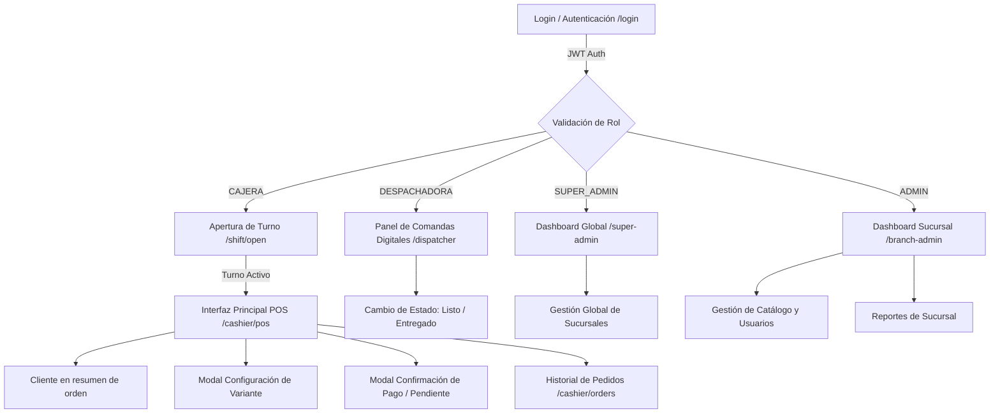

# Propuesta de Interfaces Frontend — Sprint 1 (Catálogo + POS Básico)

**Proyecto:** Wonder Chicken — Sistema Informático de Ventas  
**Documentos de Referencia:** [`../business/pdr.md`](../business/pdr.md), [`../business/requirements.md`](../business/requirements.md), [`../backend/technical_guide.md`](../backend/technical_guide.md), [`../backend/implementation_guide.md`](../backend/implementation_guide.md)  
**Alcance:** Sprint 1 — Catálogo de Productos/Variantes + POS Básico (MESA/LLEVAR) + Comanda Digital + Manejo Mínimo de Turnos + Gestión de Clientes.  
**Versión:** 1.0  
**Fecha:** Agosto 2026  

---

## 1. Resumen Ejecutivo del Sprint 1

El **Sprint 1** se enfoca en resolver el núcleo operativo de ventas del restaurante: eliminar las anotaciones manuales en papel, estructurar el catálogo dinámico de productos con sus variantes/sustituciones sin costo adicional, habilitar el registro ultrarrápido de ventas en caja (MESA y LLEVAR) y publicar la comanda digital en el panel de despacho de cocina.

### Requerimientos Funcionales Cubiertos en este Sprint:
- **FR-001 (Gestión de Productos y Variantes):** Administración del catálogo, variantes, presas obligatorias, acompañamientos por defecto y reglas de sustitución permitida.
- **FR-002 (Registro de Pedidos POS):** Flujo ágil en 3 pasos para armar pedidos (MESA / LLEVAR) con N ítems, variantes, sustituciones, bebidas y extras.
- **FR-003 (Comanda Digital - Parcial):** Generación automática e instantánea de la comanda digital visualizable en la pantalla de despacho al confirmar o registrar el pedido.
- **FR-004 / Shift Mínimo (Apertura de Caja):** Apertura obligatoria de turno declarando el **Período** (Mañana/Noche) y Monto Inicial para emitir el `orderNumber` atómico.
- **FR-008 / FR-013 (UI Diferenciada y Limpia por Rol):** Adaptación estricta de la pantalla según el rol (Superadministrador, Administrador de sucursal, Cajera y Despachadora). El rol Cocinero queda reservado hasta definir sus casos de uso.
- **FR-011 (Pedidos con Pago Pendiente - Parcial):** Registro de pedidos LLEVAR/delivery en estado `PENDING_PAYMENT` para envío directo a despacho, con cobro posterior vía `POST /orders/{id}/pay`.
- **FR-018 / FR-019 (Autenticación JWT y Clientes):** Inicio de sesión seguro y búsqueda/asociación rápida de clientes por CI/NIT (o venta anónima S/N).

---

## 2. Mapa de Navegación e Interfaces por Rol



  ### 2.1. Decisiones de arquitectura de interfaz

La estructura de carpetas del App Router es adecuada para este proyecto. Se utilizarán **route groups** para separar páginas públicas, autenticadas y layouts por rol sin alterar las URLs públicas. La ruta permite organizar la experiencia, pero la autorización real continúa en el backend mediante JWT, rol y sucursal.

La cajera y el cliente futuro no deben compartir la misma pantalla completa. Comparten contratos, datos del catálogo, schemas y componentes pequeños de dominio, pero sus contenedores son distintos:

- La cajera necesita velocidad, teclado, densidad de información y confirmaciones mínimas.
- El cliente necesita descubrimiento del menú, imágenes, accesibilidad y seguimiento de su pedido.

En Sprint 1 se diseña la operación de cajera. La vista pública de la comanda se reserva para el token de la orden; el portal autenticado del cliente queda fuera de este sprint y se incorporará como una experiencia separada cuando se defina su alcance.

### 2.2. Criterios visuales transversales

- Toda la interfaz se presenta en español. Los estados técnicos del backend se traducen para la UI: `PENDING_PAYMENT` se muestra como “Pago pendiente”, `PREPARING` como “En preparación” y `READY` como “Listo”.
- Las llamadas a la API que fallan deben informar el error mediante `react-toastify`. También puede utilizarse para confirmar operaciones críticas como vender, cobrar, eliminar o cambiar estados, pero no es obligatorio usarlo para cada respuesta o interacción. Los éxitos rutinarios no generan toast automáticamente.
- El `ToastContainer` se montará una sola vez en `ClientProviders` y respetará el tema activo. Los formularios y pantallas también deben mostrar errores junto al campo o sección que requiere corrección.
- El criterio principal es mantener un código limpio, legible y fácil de mantener: no se agregarán toasts, wrappers o utilidades genéricas cuando el feedback local de la pantalla sea suficiente. `react-toastify` complementa los estados de la interfaz; no reemplaza la carga, el error, el estado vacío ni la actualización de datos.
- Las pantallas deben ser responsive desde el inicio. La cajera y el administrador se optimizan para monitor, pero deben funcionar en tablet y móvil; la experiencia del cliente prioriza el teléfono.
- La distribución se construirá con `Grid`, `Stack`, `Container`, `Box` y breakpoints de MUI. No se asumirán anchos ni resoluciones fijas.
- La aplicación debe permitir tema claro y oscuro. Los componentes deben usar colores del theme de MUI (`background`, `text`, `divider` y colores semánticos) y evitar fondos, textos o bordes hardcodeados que rompan el contraste.
- Los estados no dependerán únicamente del color: las etiquetas, iconos y textos deben seguir siendo comprensibles en ambos temas.
- Los `Tooltip` utilizados dentro de diálogos o modales deben aparecer por encima del modal. Su portal y `z-index` deben configurarse con los valores del theme de MUI para que no queden ocultos por el overlay.
- La reutilización será equilibrada. Se compartirán patrones estables y componentes pequeños, pero una pantalla o tabla específica puede permanecer dentro de su feature si una abstracción común exige demasiadas props o condicionales.
- Se utilizarán preferentemente iconos de `@mui/icons-material`; no se agregará otra biblioteca de iconos cuando MUI tenga una alternativa adecuada. Los iconos sin texto deben incluir `Tooltip` o una etiqueta accesible. Si el icono aparece dentro de un modal, el tooltip debe respetar la regla de `z-index` anterior.
- El tamaño predeterminado de los componentes MUI que acepten `size` será `small`, especialmente en formularios, botones, selects, tablas y controles operativos. Se podrá usar `medium` o un tamaño mayor cuando la legibilidad, accesibilidad o interacción táctil lo requiera.
- `commonComponents/` incluirá una tabla común configurable, por ejemplo `CommonTable`, responsable de renderizar columnas, filas, búsqueda opcional, carga, estado vacío, errores y acciones. No realizará llamadas HTTP ni manejará reglas de negocio.
- `CommonTable` recibirá un objeto de props tipado, con `rows`, `columns` y los estados/configuración visual que realmente necesite. `columns` será un arreglo de definiciones: cada columna declarará su identificador, encabezado y campo; si necesita una presentación especial, recibirá una función `render`.
- La columna de acciones será opcional y se detectará dentro de `columns`. Si el arreglo no contiene una columna de acciones, la tabla no la renderizará. Cuando exista, su `render` recibirá la fila y devolverá uno o varios elementos React definidos por el feature, como acciones de editar, eliminar, ver o seleccionar. `CommonTable` no decide qué acciones están permitidas.
- En lo posible, las props y parámetros relacionados se agruparán en objetos para conservar contratos estables y permitir desestructurar únicamente lo necesario. No se envolverán valores aislados en objetos ni se crearán abstracciones genéricas solo por uniformidad; la legibilidad y la simplicidad tienen prioridad.
- Las tablas densas deben tener una estrategia móvil explícita: columnas prioritarias, desplazamiento horizontal controlado o una presentación alternativa cuando la tabla no sea legible en teléfono.
- Los componentes críticos deben mostrar indicadores de carga. Se usará `CircularProgress` para acciones puntuales, botones y mutaciones, y `Skeleton` o un estado de carga de sección para tablas, listas, tarjetas, historial, contexto del POS y panel de despacho. Durante una mutación se deshabilitará el control que la inició para evitar duplicados, sin bloquear controles independientes que sigan siendo seguros.

---

## 3. Especificación Detallada de Pantallas e Interfaces

### 3.1. Pantalla de Autenticación (`/login`)
- **Propósito:** Permitir el acceso seguro al sistema según el rol del trabajador, retornando un token JWT.
- **Usuarios Destino:** Superadministrador, Administrador de sucursal, Cajera y Despachadora. El rol Cocinero queda reservado y no tiene interfaz operativa en V1.
- **Componentes Visuales:**
  - Formulario limpio con campos: *Email* y *Contraseña*. El backend documenta actualmente email + CI como credenciales; si el negocio decide usar un código en lugar del email, debe cambiarse primero el contrato backend y luego esta pantalla.
  - Botón de acción principal: `"Iniciar Sesión"`.
  - Mensajes de error claros (ej. `"Credenciales inválidas"`, `"Usuario inactivo"`).
- **Comportamiento UX:**
  - Al autenticar con éxito, redirige automáticamente según el rol:
    - **SUPER_ADMIN:** Redirige a `/super-admin`.
    - **ADMINISTRADOR:** Redirige a `/branch-admin`.
    - **CAJERA:** Redirige a `/cashier/shift/open` si no hay turno abierto o a `/cashier/pos` si ya posee turno activo.
    - **DESPACHADORA:** Redirige a `/dispatcher`.

---

### 3.2. Modal / Pantalla de Apertura de Turno (`/cashier/shift/open`)
- **Propósito:** Cumplir con el requerimiento de control de caja e iniciar el contador atómico de comandas (`lastOrderNumber`).
- **Regla de Negocio Crítica ([PDR §13.3]):** El **Período del Turno** (*Mañana* / *Noche*) **DEBE declararse explícitamente**, el sistema jamás lo infiere del reloj.
- **Componentes Visuales:**
  - Campo numérico: *Monto Inicial en Caja (Bs.)* (Ej. `200.00`).
  - Desplegable / Radio Buttons: *Período del Turno* (`MAÑANA` / `NOCHE` predeterminado pero editable).
  - Selector de Caja Asignada (Caja 1, Caja 2).
  - Resumen del Usuario activo y Fecha/Hora actual.
  - Botón principal: `"Abrir Turno y Entrar al POS"`.
- **Integración Backend:** Executa `POST /shifts/open` enviando `{ initialAmount, shiftPeriodId, cashRegisterId }`.

---

### 3.3. Interfaz Principal POS — Registro de Ventas (`/cashier/pos`)
La pantalla estrella para la Cajera. Diseñada para operar de manera táctil o mediante teclado rápido en horas pico, dividida en 3 zonas principales:

```text
+---------------------------------------------------------------------------------------------------+
  | BARRA SUPERIOR: [Sucursal Central] | Turno: MAÑANA | Cajera: Roxana                         |
+-----------------------------------------------------------+---------------------------------------+
| CATÁLOGO Y CATEGORÍAS                                    | RESUMEN DE LA ORDEN                   |
| [Platos Principales] [Bebidas] [Extras]                   |                                       |
  |                                                           | Tipo: (o) MESA   ( ) LLEVAR             |
| +-------------------+ +-------------------+               | ------------------------------------- |
| | Cuarto de Pollo   | | Porción Media     |               | 2x WONDER                     72.00 Bs|
| | 2 Presas          | | 2 Presas + Mixto  |               |    • 2x PECHO-ALA                     |
| | 23.00 Bs          | | 30.00 Bs          |               |    • 1x COCA COLA 500ml (Fría)         |
| +-------------------+ +-------------------+               |    • 1x AQUARIUS PERA 500ml (Fría)     |
| +-------------------+ +-------------------+               | ------------------------------------- |
| | Wonder            | | Medio Pollo       |               | CLIENTE: LUIS IGLESIAS (CI: 1234567)  |
| | Combo 2 P + Bebida| | 4 Presas          |               | ------------------------------------- |
| | 36.00 Bs          | | 46.00 Bs          |               | TOTAL A PAGAR:               72.00 Bs |
| +-------------------+ +-------------------+               |                                       |
|                                                           | [ REGISTRAR PAGO (F1) ]               |
|                                                           | [ PAGO PENDIENTE (LLEVAR) ]           |
+-----------------------------------------------------------+---------------------------------------+
```

#### A. Barra Superior (Header de Contexto)
- Indicador de estado del Turno activo (Sucursal, Período, Cajera).
- Acceso directo a la apertura/cierre de turno y al historial de pedidos.

#### B. Panel Izquierdo / Central — Catálogo y Selección de Productos
- Tabs de Filtrado Rápido: *Todos, Platos Principales, Bebidas, Extras*.
- Tarjetas de Productos con foto, título, composición breve y precio.
- Al hacer clic en un plato con variantes (ej. *Wonder* o *Porción Media*), se despliega el **Modal de Configuración de Variante**.

#### C. Modal de Configuración de Variante (Descomposición del Ítem)
Permite armar la composición exacta del plato evitando anotaciones manuales:
1. **Selección de Presas (Componentes Obligatorios):**
   - Muestra las presas requeridas por el plato (ej. 2 presas).
   - Botones contadores para seleccionar tipos de presas: *Ala, Pecho, Pierna, Entrepierna* (ej. 1 Pecho + 1 Ala).
   - Validación automática: No permite confirmar si faltan o sobran presas respecto a la regla del plato.
2. **Acompañamientos y Sustitución ([PDR §2.1]):**
   - Muestra el acompañamiento por defecto (ej. *Mixto: Papa + Arroz*).
   - Selector de Sustitución Permitida (1 sola cambio sin alterar el precio):
     - *Sin cambio (Mixto: Papa y Arroz)*
     - *Cambiar Mixto por papa (Todo Papa)*
     - *Cambiar Mixto por Arroz (Todo Arroz)*
     - *Cambiar Mixto por Smiles McCain*
3. **Selección de Bebida (Si el plato es un Combo tipo Wonder / Super Wonder):**
   - Dropdown de Bebidas de 500 ml disponibles (Coca Cola, Mocochinchi, Fanta, Aquarius).
  - Selector de Temperatura: `FRIA` / `NATURAL`.
4. Botón: `"Agregar a la Orden (Bs. 36.00)"`.

La configuración se conserva como estado local del ítem hasta que la cajera lo agrega al carrito. Esto permite volver a abrir el modal y modificar presas, acompañamiento, sustitución o bebida antes de crear la orden. En V1 no se debe ofrecer edición de la variante después de enviar `POST /orders`: el backend persiste un snapshot del ítem y no existe un endpoint para editar una orden ya creada. Si la orden necesita una corrección posterior, la UI debe usar el flujo de cancelación correspondiente y crear una nueva orden según las reglas del backend.

#### D. Panel Derecho — Carrito / Resumen de la Orden
- Selector de Tipo de Pedido:
  - **MESA** o **LLEVAR**. No se solicita número de mesa en el frontend; `tableNumber` es opcional en el backend y no forma parte de esta interfaz.
- Buscador rápido de Cliente dentro del resumen de la orden: búsqueda por CI, NIT o nombre, selección de un cliente registrado y acción `Cliente S/N` para una venta anónima. La orden envía únicamente el `customerId`; el backend genera el snapshot del nombre.
- Tabla MUI de ítems agregados, con columnas `Producto`, `Cantidad`, `Composición`, `Precio unitario`, `Subtotal` y `Acciones`. La columna de acciones ofrece aumentar/disminuir cantidad, editar composición mientras el ítem siga en el carrito y eliminar. La composición puede mostrarse en una fila expandible o en un `Tooltip`/`Popover` para conservar una tabla compacta sin perder presas, bebidas y sustituciones.
- Totalizador visible calculado por el frontend usando los precios unitarios recibidos en `GET /pos/context`: subtotal por ítem (`precio unitario × cantidad`) y total preliminar del carrito. El backend vuelve a validar precios, descuentos, stock y total al recibir la orden; el cálculo del frontend no reemplaza esa validación.
- **Acciones de Cierre de Venta:**
  - **Botón "Registrar Pago (Efectivo/QR)":** Abre el modal de Cobro Inmediato. Envía el pedido con `paymentStatus: PAID`; el backend lo crea en estado confirmado y calcula los totales.
  - **Botón "Pago Pendiente (Solo LLEVAR/Delivery) [FR-011]":** Registra el pedido con `paymentStatus: PENDING` y estado `PENDING_PAYMENT`, enviando la comanda a despacho sin sumar monto a caja ni descontar inventario en este momento.

#### E. Modal de Cobro Inmediato
- Muestra el Total a Cobrar (ej. `72.00 Bs`).
- Campo *Efectivo Recibido* (ej. `100.00 Bs`).
- Cálculo automático de *Cambio / Vuelto* (ej. `28.00 Bs`).
- Método de Pago: `EFECTIVO` / `QR`.
- Checkbox: `Facturar` (Desactivado por defecto; solo si el cliente lo solicita según FR-003).
- Botón principal: `"Confirmar Venta y Generar Comanda"`.

---

### 3.4. Panel de Comandas Digitales / Despacho (`/dispatcher`)
- **Propósito:** Interfaz dedicada para el rol **DESPACHADORA**. Reemplaza los tickets físicos y las llamadas a viva voz.
- **Diseño Visual:** Vista Grid / Kanban de alto contraste optimizada para pantallas táctiles en la zona de despacho.

```text
+---------------------------------------------------------------------------------------------------+
| PANEL DE DESPACHO DE COMANDAS                                [Filtro: Todos | MESA | LLEVAR]     |
+----------------------------------+----------------------------------+-----------------------------+
| #102 | MESA          [PAGADO]    | #103 | LLEVAR [PAGO PENDIENTE]  | #101 | MESA [EN PREPARACIÓN] |
| Cliente: LUIS IGLESIAS           | Cliente: MARCO ORTEGA            | Cliente: FREDY AREVALO      |
| Hora: 22:07                      | Hora: 20:37                      | Hora: 20:46                 |
| -------------------------------- | -------------------------------- | --------------------------- |
| 2x WONDER                        | 3x PORCION MEDIA                 | 2x WONDER                   |
|   • 2 PECHO-ALA                  |   • 1 PECHO-ALA                  |   • 2 PECHO-ALA             |
|   • 1 COCA COLA 500ml (FRÍA)     |   • 2 PIERNA-ENTREPIERNA         |   • 1 PIERNA-ENTREPIERNA    |
|   • 1 AQUARIUS PERA (FRÍA)       |   • Sustitución: Papa -> Arroz   |   • 2 COCA COLA (FRÍAS)     |
| -------------------------------- | -------------------------------- | --------------------------- |
| [ PREPARAR ]  [ MARCAR LISTO ]   | [ COBRAR Y CONFIRMAR ]           | [ ENTREGAR PEDIDO ]         |
+----------------------------------+----------------------------------+-----------------------------+
```

#### Funcionalidades Clave de la Comanda Digital:
- **Estados Visibles:**
  - `PREPARING` (En preparación; incluye también los pedidos `PENDING_PAYMENT`).
  - `READY` (Listo para entrega al cliente).
  - `DELIVERED` (Entregado; deja de mostrarse en la cola activa).
  - `PENDING_PAYMENT` (Pago pendiente de un pedido LLEVAR/delivery; puede prepararse sin descontar inventario ni caja).
- **Tarjetas Diferenciadas por Color:**
  - Cabecera Verde para pedidos **MESA**.
  - Cabecera Naranja/Azul para pedidos **LLEVAR**.
  - Insignia o borde Rojo/Naranja si el pedido tiene **PAGO PENDIENTE**.
- **Acciones Rápidas con 1 Clic:**
  - **"Marcar Listo":** Cambia estado a `READY` y notifica a la pantalla pública del local.
  - **"Entregar":** Cambia estado a `DELIVERED` y retira la comanda del panel activo.
  - El cobro de un pedido pendiente es una acción de la cajera desde su operación de caja; ejecuta `POST /orders/{id}/pay`. No es una transición de preparación de la despachadora.

`CREATED` es transitorio y `CONFIRMED` pasa automáticamente a `PREPARING` al publicarse la comanda; `CLOSED` corresponde al cierre administrativo del turno; `CANCELLED` se reserva para la anulación manual según el tipo de pedido. `ON_HOLD` no se usa en V1. No hay una acción independiente de "iniciar preparación" ni se muestra `PARTIAL` como estado operativo: `PARTIAL` está reservado en V1.

El rol **COCINERO** no tiene interfaz ni funcionalidades dentro de esta propuesta. Se mantiene como rol reservado para una futura definición del producto; no debe aparecer en la navegación, en el dashboard ni en el alcance de Sprint 1.

---

### 3.5. Gestión de Catálogo de Productos y Variantes (`/branch-admin/products`)
- **Propósito:** Permite al **ADMINISTRADOR** mantener el menú actualizado, añadir o modificar platos, precios base, presas requeridas y sustituciones permitidas sin tocar código.
- **Componentes Visuales:**
  - **Tabla de Productos:** Columnas de Código de producto, Nombre, Categoría, Precio Base, Cantidad de Variantes, Estado y Botones de Acción (Editar / Desactivar).
  - **Modal de Creación / Edición de Producto:**
    - Nombre del Producto (ej. *Porción Media*).
    - Código de producto para identificar el registro en el catálogo. El backend contempla `productCode`; el formato `P-002` es solo ilustrativo y no debe imponerse desde el frontend si el contrato no lo exige.
    - Categoría (*Plato Principal, Bebida, Extra*).
    - Precio Base (ej. `30.00 Bs`).
  - **Sección de Variantes y Componentes:**
    - Formulario de definición de presas requeridas (ej. `2 presas`).
    - Configuración del acompañamiento por defecto de la variante (ej. *Mixto*). Es necesaria porque forma parte de `Variant.components` y define la composición que el POS muestra; en V1 no se descuenta como inventario granular.
    - Lista de sustituciones habilitadas (ej. *Papa frita por Arroz / Papa frita por Smiles*).

---

### 3.6. Historial y Búsqueda de Pedidos (`/orders`)
- **Propósito:** Permitir a la Cajera y Administrador consultar pedidos pasados, verificar montos o resolver reclamos.
- **Carga y feedback:** El historial mostrará un estado de sección con `Skeleton` mientras consulta datos; los errores de API podrán comunicarse mediante `react-toastify` y también en la sección cuando el usuario necesite corregir o reintentar la consulta.
- **Filtros de Búsqueda:** Por Número de Pedido (`orderNumber`), Rango de Fechas, Estado (`CREATED`, `CONFIRMED`, `PREPARING`, `READY`, `DELIVERED`, `CLOSED`, `PENDING_PAYMENT`, `CANCELLED`), Tipo (`MESA`, `LLEVAR`), o Datos del Cliente (CI/NIT/Nombre).
- **Detalle de Comanda (Modal de Inspección):** Despliega el snapshot completo guardado en la base de datos (`OrderItem.snapshot`), mostrando exactamente lo que se vendió, precios aplicados, presas seleccionadas y timestamp.

---

## 4. Estructura de Proyecto Sugerida para el Frontend (Next.js / React)

Para asegurar un código mantenible, limpio y escalable acorde al backend NestJS, se propone la arquitectura por features definida en [`old-docs/frontend_code_style.md`](old-docs/frontend_code_style.md), usando **App Router**, **MUI**, **Zod** y **Zustand**. Las rutas componen pantallas; las llamadas HTTP viven en `api/`; los stores coordinan datos compartidos y acciones; los componentes no llaman directamente a `fetch`.

```text
src/
├── app/
│   ├── layout.tsx                       # Documento raíz y metadata
│   ├── ClientProviders.tsx              # MUI y providers cliente
│   ├── (public)/
│   │   ├── login/page.jsx                # FR-018: Autenticación
│   │   └── order/[token]/page.jsx        # FR-015: Comanda pública
│   └── (protected)/
│       ├── layout.tsx                    # Sesión y protección de rutas
│       ├── super-admin/
│       │   └── page.jsx                  # Sucursales y reportes globales
│       ├── branch-admin/
│       │   ├── page.jsx                  # Dashboard de sucursal
│       │   └── products/page.jsx         # FR-001: Catálogo y variantes
│       ├── cashier/
│       │   ├── page.jsx
│       │   ├── shift/open/page.jsx       # FR-004: Apertura de turno
│       │   ├── pos/page.jsx              # FR-002: POS
│       │   ├── orders/page.jsx           # FR-012: Historial
│       │   └── customers/page.jsx        # FR-019: Clientes
│       └── dispatcher/
│           └── page.jsx                  # FR-003: Comandas
├── features/
│   ├── auth/
│   │   ├── api/
│   │   ├── stores/
│   │   ├── schemas/
│   │   ├── components/
│   │   └── types.ts
│   ├── sales/
│   │   ├── api/                         # pos/context, orders y custom orders
│   │   ├── stores/                       # contexto POS y datos compartidos
│   │   ├── schemas/
│   │   ├── components/                   # piezas compartidas; POS en JSX
│   │   └── types.ts
│   ├── orders/
│   │   ├── api/                         # listado, detalle, pago, cancelación y estado
│   │   ├── stores/
│   │   ├── components/                   # tabla, detalle y comanda
│   │   └── types.ts
│   ├── cash-register/
│   ├── customers/
│   ├── inventory/                        # reservado hasta definir la UI del cocinero
│   ├── expenses/
│   ├── vouchers/
│   ├── reports/
│   └── users/
├── config/
│   └── api.ts                            # Prefijo configurable de la API
└── commonComponents/                     # UI reutilizable entre features
  ├── CommonTable.jsx                   # Tabla configurable mediante rows y columns
  ├── EmptyState.jsx                    # Estados sin datos
  └── ConfirmDialog.jsx                 # Confirmaciones reutilizables
```

La estructura de carpetas se utiliza para organizar rutas reales y layouts, no para duplicar cada feature dentro de cada rol. La lógica crítica permanece en `.ts`; las páginas y componentes de presentación pueden ser `.jsx`. El rol determina la navegación y la composición, mientras el backend determina si una operación está autorizada. `CommonTable` recibe un objeto de props con `rows`, `columns` y los estados de carga/vacío/error que correspondan. Si `columns` contiene una definición de acciones, la tabla renderiza esa columna; su función `render` devuelve uno o varios elementos React definidos por el feature. La tabla no implementa ni decide operaciones, no realiza llamadas HTTP y no debe forzar una abstracción de acciones cuando una tabla especializada resulte más clara.

---

## 5. Matriz de Cumplimiento de Criterios de Aceptación (Sprint 1)

| Requerimiento | Criterio de Aceptación Cumplido en la Interfaz Propuesta |
| :--- | :--- |
| **FR-001 (Productos)** | El administrador de sucursal administra productos y variantes en `/branch-admin/products`. Las variantes quedan disponibles de inmediato en el POS con su descomposición y precio. |
| **FR-002 (POS)** | El POS permite registrar ventas MESA/LLEVAR en 3 pasos o menos (Seleccionar plato → Configurar presas/sustitución → Confirmar pago). El total es exacto. |
| **FR-003 (Comanda)** | Al confirmar el pedido en el POS, la comanda digital aparece al instante en el panel de despacho `/dispatcher` con presas y bebidas detalladas. |
| **FR-004 (Shift Mínimo)** | Pantalla `/cashier/shift/open` exige seleccionar el Período del turno (`MAÑANA`/`NOCHE`) y monto inicial antes de vender. Inicializa `lastOrderNumber`. |
| **FR-008 / FR-013 (UI por Rol)**| Interfaz limpia e independiente por rol. Superadministrador ve el alcance global; administrador ve su sucursal; cajera ve POS/Caja; despachadora ve Comandas. El cocinero queda fuera de la interfaz hasta definir su alcance. |
| **FR-011 (Pago Pendiente)**| Botón *"Pago Pendiente"* en POS crea una orden `PENDING_PAYMENT` para despacho. La cajera puede cobrarla posteriormente vía `POST /orders/{id}/pay`; el pedido se prepara desde el registro y no descuenta inventario hasta el pago. |
| **FR-018 (Auth JWT)** | Login `/login` genera token Bearer JWT. Rutas protegidas según rol con redirección automática. |
| **FR-019 (Clientes)** | Buscador rápido dentro del resumen de la orden por CI, NIT o nombre. Permite vincular `customerId` a la orden o seleccionar "S/N". |

---

## 6. Siguientes Pasos Recomendados

1. **Aprobación de la arquitectura:** Confirmar rutas por grupos, matriz de roles y separación entre POS interno y canal cliente.
2. **Implementación de componentes base:** Desarrollar los componentes reutilizables (`VariantModal`, `OrderSummary`, `OrderTicket`) y mantener las reglas críticas en TypeScript.
3. **Conexión con endpoints de Sprint 1:** Probar la integración con `POST /orders`, `POST /shifts/open`, `GET /pos/context` y `POST /auth/login`.
