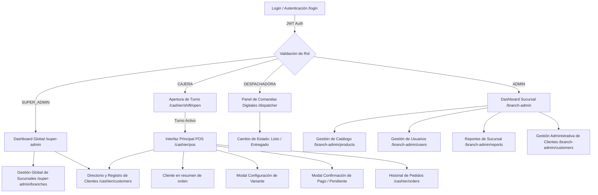

# Propuesta de Interfaces Frontend — Sprint 1 (Catálogo + POS Básico)

**Proyecto:** Wonder Chicken — Sistema Informático de Ventas  
**Documentos de Referencia:** [`../business/pdr.md`](../business/pdr.md), [`../business/requirements.md`](../business/requirements.md), [`../backend/technical_guide.md`](../backend/technical_guide.md), [`../backend/implementation_guide.md`](../backend/implementation_guide.md)  
**Alcance:** Sprint 1 — Catálogo de Productos/Variantes + POS Básico (MESA/LLEVAR) + Comanda Digital + Manejo Mínimo de Turnos + Asociación de Cliente pre-cargado en el POS.  
**Versión:** 1.0  
**Fecha:** Agosto 2026  

> **Interfaces futuras:** Las pantallas completas de **gestión de clientes** (`/cashier/customers` operativa y `/branch-admin/customers` administrativa) se entregan en **Sprint 4**. El contrato UX se documenta igual en la **§7** para no perder contexto, pero **no forma parte del alcance de Sprint 1**. Ver [`implementation_guide.md` §6](../backend/implementation_guide.md#6-sprint-4--cliente-vistas-públicas-e-impresión).

---

## 1. Resumen Ejecutivo del Sprint 1

El **Sprint 1** se enfoca en resolver el núcleo operativo de ventas del restaurante: eliminar las anotaciones manuales en papel, estructurar el catálogo dinámico de productos con sus variantes/sustituciones sin costo adicional, habilitar el registro ultrarrápido de ventas en caja (MESA y LLEVAR), publicar la comanda digital en el panel de despacho de cocina y permitir la asociación rápida de un cliente pre-cargado a la orden (FR-019 parcial).

### Requerimientos Funcionales Cubiertos en este Sprint:
- **FR-001 (Gestión de Productos y Variantes):** Administración del catálogo, variantes, presas obligatorias, acompañamientos por defecto y reglas de sustitución permitida.
- **FR-002 (Registro de Pedidos POS):** Flujo ágil en 3 pasos para armar pedidos (MESA / LLEVAR) con N ítems, variantes, sustituciones, bebidas y extras.
- **FR-003 (Comanda Digital - Parcial):** Generación automática e instantánea de la comanda digital visualizable en la pantalla de despacho al confirmar o registrar el pedido.
- **FR-004 / Shift Mínimo (Apertura de Caja):** Apertura obligatoria de turno declarando el **Período** (Mañana/Noche) y Monto Inicial para emitir el `orderNumber` atómico.
- **FR-008 / FR-013 (UI Diferenciada y Limpia por Rol):** Adaptación estricta de la pantalla según el rol (Superadministrador, Administrador de sucursal, Cajera y Despachadora). El rol Cocinero queda reservado hasta definir sus casos de uso.
- **FR-011 (Pedidos con Pago Pendiente - Parcial):** Registro de pedidos LLEVAR/delivery en estado `PENDING_PAYMENT` para envío directo a despacho, con cobro posterior vía `POST /orders/{id}/pay`.
- **FR-018 (Autenticación JWT):** Inicio de sesión seguro con email + CI y JWT Bearer.
- **FR-019 (Clientes — parcial):** Asociación rápida de un cliente pre-cargado por CI/NIT desde el resumen de la orden (componente G del POS). El CRUD completo de clientes se entrega en **Sprint 4** (ver §7).

---

## 2. Mapa de Navegación e Interfaces por Rol



#### 2.0. Tabla de Nodos del Mapa de Navegación

| Nodo | Tipo | Ruta / Contexto | Rol(es) | Propósito |
| :--- | :--- | :--- | :--- | :--- |
| **A** | Pantalla | `/login` | Todos (público) | Autenticación con JWT. Redirige según rol al validar credenciales. |
| **B** | Lógica | — (router guard) | — | Bifurcación interna según el `role` del JWT. No es una pantalla visible. |
| **C** | Pantalla | `/super-admin` | `SUPER_ADMIN` | Dashboard global: vista multi-sucursal con KPIs agregados. |
| **D** | Pantalla | `/branch-admin` | `ADMIN` | Dashboard de sucursal: resumen operativo y accesos de administración. |
| **E** | Pantalla | `/cashier/shift/open` | `CAJERA` | Apertura obligatoria de turno. Declara Período (`MAÑANA`/`NOCHE`) y monto inicial. Habilita el POS. |
| **F** | Pantalla | `/cashier/pos` | `CAJERA` | Interfaz principal del POS. Catálogo a la izquierda, resumen de orden a la derecha. |
| **G** | Componente | Dentro de F (panel derecho, sobre el carrito) | `CAJERA` | Selector de cliente en el resumen de la orden: dropdown con clientes recientes/encontrados, búsqueda por CI/NIT/nombre y botón `+ Nuevo` que abre el modal de registro rápido. Permite `S/N` (venta anónima). Asocia el `customerId` a la orden. |
| **H** | Modal | Disparado desde F al seleccionar un plato con variantes | `CAJERA` | Configuración de variante: presas obligatorias, acompañamiento/sustitución, bebida y temperatura. |
| **I** | Modal | Disparado desde F al confirmar venta | `CAJERA` | Confirmación de cobro inmediato o registro de `PENDING_PAYMENT` (solo `LLEVAR`/delivery). |
| **J** | Pantalla | `/cashier/orders` | `CAJERA`, `ADMIN` | Historial y búsqueda de pedidos con filtros por número, fecha, estado, tipo y cliente. |
| **K** | Pantalla | `/dispatcher` | `DESPACHADORA` | Panel de comandas digitales en formato grid/Kanban para preparar y entregar pedidos. |
| **L** | Acción | Acciones de cada tarjeta en K | `DESPACHADORA` | Cambio de estado de la comanda: `PREPARING` → `READY` → `DELIVERED`. |
| **M** | Pantalla | `/super-admin/branches` | `SUPER_ADMIN` | Gestión global de sucursales (alta, baja y configuración de branches). |
| **N1** | Pantalla | `/branch-admin/products` | `ADMIN` | Gestión del catálogo de productos, variantes y sustituciones permitidas. |
| **N2** | Pantalla | `/branch-admin/users` | `ADMIN` | Gestión de usuarios de la sucursal (cajeras, despachadoras, administradores). |
| **O** | Pantalla | `/branch-admin/reports` | `ADMIN` | Reportes operativos de la sucursal (ventas, caja, inventario). |
| **P** | Pantalla | `/cashier/customers` | `CAJERA`, `SUPER_ADMIN` | **Módulo FR-019 (vista operativa, *futuro — Sprint 4*):** directorio y registro de clientes. Permite buscar por CI/NIT/nombre, registrar clientes nuevos (CI, NIT opcional, nombres, apellidos, sexo, celular, correo, fecha de nacimiento opcional) y acceder al alta completa con la nota legal RND 102100000011. Búsqueda **cross-sucursal**. Expone el acceso rápido para asociar el cliente recién creado a una orden en curso (atajo `F9`). NO es la vista administrativa masiva — esa es la pantalla **Q**. **Contrato UX detallado en §7.1.** |
| **Q** | Pantalla | `/branch-admin/customers` | `ADMINISTRADOR`, `SUPER_ADMIN` | **Módulo FR-019 (vista administrativa cross-sucursal, *futuro — Sprint 4*):** gestión completa de clientes. Listado paginado con filtros (CI, NIT, nombre, fecha de registro, estado), edición de datos, ver historial de pedidos del cliente (todas las sucursales, vía `GET /customers/{id}/orders`), activar/desactivar (`PATCH /customers/{id}/toggle-active`). La búsqueda opera cross-sucursal: muestra clientes registrados por cualquier sucursal. Ver [PDR §2.12](../business/pdr.md#212-clientes-y-facturación-nominada) — entidad `Customer` global. **Contrato UX detallado en §7.2.** |

> **Convenciones de la tabla:**
> - **Pantalla** = ruta navegable propia con layout dedicado.
> - **Modal / Componente / Acción** = viven dentro de otra pantalla y no tienen ruta propia.
> - **Sección** = agrupación funcional dentro de un dashboard, sin ruta independiente confirmada en Sprint 1.

### 2.1. Decisiones de experiencia de interfaz

La cajera y el cliente futuro no deben compartir la misma pantalla completa. Comparten datos del catálogo y componentes pequeños de dominio, pero sus contenedores son distintos:

- La cajera necesita velocidad, teclado, densidad de información y confirmaciones mínimas.
- El cliente necesita descubrimiento del menú, imágenes, accesibilidad y seguimiento de su pedido.

En Sprint 1 se diseña la operación de cajera. La vista pública de la comanda se reserva para el token de la orden; el portal autenticado del cliente queda fuera de este sprint y se incorporará como una experiencia separada cuando se defina su alcance.

> **Implementación técnica:** La estructura de rutas, route groups, layouts por rol y autorización se definen en [`old-docs/frontend_code_style.md`](old-docs/frontend_code_style.md).

### 2.2. Criterios visuales y de experiencia de usuario

- Toda la interfaz se presenta en español. Los estados técnicos del backend se traducen para la UI: `PENDING_PAYMENT` se muestra como “Pago pendiente”, `PREPARING` como “En preparación” y `READY` como “Listo”.
- Las pantallas deben ser responsive desde el inicio. La cajera y el administrador se optimizan para monitor, pero deben funcionar en tablet y móvil; la experiencia del cliente prioriza el teléfono.
- La distribución se construirá con `Grid`, `Stack`, `Container`, `Box` y breakpoints de MUI. No se asumirán anchos ni resoluciones fijas.
- La aplicación debe permitir tema claro y oscuro. Los componentes deben usar colores del theme de MUI (`background`, `text`, `divider` y colores semánticos) y evitar fondos, textos o bordes hardcodeados que rompan el contraste.
- Los estados no dependerán únicamente del color: las etiquetas, iconos y textos deben seguir siendo comprensibles en ambos temas.
- Los `Tooltip` utilizados dentro de diálogos o modales deben aparecer por encima del modal. Su portal y `z-index` deben configurarse con los valores del theme de MUI para que no queden ocultos por el overlay.
- Se utilizarán preferentemente iconos de `@mui/icons-material`; no se agregará otra biblioteca de iconos cuando MUI tenga una alternativa adecuada. Los iconos sin texto deben incluir `Tooltip` o una etiqueta accesible. Si el icono aparece dentro de un modal, el tooltip debe respetar la regla de `z-index` anterior.
- El tamaño predeterminado de los componentes MUI que acepten `size` será `small`, especialmente en formularios, botones, selects, tablas y controles operativos. Se podrá usar `medium` o un tamaño mayor cuando la legibilidad, accesibilidad o interacción táctil lo requiera.
- Las tablas densas deben tener una estrategia móvil explícita: columnas prioritarias, desplazamiento horizontal controlado o una presentación alternativa cuando la tabla no sea legible en teléfono.
- Los componentes críticos deben mostrar indicadores de carga. Se usará `CircularProgress` para acciones puntuales, botones y mutaciones, y `Skeleton` o un estado de carga de sección para tablas, listas, tarjetas, historial, contexto del POS y panel de despacho. Durante una mutación se deshabilitará el control que la inició para evitar duplicados, sin bloquear controles independientes que sigan siendo seguros.
- Las llamadas a la API que fallan deben informar el error mediante `react-toastify`. También puede utilizarse para confirmar operaciones críticas como vender, cobrar, eliminar o cambiar estados, pero no es obligatorio usarlo para cada respuesta o interacción. Los éxitos rutinarios no generan toast automáticamente.
- El `ToastContainer` se montará una sola vez en `ClientProviders` y respetará el tema activo. Los formularios y pantallas también deben mostrar errores junto al campo o sección que requiere corrección.
- El criterio principal es mantener un código limpio, legible y fácil de mantener: no se agregarán toasts, wrappers o utilidades genéricas cuando el feedback local de la pantalla sea suficiente. `react-toastify` complementa los estados de la interfaz; no reemplaza la carga, el error, el estado vacío ni la actualización de datos.
- La reutilización será equilibrada. Se compartirán patrones estables y componentes pequeños, pero una pantalla o tabla específica puede permanecer dentro de su feature si una abstracción común exige demasiadas props o condicionales.
- `commonComponents/` incluirá una tabla común configurable (`CommonTable`) y componentes reutilizables como `EmptyState`, `ConfirmDialog` y `ActionModal`. La tabla común recibe un objeto de props con `rows`, `columns` y los estados visuales que necesite. La columna de acciones es opcional y se detecta dentro de `columns`; su `render` recibe la fila y devuelve uno o varios elementos React definidos por el feature.
- En lo posible, las props y parámetros relacionados se agruparán en objetos para conservar contratos estables y permitir desestructurar únicamente lo necesario. No se envolverán valores aislados en objetos ni se crearán abstracciones genéricas solo por uniformidad; la legibilidad y la simplicidad tienen prioridad.

> **Detalles de implementación:** La configuración técnica de `react-toastify`, `CommonTable`, `ActionModal`, `ConfirmDialog`, estados de carga, agrupación de props, paleta de colores y patrones de componentes se documentan en [`old-docs/frontend_code_style.md`](old-docs/frontend_code_style.md).

---

## 3. Especificación Detallada de Pantallas e Interfaces

### 3.1. Pantalla de Autenticación (`/login`)
- **Propósito:** Permitir el acceso seguro al sistema según el rol del trabajador, retornando un token JWT.
- **Usuarios Destino:** Superadministrador, Administrador de sucursal, Cajera y Despachadora. El rol Cocinero queda reservado y no tiene interfaz operativa en V1.
- **Componentes Visuales:**
  - Formulario limpio con campos: *Email* y *Contraseña*. El backend documenta actualmente email + CI como credenciales; si el negocio decide usar un código en lugar del email, debe cambiarse primero el contrato backend y luego esta pantalla.
  - Botón de acción principal: `"Iniciar Sesión"`.
  - Mensajes de error claros (ej. `"Credenciales inválidas"`, `"Usuario inactivo"`).
- **Comportamiento UX:**
  - Al autenticar con éxito, redirige automáticamente según el rol:
    - **SUPER_ADMIN:** Redirige a `/super-admin`.
    - **ADMINISTRADOR:** Redirige a `/branch-admin`.
    - **CAJERA:** Redirige a `/cashier/shift/open` si no hay turno abierto o a `/cashier/pos` si ya posee turno activo.
    - **DESPACHADORA:** Redirige a `/dispatcher`.

---

### 3.2. Modal / Pantalla de Apertura de Turno (`/cashier/shift/open`)
- **Propósito:** Cumplir con el requerimiento de control de caja e iniciar el contador atómico de comandas (`lastOrderNumber`).
- **Regla de Negocio Crítica ([PDR §13.3]):** El **Período del Turno** (*Mañana* / *Noche*) **DEBE declararse explícitamente**, el sistema jamás lo infiere del reloj.
- **Componentes Visuales:**
  - Campo numérico: *Monto Inicial en Caja (Bs.)* (Ej. `200.00`).
  - Desplegable / Radio Buttons: *Período del Turno* (`MAÑANA` / `NOCHE` predeterminado pero editable).
  - Selector de Caja Asignada (Caja 1, Caja 2).
  - Resumen del Usuario activo y Fecha/Hora actual.
  - Botón principal: `"Abrir Turno y Entrar al POS"`.
- **Integración Backend:** Executa `POST /shifts/open` enviando `{ initialAmount, shiftPeriodId, cashRegisterId }`.

---

### 3.3. Interfaz Principal POS — Registro de Ventas (`/cashier/pos`)
La pantalla estrella para la Cajera. Diseñada para operar de manera táctil o mediante teclado rápido en horas pico, dividida en 3 zonas principales:

```text
+---------------------------------------------------------------------------------------------------+
  | BARRA SUPERIOR: [Sucursal Central] | Turno: MAÑANA | Cajera: Roxana                         |
+-----------------------------------------------------------+---------------------------------------+
| CATÁLOGO Y CATEGORÍAS                                    | RESUMEN DE LA ORDEN                   |
| [Platos Principales] [Bebidas] [Extras]                   |                                       |
  |                                                           | Tipo: (o) MESA   ( ) LLEVAR             |
| +-------------------+ +-------------------+               | ------------------------------------- |
| | Cuarto de Pollo   | | Porción Media     |               | 2x WONDER                     72.00 Bs|
| | 2 Presas          | | 2 Presas + Mixto  |               |    • 2x PECHO-ALA                     |
| | 23.00 Bs          | | 30.00 Bs          |               |    • 1x COCA COLA 500ml (Fría)         |
| +-------------------+ +-------------------+               |    • 1x AQUARIUS PERA 500ml (Fría)     |
| +-------------------+ +-------------------+               | ------------------------------------- |
| | Wonder            | | Medio Pollo       |               | CLIENTE: LUIS IGLESIAS (CI: 1234567)  |
| | Combo 2 P + Bebida| | 4 Presas          |               | ------------------------------------- |
| | 36.00 Bs          | | 46.00 Bs          |               | TOTAL A PAGAR:               72.00 Bs |
| +-------------------+ +-------------------+               |                                       |
|                                                           | [ REGISTRAR PAGO (F1) ]               |
|                                                           | [ PAGO PENDIENTE (LLEVAR) ]           |
+-----------------------------------------------------------+---------------------------------------+
```

#### A. Barra Superior (Header de Contexto)
- Indicador de estado del Turno activo (Sucursal, Período, Cajera).
- Acceso directo a la apertura/cierre de turno y al historial de pedidos.

#### B. Panel Izquierdo / Central — Catálogo y Selección de Productos
- Tabs de Filtrado Rápido: *Todos, Platos Principales, Bebidas, Extras*.
- Tarjetas de Productos con foto, título, composición breve y precio.
- Al hacer clic en un plato con variantes (ej. *Wonder* o *Porción Media*), se despliega el **Modal de Configuración de Variante**.

#### C. Modal de Configuración de Variante (Descomposición del Ítem)
Permite armar la composición exacta del plato evitando anotaciones manuales:
1. **Selección de Presas (Componentes Obligatorios):**
   - Muestra las presas requeridas por el plato (ej. 2 presas).
   - Botones contadores para seleccionar tipos de presas: *Ala, Pecho, Pierna, Entrepierna* (ej. 1 Pecho + 1 Ala).
   - Validación automática: No permite confirmar si faltan o sobran presas respecto a la regla del plato.
2. **Acompañamientos y Sustitución ([PDR §2.1]):**
   - Muestra el acompañamiento por defecto (ej. *Mixto: Papa + Arroz*).
   - Selector de Sustitución Permitida (1 sola cambio sin alterar el precio):
     - *Sin cambio (Mixto: Papa y Arroz)*
     - *Cambiar Mixto por papa (Todo Papa)*
     - *Cambiar Mixto por Arroz (Todo Arroz)*
     - *Cambiar Mixto por Smiles McCain*
3. **Selección de Bebida (Si el plato es un Combo tipo Wonder / Super Wonder):**
   - Dropdown de Bebidas de 500 ml disponibles (Coca Cola, Mocochinchi, Fanta, Aquarius).
  - Selector de Temperatura: `FRIA` / `NATURAL`.
4. Botón: `"Agregar a la Orden (Bs. 36.00)"`.

La configuración se conserva como estado local del ítem hasta que la cajera lo agrega al carrito. Esto permite volver a abrir el modal y modificar presas, acompañamiento, sustitución o bebida antes de crear la orden. En V1 no se debe ofrecer edición de la variante después de enviar `POST /orders`: el backend persiste un snapshot del ítem y no existe un endpoint para editar una orden ya creada. Si la orden necesita una corrección posterior, la UI debe usar el flujo de cancelación correspondiente y crear una nueva orden según las reglas del backend.

#### D. Panel Derecho — Carrito / Resumen de la Orden
- Selector de Tipo de Pedido:
  - **MESA** o **LLEVAR**. No se solicita número de mesa en el frontend; `tableNumber` es opcional en el backend y no forma parte de esta interfaz.
- **Componente G — Selector de cliente en el resumen de la orden** *(FR-019 parcial, Sprint 1)*:
  - Buscador rápido de Cliente dentro del resumen de la orden: búsqueda por CI, NIT o nombre, selección de un cliente pre-cargado y acción `Cliente S/N` para una venta anónima. La orden envía únicamente el `customerId`; el backend genera el snapshot del nombre en `Order.customerName`.
  - Backend: `GET /customers?search=…` (módulo `customers/` mínimo cableado en [`implementation_guide.md` §3 paso 6](../backend/implementation_guide.md#3-sprint-1--catálogo--pos-básico)). Búsqueda cross-sucursal.
  - Sin alta rápida en Sprint 1: la pantalla completa de registro de clientes se entrega en Sprint 4 (§7.1). En Sprint 1 la cajera selecciona de los clientes pre-cargados vía seed, o marca `S/N`.
  - El snapshot `customerName` queda congelado en la orden al confirmar; las ediciones futuras del cliente **no** lo modifican ([PDR §2.12](../business/pdr.md#212-clientes-y-facturación-nominada)).
- Tabla MUI de ítems agregados, con columnas `Producto`, `Cantidad`, `Composición`, `Precio unitario`, `Subtotal` y `Acciones`. La columna de acciones ofrece aumentar/disminuir cantidad, editar composición mientras el ítem siga en el carrito y eliminar. La composición puede mostrarse en una fila expandible o en un `Tooltip`/`Popover` para conservar una tabla compacta sin perder presas, bebidas y sustituciones.
- Totalizador visible calculado por el frontend usando los precios unitarios recibidos en `GET /pos/context`: subtotal por ítem (`precio unitario × cantidad`) y total preliminar del carrito. El backend vuelve a validar precios, descuentos, stock y total al recibir la orden; el cálculo del frontend no reemplaza esa validación.
- **Acciones de Cierre de Venta:**
  - **Botón "Registrar Pago (Efectivo/QR)":** Abre el modal de Cobro Inmediato. Envía el pedido con `paymentStatus: PAID`; el backend lo crea en estado confirmado y calcula los totales.
  - **Botón "Pago Pendiente (Solo LLEVAR/Delivery) [FR-011]":** Registra el pedido con `paymentStatus: PENDING` y estado `PENDING_PAYMENT`, enviando la comanda a despacho sin sumar monto a caja ni descontar inventario en este momento.

#### E. Modal de Cobro Inmediato
- Muestra el Total a Cobrar (ej. `72.00 Bs`).
- Campo *Efectivo Recibido* (ej. `100.00 Bs`).
- Cálculo automático de *Cambio / Vuelto* (ej. `28.00 Bs`).
- Método de Pago: `EFECTIVO` / `QR`.
- Checkbox: `Facturar` (Desactivado por defecto; solo si el cliente lo solicita según FR-003).
- Botón principal: `"Confirmar Venta y Generar Comanda"`.

---

### 3.4. Panel de Comandas Digitales / Despacho (`/dispatcher`)
- **Propósito:** Interfaz dedicada para el rol **DESPACHADORA**. Reemplaza los tickets físicos y las llamadas a viva voz.
- **Diseño Visual:** Vista Grid / Kanban de alto contraste optimizada para pantallas táctiles en la zona de despacho.

```text
+---------------------------------------------------------------------------------------------------+
| PANEL DE DESPACHO DE COMANDAS                                [Filtro: Todos | MESA | LLEVAR]     |
+----------------------------------+----------------------------------+-----------------------------+
| #102 | MESA          [PAGADO]    | #103 | LLEVAR [PAGO PENDIENTE]  | #101 | MESA [EN PREPARACIÓN] |
| Cliente: LUIS IGLESIAS           | Cliente: MARCO ORTEGA            | Cliente: FREDY AREVALO      |
| Hora: 22:07                      | Hora: 20:37                      | Hora: 20:46                 |
| -------------------------------- | -------------------------------- | --------------------------- |
| 2x WONDER                        | 3x PORCION MEDIA                 | 2x WONDER                   |
|   • 2 PECHO-ALA                  |   • 1 PECHO-ALA                  |   • 2 PECHO-ALA             |
|   • 1 COCA COLA 500ml (FRÍA)     |   • 2 PIERNA-ENTREPIERNA         |   • 1 PIERNA-ENTREPIERNA    |
|   • 1 AQUARIUS PERA (FRÍA)       |   • Sustitución: Papa -> Arroz   |   • 2 COCA COLA (FRÍAS)     |
| -------------------------------- | -------------------------------- | --------------------------- |
| [ PREPARAR ]  [ MARCAR LISTO ]   | [ COBRAR Y CONFIRMAR ]           | [ ENTREGAR PEDIDO ]         |
+----------------------------------+----------------------------------+-----------------------------+
```

#### Funcionalidades Clave de la Comanda Digital:
- **Estados Visibles:**
  - `PREPARING` (En preparación; incluye también los pedidos `PENDING_PAYMENT`).
  - `READY` (Listo para entrega al cliente).
  - `DELIVERED` (Entregado; deja de mostrarse en la cola activa).
  - `PENDING_PAYMENT` (Pago pendiente de un pedido LLEVAR/delivery; puede prepararse sin descontar inventario ni caja).
- **Tarjetas Diferenciadas por Color:**
  - Cabecera Verde para pedidos **MESA**.
  - Cabecera Naranja/Azul para pedidos **LLEVAR**.
  - Insignia o borde Rojo/Naranja si el pedido tiene **PAGO PENDIENTE**.
- **Acciones Rápidas con 1 Clic:**
  - **"Marcar Listo":** Cambia estado a `READY` y notifica a la pantalla pública del local.
  - **"Entregar":** Cambia estado a `DELIVERED` y retira la comanda del panel activo.
  - El cobro de un pedido pendiente es una acción de la cajera desde su operación de caja; ejecuta `POST /orders/{id}/pay`. No es una transición de preparación de la despachadora.

`CREATED` es transitorio y `CONFIRMED` pasa automáticamente a `PREPARING` al publicarse la comanda; `CLOSED` corresponde al cierre administrativo del turno; `CANCELLED` se reserva para la anulación manual según el tipo de pedido. `ON_HOLD` no se usa en V1. No hay una acción independiente de "iniciar preparación" ni se muestra `PARTIAL` como estado operativo: `PARTIAL` está reservado en V1.

El rol **COCINERO** no tiene interfaz ni funcionalidades dentro de esta propuesta. Se mantiene como rol reservado para una futura definición del producto; no debe aparecer en la navegación, en el dashboard ni en el alcance de Sprint 1.

---

### 3.5. Gestión de Catálogo de Productos y Variantes (`/branch-admin/products`)
- **Propósito:** Permite al **ADMINISTRADOR** mantener el menú actualizado, añadir o modificar platos, precios base, presas requeridas y sustituciones permitidas sin tocar código.
- **Componentes Visuales:**
  - **Tabla de Productos:** Columnas de Código de producto, Nombre, Categoría, Precio Base, Cantidad de Variantes, Estado y Botones de Acción (Editar / Desactivar).
  - **Modal de Creación / Edición de Producto:**
    - Nombre del Producto (ej. *Porción Media*).
    - Código de producto para identificar el registro en el catálogo. El backend contempla `productCode`; el formato `P-002` es solo ilustrativo y no debe imponerse desde el frontend si el contrato no lo exige.
    - Categoría (*Plato Principal, Bebida, Extra*).
    - Precio Base (ej. `30.00 Bs`).
  - **Sección de Variantes y Componentes:**
    - Formulario de definición de presas requeridas (ej. `2 presas`).
    - Configuración del acompañamiento por defecto de la variante (ej. *Mixto*). Es necesaria porque forma parte de `Variant.components` y define la composición que el POS muestra; en V1 no se descuenta como inventario granular.
    - Lista de sustituciones habilitadas (ej. *Papa frita por Arroz / Papa frita por Smiles*).

---

### 3.6. Historial y Búsqueda de Pedidos (`/orders`)
- **Propósito:** Permitir a la Cajera y Administrador consultar pedidos pasados, verificar montos o resolver reclamos.
- **Carga y feedback:** El historial mostrará un estado de sección con `Skeleton` mientras consulta datos; los errores de API podrán comunicarse mediante `react-toastify` y también en la sección cuando el usuario necesite corregir o reintentar la consulta.
- **Filtros de Búsqueda:** Por Número de Pedido (`orderNumber`), Rango de Fechas, Estado (`CREATED`, `CONFIRMED`, `PREPARING`, `READY`, `DELIVERED`, `CLOSED`, `PENDING_PAYMENT`, `CANCELLED`), Tipo (`MESA`, `LLEVAR`), o Datos del Cliente (CI/NIT/Nombre).
- **Detalle de Comanda (Modal de Inspección):** Despliega el snapshot completo guardado en la base de datos (`OrderItem.snapshot`), mostrando exactamente lo que se vendió, precios aplicados, presas seleccionadas y timestamp.

---

> **Nota:** Las pantallas de gestión de clientes (`/cashier/customers` operativa y `/branch-admin/customers` administrativa) **no forman parte del alcance de Sprint 1**. Se documentan completas en la **§7** para fijar el contrato UX temprano, pero su implementación se materializa en **Sprint 4** según el [`implementation_guide.md` §6](../backend/implementation_guide.md#6-sprint-4--cliente-vistas-públicas-e-impresión). En Sprint 1 la cajera usa el componente **G** del POS (§3.3 D) que opera sobre clientes pre-cargados vía seed.

---

## 4. Rutas de Pantallas Previstas para Sprint 1

Las siguientes rutas corresponden a las pantallas de este documento. La implementación técnica (estructura de carpetas, route groups, layouts, stores, API, componentes comunes) se detalla en [`old-docs/frontend_code_style.md`](old-docs/frontend_code_style.md).

```
/login                              → Autenticación (FR-018)
/super-admin                        → Dashboard global (solo SUPER_ADMIN)
/super-admin/branches               → Gestión global de sucursales (SUPER_ADMIN)
/branch-admin                       → Dashboard de sucursal (solo ADMIN)
/branch-admin/products              → Gestión de catálogo y variantes (FR-001)
/branch-admin/users                 → Gestión de usuarios de la sucursal (ADMIN, Sprint 1)
/branch-admin/reports               → Reportes operativos de la sucursal (ADMIN)
/cashier/shift/open                 → Apertura de turno (FR-004)
/cashier/pos                        → POS / registro de ventas (FR-002) — incluye componente G (cliente)
/cashier/orders                     → Historial de pedidos (FR-012)
/dispatcher                         → Panel de comandas digitales (FR-003)
/order/[token]                      → Comanda pública (sin autenticación)
```

> **Rutas diferidas a sprints posteriores** (documentadas en §7):
> - `/cashier/customers` — vista operativa de clientes — **Sprint 4**.
> - `/branch-admin/customers` — vista administrativa de clientes — **Sprint 4**.

> **Nota:** El rol COCINERO no tiene rutas ni pantallas en Sprint 1. Se mantiene como rol reservado para futuras definiciones.

---

## 5. Matriz de Cumplimiento de Criterios de Aceptación (Sprint 1)

| Requerimiento | Criterio de Aceptación Cumplido en la Interfaz Propuesta |
| :--- | :--- |
| **FR-001 (Productos)** | El administrador de sucursal administra productos y variantes en `/branch-admin/products`. Las variantes quedan disponibles de inmediato en el POS con su descomposición y precio. |
| **FR-002 (POS)** | El POS permite registrar ventas MESA/LLEVAR en 3 pasos o menos (Seleccionar plato → Configurar presas/sustitución → Confirmar pago). El total es exacto. |
| **FR-003 (Comanda)** | Al confirmar el pedido en el POS, la comanda digital aparece al instante en el panel de despacho `/dispatcher` con presas y bebidas detalladas. |
| **FR-004 (Shift Mínimo)** | Pantalla `/cashier/shift/open` exige seleccionar el Período del turno (`MAÑANA`/`NOCHE`) y monto inicial antes de vender. Inicializa `lastOrderNumber`. |
| **FR-008 / FR-013 (UI por Rol)**| Interfaz limpia e independiente por rol. Superadministrador ve el alcance global; administrador ve su sucursal; cajera ve POS/Caja; despachadora ve Comandas. El cocinero queda fuera de la interfaz hasta definir su alcance. |
| **FR-011 (Pago Pendiente)**| Botón *"Pago Pendiente"* en POS crea una orden `PENDING_PAYMENT` para despacho. La cajera puede cobrarla posteriormente vía `POST /orders/{id}/pay`; el pedido se prepara desde el registro y no descuenta inventario hasta el pago. |
| **FR-018 (Auth JWT)** | Login `/login` genera token Bearer JWT. Rutas protegidas según rol con redirección automática. |
| **FR-019 (Clientes — parcial)** | Buscador rápido dentro del resumen de la orden (componente **G** del POS) por CI, NIT o nombre. Permite vincular `customerId` a la orden o seleccionar "S/N". La pantalla completa de gestión de clientes (operativa y administrativa) se entrega en **Sprint 4** — ver §7. |

---

## 6. Siguientes Pasos Recomendados

1. **Aprobación de las interfaces Sprint 1:** Confirmar el mapa de navegación, matriz de roles y separación entre POS interno y canal cliente.
2. **Implementación técnica:** Seguir la guía de [`old-docs/frontend_code_style.md`](old-docs/frontend_code_style.md) para desarrollar los componentes base (`CommonTable`, `ConfirmDialog`, `ActionModal`), stores Zustand, API calls y estructura de rutas.
3. **Conexión con endpoints de Sprint 1:** Probar la integración con `POST /orders` (acepta `customerId`), `POST /shifts/open`, `GET /pos/context`, `POST /auth/login` y `GET /customers?search=` (módulo mínimo Sprint 1).
4. **Planificación Sprint 4:** Las interfaces de gestión de clientes (§7) requieren los endpoints ampliados del módulo `customers/` documentados en [`implementation_guide.md` §6](../backend/implementation_guide.md#6-sprint-4--cliente-vistas-públicas-e-impresión).

---

## 7. Interfaces Futuras — Actualizaciones Previstas en Sprints Posteriores

> Esta sección documenta el contrato UX de las pantallas **futuras** para no perder contexto durante la construcción de Sprint 1. Su implementación se materializa en **Sprint 4** según el [`implementation_guide.md` §6](../backend/implementation_guide.md#6-sprint-4--cliente-vistas-públicas-e-impresión). En Sprint 1 **no se construyen** estas pantallas.

### 7.1. Vista Operativa de Clientes (`/cashier/customers`) — *[FR-019 — Sprint 4]*

> **Separación por rol (FR-013 — UI limpia por rol):** esta es la vista **operativa** de la cajera (alta rápida + asociación al pedido). La vista **administrativa** (listado completo, filtros, edición, auditoría cross-sucursal) es responsabilidad del `ADMINISTRADOR` y vive en `/branch-admin/customers` (sección 7.2). El `Customer` es una **entidad global** (sin `branchId`); ambas pantallas consultan y operan sobre el mismo conjunto de datos — solo cambia el alcance funcional y el tipo de acciones disponibles.

- **Propósito:** Cumplir con [FR-019](../business/requirements.md#fr-019--registro-y-búsqueda-de-clientes-alta) en su uso **operativo**: la cajera registra clientes nuevos para **facturación nominada** y los busca por **CI o NIT** de manera **cross-sucursal**, asociándolos rápidamente a la orden en curso. El vínculo a la orden es **opcional** (anónimo = `S/N`, ventas < Bs 1.000).
- **Usuarios Destino:** `CAJERA` (uso principal — [PDR §2.7](../business/pdr.md#27-roles-e-interfaces-v1-con-autenticación-jwt-y-control-de-permisos-por-rol-en-backend)) y `SUPER_ADMIN` (acceso global cross-sucursal). La gestión administrativa masiva queda en `/branch-admin/customers` (sección 7.2).
- **Componentes Visuales (basados en el prototipo funcional):**
  - **Sidebar de Cajera:** `POS Ventas`, `Resumen de Apertura`, `Pago Pendiente [FR-011]`, `Despacho Cocina (KDS)`, `Historial de Pedidos`, **`Clientes`** (activo) y `Cerrar Sesión`. La sidebar se reutiliza entre las pantallas de la cajera.
  - **Cabecera de Contexto:** Indicador de `Sucursal Central` y `TURNO: MAÑANA` (estado del turno activo).
  - **Título y Subtítulo:** `Directorio y Registro de Clientes` con el badge `Módulo FR-019 • Gestión de Clientes y Cumplimiento Normativo de Facturación (SIN BOLIVIA)`.
  - **Formulario de Nuevo Cliente** (sección principal):
    - `CI *` (obligatorio) con selector de departamento (`LP`, `CB`, `SC`, `OR`, `PT`, `TJ`, `BE`, `PD`) e input numérico (`Ej. 8493021`).
    - Checkbox `¿Factura Razón Social?` — al activarlo revela el campo `NIT` (también con departamento).
    - `Nombres *` y `Apellidos *`.
    - `Sexo / Género:` dos botones excluyentes (`Hombre` / `Mujer`).
    - `Celular de Contacto / WhatsApp` y `Correo Electrónico` (opcionales).
    - `Fecha de Nacimiento` (opcional — usado para campañas 20% cumpleaños).
    - **Nota Legal RND 102100000011** (Servicio de Impuestos Nacionales): recordatorio visible de que la facturación nominada es **obligatoria para consumos superiores a Bs 1.000**.
  - **Acciones del formulario:**
    - `Limpiar Campos (Esc)`: resetea el formulario.
    - `Guardar Cliente (F10)`: persiste el cliente y lo deja disponible para asociar.
    - `Guardar y Asociar a Orden (F9)`: persiste y, si hay una orden en curso en el POS, asigna el `customerId` automáticamente.
- **Integración Backend (Sprint 4):**
  - `GET /customers?search=…` (búsqueda por CI / NIT / nombre).
  - `POST /customers` (registro).
  - `PATCH /customers/{id}` (edición; **no altera** el `customerName` snapshot de órdenes pasadas — [PDR §2.12](../business/pdr.md#212-clientes-y-facturación-nominada)).
  - `GET /customers/{id}` (consulta).
- **Reglas de UX aplicables al Sprint 4:**
  - El componente **G** del POS consume el mismo cliente del directorio: el `+ Nuevo` dentro del resumen de orden abre el formulario de esta pantalla como **modal de alta rápida** y al confirmar vuelve al POS con el cliente ya vinculado.
  - La edición de un cliente **no debe propagarse** a los snapshots de órdenes pasadas; el frontend no debe ofrecer acciones que sugieran lo contrario.
  - La búsqueda opera por **CI o NIT** (no por `id` interno) y nunca muestra más datos de los necesarios para la selección (privacidad por defecto).
  - El POS **no debe** listar pedidos tipeando un NIT/CI en la URL — el acceso a la vista del cliente va siempre por `publicToken` (regla de seguridad, [PDR §2.12](../business/pdr.md#212-clientes-y-facturación-nominada)).

### 7.2. Vista Administrativa de Clientes (`/branch-admin/customers`) — *[FR-019 — Sprint 4, cross-sucursal]*

- **Propósito:** Vista administrativa del [FR-019](../business/requirements.md#fr-019--registro-y-búsqueda-de-clientes-alta) para que el `ADMINISTRADOR` gestione clientes de forma masiva: consulta cross-sucursal, edición, activación/desactivación y consulta del historial de pedidos del cliente. **No es la vista de la cajera** (esa es `/cashier/customers`, sección 7.1).
- **Usuarios Destino:** `ADMINISTRADOR` ([PDR §2.7](../business/pdr.md#27-roles-e-interfaces-v1-con-autenticación-jwt-y-control-de-permisos-por-rol-en-backend)) y `SUPER_ADMIN` (acceso global). **El `ADMINISTRADOR` ve clientes de todas las sucursales** porque `Customer` es una entidad global sin `branchId` ([PDR §2.12](../business/pdr.md#212-clientes-y-facturación-nominada)).
- **Componentes Visuales:**
  - **Cabecera con contexto:** badge `Sucursal Central` + `Módulo FR-019 • Gestión Administrativa de Clientes (cross-sucursal)`.
  - **Filtros de búsqueda** (sobre `CommonTable`):
    - `CI` (búsqueda exacta o por prefijo).
    - `NIT` (búsqueda exacta o por prefijo).
    - `Nombre` (búsqueda parcial: nombres o apellidos, case-insensitive).
    - `Rango de fecha de registro` (`desde` / `hasta`).
    - `Estado` (`activo` / `inactivo` / `todos`).
  - **Tabla de Clientes** (columnas): `CI`, `NIT`, `Nombres`, `Apellidos`, `Celular`, `Correo`, `Fecha de registro`, `Estado` (badge activo/inactivo), `Acciones`.
  - **Acciones por fila:**
    - `Editar` → abre modal de edición (mismos campos que el alta, pero con `CI` y `NIT` no editables). `PATCH /customers/{id}`.
    - `Ver historial de pedidos` → abre modal/lista con todos los pedidos del cliente (todas las sucursales, todos los días), llamando a `GET /customers/{id}/orders`. Link al detalle de cada pedido.
    - `Activar / Desactivar` (`PATCH /customers/{id}/toggle-active`) → invierte el flag `active`. Mismo patrón que `users` y `branches`. Sin body.
- **Alta desde la vista admin:**
  - Botón `+ Nuevo Cliente` en la cabecera de la tabla abre el mismo formulario de alta que usa la cajera, con los mismos atajos (`Esc`, `F10`, `F9`).
  - `F9` (Guardar y Asociar a Orden) **no aplica** en esta pantalla (no hay orden en curso en la vista admin). El botón se oculta o se desactiva.
- **Integración Backend (Sprint 4):**
  - `GET /customers?search=&page=&pageSize=&status=&from=&to=` (búsqueda cross-sucursal con filtros y paginación; el `?search=` mínimo ya está cableado en Sprint 1).
  - `POST /customers`.
  - `GET /customers/{id}`.
  - `PATCH /customers/{id}`.
  - `PATCH /customers/{id}/toggle-active` (nuevo — `ADMIN` puede desactivar clientes; mismo patrón que `users` y `branches`).
  - `GET /customers/{id}/orders?from=&to=` (historial de pedidos del cliente, cross-sucursal — vista resumida optimizada para el modal).
- **Reglas de UX y auditoría:**
  - **Deduplicación:** si al intentar registrar un cliente el CI ya existe (en cualquier sucursal), el sistema muestra el cliente existente y **no permite crear duplicado**. La primera registración gana (`Customer.ci` es `UNIQUE` en el schema).
  - **Edición no propaga a snapshots:** los `customerName` ya guardados en órdenes pasadas **no se modifican** al editar el cliente. El frontend debe evitar cualquier UI que sugiera lo contrario.
  - **Privacidad:** la tabla no debe mostrar más columnas de las necesarias para la gestión administrativa; campos sensibles (correo, celular) pueden ocultarse tras click en `Ver detalle`.
  - **Auditoría:** la creación, edición y toggle-active deben registrarse en `AuditLog` como acciones críticas (datos personales). El frontend no implementa la auditoría — solo dispara los endpoints que el backend audit-loggea.
  - **El POS NO debe** listar pedidos tipeando un NIT/CI en la URL — el acceso a la vista del cliente va siempre por `publicToken` (regla de seguridad, [PDR §2.12](../business/pdr.md#212-clientes-y-facturación-nominada)). Esta pantalla es para gestión interna del admin, no para vistas públicas.
  - **No existe "sucursal de registro":** el `Customer` no tiene `branchId` (es entidad global). Por eso esta UI no expone el filtro "Sucursal de registro" — si en el futuro se necesita derivar, se hace a partir del primer `Order` del cliente (fuera de alcance V1).
